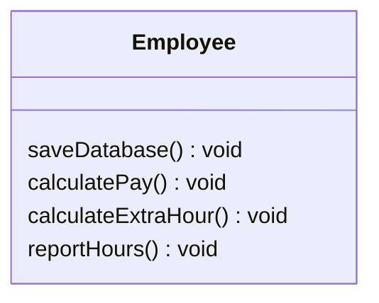
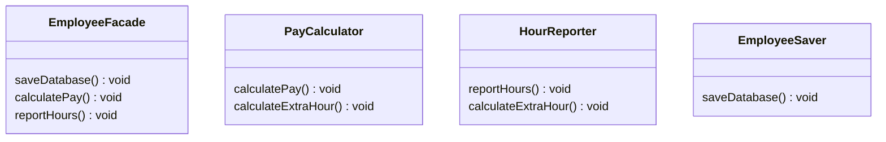
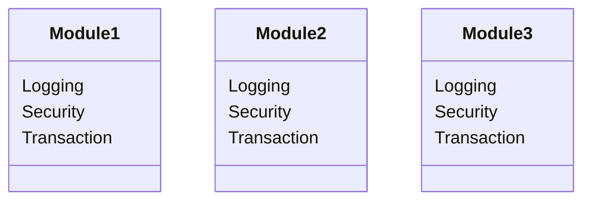
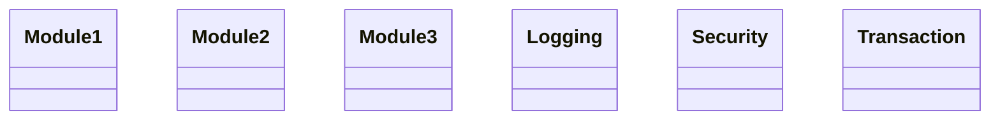

## SRP (Single Responsibility Principle) : 단일 책임 원칙

```txt
단일 module은 변경의 이유가 하나, 오직 하나뿐이여야 한다.
```

- 단일 책임 원칙(SRP)는 **객체는 단 하나의 책임만 가져야 한다**는 원칙을 말합니다.
    - 하나의 책임만을 가진다는 것은 변경되는 이유가 한 가지여야 한다는 말과 같습니다.
        - 여러 가지 책임을 가지고 있으면, 각기 다른 사유에 의해서 module이 변경되는 이유가 여러 가지가 되기 때문입니다.
    - '책임'은 '기능 담당'을 의미합니다.

- 하나의 class는 하나의 기능만을 담당하여 하나의 책임을 수행하는데 집중해야 합니다.
    - 또한 class는 그 책임을 완전히 캡슐화(encapsulation)해야 합니다.

- SRP는 **다른 설계 원칙들을 적용하는 기초**가 되기도 합니다.


### SRP를 따라야 하는 이유

- 단일 책임 원칙을 잘 따르면, 기능 변경(수정)이 일어났을 때의 파급 효과를 막을 수 있습니다.
    - 특정 책임(기능)을 변경할 때, 다른 책임(기능)이 연쇄적으로 변경될 가능성을 배제할 수 있습니다.

- 여러 책임이 포함된 class는 한 책임의 변경이 다른 책임에게도 연쇄적인 영향을 줍니다.
    - 한 객체에 책임이 많아질수록 class 내부에서 서로 다른 역할을 수행하는 code끼리 강하게 결합될 가능성이 높아집니다.
    - 그래서 해당 객체가 하는 기능에 변경 사항이 생기면, 이 기능을 사용하는 부분의 code를 모두 다시 test해야 합니다.
    - 예를 들어, A를 고쳤더니 B를 수정해야 하고, B를 수정했더니 C를 수정해야하고, C를 수정했더니 다시 A로 돌아가서 수정해야 하는, 책임이 순환되는 상황이 생길 수 있습니다.
 
- 따라서 단일 책임 원칙을 적용하여, 각 class에게 주제에 적합한 책임을 부여하고, 책임 영역을 확실히 해야합니다.
    - 책임 영역이 나뉘어져 있기 때문에, 역할 변경에 영향을 받는 기능들이 한 class에 모여있을 것이고, 변경 사항이 생겼을 때는 그 class만 수정하면 됩니다.

- 어떤 class에 변경되어야 할 이유가 두 가지 이상이라면, 해당 class는 관심사 분리를 통해 각각의 책임(변경이 일어나는 이유)를 독립시키는 것이 좋습니다.
    - SRP 원칙을 적용하여 class를 세세하게 나눔으로써 전체 code 길이가 길어졌다 하더라도, 하나의 class를 사용하는 것보다 여러 개의 class를 사용하는 것이 더 좋습니다.
    - 역할에 따라 class 나누어 책임을 적절히 분배하는 것이 각 class의 의미를 파악하기 더 쉽게 하여(code 가독성 향상), 유지 보수를 용이하게 합니다.


---


## SRP 적용해보기 (Facade Pattern)

- 단일 책임 원칙을 적용하는 대표적인 방법으로 Facade Pattern이 있습니다.

- Facade Pattern은 구체적인 구현을 감추는 Design Pattern입니다.
    - Facade란 건물의 정면을 의미합니다.
    - Facade Pattern은 건물의 뒷부분이 어떻게 생겼는지는 보여주지 않고 건물의 정면만 보여주는 pattern입니다.
    - FacadeClass는 method의 구현이 어떻게 되어있는지(건물의 뒷부분)는 보여주지 않고, 어떤 method가 있는지(건물의 정면)만 보여줍니다.
        - 구체적인 method의 구현은 ConcreteClass에 위임하기 때문입니다.


### 적용 전

- `Employee` class는 회계팀, 인사팀, 기술팀이 사용하는 여러 가지 기능을 가지고 있습니다.

- 만약 회계팀에서 급여를 계산하는 기존의 방식을 새로 변경하여, 초과 근무 시간을 계산하는 메서드 `calculateExtraHour()`의 algorithm을 변경하면, 인사팀에서 사용하는 `reportHours()` method에도 영향을 주게 됩니다.
    - method를 공유해서 사용하기 때문입니다.
    - **SRP에 위배되는 상황**입니다.

- `Employee` class가 3개의 actor(회계팀, 인사팀, 기술팀)에 대한 여러 가지 책임(기능)을 가지고 있는 상황입니다.
    - actor는 system을 수행하는 역할을 하는 요소로써, system을 이용하는 사용자, Hardware, 외부 system 등이 될 수 있습니다.



```java
class Employee {
    String name;
    String positon;

    Employee(String name, String position) {
        this.name = name;
        this.positon = position;
    }

	// 초과 근무 시간을 계산하는 method (회계팀과 인사팀에서 공유하여 사용)
    void calculateExtraHour() {
        // ...
    }

    // 급여를 계산하는 method (회계팀에서 사용)
    void calculatePay() {
        // ...
        this.calculateExtraHour();
        // ...
    }

    // 근무 시간을 계산하는 method (인사팀에서 사용)
    void reportHours() {
        // ...
        this.calculateExtraHour();
        // ...
    }

    // 변경된 정보를 DB에 저장하는 method (기술팀에서 사용)
    void saveDababase() {
        // ...
    }
}
```


### 적용 후

- 단인 책임 원칙은 각 책임(기능 담당)에 맞게 class를 분리하여 구성하는 것으로 적용할 수 있습니다.

- 회계팀, 인사팀, 기술팀의 기능 담당은 `PayCaculator`, `HourReporter`, `EmployeeSaver` class로 분리하고, 이 class들을 통합적으로 사용하는 `EmployeeFacade` class를 만듭니다.

- `EmployeeFacade` class는 어떠한 actor도 담당하지 않습니다.
    - `EmployeeFacade` class의 method에는 아무런 logic이 들어있지 습니다.
    - 생성자로 instance를 생성하고 각 class의 method를 사용하는 역할만 합니다.

- 만일 변경 사항이 생겨도 각각의 분리된 class에서만 수정하면 되기 때문에, `EmployeeFacade` class는 수정하지 않아도 됩니다.
    - 예를 들어, 회계팀에서 초과 근무 시간 계산 방법이 변경되었다고 하면, `PayCalculator` class의 `calculateExtraHour()` method를 수정하면 되며, 이 수정은 `HourReporter` class에는 전혀 영향을 주지 않습니다.

- 또한, Facade Pattern을 적용하여 캡슐화(정보 은닉)합니다.
    - client(class를 사용하는 입장)는 `PayCalculator`, `HourReporter`, `EmployeeSaver` class가 어떤식으로 구성되어 있는지 알 필요 없이 `EmployeeFacade` class의 method만 사용하면 되기 때문입니다.




```java
// Facade class
class EmployeeFacade {
    private String name;
    private String positon;

    EmployeeFacade(String name, String position) {
        this.name = name;
        this.positon = position;
    }
    
    // 급여를 계산하는 method (회계팀 class를 불러와 사용)
    void calculatePay() {
        // ...
        new PayCalculator().calculatePay();
        // ...
    }

    // 근무 시간을 계산하는 method (인사팀 class를 불러와 사용)
    void reportHours() {
        // ...
        new HourReporter().reportHours();
        // ...
    }

    // 변경된 정보를 DB에 저장하는 method (기술팀 class를 불러와 사용)
    void EmployeeSaver() {
        new EmployeeSaver().saveDatabase();
    }
}

// 회계팀 전용 class
class PayCalculator {
    void calculateExtraHour() {
        // ...
    }
    void calculatePay() {
        // ...
        this.calculateExtraHour();
        // ...
    }
}

// 인사팀 전용 class
class HourReporter {
    void calculateExtraHour() {
        // ...
    }
    void reportHours() {
        // ...
        this.calculateExtraHour();
        // ...
    }
}

// 기술팀 전용 class
class EmployeeSaver {
    void saveDatabase() {
        // ...
    }
}
```


---


## SRP 적용 주의 사항


### Class의 이름을 책임의 소재가 드러나도록 짓기

- class가 하나의 책임을 가지고 있다는 것을 나타내기 위해, class명을 어떠한 기능을 담당하는지 알 수 있게 작명하는 것이 좋습니다.
- 각 class는 하나의 개념을 나타내도록 구성합니다.


### 결합도와 응집도를 고려하여 책임 분리하기

- 좋은 program은 응집도가 높고, 결합도는 낮습니다.
- 따라서 책임은 결합도와 응집도를 고려하여 분리해야 합니다.
    - '응집도(cohesion)'는 한 module 내부의 처리 요소들이 서로 관련되어 있는 정도를 의미합니다.
    - '결합도(coupling)'는 서로 다른 module 간에 상호 의존하는 정도 또는 연관된 관계를 의미합니다.

- SRP 원칙을 따른다고 해서 책임을 아무렇게나 분리해서는 안됩니다.
    - 여러 가지 책임을 나눌 때는 각 책임 간의 결합도가 최소가 되도록 나누어야 합니다.
    - 반대로 너무 많은 책임 분할로 인해 책임이 여러 곳으로 파편화되어 있는 경우에는, **산탄총 수술**로 다시 응집력을 높여주는 작업이 필요합니다.

#### 횡단 관심사(cross-cutting concerns)에 대한 산탄총 수술

- 하나의 책임이 여러 개의 class들로 분산되어 있는 경우에는 단일 책임 원칙에 입각하여 설계를 변경해야 하는 경우가 있습니다.
    - 예를 들어, logging, 보안, transaction과 같은 횡단 관심사로 분류할 수 있는 기능.

- 횡단 관심사에 속하는 기능은 대부분 system 핵심 기능(하나의 책임) 안에 포함되는 부가 기능(여러 개의 class로 분리)입니다.
- 부가 가능을 별개의 class로 분리해 책임을 담당하게 해야 합니다.
    - 부가 기능이라 하더라도 여러 곳에 흩어진 공통된 책임을 한 곳에 모으면서 응집도를 높일 수 있습니다.

##### 횡단 관심사에 속하는 기능을 class로 분리하지 않은 경우



##### 횡단 관심사에 속하는 기능을 단일 책임 원칙에 따라 분리한 경우




---


## Reference

- <https://inpa.tistory.com/entry/OOP-%F0%9F%92%A0-%EC%95%84%EC%A3%BC-%EC%89%BD%EA%B2%8C-%EC%9D%B4%ED%95%B4%ED%95%98%EB%8A%94-SRP-%EB%8B%A8%EC%9D%BC-%EC%B1%85%EC%9E%84-%EC%9B%90%EC%B9%99>
- <https://mangkyu.tistory.com/274>
- <https://gmlwjd9405.github.io/2018/07/05/oop-solid.html>
