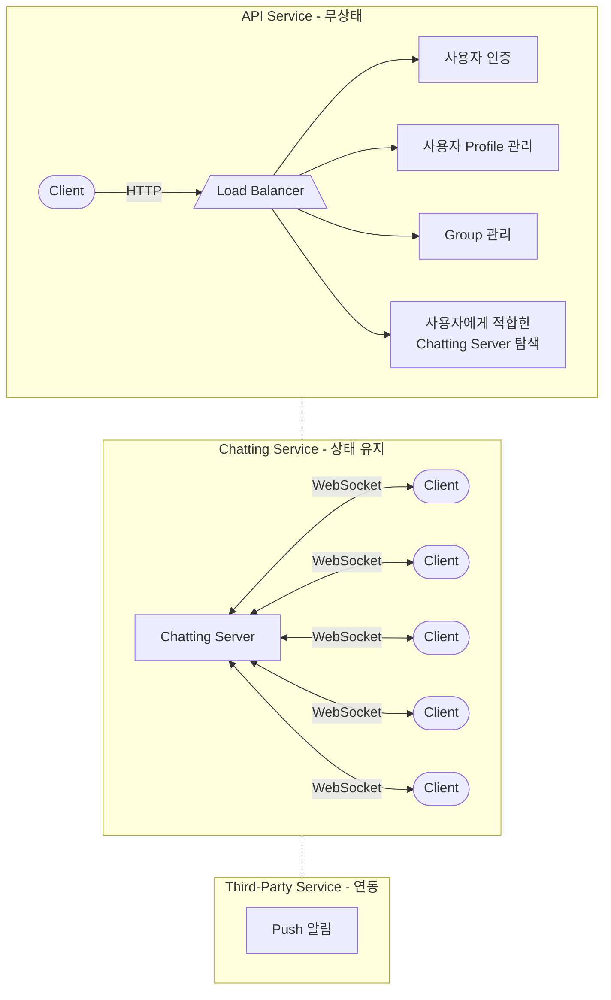
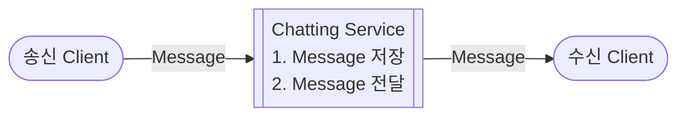
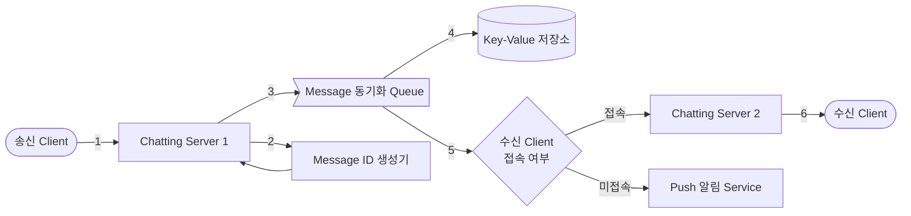
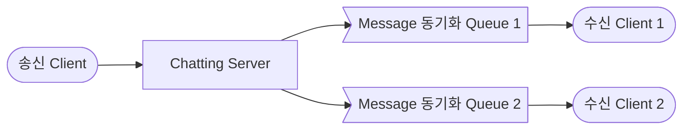
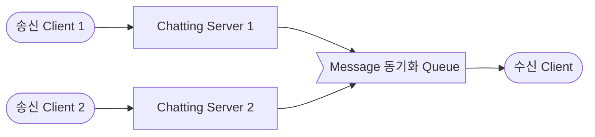
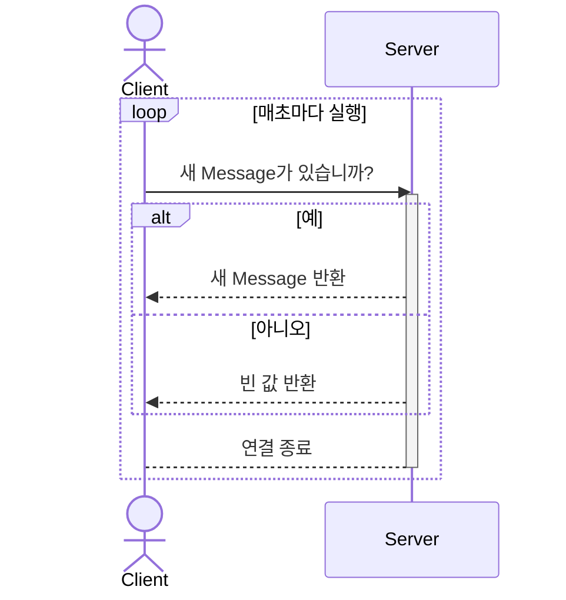
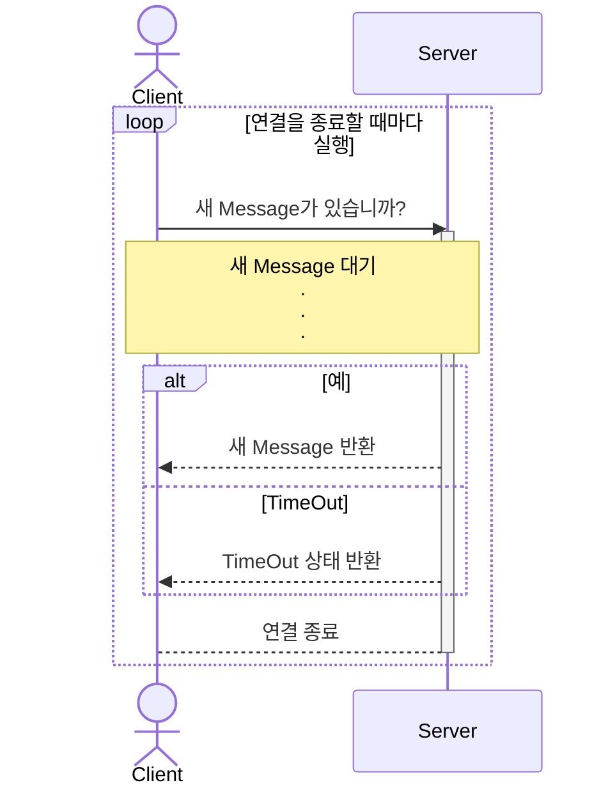
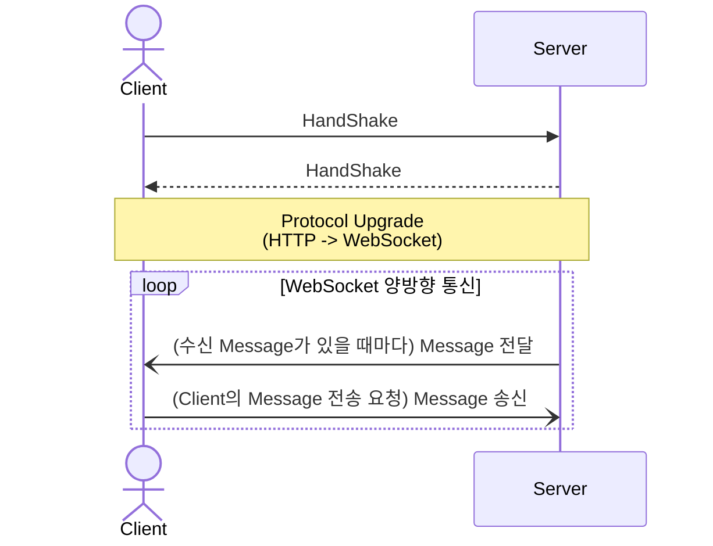
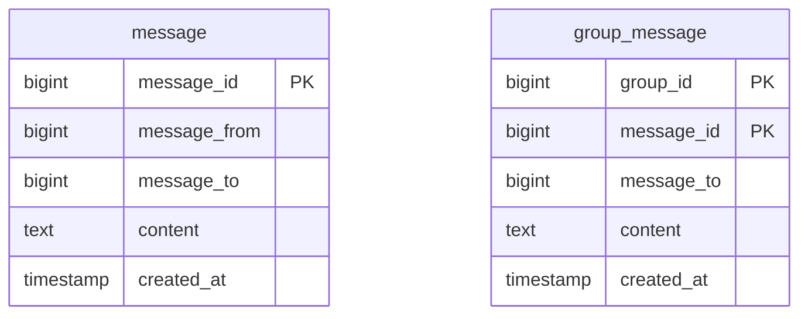

- text chatting system을 설계합니다.
    - chatting은 크게 1:1 chatting, group chatting으로 나뉩니다.
    - 대표적인 text chatting service로 KakaoTalk, Line, Slack, Facebook messenger 등이 있습니다.

- chatting system은 API Service, Chatting Service, Third-Party Service로 이루어집니다.
    1. **API Service**는 'Login/Logout', '회원 가입', '사용자 Profile 표시', 'Service 탐색' 등의 무상태(stateless) service 기능을 제공합니다.
        - Service 탐색(service discovery)은 client가 접속할 chatting server의 DNS hostname을 client에게 알려주는 역할을 합니다.
            - client의 geographical location(위치), server의 capacity(용량) 등을 기준으로 client에게 가장 적합한 chatting server를 추천해줍니다.
            - client는 해당 chatting server에 연결되어 message를 송수신합니다.
    2. **Chatting Service**는 'client 간의 통신'과 'message 저장' 등의 기능을 제공합니다.
        - 이 중 client 간의 통신은 실시간 data 교환을 위해 client와 server 사이의 연결을 유지하기 때문에 **상태 유지(stateful) service**입니다.
    3. **Third-Party Service**는 'message push 알림' 등의 추가적인 기능을 제공합니다.
        - 수신자가 미접속 중일 때 message에 대해 push 알림을 보내야 합니다.
        - 알림 system을 직접 설계하고 구현하는 것은 어려운 일이므로, 제 3자 service의 기능을 연동하여 사용합니다.
            - 필요에 따라 직접 구현하여 사용할 수도 있습니다.



- 이 글은 Chatting Service 설계에 대해 설명합니다.
    - API Service는 일반적인 Web Application과 같고, Third-Party Service는 기능을 연동하여 사용하기만 하면 됩니다.


---


## Chatting Message 처리 흐름

- 송신 Client가 message를 보내면, chatting service에서는 message를 저장하고, 수신 client에게 message를 전달합니다.




### 1:1 Chatting Message 처리 흐름



1. **`송신 Client`가 `Chatting Server 1`로 message를 전송합니다.**

2. **`Chatting Server 1`은 `ID 생성기`를 사용해 'message ID'를 결정합니다.**
    - `ID 생성기`는 sequencial하게(시간 순서대로) 채번된 식별값을 각 message에 순차적으로 배정하기 위해 사용합니다.
        - message를 저장할 key-value 저장소에는 RDBMS의 `auto_increment`가 없습니다.
    - 그리고 이런 식으로 ID를 생성하는 기능이 분리되어 있으면, service 확장을 위한 server 다중화 작업이 더 쉬워집니다.
    - 하지만 message의 식별값을 만들기 위해 반드시 외부의 ID 생성 기능을 사용해야 하는 것은 아니기 때문에, `ID 생성기`를 통한 ID 생성은 필요에 따라 선택적으로 적용합니다.

3. **해당 message를 `Message 동기화 Queue`로 전송합니다.**
    - `Message 동기화 Queue`는 message 수신함과 비슷합니다.
    - message 수신에 관련된 server와 service는 `Message 동기화 Queue`만 바라보면 됩니다.

4. **message를 `Key-Value 저장소`에 보관합니다.**

5. **`수신 Client`의 접속 여부에 따라 message 전송 방식을 결정하고 처리합니다.**
    - `수신 Client`가 접속 중인 경우, `수신 Client`가 사용 중인 `Chatting Server 2`로 message를 전송합니다.
    - `수신 Client`가 접속 중이 아닌 경우, `Push 알림 Service`로 message를 전송합니다.

6. **`수신 Client`와 `Chatting Server 2` 사이에 연결된 WebSocket을 통해 message를 전송합니다.**


### Group Chatting Message 처리 흐름

- group chatting은 1:1 chatting과 달리 송신 client나 수신 client가 여러 개입니다.
- 그래서 client와 connection을 유지하는 chatting server와 그에 따라 관리되는 message queue가 1:1 chatting보다 더 많습니다.
- 상세한 message 처리 흐름은 1:1 chatting과 동일합니다.

#### Group Chatting : Message를 여러 Client에게 송신하는 경우

- group chatting에서 message를 송신할 때는 모든 수신 client에게 message를 보내야 합니다.



#### Group Chatting : Message를 여러 Client로부터 수신하는 경우

- group chatting에서 message를 수신할 때는 모든 송신 client의 message를 받을 수 있어야 합니다.




---


## Client와 Chatting Server 간의 연결 유지하기

- **HTTP**는 Request/Response 기반의 Stateless Protocol이며, **client가 server와의 연결을 생성하는** 가장 대중적인 통신 방식입니다.
    - 대부분의 client/server application은 **client가 server에 요청을 보내고 server가 응답**하는 단방향의 HTTP 통신으로도 충분합니다.

- 따라서 송신 client가 message를 chatting server에 보낼 때에는 일반적인 HTTP 통신을 사용할 수 있습니다.
    - 송신 client가 server에게 요청하는 것이기 때문에 일반적인 application과 비슷합니다.

- 그러나 **수신 client와 server와의 관계는 일반적인 HTTP 통신만으로 구현할 수 없습니다.**
    - HTTP 통신의 '상태를 유지하지 않는(Stateless) 특성' 때문에 연속된 data의 실시간 갱신에 한계가 있기 때문입니다.
        - 수신 client는 server로부터 message를 실시간으로 수신합니다.
            - = server에서 수신 client로 message를 실시간으로 전송합니다.
    - 새로운 message 송신 요청을 받으면, chatting server는 임의 시점에 **수신 client에게 상태 변경(data update)을 요청**해야 합니다.
        - 이는 client가 server에 요청하던 **일반적인 HTTP의 통신 방향에 반대되는 요청**입니다.

- 이를 해결하기 위해 client와 server 간의 **network 연결(connection)을 끊지 않고 유지하는 방식**(WebSocket)을 사용합니다.
    - 또는 실제로 연결은 끊어지지만, **지속적으로 요청하여 끊어지지 않은 것처럼 보이게 하는 기법**(Polling, Long Polling)을 사용합니다.
    - server는 client와 server 사이에 유지되고 있는 connection line을 통해 원하는 시점에 client에게 data를 전달할 수 있습니다.
        - server가 수많은 client 중 특정 client를 찾아서 연결을 만들고 요청하는 것은 어렵고 비효율적입니다.

- server와 client 간의 **양방향 통신을 가능하게 하는 방법**엔 크게 3가지가 있습니다.
    1. **Polling** : 주기적으로 server에 data를 요청하는 방식입니다.
    2. **Long Polling** : server에 새로운 data가 생길 때까지 요청을 유지하는 방식입니다.
    3. **WebSocket** : 양방향 통신을 위한 protocol로, 실시간 data 교환에 최적화되어 있습니다.

- chatting server과 client 간의 통신에는 **WebSocket Protocol을 권장**합니다.


### 1. Polling



- Polling은 **client가 정해진 시간 간격으로 server에게 최신 data를 요청**하여 상태를 동기화하는 기법입니다.
    - HTTP를 사용합니다.

- Polling은 구현이 간단하지만, **server에 불필요한 부하**를 줄 수 있고, **data을 실시간으로 갱신하는 데에 한계**가 있습니다.
    - Polling 주기를 짧게 하여 요청을 자주 할수록, network 통신 비용이 올라갑니다.
        - 또한 동기화할 필요가 없는 경우에도 요청하기 때문에, server 자원이 불필요하게 낭비됩니다.
    - Polling의 주기를 길게 하는 경우, 실시간성에 위배됩니다.


### 2. Long Polling



- Long Polling은 **Polling의 효율성, 실시간성에 대한 한계를 극복하기 위한 방법**입니다.
    - 일반 Polling과 마찬가지로 HTTP를 사용합니다.

- Long Polling 방식에서 client는 **새 message가 반환되거나 timeout될 때까지 연결을 유지**합니다.
    - **client가 새 message를 받으면** 기존 연결을 종료하고, server에 새로운 요청을 보내어 모든 절차를 다시 시작합니다.
        - server는 새로운 data가 있을 때까지 요청을 보류하고, 새로운 data가 생기면 그제서야 응답을 반환합니다.
    - **connection timeout이 발생하면** client는 즉시 새로운 요청을 보내어 연결을 유지합니다.

- Long Polling은 data가 존재할 때만 통신을 하므로 일반 Polling보다 효율적이지만, 몇 가지 단점이 있습니다.
    1. server 입장에서는 client가 연결을 해제했는지 해제하지 않았는지 알 수 있는 방법이 없습니다.
        - HTTP을 사용하기 때문에 연결의 주체가 client이기 때문입니다.
    2. message를 많이 받지 않는 client도 timeout이 일어날 때마다 주기적으로 서버에 접속하기 때문에, 여전히 비효율적입니다.


### 3. WebSocket (권장)



- WebSocket은 server와 client 간에 **양방향 통신**을 가능하게 하는 통신 Protocol로, 연결(connection)을 유지해서 지속적인 통신을 가능하게 합니다.
    - WebSocket은 주로 **Real-Time(실시간) Web Application을 구현하기 위해 사용**됩니다.

- WebSocket은 **상태 유지(Stateful) 통신을 제공**하며, 한 번 연결되면 해당 connection line을 사용하여 양방향으로 data를 주고받을 수 있습니다.
    - 양방향 data 교환에 있어서, **HTTP 통신(Polling, Long Polling)보다 WebSocket이 더 효율적**입니다.
        - HTTP 통신은 client가 server에 요청을 보내고 server가 응답하는 단방향 통신이며, 상태를 유지하지 않는(Stateless) 특성 때문에 연속된 data의 실시간 update에 한계가 있습니다.

- 양방향 통신이 가능하기에, **수신 client 뿐만 아니라 송신 client에서도 사용**할 수 있습니다.
    - data의 송신과 수신에 connection을 각각 맺을 필요가 없어, 하나의 connection으로 data를 송신하고 수신할 수 있습니다.
    - message를 보낼 때와 받을 때 모두 같은 Protocol을 사용할 수 있게 되므로, 구현이 단순하고 직관적이게 됩니다.


---


## Chatting System Database

- chatting system의 data 형태는 2가지이며, data의 유형과 읽기/쓰기 연산 pattern을 기반으로 database를 결정합니다.

1. 사용자 Profile, 설정, 친구 목록 등의 **일반적인 data**는 안정성을 보장하는 **관계형 database**에 보관합니다.

2. chatting system에 고유한 **chat history(대화 이력) data**는 **key-value 저장소**에 보관합니다.
    - chat history 저장소로는 **수평적 규모 확장**이 쉽고, **data 접근 지연 시간이 낮은** key-value 저장소가 적합합니다.
        - chat history은 data 양이 엄청나게 많습니다.
            - e.g., Facebook, WhatsApp은 매일 600억 개의 message를 처리합니다.
        - 최근에 주고받은 message만 빈번하게 사용됩니다.
        - 검색, 언급(mention) 등의 기능으로 특정 message로 이동하는 무작위적인 data 접근이 많습니다.
        - 쓰기와 읽기가 1:1 비율입니다.
    - 관계형 database는 index가 커지면 무작위적 접근을 처리하는 비용이 늘어나고, 'Long Tail'에 해당하는 data 조회에 한계가 있습니다.
    - e.g., Facebook(Hbase), Discord(Cassandra) 등, 이미 많은 안정적인 chatting system이 key-value 저장소를 채택하였습니다. 


### Chatting Message Data Model



- 1:1 chatting(`message`)에서는 `message_id`를 Primary Key로 사용합니다.
    - `message_id`는 message 순서를 쉽게 정할 수 있도록 하는 역할도 담당합니다.
    - 서로 다른 두 message가 동시에 만들어질 수도 있기 때문에, `created_at`을 사용하여 message 순서를 정할 수는 없습니다.

- group chatting(`group_message`)에서는 (`message_id`, `group_id`)의 복합 Key(Composite Key)를 Primary Key로 사용합니다.
    - 'channel'은 'chatting group'을 의미합니다.
    - `chennal_id`는 Partition Key로도 사용합니다.
        - group chatting에 적용될 모든 질의는 특정 channel을 대상으로 할 것이기 때문입니다.


#### `message_id` : Sequencial Primary Key

- **message의 고유한 식별값**(`message_id`)은 정렬 가능해야 하며 **시간 순서와 일치**해야 합니다.
    - message 조회 및 동기화 시의 편의를 위해 새로운 ID는 이전 ID보다 큰 값이어야 합니다.

- RDBMS에서는 `auto_increment`가 대안이 될 수 있지만, NoSQL은 보통 해당 기능을 제공하지 않습니다.

- 따라서 Snowflake 같은 전역적 64-bit 순서 번호 생성기(global sequence number generator)로 **시간 순서의 고유한 sequence를 발급받아 `message_id`에 사용**합니다.
    - ID 유일성은 같은 group 안에서만 보증하면 충분하기 때문에, local sequence number generator(지역적 순서 번호 생성기)를 사용해도 됩니다.
        - message 사이의 순서는 같은 channel, 혹은 같은 1:1 chatting session 안에서만 유지되면 충분합니다.


#### 사용자 단말기에 없는 Message를 조회하여 동기화하기

```sql
-- 1:1 Chatting
SELECT * FROM message
WHERE message_id > [cur_max_message_id]
ORDER BY message_id;

-- Group Chatting
SELECT * FROM group_message
WHERE group_id = [group_id] AND message_id > [cur_max_message_id]
ORDER BY message_id;

-- chat history는 key-value 저장소에 보관하지만, 조회 예시는 가독성을 위해 query로 작성함
```

1. 사용자의 단말기는 `cur_max_message_id`라는 **가장 최신 `message_id`를 추적하는 변수**를 유지 관리합니다.
    - 사용자 단말기는 Phone, Laptop 등의 client를 의미합니다.

2. **client의 `cur_max_message_id` 값**과 **DB의 `message_id`** 값을 비교하여, 단말기에 없는 message를 key-value 저장소에서 조회합니다.
    - `cur_max_message_id`보다 큰 `message_id`를 가진 message들을 조회합니다.
    - e.g., `message_id > cur_max_message_id`.

3. 조회 결과를 사용자의 단말기에 보관하고, `cur_max_message_id`를 최신 `message_id`로 갱신합니다.


---


## Reference

- 가상 면접 사례로 배우는 대규모 시스템 설계 기초 (도서) - Alex Xu, 이병준
- <https://jjingho.tistory.com/161>
