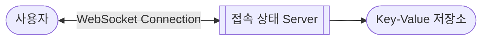

- 사용자의 접속 상태 기능은 접속 상태 server를 따로 두어 관리합니다.
    1. **WebSocket**으로 접속 상태 server에 사용자를 연결합니다.
    2. **박동 event**로 접속 상태 Server에 사용자의 접속 상태를 주기적으로 알립니다.
    3. **발행-구독 model**로 사용자와 관계있는 다른 사용자에게 상태 변화를 통지합니다.

- 이 글에서 소개하는 방법은 소규모 service에 적합합니다.
    - 대규모 service의 경우, 너무 많은 event가 발생하게 됩니다.
    - 만약 대규모 service에서 상태 정보를 전달하는 기능이 필요하다면, service에 입장하는 순간에만 상태 정보를 읽어가거나, 수동으로 갱신하도록 유도해야 합니다.


---


## 1. 사용자와 접속 상태 Server 연결하기 : WebSocket

- 접속 상태 server는 클라이언트와 WebSocket으로 통신하는 실시간 service입니다.



- 사용자와 실시간 service 사이에 연결이 이루어지면 접속 상태 server는 **사용자의 상태**와 **`last_active_at` timestamp**를 key-value 저장소에 보관합니다.

```json
// key-value 저장소에 User의 접속 상태 저장
{
    "user_id": {
        "status": "online",    // online, offline
        "last_active_at": "2024-02-21 10:21:39"    // Timestamp
    }
}
```

- 이 작업이 끝나면 사용자는 '접속 중' 상태로 표시됩니다.


## 2. 접속 상태 Server에 접속 상태를 주기적으로 알리기 : 박동 Event

- internet 연결이 항상 안정적일 수 없기 때문에, 설계할 때에 접속 장애를 함께 고려해야 합니다.
- 불안정한 연결을 보완하기 위해 일반적으로 사용하는 방법은 **주기적으로 박동(heartbeat) event를 발생시키는 방법**입니다.
    - **client**는 주기적으로 박동 event를 발생시켜 접속 상태 server로 전송합니다.
    - **server**는 마지막 event를 받은 지 x초 이내에 또 다른 박동 event를 받는다면 접속 상태를 유지합니다.
        - 접속 상태 유지는 key-value 저장소에 보관된 사용자의 `last_active_at`를 갱신하는 것으로 합니다.
        - 만약 server가 시간 내에 박동 event를 받지 못한다면, 사용자의 상태(`status`)를 offline으로 바꿉니다.


## 3. 관계있는 다른 사용자에게 상태 변화 통지하기 : 발행-구독 Model

- 박동 event로 접속 상태 변화를 관리하더라도, 관련된 다른 사용자들(e.g., 친구, follower 등)이 해당 상태 변화를 알 수 있어야 합니다.
- 발행-구독 model(publish–subscribe pattern)을 사용하여 각 사용자마다 channel을 하나씩 두어 상태 변화를 통지받을 수 있도록 합니다.
    - channel은 발행자와 구독자의 data 동기화를 위한 message queue입니다.
    - 다른 사용자들은 구독한 channel을 통해 해당 사용자의 상태 변화를 전달받을 수 있습니다.


---


## Reference

- 가상 면접 사례로 배우는 대규모 시스템 설계 기초 (도서) - Alex Xu, 이병준
