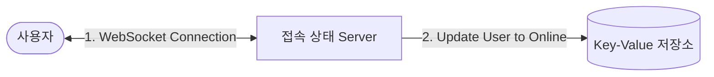
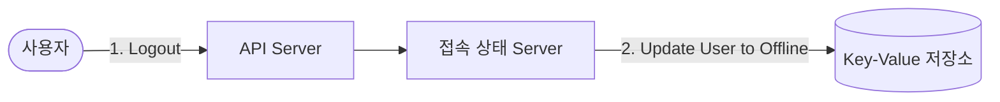
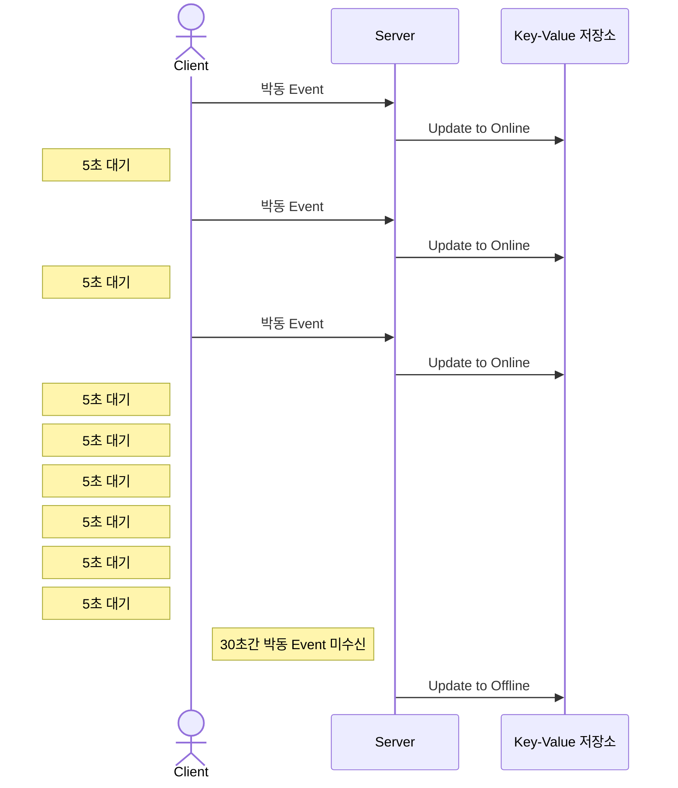
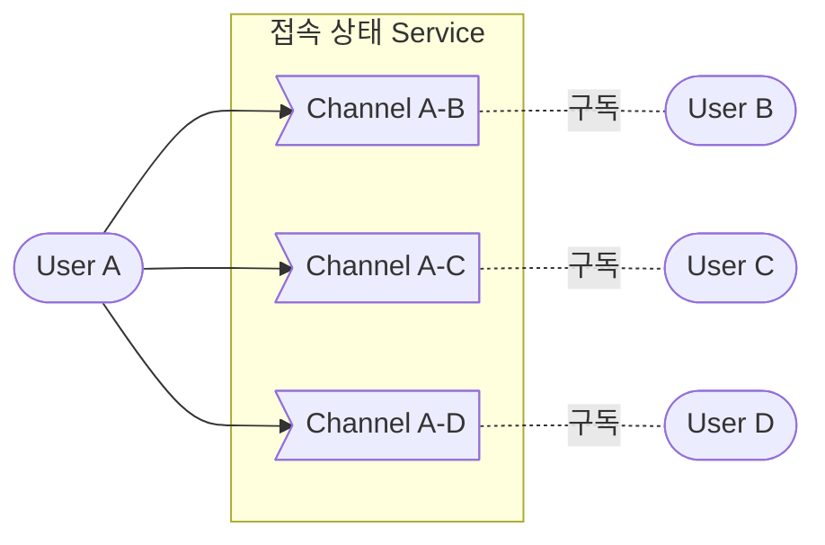

- 사용자의 접속 상태를 표시하는 것은 SNS 또는 chatting application의 핵심적 기능힙니다.

- 접속 상태 server(presense server)를 통해 사용자의 상태를 관리합니다.
    - 접속 상태 server는 client와 WebSocket으로 통신하는 실시간(real-time) service입니다.


---


## 사용자 Login/Logout


### Login

- login을 통해 사용자와 실시간 service 사이에 연결이 이루어지면, 접속 상태 server는 **사용자의 상태**(`status`)와 **마지막 활동 일시**(`last_active_at`)를 key-value 저장소에 보관합니다.
    - 이 작업이 끝나면 사용자는 '접속 중' 상태로 표시됩니다.



```json
{
    "user_id": {
        "status": "online",    // online으로 갱신
        "last_active_at": "2024-02-21 10:21:39",    // 현재 시간으로 갱신
    }
}
```

### Logout

- client는 API server로 logout 요청을 하고, API server가 그 요청을 접속 상태 server에 전달하면, 접속 상태 server는 사용자의 상태(`status`)를 'offline'으로 변경합니다.
    - 이 작업이 끝나면 사용자는 '미접속' 상태로 표시됩니다.



```json
{
    "user_id": {
        "status": "offline",    // offline으로 갱신
        "last_active_at": "2024-02-21 10:21:39",    // 갱신하지 않음
    }
}
```


---


## 접속 장애

- internet 연결이 항상 안정적일 수 없기 때문에, 설계할 때에 접속 장애를 함께 고려해야 합니다.
    - 사용자의 internet 연결이 끊어지면 client와 server 사이에 맺어진 WebSocket 같은 지속성 연결도 끊어집니다.

- 접속 장애에 대응하는 간단한 방법은 "장애 시 사용자를 offline 상태로 표시하고, 연결이 복구되면 online 상태로 변경하는 것"입니다.
    - 하지만 짧은 시간 동안 internet 연결이 끊어졌다 복구되는 일은 흔하기 때문에, 그때마다 사용자의 접속 상태를 변경하는 것은 지나칩니다.
        - e.g., elevator를 타거나 차를 타고 tunnel을 지나가면 internet 연결이 잠시 끊어집니다.
    - 이는 사용자 경험 측면에서도 바람직하지 않습니다.

- 따라서 사용자 경험을 해치지 않으면서 접속 장애에 대응하기 위해, **박동 event를 발생시키는 방법**을 사용합니다.


### 박동 Event (Heartbeat Event)



1. **client**는 주기적으로 박동 event를 발생시켜 접속 상태 server로 전송합니다.

2. **server**는 박동 event 수신 여부로 장애 여부를 판단하여 사용자의 접속 상태를 변경합니다.
    - **online** : 마지막 event를 받은 지 x초 이내에 또 다른 박동 event를 받는다면 접속 상태를 계속 online으로 유지합니다.
        - 접속 상태 유지 작업은 key-value 저장소에 보관된 사용자의 **`status`를 'online'으로, `last_active_at`를 현재 시간으로 갱신**하여 처리합니다.
    - **offline** : 만약 server가 시간 내에 박동 event를 받지 못한다면, 사용자의 접속 상태를 offline으로 바꿉니다.
        - key-value 저장소에 보관된 사용자의 **`status`를 'offline'으로 갱신**하여 처리합니다.


---


## 상태 정보의 전송

- 사용자의 접속 상태 변화를 관련된 다른 사용자들(e.g., 친구, follower 등)이 알 수 있어야 합니다.
- 따라서 발행-구독 model(publish–subscribe model)을 사용하여 각각의 관계마다 channel을 하나씩 두어 상태 변화를 통지 받을 수 있도록 합니다.
    - channel은 발행자와 구독자의 data 동기화를 위한 message queue입니다.
    - 다른 사용자들은 구독한 channel을 통해 해당 사용자의 상태 변화를 쉽게 전달받을 수 있습니다.



- 이 방식은 group size가 작을 때 효과적입니다.
- group size가 더 커지면 이런 식으로 접속 상태를 알려서는 비용이나 시간이 많이 들게 되므로 좋지 않습니다.
    - e.g., group 하나에 100,000 사용자가 있다면, 상태 변화 1건당 100,000개의 event message가 발생할 것입니다.
    - 이런 성능 문제를 해소하는 방법으로 'service 또는 group에 입장하는 순간에만 상태 정보를 읽어가게 하는 것'이나, '수동으로(manual) 접속 상태를 갱신하도록 유도하는 것' 등이 있습니다.


---


## Reference

- 가상 면접 사례로 배우는 대규모 시스템 설계 기초 (도서) - Alex Xu, 이병준
