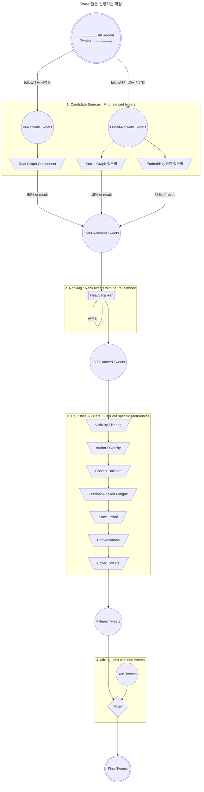

- 2023년 3월 31일, Twitter는 home timeline의 **"For You" feed 추천 Algorithm**을 Github와 자사의 기술 blog에 공개했습니다.
    - algorithm source code : <https://github.com/twitter/the-algorithm>
    - machine learning source code : <https://github.com/twitter/the-algorithm-ml>
    - algorithm에 대한 설명 : <https://blog.twitter.com/engineering/en_us/topics/open-source/2023/twitter-recommendation-algorithm>

- Twitter의 home에는 두 개의 timeline이 표시됩니다.
    1. Follwing timeline : 'follow한 사람의 posting'을 볼 수 있습니다.
    2. For You (추천) timeline : 'follow한 사람의 posting', 'follow하지 않는 사람의 posting', '광고' 등이 추천 algorithm으로 선정되어 보여집니다.

- 이 글은 추천 algorithm에 대해 설명합니다.


---


## 추천 timeline의 tweet들을 선정하는 algorithm

- Twitter에는 매일 5억개 정도의 tweet들이 게시됩니다.
- 추천 algorithm은 timeline 상위에 노출시킬 tweet들을 선정합니다.
- 화면에 표시되는 tweet들은 선정을 위한 pipeline을 거치면서 정해집니다.
    1. Candidate Sources : 후보를 선정합니다.
    2. Ranking : 순위를 매깁니다.
    3. Heuristics & Filters : filtering하고 순위를 조정합니다.
    4. Mixing : tweet들과 non-tweet들을 섞습니다.




---


## 1. Candidate Sources

- 수억 개의 후보 중에서 약 1500개 정도의 관련성 있는 최신 tweet들을 가져오는 작업입니다.
- In-Network(follow하는 사람들)과 Out-of-Network(follow하지 않는 사람들)에게서 후보를 가져옵니다.
    - 추천 timeline은 평균적으로 In-Network 50%와 Out-of-Network 50%로 구성됩니다.

### In-Network Source

- follow한 사람의 tweet들 중에 가장 '최신'이며 가장 '관련성 있는' tweet들을 가져옵니다.
    - logistic 회귀 model을 사용하여 follow하는 사람들의 tweet들을 관련성에 따라 순위를 매깁니다.
        - logistic 회귀(regression) : 수학을 사용하여 두 data 요인 간의 관계를 찾는 data 분석 기법.
    - 높은 순위의 tweet들을 다음 단계로 보냅니다.

- [Real Graph](https://www.ueo-workshop.com/wp-content/uploads/2014/04/sig-alternate.pdf)는 In-Network에서 순위를 정할 때 사용되는 핵심 component입니다.
    - Real Graph는 두 사용자 간의 참여(engagement) 가능성을 예측하는 model입니다.
        - engagement : 상호 간의 관계를 맺는 모든 행위.
            - e.g., 댓글 작성하기
    - '사용자(user)'와 '사용자가 follow하는 사람(author of tweet)' 간의 Real Graph 점수가 높을 수록 더 많은 tweet이 후보에 포함됩니다.

### Out-of-Network Sources

- Out-of-Network에서 관련성 있는 tweet들을 찾는 것은 In-Network에서 찾는 것보다 더 까다롭습니다.

- Twitter는 Out-of-Newtork에서 사용자가 좋아할 것 같은 tweet들을 찾기 위해 두 가지 접근법을 사용합니다.
    1. Social Graph
    2. Embedding Spaces

#### Social Graph 접근법

- 사용자가 follow하는 사람과 선호하는 tweet들을 기준으로 관심도 높은 후보를 생성합니다.

```txt
사용자가 follow하는 사람들이 최근에 어떤 tweet에 참여했습니까?
사용자가 좋아하는 tweet들과 비슷한 tweet을 좋아하는 사람들이 최근에 어떤 것들을 좋아했습니까?
```

- 위 질문들에 대한 답을 하면서 후보 tweet들을 생성하고, logistic 회귀 model을 사용하여 결과 tweet들의 순위를 매깁니다.
    - 이런 유형의 graph 순회(traversal)는 Out-of-Network 추천에 필수적입니다.
    - Twitter는 graph 순회를 실행하기 위해 자체 개발한 [GraphJet](https://www.vldb.org/pvldb/vol9/p1281-sharma.pdf)을 사용합니다.
        - GraphJet : 사용자와 tweet 간의 실시간 상호 작용 graph를 유지하는 graph 처리 engine입니다.

#### Embedding 공간 접근법

- embedding 공간 접근법은 content의 유사성에 대해 social graph 접근법보다 **일반적인** 기준으로 판단합니다.

```txt
사용자의 관심사와 비슷한 tweet과 사용자가 무엇입니까?
```

- embedding 공간에서 유사성을 계산하여 관련도를 얻습니다.
    - embedding은 사용자의 관심사와 tweet의 content를 수치로 표현함으로써(numerical representation) 작동합니다.
    - 이 수치로 embedding 공간에서 user-user, tweet-tweet, user-tweet 간의 유사성을 계산할 수 있습니다.
    - 정확한 embedding을 생성한 경우, 이 유사성을 관련성 지표로 사용할 수 있습니다.

- community를 이용해 tweet이 어떤 관심사에 속하는지 알아낼 수 있으며, 이 과정에서 [custom matrix factorization algorithm](https://github.com/twitter/sbf)을 사용하는 [SimClusters](https://dl.acm.org/doi/10.1145/3394486.3403370)라는 embedding 공간을 사용합니다.
    - community는 특정한 관심사를 다른 사람들과 함께 모아볼 수 있는 공간입니다.
    - community(관심사) 내의 많은 사용자가 좋아하는 tweet은 그 관심사와 연관되어 있을 확률이 높습니다.
        - 따라서 "'어떤 사용자'와 '어떤 tweet'이 '어떤 community'에 속해있는지"는 tweet의 관심사를 분류하는 데에 중요한 정보로 활용할 수 있습니다.
        - Twitter에는 이미 145,000개의 community들이 있으며, 3주마다 새로운 community들이 update됩니다.

| Top 5 Community | 사용자 수 |
| --- | --- |
| POP | 332,000,000 |
| NEWS | 293,000,000 |
| SOCCER | 191,000,000 |
| BOLLYWOOD | 80,000,000 |
| NBA | 70,000,000 |


---


## 2. Ranking

- 후보 선정이 끝나고, 순위 작업이 시작되는 시점의 pipeline에는 최대 1500개의 후보가 있습니다.
    - 순위 작업에서의 모든 후보들은 동일한 중요도를 가지고 판단됩니다.
        - 후보의 출처가 어디인지 상관하지 않습니다.

- 사용자의 긍정적 참여(좋아요, Retweet, 댓글 등)를 유도하기 위해 지속적으로 학습되어 온 신경망을 사용하여 적합한 순위를 매깁니다.
    - 이 신경망은 최대 4800만 개의 parameter로 tweet 간의 상호 작용에 대해서 학습한 신경망입니다.

- 신경망을 이용한 ranking mechanism은 각 tweet에 점수를 주고, 이 점수로 tweet의 순위를 매깁니다.
    - ranking mechanism은 수천 개의 feature로 10개의 label을 예측합니다.
    - 각 label은 참여 확률(probability of engagement)을 나타냅니다.


---


## 3. Heuristics & Filters

- 순위를 매기고 나면, heuristic과 filter를 적용하여, 다양하고 균형 잡힌 feed들이 생성될 수 있도록 합니다.
    - heuristic algorithm : 불충분한 시간이나 정보로 인하여 합리적인 판단을 할 수 없거나, 체계적이면서 합리적인 판단이 굳이 필요하지 않은 상황에서 빠른 의사결정을 할 수 있도록 고안된 computer altorithm.

1. Visibility Filtering
    - tweet의 내용과 사용자의 선호도에 따라 tweet들을 filtering합니다.
    - e.g., block 또는 mute한 계정의 tweet들을 제거합니다.

2. Author Diversity
    - 한 작성자의 연속되는 tweet을 피합니다.

3. Content Balance
    - In-Network의 tweet들과 Out-of-Network의 tweet들을 균형 있게 제공합니다.

4. Feedback-based Fatigue
    - 특정 tweet을 보았던 사용자가 부정적인 feedback을 줬다면, 해당 tweet의 점수를 낮춥니다.

5. Social Proof
    - 품질 보호를 위해 tweet에 대한 2단계 연결이 없는 Out-of-Network tweet들은 제외합니다.
        - 사용자가 follow하는 tweet에 참여하거나, tweet의 작성자를 follow하는지 확인합니다.

6. Conversations
    - tweet에 대한 응답(reply) tweet은 thread로 만들어, 원래 tweet의 내용을 함께 제공합니다.

7. Edited Tweets
    - 현재 device에 있는 tweet들이 오래되었는지 확인하고, 편집된 version의 tweet들로 바꾸라는 명령을 보냅니다.


---


## 4. Mixing

- 이 시점에서 Home Mixer는 사용자에게 표시할 최종 tweet들을 가지고 있습니다.
- 마지막 과정으로, system은 tweet들을 non-tweet(광고, follow할 사람 추천 등)과 섞어 화면에 표시합니다.


---


## Reference

- <https://github.com/twitter/the-algorithm>
- <https://github.com/twitter/the-algorithm-ml>
- <https://blog.twitter.com/engineering/en_us/topics/open-source/2023/twitter-recommendation-algorithm>
- <https://www.youtube.com/watch?v=a8wCny94-_U>
