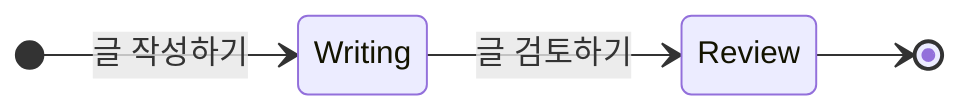

## 글을 시작하는 소제목 : 소제목에 대한 부가 설명

- 이 영역에선 전체적인 내용을 요약합니다.
- 주로 개념적인 설명이나 전체적인 구조를 그립니다.
- 글은 항상 항목화하여, 구조적으로 작성합니다.
    - 추상적인 내용이 먼저 나오고, 구체적인 내용이 나중에 나옵니다.
    - 부가적인 설명은 주된 설명의 하위 항목으로 작성합니다.

---

## 2단계 제목 작성하기

- 2단계 제목(`##`)은 글을 나누는 가장 큰 단위입니다.
- 2단계 제목에 대한 내용은 수평선(`---`)과 줄바꿈으로 구분합니다.
    - 수평선 위와 아래에는 빈 줄을 2개 추가하여, 내용을 더 명확히 구분합니다.

### 3단계 제목 작성하기

- 3단계 제목(`###`)은 2단계 제목의 내용을 세부적으로 나누는 단위입니다.
- 3단계 제목에 대한 내용은 2개의 빈 줄을 추가하여 구분합니다.

#### 4단계 제목 작성하기

- 4단계 제목(`####`)은 3단계 제목의 내용을 더 세부적으로 나누는 단위입니다.
- 4단계 제목에 대한 내용은 1개의 빈 줄을 추가하여 구분합니다.
- 5단계 제목(`#####`)과 6단계 제목(`######`)은 문서에 사용하지 않습니다.
    - 5단계 제목과 6단계 제목은 문서의 구조를 복잡하게 만들 수 있습니다.
    - 그 정도로 세부적이어야 하는 경우, 별도의 문서로 분리하여 작성하는 것이 좋습니다.

---

## Diagram 그리기

- diagram은 Mermaid.js를 사용하여 작성합니다.

---

## Tabel 그리기

- table은 Markdown의 table syntax를 사용하여 작성합니다.

- 제목 행과 내용 행을 구분할 때는 `| --- |`를 사용합니다.

| 제목 1 | 제목 2 | 제목 3 |
| --- | --- | --- |
| 내용 1 | 내용 2 | 내용 3 |
| 내용 4 | 내용 5 | 내용 6 |
| 내용 7 | 내용 8 | 내용 9 |

---

## Reference

- <https://example.comm>
