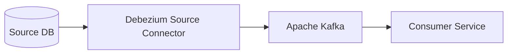
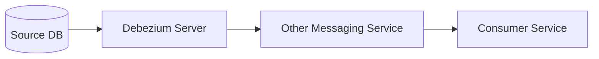
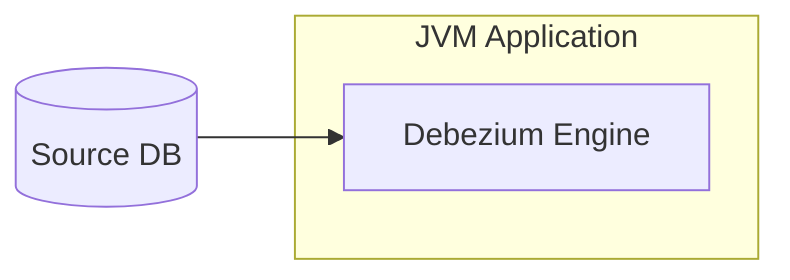

## Debezium : 데이터베이스의 변경 사항을 실시간으로 감지하고 전달하기

> Debezium is a set of distributed services to capture changes in your databases so that your applications can see those changes and respond to them. Debezium records all row-level changes within each database table in a change event stream, and applications simply read these streams to see the change events in the same order in which they occurred.

- Debezium은 **데이터베이스의 변경사항을 실시간으로 캡처**하여, 애플리케이션이 이러한 변경사항을 감지하고 대응할 수 있게 해주는 분산 서비스입니다.
    - 각 데이터베이스 테이블의 행 단위 변경사항을 변경 이벤트 스트림(change event stream)으로 기록하며, 애플리케이션은 이 스트림을 읽어 변경 이벤트를 발생 순서대로 확인할 수 있습니다.

- Debezium은 실시간 데이터 동기화, 마이크로서비스 간 데이터 일관성 유지, 데이터 분석, 모니터링, 캐시 무효화, 검색 인덱스 업데이트 등 다양한 use case에 활용될 수 있습니다.
    - 데이터베이스의 변경사항을 실시간으로 처리해야 하는 모든 시나리오에 적합합니다.

### Debezium의 주요 특징

- Debezium은 **로그 기반 CDC** 방식으로 데이터베이스의 변경사항을 캡처합니다.
    - **트랜잭션 로그를 읽어들여 데이터베이스의 변경사항을 실시간으로 감지**하고 이를 다른 시스템으로 전달합니다.

- 로그 기반 CDC 방식을 채용하였기에, Log 기반 CDC의 장점을 동일하게 가집니다.

1. **완전한 데이터 변경 캡처** : 모든 데이터 변경사항을 누락 없이 포착합니다.
    - 데이터베이스의 커밋된 트랜잭션을 실시간으로 추적하여 INSERT, UPDATE, DELETE 연산을 정확하게 캡처합니다.

2. **낮은 지연 시간** : MySQL이나 PostgreSQL의 경우 밀리초 단위의 지연시간으로 변경사항을 감지하며, 잦은 폴링으로 인한 CPU 사용량 증가를 방지합니다.
    - 바이너리 로그나 WAL(Write-Ahead Log)을 직접 읽어 효율적으로 처리합니다.

3. **데이터 모델 유지** : "Last Updated" 같은 추가 컬럼이 필요하지 않습니다.
    - 기존 애플리케이션의 데이터 모델을 변경하지 않고도 CDC를 구현할 수 있습니다.

4. **삭제 이벤트 캡처** : 데이터 삭제 작업도 감지 가능합니다.
    - 삭제된 레코드의 키와 이전 값을 포함한 완전한 정보를 제공합니다.

5. **풍부한 메타데이터** : 이전 레코드 상태, 트랜잭션 ID, 원인이 된 쿼리 등 다양한 메타데이터를 캡처할 수 있습니다.
    - 소스 데이터베이스의 스키마 변경사항도 추적 가능합니다.

### Debezium의 주요 기능

1. **스냅샷** : 커넥터 시작 시 필요한 로그가 없는 경우, 데이터베이스의 현재 상태를 초기 스냅샷으로 생성할 수 있습니다.
    - 런타임에 트리거할 수 있는 증분 스냅샷도 지원됩니다.
    - 스키마 변경이나 데이터 복구 시에도 부분 스냅샷을 활용할 수 있습니다.
    - 스냅샷 모드를 구성하여 초기 로드 동작을 제어할 수 있습니다.

2. **필터링** : include/exclude 리스트를 통해 캡처할 스키마, 테이블, 컬럼을 구성할 수 있습니다.
    - 정규표현식을 사용한 동적 필터링이 가능합니다.
    - 특정 데이터베이스 사용자의 변경사항만 캡처하도록 설정할 수 있습니다.
    - 조건부 필터링을 통해 특정 조건을 만족하는 레코드만 캡처할 수 있습니다.

3. **마스킹** : 민감한 데이터가 포함된 특정 컬럼의 값을 마스킹 처리할 수 있습니다.
    - 해시, 토큰화, 난독화 등의 다양한 마스킹 알고리즘을 제공합니다.
    - 커스텀 마스킹 변환기를 구현하여 사용할 수 있습니다.
    - 조건부 마스킹으로 특정 상황에서만 마스킹을 적용할 수 있습니다.

4. **모니터링** : 대부분의 커넥터는 JMX를 통한 모니터링이 가능합니다.
    - 지연 시간, 처리량, 오류율 등 다양한 메트릭을 제공합니다.
    - Prometheus와 Grafana를 통한 시각화가 가능합니다.
    - 알림 설정을 통해 문제 상황을 즉시 감지할 수 있습니다.

5. **메시지 변환** : 메시지 라우팅, 필터링, 이벤트 평탄화 등을 위한 즉시 사용 가능한 변환 기능을 제공합니다.
    - SMT(Single Message Transform)을 통한 메시지 구조 변경이 가능합니다.
    - 아웃바운드 라우팅을 통해 조건에 따라 다른 토픽으로 메시지를 전송할 수 있습니다.
    - 스키마 진화를 지원하여 스키마 변경에 유연하게 대응할 수 있습니다.
    - 이벤트 평탄화를 통해 복잡한 관계형 데이터를 단순화할 수 있습니다.

---

## Debezium Architecture : 여러 가지 사용 방식

- Debezium은 기본적으로 Apache Kafka Connect를 위한 소스 커넥터 세트이지만, 다른 방식으로도 사용할 수 있습니다.

### 1. Kafka Connect Source Connector ([참고 문서](https://debezium.io/documentation/reference/stable/architecture.html))

- Kafka Connect를 통해 Apache Kafka를 이용하여 변경 이벤트를 전송합니다.
- Kafka Connect의 source connector로 Debezium을 사용하는, 가장 일반적인 사용 방식입니다.

### 2. Debezium Server ([참고 문서](https://debezium.io/documentation/reference/stable/operations/debezium-server.html))

- Debezium Server를 사용하여 다른 메시징 인프라로 통해 변경 이벤트를 전송합니다.
- Kafka 외의 메시징 서비스를 사용해야 하는 경우 사용합니다.

### 3. Debezium Engine ([참고 문서](https://debezium.io/documentation/reference/stable/development/engine.html))

- Debezium Engine 라이브러리를 JVM 기반 애플리케이션에 임베드하여 사용합니다.
- messaging service를 통하지 않고, application으로 변경 사항을 바로 전달받고 싶은 경우 사용합니다.

---

## Reference

- <https://debezium.io/documentation/reference/stable/index.html>
- <https://debezium.io/documentation/reference/stable/features.html>
