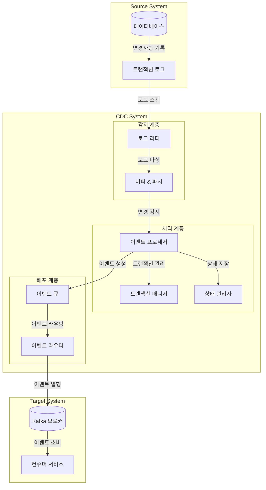

## Log 기반 CDC : DB Log를 활용한 변경 감지

- Log 기반 CDC(Log-based Change Data Capture)는 데이터베이스의 변경 사항을 **로그 파일을 통해** 실시간으로 포착하고 전파하는 기술입니다.
    - MySQL의 Binlog, PostgreSQL의 WAL 등, 대부분의 DB에는 DB의 모든 이벤트를 저장하는 트랜잭션 로그가 존재합니다.
    - 트랜잭션 로그, 리두 로그, 바이너리 로그 등을 활용하여 INSERT, UPDATE, DELETE 작업을 감지하고 추출하여, 변경 정보를 스트리밍 형태로 제공합니다.

- 일반적인 event programming 방식과 비교했을 때, 개발자의 실수로 인한 이벤트 누락이 없습니다.
    - event programming 방식은 개발자가 application source code 내에서 직접 이벤트를 발생시는 방식입니다.
    - CDC를 사용하면 데이터베이스 내부에서 변경 사항을 감지하므로, 개발자의 실수로 인한 이벤트 누락이 없습니다.
        - database 기반의 CDC에는 공통적으로 적용되는 특징입니다.

- 오직 로그에만 의존하기 때문에, 데이터베이스에 대한 영향을 최소화하면서 변경 사항을 실시간으로 감지할 수 있습니다.
    - 소스 데이터베이스의 변경 없이 구현이 가능하여, 데이터베이스 성능에 미치는 영향을 최소화할 수 있습니다.
        - 트랜잭션 로그는 데이터베이스의 기본 기능이므로, 별도의 트리거나 추가적인 쿼리를 사용하지 않아도 됩니다.

### Log 기반 CDC의 장점

- **데이터베이스 성능 영향 최소화** : 트랜잭션 로그를 읽기만 하므로 **실제 데이터베이스 작업에 거의 영향을 주지 않습니다.**
    - 데이터베이스가 기본적으로 생성하는 로그를 활용하므로 추가적인 부하가 발생하지 않습니다.
    - 운영 중인 시스템의 성능을 안정적으로 유지할 수 있습니다.

- **데이터 정확성과 신뢰성** : 트랜잭션 로그에는 **모든 변경사항이 시간 순서대로 기록됩니다.**
    - ACID 속성이 보장된 트랜잭션 단위로 변경사항을 추적할 수 있습니다.
    - 롤백된 트랜잭션도 감지할 수 있어 더 정확한 데이터 추적이 가능합니다.

- **확장성** : **대용량 데이터 처리에 적합**합니다.
    - 여러 개의 CDC 리더를 병렬로 실행할 수 있습니다.
    - 데이터베이스 크기가 증가해도 안정적으로 동작합니다.

- **시점 복구(Point-in-Time Recovery) 지원** : **특정 시점의 데이터 상태로 복구가 가능**합니다.
    - 장애 발생 시 데이터 손실을 최소화할 수 있습니다.
    - 히스토리 추적과 감사가 용이합니다.

- **유연한 데이터 처리** : **다양한 형태의 데이터 변환과 가공이 가능**합니다.
    - 배치 처리와 실시간 처리를 모두 지원합니다.
    - 필요한 변경 데이터만 선택적으로 필터링할 수 있습니다.

### Log 기반 CDC의 단점

- **로그 포맷 의존성** : 데이터베이스 벤더마다 로그 형식이 다릅니다.
    - 또한, 데이터베이스 버전이 업그레이드될 때마다 로그 형식이 변경될 수 있습니다.
    - 벤더에 종속적이기 때문에 CDC 시스템의 유지보수가 복잡해질 수 있습니다.

- **스토리지 관리 필요** : 트랜잭션 로그는 지속적으로 증가합니다.
    - 로그 파일의 크기가 너무 커지면 처리 성능에 영향을 미칠 수 있습니다.
    - 따라서 적절한 로그 보관 정책과 스토리지 관리 전략이 필요합니다.

- **구현 복잡성** : 데이터베이스 내부 동작을 알아야 구현할 수 있습니다.
    - 로그 기반 CDC를 구현하기 위해서는 데이터베이스 내부 동작에 대한 이해가 필요합니다.
    - 로그 파싱, 변경 데이터 추출, 에러 처리 등 복잡한 로직을 구현해야 합니다.

- 일반적으로는 CDC 솔루션을 사용하기 때문에, **사용자의 입장에서는 이러한 단점들을 크게 신경쓰지 않아도 됩니다.**
    - 솔루션을 사용하면 데이터베이스 벤더나 버전에 상관없이 **일관된 인터페이스로 CDC를 구현**할 수 있습니다.
    - 대표적인 CDC 솔루션으로 Debezium, Maxwell, GoldenGate 등이 있습니다.

### Log 기반 CDC 사용 시 주의 사항

- 로그를 기반으로 변경을 감지한다는 특성이 문제가 될 수 있는 상황이 있습니다.
    - DB 설정 및 DB 계정 권한에 따른 제약 사항, 대량 데이터 변경 시 동기화 지연 문제 등.

- 따라서 사전에 이러한 문제점을 파악하고 대비하는 전략을 수립해야 합니다.
    - Log 기반 CDC를 사용할 때는 데이터베이스의 로깅 정책과 사용자 권한 설정을 미리 확인하고, 대량 데이터 변경에 대한 대책을 마련해야 합니다.

#### 데이터베이스 설정 및 권한 관련 제약 사항

- 성능 최적화를 위해 최소 로깅(Minimal Logging) 또는 벌크 로깅(Bulk Logging) 모드를 사용하는 경우, 일부 데이터 변경사항이 로그에 기록되지 않을 수도 있습니다.
    - 예를 들어, Oracle의 NOLOGGING 옵션이나 SQL Server의 Minimal Logging 설정이 활성화된 경우, 대규모 데이터 적재 작업의 세부 변경사항이 캡처되지 않을 수 있습니다.

- 또한, 데이터베이스 로그에 대한 읽기 권한이 없는 경우, 로그 기반의 CDC 사용이 불가능합니다.
    - 보안 정책이 엄격한 조직에서는 권한 부여를 제한할 수 있으며, 특히 클라우드 환경이나 관리형 데이터베이스 서비스를 사용하는 경우, 서비스 수준에서 로그 접근이 제한될 수 있습니다.

- 따라서 Log 기반 CDC를 사용하기 위해서는 데이터베이스의 로깅 정책, 설정, 권한 관련 제약 사항 등을 사전에 확인하고 준비해두어야 합니다.

#### 대량 데이터 변경 시 동기화 지연 문제

- 대규모 데이터 변경 작업은 CDC 시스템에 부하를 줍니다.
    - 대규모의 데이터 변경이 발생할 경우, 로그 파일의 크기가 급격히 증가하고 처리해야 할 변경사항의 양도 대폭 증가합니다.
    - 예를 들어, 연말 데이터 정산, 시스템 마이그레이션, 또는 대규모 데이터 정제 작업과 같은 벌크 작업 등.

- 대량의 데이터가 변경될 때, CDC 시스템은 많은 수의 변경사항을 실시간으로 처리해야 하므로, 처리 속도가 느려지거나 지연이 발생할 수 있습니다.
    - CDC 처리 속도가 변경사항 발생 속도를 따라가지 못해 지연이 발생하는 경우, 데이터 동기화가 늦어지거나 데이터 누락이 발생할 수 있습니다.
    - 로그 파일 처리에 필요한 시스템 리소스가 급증하여 전반적인 성능 저하가 발생할 수 있습니다.
    - 대량의 변경사항을 처리하는 동안 메모리 사용량이 급증하여 시스템 안정성에 영향을 줄 수 있습니다.

- 따라서 변경사항을 일시적으로 큐잉하거나 배치 처리하는 방식을 적용하여 대량 변경 작업에 대한 영향을 최소화하는 전략을 수립해야 합니다.
    - 예를 들어, 대량 데이터 변경 작업이 발생할 경우, CDC 시스템을 일시적으로 중지하고 변경 작업이 완료된 후에 다시 시작하는 방식을 적용할 수 있습니다.
    - 또는 변경사항을 큐잉하여 일정 시간 간격으로 배치 처리하는 방식을 적용할 수 있습니다.

---

## Log 기반 CDC Architecture

- **Source System**에서 일어나는 변경 사항을 **CDC System**이 감지하고 처리한 후, **Target System**으로 전달하는 구조입니다.

### Source System

- 소스 시스템은 모니터링 대상이 되는 데이터베이스와 그 변경사항을 기록하는 트랜잭션 로그로 구성됩니다.

- 데이터베이스에서 발생하는 모든 변경사항(INSERT, UPDATE, DELETE)은 트랜잭션 로그에 순차적으로 기록되며, 이는 CDC 시스템의 기초 데이터가 됩니다.
    - 트랜잭션 로그는 ACID 속성을 보장하며, 데이터베이스의 모든 변경사항을 시간 순서대로 저장합니다.
    - 로그 포맷은 데이터베이스 벤더별로 상이하며, MySQL binlog, PostgreSQL WAL 등과 같이 바이너리 형태로 저장됩니다.

- 로그 보관 정책에 따라 순환 삭제될 수 있으므로, CDC 시스템은 적절한 처리 속도를 보장해야 합니다.

### CDC System

- CDC 시스템은 **변경을 감지/추출**(감지 계층)하고, 변경 데이터를 **이벤트로 변환**(처리 계층)한 뒤, 처리된 이벤트를 **목적지 시스템으로 전달**(배포 계층)합니다.

#### 감지 계층 (Capture Layer)

- **Log Reader** : **트랜잭션 로그를 지속적으로 스캔하여 변경사항을 감지**합니다.
    - 데이터베이스 성능에 미치는 영향을 최소화하기 위해 비동기적으로 처리합니다.
    - LSN(Log Sequence Number) 또는 SCN(System Change Number) 기반으로 마지막으로 읽은 로그 포지션을 추적하여 장애 발생 시 복구를 지원합니다.
    - 데이터베이스 버전 변경이나 스키마 변경을 감지하고 대응합니다.
    - 로그 리더의 병렬 처리를 통해 처리량을 최적화합니다.

- **Buffer & Parser** : **읽어들인 로그 데이터를 임시 저장하고 파싱**합니다.
    - 벤더별 로그 포맷에 대한 전용 파서를 구현하여 다양한 데이터베이스 로그 형식을 지원합니다.
    - JSON, Avro, Protobuf 등 표준 형식으로 변환하고 타임스탬프, 트랜잭션 ID 등의 메타데이터를 추가합니다.
    - 메모리 사용량 관리를 위해 버퍼 크기를 조정하고, 파싱 성능 최적화를 위한 캐싱 전략을 적용할 수 있습니다.

#### 처리 계층 (Process Layer)

- **Event Processor** : **파싱된 로그 데이터를 이벤트로 변환하고 처리**합니다.
    - 파싱된 변경 데이터를 표준화된 이벤트 형식으로 변환합니다.
    - 변경 유형, 타임스탬프, 소스 식별자 등의 메타데이터와 연관된 비즈니스 컨텍스트 정보를 추가합니다.
    - 스키마 버전 관리 및 호환성을 검증하고, 스키마 변경에 따른 이벤트 형식을 조정합니다.
    - 민감 정보 처리와 불필요한 데이터 필터링을 수행합니다.
    - 이벤트 압축 및 최적화를 진행합니다.

- **Transaction Manager** : **트랜잭션의 시작과 종료 지점을 식별하고 관리**합니다.
    - 글로벌 순서 및 파티션별 순서 관리를 통해 트랜잭션 정합성과 이벤트 순서를 보장합니다.
    - 중복 이벤트를 감지하고 제거하며, 재시도 로직을 구현하여 멱등성을 지원합니다.
    - 트랜잭션 시작/종료 지점을 식별하고 롤백 처리를 지원합니다.
    - 분산 트랜잭션을 처리합니다.

- **State Manager** : **처리된 이벤트의 상태 정보를 관리하고 추적**합니다.
    - 주기적으로 체크포인트를 생성하고 영구 저장합니다.
    - 처리 상태를 추적하고 실패한 이벤트의 재처리를 지원합니다.
    - 처리량, 지연시간 등의 성능 지표와 오류 및 경고 상황을 기록합니다.
    - 분산 환경에서 상태를 동기화합니다.

#### 배포 계층 (Distribution Layer)

- **Event Queue** : **처리된 이벤트를 임시 저장**합니다.
    - 메모리 기반의 고속 큐를 구현하고 백프레셔 메커니즘을 적용하여 성능을 최적화합니다.
    - 이벤트를 그룹화하고 배치 크기를 최적화하여 처리 효율성을 향상시킵니다.
    - 큐 길이와 메모리 사용량을 모니터링하고 관리합니다.
    - 우선순위 기반 처리를 지원합니다.

- **Event Router** : **목적지 시스템으로 이벤트를 라우팅**합니다.
    - 지수 백오프 전략을 적용하고 데드레터 큐를 관리하여 전송 실패 시 재시도 처리를 수행합니다.
    - 대상 시스템별 포맷 변환과 라우팅 규칙을 적용합니다.
    - 다중 목적지를 지원하고 파티션 전략을 구현합니다.
    - 압축 및 배치 전송, 연결 풀링을 통해 네트워크를 최적화합니다.

### Target System

- **Kafka Broker** : **이벤트를 저장하고 전달하는 메시지 브로커 시스템**입니다.
    - 이벤트를 영구 저장하고 전달을 보장합니다.
    - 파티션 기반의 병렬 처리를 통해 높은 처리량과 낮은 지연시간을 제공합니다.
    - 파티션 내 순서를 보장하고 멀티 파티션 전략을 구현합니다.
    - 리플리케이션 팩터 설정과 리더/팔로워 구조를 통해 복제 및 장애 복구를 지원합니다.
    - 토픽별 보관 기간 설정과 디스크 공간 관리를 통해 보관 정책을 관리합니다.

- **Consumer Service** : **이벤트를 소비하고 처리하는 서비스**입니다.
    - 이벤트를 구독하고 처리하는 다양한 서비스를 제공합니다.
    - 실시간 데이터 동기화, 분석 및 집계 처리 등 비즈니스 요구사항에 따라 이벤트를 처리합니다.
    - ETL 프로세스를 구현하고 데이터 웨어하우스에 적재하는 등의 데이터 동기화 및 분석을 수행합니다.
    - 파티션 할당 전략과 오프셋 관리를 통해 컨슈머 그룹을 관리합니다.
    - 리밸런싱 처리와 멱등성 보장을 통해 장애 처리 및 복구를 지원합니다.

---

## Trigger 기반 방식 CDC와의 비교

- Log 기반 CDC와 비슷한 방식으로 Trigger 기반 CDC가 있습니다.
    - 각각 장단점이 있으며, 사용 사례에 따라 적합한 방식을 선택해야 합니다.

| 비교 항목 | 트리거 기반 CDC | 로그 기반 CDC |
| --- | --- | --- |
| **구현 방식** | 데이터베이스 트리거를 사용하여 변경 감지 | 데이터베이스 트랜잭션 로그를 읽어서 변경 감지 |
| **실시간성** | 매우 높음 (즉각적인 감지) | 높음 (로그 읽기 지연 발생 가능) |
| **성능 영향** | 상대적으로 높음 (트리거 오버헤드) | 최소화 (로그 읽기만 수행) |
| **구현 복잡도** | 낮음 (상대적으로 단순) | 높음 (로그 파싱 로직 필요) |
| **확장성** | 제한적 (트리거 부하 증가) | 우수 (로그 기반 처리) |
| **데이터 정확성** | 높음 (즉각적인 캡처) | 매우 높음 (트랜잭션 로그 기반) |
| **리소스 사용** | CPU 사용량 높음 | 디스크 I/O 중심 |
| **유지보수** | 트리거 관리 필요 | 로그 관리 필요 |
| **적합한 환경** | 소규모 시스템, 실시간성 중요, 선택적 모니터링 필요 | 대규모 시스템, 성능/확장성 중요, 감사 추적 필요 |
| **장점** | 구현이 단순, 즉각적인 감지, 세밀한 제어 가능, 대부분의 DB 지원 | 성능 영향 최소, 완벽한 감사 가능, 높은 확장성, 시점 복구 가능 |
| **단점** | DB 성능 영향, 트랜잭션 시간 증가, 확장성 제한, 관리 복잡 | 구현 복잡, 벤더 종속성, 저장 공간 필요, 실시간성 다소 떨어짐 |
| **모니터링** | 트리거 성능, 실행 상태 | 로그 파일 상태, 파싱 성능 |
| **복구 기능** | 제한적 | 시점 복구 가능 |
| **데이터 필터링** | 트리거 수준에서 가능 | 로그 파싱 시점에서 가능 |
| **운영 비용** | 중간 (트리거 관리 비용) | 높음 (로그 관리, 저장 비용) |
| **초기 설정** | 비교적 간단 | 복잡하고 전문성 필요 |

- **트리거 기반 CDC**는 데이터베이스 트리거를 통해 변경을 즉각적으로 감지하는 방식입니다.
    - 구현이 단순하고 실시간성이 뛰어나지만, 데이터베이스 성능에 부담을 주며 확장성이 제한적입니다.
    - 주로 실시간성이 중요하고 규모가 작은 시스템에 적합합니다.

- **로그 기반 CDC**는 데이터베이스의 트랜잭션 로그를 읽어 변경사항을 감지합니다.
    - 구현은 복잡하지만 데이터베이스 성능 영향이 적고 확장성이 우수합니다.
    - 시점 복구가 가능하고 완벽한 감사 추적을 할 수 있습니다.
    - 대규모 시스템이나 데이터 정확성이 중요한 환경에 적합합니다.

---

## Reference

- <https://velog.io/@khj2872/Change-Data-CaptureCDC>
