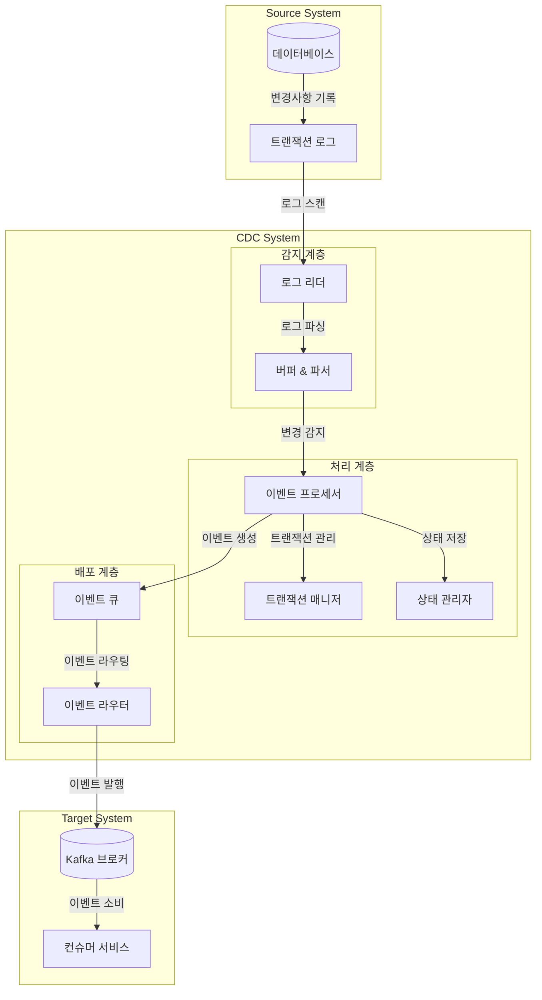

## Log 기반 CDC : DB Log를 활용한 변경 감지

- Log 기반 CDC(Log-based Change Data Capture)는 데이터베이스의 변경 사항을 **로그 파일을 통해** 실시간으로 포착하고 전파하는 기술입니다.
    - MySQL의 Binlog, PostgreSQL의 WAL 등, 대부분의 DB에는 DB의 모든 이벤트를 저장하는 트랜잭션 로그가 존재합니다.
    - 트랜잭션 로그, 리두 로그, 바이너리 로그 등을 활용하여 INSERT, UPDATE, DELETE 작업을 감지하고 추출하여, 변경 정보를 스트리밍 형태로 제공합니다.

- 일반적인 event programming 방식과 비교했을 때, 개발자의 실수로 인한 이벤트 누락이 없습니다.
    - event programming 방식은 개발자가 application source code 내에서 직접 이벤트를 발생시는 방식입니다.
    - CDC를 사용하면 데이터베이스 내부에서 변경 사항을 감지하므로, 개발자의 실수로 인한 이벤트 누락이 없습니다.
        - database 기반의 CDC에는 공통적으로 적용되는 특징입니다.

- 오직 로그에만 의존하기 때문에, 데이터베이스에 대한 영향을 최소화하면서 변경 사항을 실시간으로 감지할 수 있습니다.
    - 직접 질의(query)하지 않기 때문에 DB 부하를 최소화할 수 있고, timestamp 및 trigger 등의 생성도 필요 없습니다.

- Log 기반 CDC는 현대적인 데이터 아키텍처에서 핵심적인 역할을 담당하며, 특히 대규모 분산 시스템에서 데이터 일관성을 유지하는 데 필수적인 기술로 자리잡고 있습니다.

 주요 특징
1. **비침투성 (Non-invasive)**
   - 소스 데이터베이스의 변경 없이 구현 가능
   - 데이터베이스 성능에 미치는 영향 최소화

2. **신뢰성 (Reliability)**
   - 트랜잭션 로그 기반의 안정적인 변경 감지
   - 장애 발생 시 복구 메커니즘 제공

3. **확장성 (Scalability)**
   - 컴포넌트별 독립적인 확장 가능
   - 대용량 데이터 처리 지원

4. **유연성 (Flexibility)**
   - 다양한 데이터베이스 시스템 지원
   - 커스텀 이벤트 처리 및 변환 가능

### Log 기반 CDC의 장점

- **데이터 완전성 보장** : 트랜잭션 로그를 기반으로 하기 때문에 모든 변경사항이 순차적으로 기록되며, 데이터 손실 위험이 최소화됩니다.
    - 데이터베이스에서 발생하는 모든 변경사항(삽입, 수정, 삭제)을 정확하게 캡처할 수 있습니다.

- **낮은 리소스 부하** : 데이터베이스 테이블을 직접 스캔하지 않고 로그 파일만을 읽기 때문에, 운영 데이터베이스에 미치는 성능 영향이 적습니다.
    - 특히 대규모 트랜잭션이 발생하는 환경에서 중요한 이점입니다.

- **실시간 동기화** : 변경사항이 발생하는 즉시 로그에 기록되므로, 거의 실시간에 가까운 데이터 동기화가 가능합니다.
    - 실시간 분석이나 마이크로서비스 아키텍처에서 특히 유용합니다.

### Log 기반 CDC의 단점

- **로그 포맷 의존성** : 데이터베이스 벤더마다 로그 형식이 다르며, 데이터베이스 버전이 업그레이드될 때마다 로그 형식이 변경될 수 있습니다.
    - CDC 시스템의 유지보수가 복잡해질 수 있습니다.

- **스토리지 관리 필요** : 트랜잭션 로그는 지속적으로 증가하므로, 적절한 로그 보관 정책과 스토리지 관리 전략이 필요합니다.
    - 로그 파일의 크기가 너무 커지면 처리 성능에 영향을 미칠 수 있습니다.

- **구현 복잡성** : 로그 기반 CDC를 구현하기 위해서는 데이터베이스 내부 동작에 대한 이해가 필요합니다.
    - 또한 로그 파싱, 변경 데이터 추출, 에러 처리 등 복잡한 로직을 구현해야 합니다.

- 일반적으로는 CDC 솔루션을 사용하기 때문에, 이러한 단점들은 사용자의 입장에서는 크게 신경쓰지 않아도 됩니다.
    - 솔루션을 사용하면 데이터베이스 벤더나 버전에 상관없이 일관된 인터페이스로 CDC를 구현할 수 있습니다.
    - 대표적인 CDC 솔루션으로 Debezium, Maxwell, GoldenGate 등이 있습니다.

### Log 기반 CDC 사용 시 주의 사항

- 로그를 기반으로 변경을 감지한다는 특성이 문제가 될 수 있는 상황이 여럿 있습니다.
    - DB 설정 및 DB 계정 권한에 따른 제약 사항, 대량 데이터 변경 시 동기화 지연 문제 등.

- 이런 문제를 완화하기 위해서는 적절한 모니터링 체계 구축, 리소스 확장 계획 수립, 그리고 대량 변경 작업 시 CDC 처리 전략을 사전에 수립하는 것이 중요합니다.

#### 데이터베이스 설정 및 권한 관련 제약 사항

- 성능 최적화를 위해 최소 로깅(Minimal Logging) 또는 벌크 로깅(Bulk Logging) 모드를 사용하는 경우, 일부 데이터 변경사항이 로그에 기록되지 않을 수도 있습니다.
    - 예를 들어, Oracle의 NOLOGGING 옵션이나 SQL Server의 Minimal Logging 설정이 활성화된 경우, 대규모 데이터 적재 작업의 세부 변경사항이 캡처되지 않을 수 있습니다.

- 또한, 데이터베이스 로그에 대한 읽기 권한이 없는 경우, 로그 기반의 CDC 사용이 불가능합니다.
    - 보안 정책이 엄격한 조직에서는 권한 부여를 제한할 수 있으며, 특히 클라우드 환경이나 관리형 데이터베이스 서비스를 사용하는 경우, 서비스 수준에서 로그 접근이 제한될 수 있습니다.

- 따라서 Log 기반 CDC를 사용하기 위해서는 데이터베이스의 로깅 정책, 설정, 권한 관련 제약 사항 등을 사전에 확인하고 준비해두어야 합니다.

#### 대량 데이터 변경 시 동기화 지연 문제

- 대규모 데이터 변경 작업은 CDC 시스템에 부하를 줍니다.
    - 대규모의 데이터 변경이 발생할 경우, 로그 파일의 크기가 급격히 증가하고 처리해야 할 변경사항의 양도 대폭 증가합니다.
    - 예를 들어, 연말 데이터 정산, 시스템 마이그레이션, 또는 대규모 데이터 정제 작업과 같은 벌크 작업 등.

- 대량의 데이터가 변경될 때, CDC 시스템은 많은 수의 변경사항을 실시간으로 처리해야 하므로, 처리 속도가 느려지거나 지연이 발생할 수 있습니다.
    - CDC 처리 속도가 변경사항 발생 속도를 따라가지 못해 지연이 발생하는 경우, 데이터 동기화가 늦어지거나 데이터 누락이 발생할 수 있습니다.
    - 로그 파일 처리에 필요한 시스템 리소스가 급증하여 전반적인 성능 저하가 발생할 수 있습니다.
    - 대량의 변경사항을 처리하는 동안 메모리 사용량이 급증하여 시스템 안정성에 영향을 줄 수 있습니다.

- 따라서 변경사항을 일시적으로 큐잉하거나 배치 처리하는 방식을 적용하여 대량 변경 작업에 대한 영향을 최소화하는 전략을 수립해야 합니다.
    - 예를 들어, 대량 데이터 변경 작업이 발생할 경우, CDC 시스템을 일시적으로 중지하고 변경 작업이 완료된 후에 다시 시작하는 방식을 적용할 수 있습니다.
    - 또는 변경사항을 큐잉하여 일정 시간 간격으로 배치 처리하는 방식을 적용할 수 있습니다.

---

## Log 기반 CDC Architecture

- Source System에서 일어나는 변경 사항을 CDC System이 감지하고 처리한 후, Target System으로 전달하는 구조입니다.

### Source System

- 소스 시스템은 모니터링 대상이 되는 데이터베이스와 그 변경사항을 기록하는 트랜잭션 로그로 구성됩니다.
- 데이터베이스에서 발생하는 모든 변경사항(INSERT, UPDATE, DELETE)은 트랜잭션 로그에 순차적으로 기록되며, 이는 CDC 시스템의 기초 데이터가 됩니다.

### CDC System

- CDC 시스템은 변경을 감지/추출(감지 계층)하고, 변경 데이터를 이벤트로 변환(처리 계층)한 뒤, 처리된 이벤트를 목적지 시스템으로 전달(배포 계층)합니다.

#### 감지 계층 (Capture Layer)

- **Log Reader** : 트랜잭션 로그를 지속적으로 스캔하여 변경사항을 감지.
    - 데이터베이스 성능에 미치는 영향을 최소화하기 위한 비동기 처리 수행
    - 마지막으로 읽은 로그 포지션을 추적하여 장애 발생 시 복구 지원

- **Buffer & Parser** : 읽어들인 로그 데이터를 임시 저장하고 파싱.
    - 다양한 데이터베이스 로그 형식을 지원하는 파서 제공
    - 변경 데이터의 구조화 및 정규화 수행

#### 처리 계층 (Process Layer)

- **Event Processor** : 파싱된 변경 데이터를 표준화된 이벤트 형식으로 변환.
    - 메타데이터 추가 및 이벤트 보강
    - 스키마 변경 감지 및 대응

- **Transaction Manager** : 트랜잭션 정합성 보장.
    - 이벤트 순서 보장
    - 멱등성 처리 지원

- **State Manager** : 처리된 이벤트의 상태 정보 관리.
    - 체크포인트 생성 및 관리
    - 장애 복구를 위한 상태 정보 유지

#### 배포 계층 (Distribution Layer)

- **Event Queue** : 처리된 이벤트의 임시 저장.
    - 버퍼링을 통한 성능 최적화
    - 배치 처리 지원

- **이벤트 라우터 (Event Router)** : 목적지 시스템으로의 이벤트 라우팅.
    - 전송 실패 시 재시도 처리
    - 이벤트 필터링 및 변환

### Target System

- **Kafka 브로커 (Kafka Broker)** : 이벤트의 영구 저장 및 전달 보장.
    - 높은 처리량과 낮은 지연시간 제공
    - 이벤트의 순서 보장

- **컨슈머 서비스 (Consumer Services)** : 이벤트를 구독하고 처리하는 다양한 서비스.
    - 비즈니스 요구사항에 따른 이벤트 처리
    - 데이터 동기화 및 분석 수행

---

## Trigger 기반 방식 CDC와의 비교

- Log 기반 CDC와 비슷한 방식으로 Trigger 기반 CDC가 있습니다.
    - 각각 장단점이 있으며, 사용 사례에 따라 적합한 방식을 선택해야 합니다.

| 구분 | 데이터베이스 트리거 방식 | Log 기반 CDC |
|------|----------------------|--------------|
| 성능 영향 | 높음 | 낮음 |
| 구현 복잡도 | 낮음 | 중간 |
| 확장성 | 제한적 | 높음 |
| 데이터 정확성 | 중간 | 높음 |

- Trigger 기반 CDC는 데이터베이스 내부에 트리거를 생성하여 변경사항을 감지하는 방식입니다.
    - 트리거 생성 및 관리, 데이터베이스 성능 저하 등의 문제가 있습니다.
    - Log 기반 CDC는 데이터베이스 로그를 직접 읽어들여 변경사항을 추출하는 방식으로, 성능 저하가 적고 확장성이 높습니다.

---

## Reference

- <https://velog.io/@khj2872/Change-Data-CaptureCDC>
