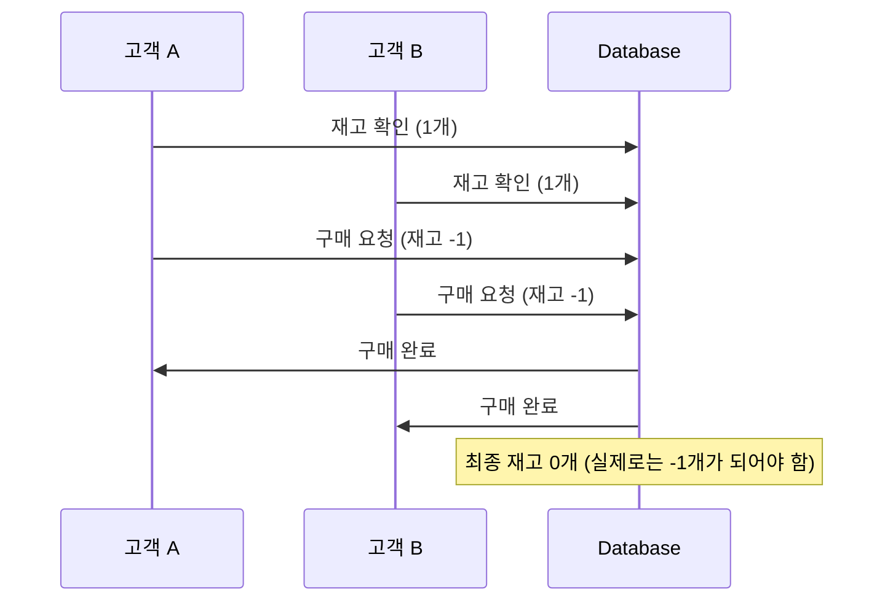
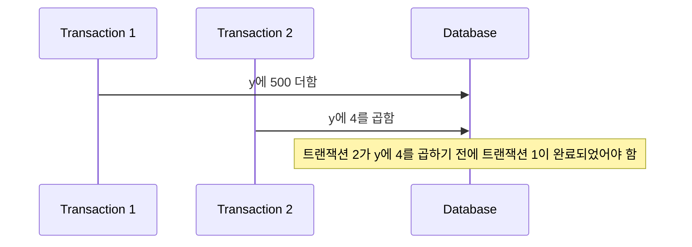
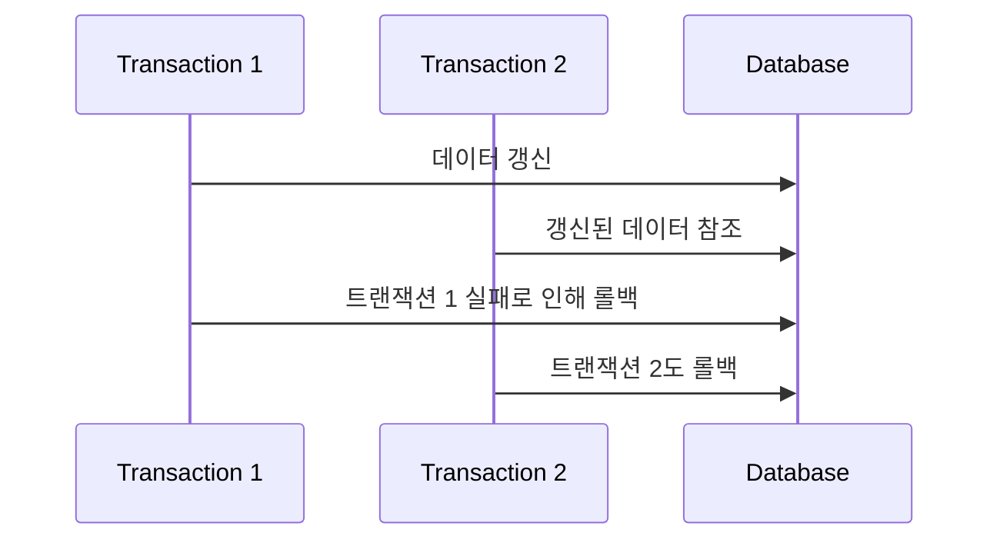
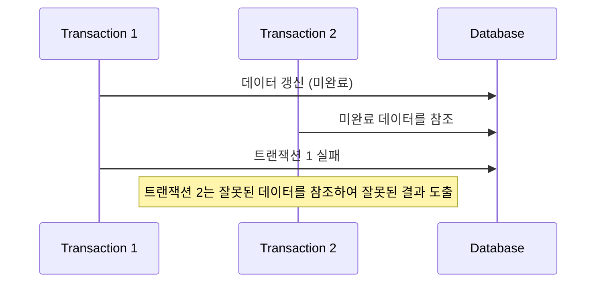

## 병행 제어 : 일관성과 효율성 모두 지키기

- **병행(concurrency)**은 매우 빠르게 여러 트랜잭션 사이를 이동하면서 조금씩 처리를 수행하는 방식입니다.
    - 실제로는 한 번에 한 트랜잭션만 수행하지만, 마치 동시에 여러 트랜잭션을 수행하는 것처럼 보이도록 합니다.

- **병행 제어(concurrency control)**는 여러 트랜잭션이 동시에 수행될 때 데이터베이스의 일관성과 무결성을 유지하기 위한 기법입니다.
    - 병행 트랜잭션들이 서로 영향을 미치지 않도록 제어하는 것이 목적입니다.
    - 데이터를 일관성 있게 유지하면서 동시에 여러 사용자가 데이터베이스를 최대한 공유할 수 있도록 합니다.

- 병행 제어는 데이터베이스의 **일관성**(데이터 무결성 유지)과 **효율성**(시스템 성능 최적화)이라는 **서로 상충되는 목적을 동시에 추구**합니다.
    - **데이터베이스의 일관성 유지** : 여러 트랜잭션이 동시에 실행되더라도 데이터베이스의 무결성과 일관성을 보장하여, 모든 트랜잭션이 완료된 후에도 데이터베이스가 정확하고 일관된 상태를 유지하도록 합니다.
    - **데이터베이스의 최대 공유** : 시스템의 자원을 효율적으로 활용하고 사용자 간의 데이터 공유를 최대화함으로써, 가능한 한 많은 사용자가 동시에 데이터베이스에 접근할 수 있도록 합니다.
    - **시스템 활용도 극대화** : 데이터베이스 시스템의 자원(CPU, 메모리, 디스크 등)을 최대한 효율적으로 사용하여 전체적인 시스템 성능을 향상시킵니다.
    - **사용자 응답 시간 최소화** : 각 트랜잭션의 실행 시간을 최소화하고 사용자가 요청한 작업에 대한 응답을 빠르게 받을 수 있도록 하여, 사용자 경험을 개선하고 시스템의 효율성을 높입니다.
    - **단위 시간당 처리할 수 있는 트랜잭션 수 최대화** : 주어진 시간 내에 처리할 수 있는 트랜잭션의 수를 늘려 시스템의 처리량(throughput)을 증가시킴으로써, 전체적인 시스템의 성능과 효율성을 높입니다.

---

## 병행 제어 없는 병행의 문제점

- 병행 제어 없이 병행 수행을 할 경우, 여러 트랜잭션이 동시에 데이터에 접근하고 수정할 때 다양한 문제들이 발생합니다.

### 갱신 분실 (Lost Update)

- 갱신 분실은 **두 개 이상의 트랜잭션이 동일한 데이터를 수정할 때 발생**하며, **한 트랜잭션의 갱신 결과가 다른 트랜잭션의 갱신에 의해 덮어쓰여서 일부 갱신이 소실되는 현상**을 말합니다.
    1. 트랜잭션 A와 B가 동시에 수량 데이터를 확인하고 각각 수정을 시도합니다.
    2. 두 트랜잭션 모두 수량이 1인 것을 확인합니다.
    3. 트랜잭션 A가 수정 요청을 보내고 수량을 1 감소시킵니다.
    4. 트랜잭션 B도 수정 요청을 보내고 수량을 1 감소시킵니다.
    5. 데이터베이스는 두 요청을 모두 처리하여 수량을 0으로 만듭니다.
    6. 실제로는 수량이 -1이 되어야 하지만, 트랜잭션 B의 갱신이 트랜잭션 A의 갱신을 덮어쓰게 되어 최종 수량은 0이 됩니다.

- 예를 들어, 온라인 쇼핑몰에서 **두 명의 고객이 동시에 재고가 1개 남은 상품을 구매하려고 할 때** 갱신 분실 문제가 발생할 수 있습니다.
    - 고객 A와 고객 B가 동시에 상품의 재고를 확인하고, 각각 재고 1개를 기반으로 구매 요청을 보냅니다.
    - 데이터베이스는 두 요청을 처리하지만, 실제로는 한 요청만 처리되었어야 합니다.
    - 이로 인해 두 번째 트랜잭션의 갱신이 첫 번째 트랜잭션의 갱신을 덮어쓰며, 최종 재고가 실제보다 잘못 저장됩니다.
    - 고객 B의 구매로 인한 재고 감소가 '갱신 분실'되었습니다.
    - 이로 인해 데이터베이스의 일관성이 깨지고, 실제 재고보다 더 많은 상품이 판매되는 문제가 발생합니다.

- 갱신 분실 문제를 해결하기 위해서는 트랜잭션 격리 수준을 적절히 설정하거나, lock을 사용하여 동시 접근을 제어하는 등의 동시성 제어 기법을 적용해야 합니다.

### 모순성 (Inconsistency)

- 모순성은 여러 트랜잭션이 병행 수행될 때, **한 트랜잭션이 데이터를 수정하는 동안 다른 트랜잭션이 수정 중인 데이터를 읽어 참조**하면서 발생하는 불일치 문제를 말합니다.
    - 트랜잭션 1이 데이터를 갱신 중일 때, 트랜잭션 2가 그 데이터를 참조하면 불일치한 결과가 도출될 수 있습니다.

- **두 개의 트랜잭션이 데이터 `y`를 각각 갱신하는 상황에서 모순성이 발생**할 수 있습니다.
    - 트랜잭션 1이 `y`에 500을 더하고, 그 이후에 트랜잭션 2가 `y`에 4를 곱해야 합니다.
    - 하지만 트랜잭션 2가 먼저 실행되어 `y`에 4를 곱한 후에 트랜잭션 1이 500을 더하는 상황이 발생할 수 있습니다.
    - 이는 데이터의 일관성을 해치며, 트랜잭션의 결과가 서로 모순(데이터 불일치)되게 됩니다.

### 연쇄 복귀 (Cascading Rollback)

- 연쇄 복귀는 **한 트랜잭션의 실패로 인해 다른 트랜잭션들이 함께 롤백되는 현상**입니다.
    - 병행 수행 중인 트랜잭션들이 서로 참조하고 있거나 상호 연관된 경우, 하나의 트랜잭션이 실패하면 다른 트랜잭션들도 영향을 받아 롤백될 수 있습니다.

- 트랜잭션 1이 데이터를 갱신하고, 그 데이터를 기반으로 트랜잭션 2가 수행되는 상황에서 연쇄 복귀가 발생할 수 있습니다.

- 트랜잭션 1이 실패하여 롤백되면, 트랜잭션 2는 이미 트랜잭션 1이 갱신한 데이터를 참조하고 있기 때문에 트랜잭션 2도 롤백되어야 합니다.

- 연쇄적인 롤백은 데이터 일관성 문제로 이어집니다.

### 현황 파악 오류 (Uncommitted Dependency)

- 현황 파악 오류는 **한 트랜잭션이 아직 커밋되지 않은 데이터를 다른 트랜잭션이 참조하면서 발생하는 문제**를 의미합니다.
    - 중간 상태의 데이터에 의존하여 잘못된 결과를 도출할 수 있는 위험을 동반합니다.

- 트랜잭션 1이 데이터를 갱신하고 있지만 아직 커밋되지 않은 상태에서 트랜잭션 2가 그 데이터를 참조하는 상황에서 현황 파악 오류가 발생할 수 있습니다.

- 트랜잭션 1이 실패한 후에도 트랜잭션 2는 이미 실패한 데이터를 기반으로 연산을 수행했기 때문에, 트랜잭션 2 역시 오류를 내포할 수밖에 없습니다.

- 현황 파악 오류는 트랜잭션의 무결성과 신뢰성을 저하시킵니다.

---

## 병행 제어 기법

- 각 환경과 요구사항에 따라 적절한 병행 제어 기법을 선택하고 혼합하여, 데이터베이스의 일관성과 성능을 최적화할 수 있습니다.

| 기법 | 주요 특징 | 장점 | 단점 | 적합한 사용 상황 |
|------|----------|------|------|-----------------|
| **Locking** | 데이터에 잠금을 걸어 독점적 사용 | - 데이터 일관성 보장 - 구현이 상대적으로 간단 | - 교착 상태 발생 가능 - 잠금 단위에 따른 성능 차이 | - 데이터 일관성이 매우 중요한 경우 - 트랜잭션 충돌이 빈번한 환경 |
| **Timestamp Ordering** | 트랜잭션에 타임스탬프 부여하여 순서대로 실행 | - 교착 상태 발생 없음 - 우선순위 부여 가능 | - Rollback 발생률 높음 - 연쇄 복귀 가능성 | - 트랜잭션 우선순위가 중요한 경우 - 교착 상태를 완전히 피해야 하는 상황 |
| **Optimistic Concurrency Control** | 트랜잭션 종료 후 검증 | - 충돌이 적은 환경에서 높은 성능 - 잠금 오버헤드 없음 | - 충돌 시 롤백 비용 높음 - 검증 단계에서 병목 현상 가능 | - 읽기 위주의 트랜잭션이 많은 환경 - 충돌 가능성이 낮은 상황 |
| **Multi-version Concurrency Control** | 데이터의 여러 버전 유지 | - 읽기 작업의 병행성 향상 - 롤백 감소 | - 저장 공간 증가 - 버전 관리 복잡성 | - 읽기와 쓰기 작업이 혼재된 환경 - 긴 트랜잭션과 짧은 트랜잭션이 공존하는 상황 |

### Locking : 잠금 기법

- Locking은 트랜잭션이 데이터를 독점적으로 사용하기 위해 **잠금을 걸어 다른 트랜잭션의 접근을 막는 기법**입니다.
    - 트랜잭션이 lock을 걸면 해당 데이터는 unlock될 때까지 독점적으로 사용됩니다.
    - 데이터의 잠금 단위는 필드, 레코드, 테이블 등으로 설정할 수 있습니다.
    - 이를 통해 상호 배제 기능을 제공하며, 잠금을 설정한 트랜잭션이 해제(unlock)할 때까지 데이터를 독점적으로 사용할 수 있습니다.
        - 상호 배제(mutual exclusion)는 여러 프로세스나 트랜잭션이 동시에 공유 자원에 접근하지 못하도록 하는 기법입니다.

- **한 번에 locking 할 수 있는 데이터의 크기**를 **locking 단위**라고 하며, field, record, table, file, database 모두 locking 단위가 될 수 있습니다.

- **locking 단위의 크기에 따라 병행성 수준과 성능의 차이가 발생**합니다.
    - 병행성 수준은 여러 트랜잭션이 동시에 실행될 수 있는 정도를 의미합니다.
    - **locking 단위가 클수록** 병행 제어가 단순해지고 관리하기가 편해지지만, 병행성 수준이 낮아집니다.
    - **locking 단위가 작을수록** 병행 제어가 복잡해지고 오버헤드가 증가하지만, 병행성 수준과 데이터베이스 공유도가 높아집니다. 

- locking 기법은 **교착 상태(deadlock)가 발생할 수 있다는 한계점**이 있습니다.
    - 교착 상태란 여러 트랜잭션이 특정 데이터에 lock을 한 채 다른 트랜잭션이 lock을 수행한 데이터에 접근하려고 할 때 실행을 하지 못하고 서로 무한정 기다리는 상태를 말합니다.
    - 예를 들어, Transaction 1에서 x를 lock 하고 Transaction 2에서 y를 lock 한 경우에 Transaction 1도 y에 접근할 수 없고 Transaction 2도 x에 접근할 수 없게 되기 때문에 서로 무한정 기다리게 됩니다.

- **locking의 종류에는 공유 잠금(S-lock)과 배타 잠금(X-lock)** 두 가지가 있으며, 둘 중 하나를 설정하는 기준은 읽기 연산(read)과 쓰기 연산(write)의 필요성에 따라 결정됩니다.
    - 읽기 연산(read)만 필요한 경우 공유 잠금을 설정하고, 쓰기 연산(write)이 필요한 경우 배타 잠금을 설정합니다.
    - 읽기와 쓰기 모두 필요한 경우에도 배타 잠금을 설정합니다.

| S-lock (공유 잠금) | X-lock (배타 잠금) |
| --- | --- |
| 읽기 연산(read)만 가능 | 읽기 연산(read)과 쓰기 연산(write) 모두 가능 |
| 다른 트랜잭션도 읽기 연산(read)만 가능 | 다른 트랜잭션은 읽기 연산(read)과 쓰기 연산(write) 모두 불가능 |
| 여러 트랜잭션이 동시에 공유 잠금을 설정할 수 있음 | 하나의 트랜잭션만이 배타 잠금을 설정할 수 있음 |

### Timestamp Ordering : 타임스탬프 순서 기법

- Timestamp Ordering 기법은 **트랜잭션의 순서를 미리 정해 순서대로 데이터에 접근하는 기법**입니다.
    - 트랜잭션마다 고유한 타임스탬프를 부여하여 트랜잭션을 직렬화하고, 이 순서에 따라 데이터에 접근합니다.
        - 데이터에 접근하는 시간(timestamp)을 미리 정해두어 부여된 시간 순서대로 데이터에 접근합니다.
    - lock을 사용하지 않고 시간을 나눠 사용하기 때문에 교착 상태(deadlock)가 발생하지 않습니다.
        - 대신에 rollback 발생률이 높고, 따라서 연쇄 복귀(cascading rollback) 문제 역시 발생할 수 있습니다.
 
- 타임스탬프는 트랜잭션을 유일하게 식별할 수 있는 식별자의 역할을 할 수 있으며 트랜잭션의 시작 시간으로 간주할 수 있습니다.

- 타임스탬프를 생성하는 방법은 논리적 계수기(logical count) 또는 system clock을 이용한다. 
    - 논리적 계수기 : 계수기를 사용하여 트랜잭션이 들어올 때마다 카운터를 하나씩 증가.
    - 시스템 클럭 : 시스템의 고유 시계 사용.
 

- 타임스탬프 순서 기법의 운영 방식은 다음과 같다. 
    - read_TS(x) : read(x) 연산을 성공적으로 수행한 트랜잭션들의 타임스탬프 중 가장 큰 것
    - write_TS(x) : write(x) 연산을 성공적으로 수행한 트랜잭션들의 타임스탬프 중 가장 큰 것
     
    - 트랜잭션 T가 read(x)를 수행하려고 할 때
        - TS(T) < write_TS(x)이면, read(x)를 거부하고 T 취소 & 복귀
        - TS(T) ≥ write_TS(x)이면, read(x)를 허용하고 read_TS(x) = TS(T)로 갱신
     
    - 트랜잭션 T가 write(x)를 수행하려고 할 때
        - TS(T) < read_TS(x)이면, write(x)를 거부하고 T 취소 & 복귀
        - TS(T) < write_TS(x)이면, write(x)를 수행한 것으로 간주하고 무시(Thomas write rule, 트랜잭션 취소 감소 목적)
        - 이외의 경우, write(x)를 허용하고 write_TS(x) = TS(T)로 갱신 

### Optimistic Concurrency Control : 낙관적 병행 제어 기법

- 낙관적 병행 제어는 트랜잭션 수행 중 검사를 하지 않고 종료 후 검증하여 직렬성을 확인하는 기법입니다.
    - 트랜잭션이 충돌하지 않을 것이라고 가정하고 진행하며, 검증 단계에서 문제가 없으면 데이터베이스에 반영합니다.

낙관적 병행 제어는 트랜잭션 수행 동안은 어떠한 검사를 하지 않고, 트랜잭션이 종료된 이후에 일괄적으로 검사하는 방식이다. 수행 도중에는 트랜잭션을 위해 유지되는 데이터 항목들의 지역 사본에 대해서만 갱신하고, 트랜잭션이 종료되고 난 후에 직렬화를 검증하여 검증되면 데이터베이스에 한 번에 반영하는 방식이다. 
병행 수행하고자 하는 대부분의 트랜잭션이 판독 전용(Read-only)인 경우, 트랜잭션 간 충돌률이 매우 낮기 때문에 병행 제어 기법을 사용하지 않고도 대부분 일관성을 유지한다는 점을 이용한 방식이다. 

### Multi-version Concurrency Control : 다중 버전 병행 제어 기법

- 하나의 데이터에 여러 버전을 유지하여 타임스탬프를 기준으로 병행 제어를 수행하는 방식입니다.
    - 각 트랜잭션은 타임스탬프를 비교하여 직렬 가능성을 보장하며, Rollback 시 연쇄 복귀가 발생할 수 있습니다.

한 데이터에 대해 여러 버전의 값을 유지하며 관리하는 방식이다. 타임스탬프의 개념을 이용하며, 다중 버전 타임 스탬프 기법이라고도 한다. 
여러 버전의 타임스탬프를 비교하여 스케줄상 직렬 가능성이 보장되는 타임스탬프를 선택한다. 
충돌이 발생할 경우 연쇄 복귀가 발생할 수 있는 단점이 있다.

---

## Reference

- <https://rebro.kr/163>
