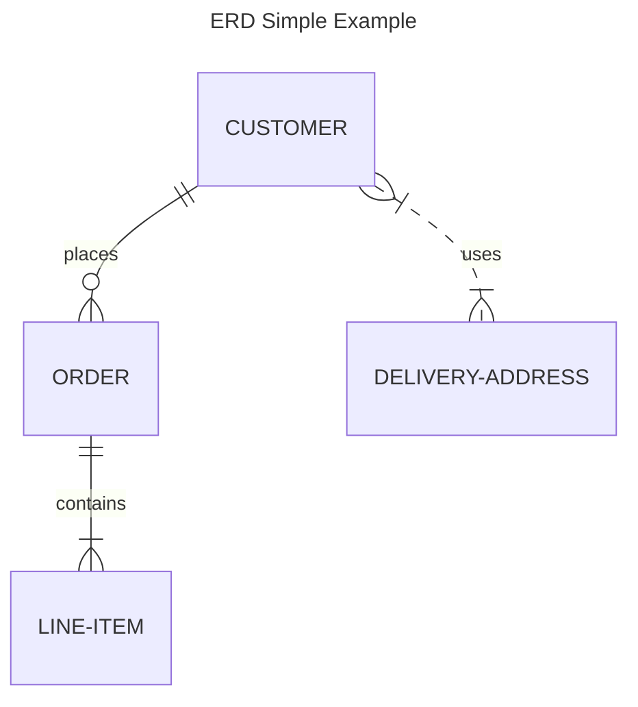
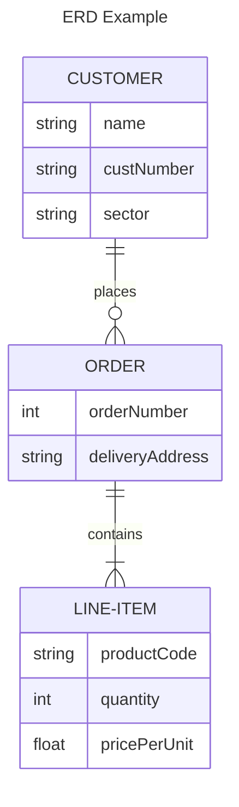
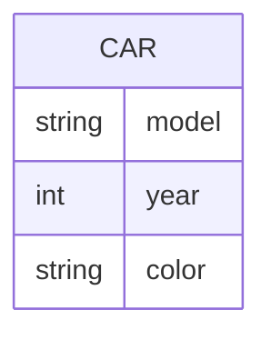
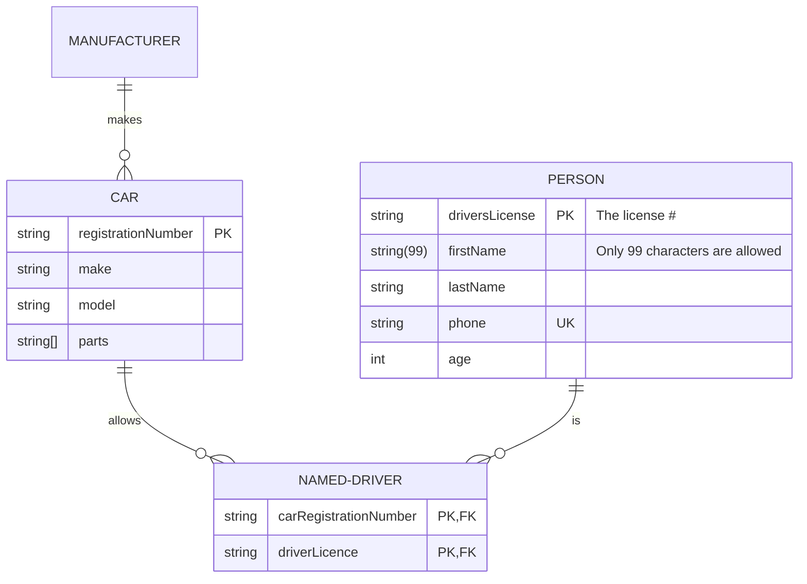
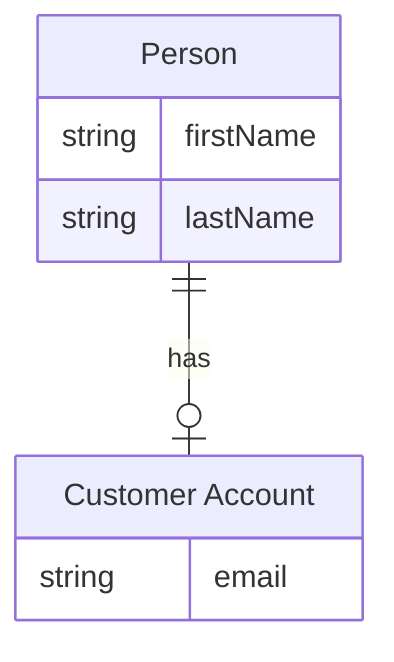
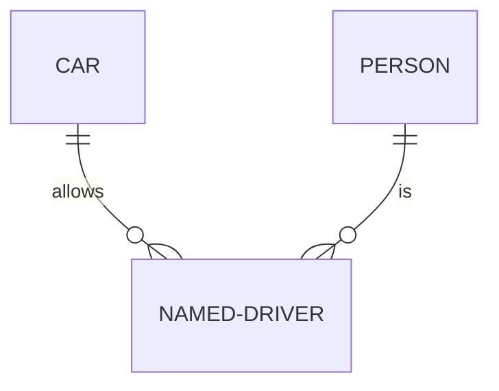

- mermaid를 사용해 ERD(Entity Relationship Diagram)를 그릴 수 있습니다.






---


## 구성 요소

```txt
<first-entity> [<relationship> <second-entity> : <relationship-label>]
```

| 구성 요소 | 설명 |
| --- | --- |
| `first-entity` (첫 번째 entity) | entity의 이름은 alphabet이나 밑줄(`_`)로 시작해야 하며, 숫자와 hyphen(`-`)도 포함할 수 있습니다. |
| `relationship` (관계) | 두 entity가 상호 간에 어떻게 관련되는지(inter-relate)를 설명합니다. |
| `second-entity` (두 번째 entity) | 또 다른 entity의 이름입니다. |
| `relationship-label` (label) | 첫 번째 entity의 관점에서 두 entity 간의 관계를 설명합니다. |

- 첫 번째 entity만이 필수 구성 요소입니다.
    - 첫 번째 entity만 기술함으로써 관계가 없는 entity를 표시할 수 있으며, 이는 diagram의 반복적 구성 과정에서 유용하게 사용할 수 있습니다.
    - 만약 첫 번째 entity 외 다른 요소가 지정된 경우에는 모든 요소가 필수적입니다.

- label은 첫 번째 entity의 관점에서 작성되며, 이를 통해 두 번째 entity 관점에서의 라벨도 쉽게 유추할 수 있습니다.
    - 예를 들어, 첫 번째 entity가 두 번째 entity를 포함한다(contains)는 관계를 표현하는 경우, 두 번째 entity의 관점에서는 첫 번째 entity에 포함되는(contained by) 관계라고 유추할 수 있습니다.

- 예를 들어, 하나의 부동산이 하나 이상의 방을 포함하고, 하나의 방은 오직 하나의 부동산에만 속하는 관계는 `PROPERTY ||--|{ ROOM : contains` 같이 표현할 수 있습니다.


---


## Entity 정의하기

- 이름(name)을 표기하여 entity를 간단히 정의할 수 있습니다.

```txt
ENTITY
```

- 속성(attribute)과 별칭(alias)이 추가된 더 복잡한 entity는 다음과 같이 표현할 수 있습니다.

```txt
ENTITY [Alias]

ENTITY {
    type name
    type name PK, FK, UK "comment"
}
```


## Entity 속성 정의하기

```txt
{
    <type> <name>
}
```

- entity의 속성(attribute)은 entity 이름 뒤에 중괄호(`{}`)로 구분되는 block을 사용하여 정의할 수 있습니다.
    - 속성들은 entity 상자 안에 rendering됩니다.

- entity block 안에는 여러 개의 '자료형-이름' 쌍(`type-name` pair)이 포함됩니다.
    - **자료형**(`type`)은 alphabet 문자로 시작해야 하며, alphabet 대소문자(한글 사용 불가), 숫자, hyphen(`-`), underbar(`_`), 괄호(`()`) 및 대괄호(`[]`)를 포함할 수 있습니다.
    - **이름**(`name`)도 자료형과 같은 naming 규칙을 따르며, 속성이 PK(primary key)임을 나타내기 위해 별표(`*`)를 앞에 붙일 수 있습니다.

```txt
erDiagram

CAR {
    string model
    int year
    string color
}
```




## Entity 속성에 Key(PK, FK, UK)와 Comment 추가하기

```txt
{
    <type> <name> [PK, FK, UK] ["comment"]
}
```

- 속성에는 key와 comment를 정의할 수 있습니다.

- key는 `PK`, `FK`, `UK`로 지정할 수 있으며, 하나의 속성에 여러 개의 key 제약 조건을 지정할 수 있습니다.
    - 예를 들어, `PK, FK`로 지정할 경우, 해당 속성은 primary key이면서 foreign key입니다.

- comment는 속성 끝에 따옴표(`""`)를 사용하여 정의할 수 있습니다.
    - comment 자체에는 따옴표 문자를 포함할 수 없습니다.

```txt
erDiagram

CAR ||--o{ NAMED-DRIVER : allows
CAR {
    string registrationNumber PK
    string make
    string model
    string[] parts
}
PERSON ||--o{ NAMED-DRIVER : is
PERSON {
    string driversLicense PK "The license #"
    string(99) firstName "Only 99 characters are allowed"
    string lastName
    string phone UK
    int age
}
NAMED-DRIVER {
    string carRegistrationNumber PK, FK
    string driverLicence PK, FK
}
MANUFACTURER only one to zero or more CAR : makes
```




## Entity에 별칭 추가하기

- entity 이름 뒤에 대괄호(`[]`)를 사용하여 별칭(alias)을 추가할 수 있습니다.
    - 별칭을 지정하는 경우, diagram에는 entity 이름 대신 별칭이 표시됩니다.

```txt
erDiagram

p[Person] {
    string firstName
    string lastName
}
a["Customer Account"] {
    string email
}
p ||--o| a : has
```




---


## Relationship 정의하기

- 두 entity 간의 관계(relationship)는 `o`, `\|`, `{`, `}`를 조합하여 표현할 수 있습니다.

| Value (left) | Value (right) | Meaning |
| --- | --- | --- |
| `o` | `o` | zero or one |
| `\|\|` | `\|\|` | exactly one |
| `}o` | `o{` | zero or more (no upper limit) |
| `}\|` | `{\|` | one or more (no upper limit) |

- 왼쪽과 오른쪽 관계 값을 dash 두 개(`--`)로 잇습니다.
    - 또는 마침표 두 개(`..`)를 사용해 점선으로 이을 수도 있습니다.

| 사용 예시 | `N` : `N` |
| --- | --- |
| `o--o` | `0 ~ 1` : `0 ~ 1` |
| `\|\|--\|\|` | `1` : `1` |
| `}o--o{` | `0 or many` : `0 or many` |
| `}\|--{\|` | `1 ~ many` : `1 ~ many` |

```txt
erDiagram

CAR ||--o{ NAMED-DRIVER : allows
PERSON ||--o{ NAMED-DRIVER : is
```




### Relationship Label 지정하기

- 관계 라벨(relationship label)은 한 단어 이상인 경우, 문자열을 따옴표(`"`)로 묶어야 합니다.
    - 예를 들어, `"zero or one"` 또는 `"one or many"`처럼 표현할 수 있습니다.

- 관계에 라벨이 없는 경우, 반드시 빈 따옴표(`""`)를 사용해야 합니다.
    - 예를 들어, `""`처럼 표현할 수 있습니다.

- 관계에 여러 줄의 라벨이 있는 경우, 두 줄 사이에 `<br />`을 사용해야 합니다.
    - 예를 들어, `"first line<br />second line"`처럼 표현할 수 있습니다.


---


## Reference

- <https://mermaid.js.org/syntax/entityRelationshipDiagram.html>
