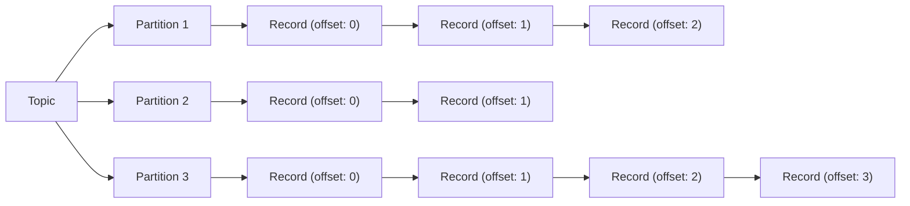

## Topic & Partition & Record

- Kafka의 핵심 개념인 **topic, partition, record**는 **data 흐름과 저장 기능을 구성하는 가장 기본적인 요소**입니다.
    - Kafka는 분산 event streaming platform으로 고성능, 확장성, 내구성을 갖춘 message processing system입니다.
    - 고성능, 확장성, 내구성에 대한 요구 사항을 충족하기 위해, Kafka는 topic, partition, record의 개념으로 data를 효율적으로 저장하고 처리합니다.

| 구성 요소 | 설명 |
| --- | --- |
| **Record** | Kafka에서 처리되는 **data의 기본 단위** |
| **Partition** | record를 순서대로 저장하는 **물리적인 단위**이자 **실질적인 기억 장치** |
| **Topic** | data stream을 구분하는 **논리적 단위**로, **다수의 partition을 grouping**하여 하나의 주제를 나타냄 |

### 1. Record : Data Unit

- **record**는 **Kafka에서 처리되는 data의 기본 단위**입니다.
    - Kafka에서 **message**라고도 불리며, **producer가 발행**하고 **consumer가 구독**하는 data를 나타냅니다.

- record는 **key, value, timestamp로 구성**됩니다.
    - **key** : record를 특정 partition에 할당하는 데 사용됩니다.
        - 선택적으로 사용되며, key가 없는 경우 round-robin 방식으로 partition이 선택됩니다.
    - **value** : 실제 data 내용을 담고 있습니다.
    - **timestamp** : record가 생성된 시간을 나타냅니다.

- record는 **생성되면 topic의 특정 partition에 추가**되며, 한 번 기록된 record는 불변(immutable)합니다..
    - 한 번 들어간 record는 수정할 수 없으며, 삭제하거나 덮어쓸 수 없습니다.

- record는 **partition 내에서 순차적으로 저장**되며, 각 record는 해당 partition 내에서 **고유한 offset**을 가집니다.
    - **offset**은 0부터 시작하여 증가하는 정수값으로, consumer가 partition 내에서 자신의 위치를 추적하는 데 사용됩니다.
    - consumer가 record를 읽으면 offset이 증가하며, consumer는 자신이 마지막으로 읽은 offset을 기억하고 있다가 다음에 읽을 record를 결정합니다.

### 2. Partition : Record List

- partition은 **record를 순차적으로 저장**하는 **물리적인 단위**입니다.
    - partition은 **실질적인 기억 장치**로, record를 저장하고 관리합니다.

- partition은 **순서가 있는 불변(immutable)의 record sequence**입니다.
    - partition은 각 record는 순서를 가지도록 하기 위해, record가 생성될 때 sequence number(offset)를 할당합니다.
    - partition이 할당하기 때문에, offset은 partition 내에서만 유일합니다.

- partition의 주요 목적은 확장성과 병렬 처리를 제공하는 것입니다.
    - 여러 server에 partition을 분산시켜 단일 server의 용량 제한을 극복하고 처리량을 높일 수 있습니다.
    - 각 partition은 Kafka cluster의 여러 broker에 분산되어 저장될 수도 있습니다.

- **partition의 갯수**를 나중에 증가시키는 것은 가능하지만, **줄이는 것은 불가능**합니다.
    - Kafka는 **수평적 확장에 최적화된 system**으로, **축소보다는 확장 작업에 중점을 두고 설계**되었습니다.
    - 따라서 기술적으로 축소에 대한 지원은 제한적이며, 새로운 topic을 생성하여 기존 data를 이관하는 방식을 사용하는 것이 더 권장되는 방법입니다.
        - 만약 강제로 partition 수를 줄인다면, data 일관성 문제, record 순서 보장 문제, offset sequence 충돌 문제, consumer group rebalancing 문제 등이 발생할 수 있습니다.
    - 초기 partition의 수는 topic 생성 시 설정할 수 있습니다.

- 각 partition은 Kafka cluster 내 **하나의 broker가 leader 역할**을 하며, **다른 broker들은 follower로 data를 복제**합니다.
    - **leader partition은 record를 추가**하고, **follower partition은 leader partition의 record를 복제**합니다.
    - follower partition은 leader partition의 record를 복제하여 fault tolerance를 제공하며, **leader partition이 실패하면 follower partition 중 하나가 leader로 승격**됩니다.
    - **복제 계수**(replication factor)를 설정하여 follower partition의 수를 지정할 수 있습니다.

### 3. Topic : Partition Group

- topic은 Kafka에서 **data stream을 구분하는 논리적 단위**입니다.
    - topic은 논리적 개념이지만, 실제 data는 partition이라는 물리적 단위에 저장됩니다.
    - "주제"를 의미하기 때문에, **논리적으로 같은 주제(topic)라면 물리적으로 분리(partition)되어 있어도 하나의 topic**이 될 수 있습니다.

- topic은 **특정 category**의 message를 저장하는 channel로 생각할 수 있습니다.
    - 예를 들어, website 사용자 활동, 결제 transaction, 장치 sensor data 등의 category가 각각 별도의 topic이 될 수 있습니다.

- 각 topic은 고유한 이름을 가지며, **producer는 특정 topic에 data를 발행**하고 **consumer는 원하는 topic에서 data를 구독**합니다.

- **topic은 내부적으로 여러 partition으로 분할**되어, 분산 저장 및 병렬 처리가 가능합니다.
    - topic을 생성할 때 partition 수를 지정할 수 있습니다.
    - partition의 갯수는 topic의 병렬 처리 능력과 확장성을 결정합니다.
    - partition 수에 따른 장단점이 있으므로, 적절한 partition 수를 선택하는 것이 중요합니다.

---

## Topic, Partition, Record 간의 관계

- **broker는 topic을 생성**하고, **topic은 partition을 생성**하며, **partition은 record를 저장**합니다.
    - **topic은 partition을 grouping**하는 역할을, **partition은 record를 저장**하는 역할을 합니다.

| 관계 | 의미 | 설명 |
| --- | --- | --- |
| `topic : partition` = `1 : N` | 하나의 topic이 여러 partition으로 구성됨 | partition 수는 topic의 병렬 처리 능력을 결정함 |
| `partition : record` = `1 : N` | 하나의 partition에 여러 record가 저장됨 | partition 내에서 record는 순서가 보장되지만, partition 간에는 순서가 보장되지 않음 |
| `record : key` = `N : 1` | 동일한 key를 가진 record는 항상 같은 partition에 저장됨 | key가 null인 경우, round-robin 방식으로 partition에 자동 분배됨 |
| `broker : partition` = `1 : N` | 하나의 broker는 여러 partition을 관리함 | 각 partition은 하나의 leader broker와 여러 follower broker가 관리함 |

- record는 partition 내에서 **고유한 offset**을 가지며, **append-only 방식으로 추가**됩니다.
    - append-only log 구조로, record는 한 번 추가되면 수정할 수 없습니다.

---

## 실제 적용 예시

- 다양한 scenario에서 topic, partition, record의 개념을 활용하여 messaging system을 구성할 수 있습니다.

### 예시 1. 실시간 Log 처리 System

- 각 application component의 log는 별도 topic으로 구성됩니다.
- log volume에 따라 적절한 수의 partition으로 나누어 처리 capacity를 확보합니다.
- service ID를 key로 사용하여 같은 service의 log는 항상 같은 partition에서 순서대로 처리됩니다.

### 예시 2. E-Commerce Platform

- 주문, 재고, 배송 등 각 업무 영역별로 별도 topic을 구성합니다.
- 고객 ID를 key로 사용하여 같은 고객의 주문 이벤트가 순서대로 처리되도록 보장합니다.
- 처리량이 많은 주문 topic은 partition을 더 많이 할당하여 병렬 처리 capacity를 높입니다.

---

## Reference

- <https://velog.io/@jwpark06/Kafka-%EC%8B%9C%EC%8A%A4%ED%85%9C-%EA%B5%AC%EC%A1%B0-%EC%95%8C%EC%95%84%EB%B3%B4%EA%B8%B0>
