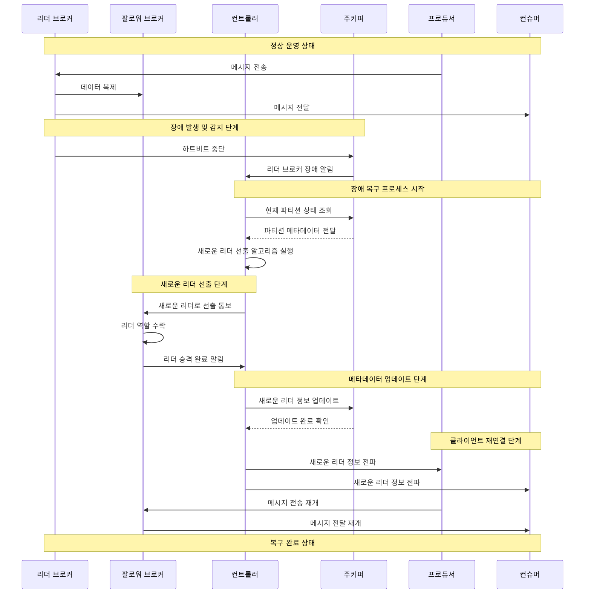
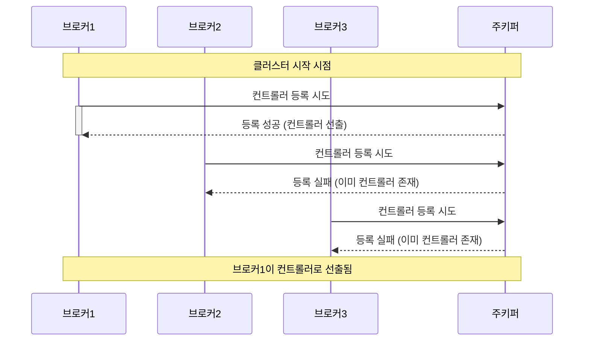

- Kafka는 자동화된 장애 대응 체계를 통해 높은 가용성과 안정성을 확보합니다.

## 1. 정상 운영 상태의 데이터 흐름
    - 프로듀서는 리더 브로커에게 메시지를 전송하여 데이터 입력을 수행합니다.
    - 리더 브로커는 수신한 메시지를 팔로워 브로커들에게 복제하여 데이터 안정성을 확보합니다.
    - 컨슈머는 리더 브로커로부터 메시지를 수신하여 데이터를 처리합니다.

## 2. 장애 감지 프로세스
    - 주키퍼는 모든 브로커와의 하트비트를 통해 상태를 지속적으로 모니터링합니다.
        - 하트비트는 일정 주기로 발생하는 상태 체크 신호입니다.
        - 설정된 타임아웃 시간 동안 하트비트가 없으면 해당 브로커를 장애 상태로 판단합니다.
    - 리더 브로커의 하트비트가 중단되면 주키퍼는 즉시 컨트롤러에게 이를 통보합니다.
        - 통보에는 장애가 발생한 브로커의 식별 정보가 포함됩니다.
        - 컨트롤러는 장애 복구 프로세스를 즉시 시작합니다.

## 3. 새로운 리더 선출 과정
    - 컨트롤러는 주키퍼로부터 현재 파티션의 상태 정보를 조회합니다.
        - 파티션의 현재 리더와 팔로워 목록을 확인합니다.
        - 각 브로커의 상태와 복제 진행 상황을 검토합니다.
    - 선출 알고리즘을 통해 새로운 리더를 결정합니다.
        - ISR(In-Sync Replicas) 목록에서 가장 적합한 팔로워를 선택합니다.
        - 데이터 동기화 상태가 가장 최신인 팔로워가 우선적으로 고려됩니다.
    - 선택된 팔로워 브로커에게 리더 승격을 통보합니다.
        - 새로운 리더는 승격 절차를 수행하고 완료를 알립니다.
        - 리더 승격 과정에서 데이터 일관성이 보장됩니다.

## 4. 메타데이터 갱신 및 클라이언트 재연결
    - 컨트롤러는 새로운 리더 정보를 주키퍼에 업데이트합니다.
        - 파티션의 리더 정보가 주키퍼에 기록됩니다.
        - 클러스터의 모든 구성원이 새로운 정보를 참조할 수 있습니다.
    - 프로듀서와 컨슈머에게 새로운 리더 정보가 전파됩니다.
        - 클라이언트들은 자동으로 새로운 리더와 연결을 재설정합니다.
        - 메시지 전송 및 수신이 자동으로 재개됩니다.

## 5. 복구 완료 및 정상화
    - 새로운 리더가 정상적으로 동작하면서 클러스터가 안정화됩니다.
    - 장애가 발생한 이전 리더 브로커는 복구 후 팔로워로 재참여할 수 있습니다.
    - 전체 시스템이 정상 상태로 돌아와 안정적인 운영이 재개됩니다.

---

## Controller Broker의 선출 과정

- Controller는 ~~~~~~~~~~~~~

## 1. 컨트롤러의 정의와 기본 역할
1. 컨트롤러의 기본 개념
    - 카프카 클러스터 내에서 선출된 특별한 브로커로서, 클러스터의 관리와 조율을 담당하는 핵심 구성요소입니다.
    - 클러스터 내의 모든 브로커 중에서 하나만 컨트롤러 역할을 수행하며, 이를 통해 중앙 집중적인 클러스터 관리가 가능해집니다.

2. 컨트롤러의 선출 과정
    - 카프카 클러스터가 시작될 때, 가장 먼저 주키퍼에 컨트롤러 등록을 시도하는 브로커가 컨트롤러 역할을 부여받습니다.
    - 주키퍼의 임시 노드(Ephemeral Node) 기능을 활용하여 컨트롤러 선출의 동시성과 유일성을 보장합니다.

## 2. 컨트롤러의 주요 책임과 기능
1. 브로커 상태 관리
    - 클러스터 내의 모든 브로커의 생존 여부를 지속적으로 모니터링합니다.
    - 주키퍼의 워치(Watch) 기능을 활용하여 브로커의 상태 변화를 실시간으로 감지합니다.
    - 브로커의 추가와 제거 시 필요한 관리 작업을 수행합니다.

2. 파티션 관리
    - 토픽의 파티션 할당과 재분배를 조율합니다.
    - 파티션의 리더와 팔로워 관계를 설정하고 관리합니다.
    - 클러스터의 부하 균형을 고려하여 파티션을 적절히 분산시킵니다.

3. 리더 선출 관리
    - 파티션 리더에 장애가 발생했을 때 새로운 리더를 선출하는 과정을 주도합니다.
    - ISR(In-Sync Replicas) 목록을 참조하여 최적의 리더 후보를 선정합니다.
    - 선출된 새로운 리더 정보를 클러스터 전체에 전파합니다.

## 3. 컨트롤러의 고가용성 메커니즘
1. 컨트롤러 장애 대응
    - 현재 컨트롤러에 장애가 발생하면, 다른 브로커들 중에서 새로운 컨트롤러가 자동으로 선출됩니다.
    - 주키퍼의 세션 만료를 통해 컨트롤러의 장애를 신속하게 감지합니다.
    - 새로운 컨트롤러는 이전 컨트롤러의 모든 책임을 이어받아 수행합니다.

2. 컨트롤러 페일오버 프로세스
    - 기존 컨트롤러의 세션이 종료되면 주키퍼는 즉시 임시 노드를 제거합니다.
    - 다른 브로커들이 컨트롤러 부재를 감지하고 새로운 컨트롤러 선출에 참여합니다.
    - 새로운 컨트롤러는 클러스터의 현재 상태를 복구하고 관리 작업을 재개합니다.

## 4. 컨트롤러의 성능 최적화
1. 캐시 관리
    - 컨트롤러는 클러스터의 메타데이터를 로컬에 캐시하여 성능을 최적화합니다.
    - 주키퍼 접근을 최소화하여 시스템 부하를 줄입니다.
    - 캐시와 실제 상태의 동기화를 주기적으로 수행하여 데이터 일관성을 보장합니다.

2. 배치 처리 최적화
    - 여러 관리 작업을 배치로 처리하여 시스템 효율성을 향상시킵니다.
    - 불필요한 네트워크 통신을 최소화하여 전체 시스템의 성능을 개선합니다.
    - 우선순위 기반의 작업 스케줄링을 통해 중요 작업의 신속한 처리를 보장합니다.

