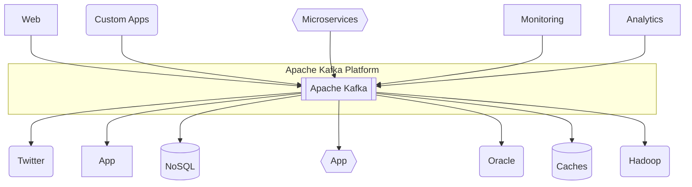
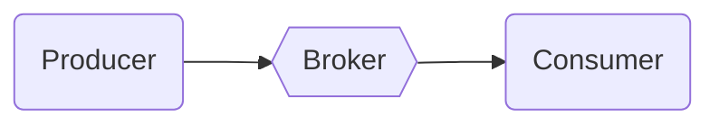
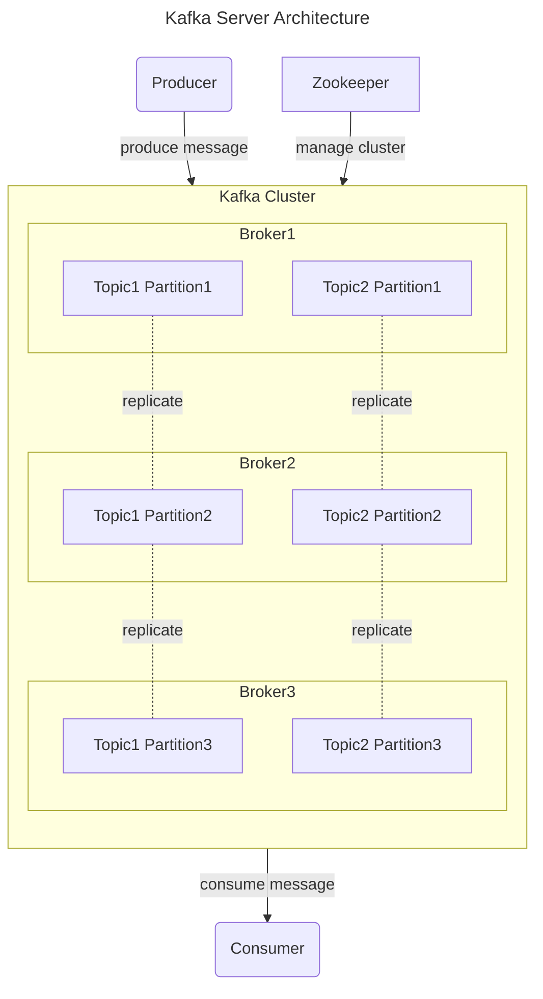

## Apache Kafka : 성능과 기능이 좋은 Message Queue

- 아파치 카프카는 LinkedIn에서 개발하여 2011년 오픈소스로 공개된 **분산 스트리밍 플랫폼**으로, **대용량 실시간 데이터 처리에 특화된 시스템**입니다.
    - 초당 수백만 건의 메시지를 안정적으로 처리할 수 있는 **고성능 구조**를 갖추고 있습니다.
    - 분산 시스템 구조를 채택하여 **높은 확장성과 안정성**을 제공합니다.

- **발행-구독(Publish-Subscribe) 모델을 기반으로 동작하는 메시징 시스템**입니다.
    - **데이터 생산자(Producer)가 메시지를 발행**하면, **소비자(Consumer)가 필요한 메시지를 구독하여 처리**합니다.
    - 다수의 생산자와 소비자가 동시에 데이터를 주고받을 수 있는 구조입니다.

- **Kafka는 Broker** 역할을 수행하며, 일종의 **Message Queue**입니다.
    - Producer application과 Conumer application 사이에 위치하여 Message를 전달합니다.

---

## Kafka의 기본 구성 요소

- **Cluster** : 여러 대의 서버가 하나의 시스템처럼 동작하는 **분산 환경을 구성**합니다.
    - 높은 가용성과 확장성을 제공하며, 대용량 데이터 처리가 가능한 구조를 만듭니다.
    - **각각의 서버는 독립적으로 동작**하면서도 **전체적으로는 단일 시스템처럼 운영**됩니다.

- **Producer** : **데이터를 생성하고 카프카 시스템에 전달**하는 애플리케이션입니다.
    - **메시지를 특정 토픽으로 발행**하며, **파티션에 데이터를 분배하는 역할**을 수행합니다.
    - **카프카에서 제공하는 프로듀서 API를 활용하여 구현**됩니다.

- **Consumer** : 프로듀서가 발행한 **메시지를 브로커로부터 가져와 처리**하는 애플리케이션입니다.
    - **하나 이상의 토픽을 구독하여 메시지를 소비**할 수 있습니다.
    - 컨슈머 그룹을 통해 병렬 처리가 가능한 구조를 제공합니다.

- **Broker** : **프로듀서와 컨슈머 사이에서 메시지를 중계하는 카프카 서버**입니다.
    - 각 브로커는 고유한 `broker.id`를 가지며, **클러스터의 일부로 동작**합니다.
    - **메시지의 저장과 전달을 담당**하며, **주키퍼와 연동하여 클러스터 운영을 관리**합니다.

- **Topic** : **메시지를 논리적으로 구분하는 단위**입니다.
    - **특정 카테고리나 이벤트 종류별로 구분되어 관리**됩니다.
    - 하나의 토픽은 **여러 개의 파티션으로 분할**될 수 있습니다.

- **Partition** : **토픽의 물리적 저장소 단위**입니다.
    - **수평적 확장이 가능한 구조**를 제공하여 높은 처리량을 달성합니다.
    - 각 파티션은 리더와 팔로워로 구성되어 고가용성을 보장합니다.

### 클러스터 운영 구조

- **Zookeeper 연동** : Zookeeper는 **클러스터의 메타데이터 관리를 담당**합니다.
    - **브로커의 상태 관리와 리더 선출을 조율**합니다.
    - 설정 정보의 중앙화된 저장소 역할을 수행합니다.

- **리더와 팔로워 구조** : **각 파티션은 하나의 리더와 여러 팔로워로 구성**됩니다.
    - **리더**는 **해당 파티션의 읽기와 쓰기를 담당**합니다.
    - **팔로워**는 **리더의 데이터를 복제하여 가용성을 보장**합니다.

- **장애 대응 체계** : **브로커 장애 발생 시 컨트롤러가 새로운 리더를 선출**합니다.
    - **변경된 리더 정보는 주키퍼에 기록**되어 클러스터 전체에 공유됩니다.
    - **자동화된 복구 프로세스**를 통해 시스템의 안정성을 유지합니다.

---

## Kafka 도입 Guide

- Kafka는 대규모 실시간 데이터를 안정적으로 처리할 수 있는 분산 스트리밍 플랫폼으로서, 토픽과 파티션을 통한 효율적인 메시지 분산 처리와 디스크 기반의 데이터 영속성을 제공하는 특징을 가지고 있습니다.
- 브로커 간 데이터 복제와 Zookeeper를 통한 클러스터 관리로 고가용성을 보장하며, 컨슈머 그룹과 오프셋 관리를 통해 안정적인 메시지 처리를 지원함으로써 현대적인 데이터 파이프라인과 실시간 스트리밍 처리에 널리 활용되고 있습니다.

### Kafka의 장점

- **높은 처리량과 낮은 지연 시간** : Kafka는 초당 수백만 건의 메시지를 처리할 수 있는 분산 메시징 시스템으로, 대규모 데이터 스트림을 실시간으로 처리하는 데 탁월한 성능을 보여줍니다.
    - 파티셔닝을 통한 분산 처리 방식으로, 단일 클러스터에서도 초당 수 테라바이트의 데이터를 안정적으로 처리할 수 있습니다.

- **데이터 영속성과 안정성** : 모든 메시지는 디스크에 저장되어 데이터 손실 위험을 최소화합니다.
    - 복제 팩터(Replication Factor) 설정을 통해 여러 브로커에 데이터를 복제함으로써 고가용성을 보장합니다.
    - 브로커 장애 발생 시에도 자동으로 복구되어 무중단 서비스가 가능합니다.

- **확장성과 유연성** : 수평적 확장이 용이하여 클러스터에 브로커를 동적으로 추가할 수 있습니다.
    - 프로듀서와 컨슈머를 독립적으로 확장할 수 있어 시스템 리소스를 효율적으로 활용할 수 있습니다.

### Kafka 활용 사례

- **로그 수집 및 처리 시스템** : 대규모 웹 서비스의 애플리케이션 로그, 시스템 메트릭, 사용자 활동 로그 등을 실시간으로 수집하고 처리합니다.
    - ELK(Elasticsearch, Logstash, Kibana) 스택과 연동하여 로그 분석 및 모니터링 시스템을 구축할 수 있습니다.

- **실시간 스트리밍 데이터 처리** : SNS 피드, 주식 시세, IoT 센서 데이터와 같은 실시간 스트리밍 데이터를 처리합니다.
    - Apache Spark, Apache Flink 등의 스트림 처리 엔진과 연동하여 복잡한 실시간 분석을 수행할 수 있습니다.

- **이벤트 기반 마이크로서비스 아키텍처** : 서비스 간 비동기 통신을 위한 이벤트 버스로 활용됩니다.
    - 서비스 간 결합도를 낮추고 확장성을 높이는 데 기여합니다.
    - 장애 전파를 방지하고 시스템 복원력을 향상시킵니다.

- **실시간 고객 데이터 파이프라인** : 사용자 행동 데이터를 실시간으로 수집하고 분석하여 개인화된 서비스를 제공합니다.
    - A/B 테스트, 실시간 추천 시스템 등에 활용됩니다.

### Kafka 도입 시 고려 사항

- **운영 복잡성** : Zookeeper 의존성 관리와 클러스터 운영에 대한 전문성이 필요합니다.
    - 적절한 파티션 수와 복제 팩터 설정이 중요합니다.

- **리소스 관리** : 메모리와 디스크 사용량을 모니터링하고 적절히 관리해야 합니다.
    - 데이터 보존 기간과 정책을 명확히 설정해야 합니다.

- **메시지 순서 보장** : 파티션 레벨에서만 순서가 보장되므로, 순서가 중요한 경우 파티셔닝 전략을 신중히 설계해야 합니다.
    - 글로벌 순서 보장이 필요한 경우 단일 파티션을 사용해야 하며, 이는 처리량 제한으로 이어질 수 있습니다.

---

## Reference

- <https://medium.com/@0joon/10%EB%B6%84%EC%95%88%EC%97%90-%EC%95%8C%EC%95%84%EB%B3%B4%EB%8A%94-kafka-bed877e7a3bc>
- <https://velog.io/@holicme7/Apache-Kafka-Kafka-Streams-%EB%9E%80>

