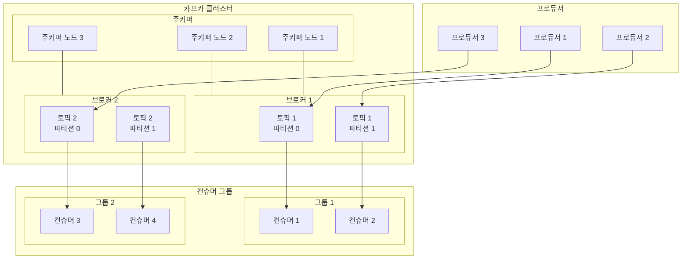

## Apache Kafka : Data Streaming Platform

- Apache Kafka는 **실시간 데이터 스트리밍 플랫폼**입니다.
    - LinkedIn에서 개발되어 2011년 오픈소스로 공개되었습니다.

- 분산 메시징 시스템의 대표적인 솔루션이며, 초당 수백만 건의 메시지를 처리할 수 있습니다.

### 주요 구성 요소

- Producer는 메시지를 생성하고 Kafka로 전송하는 역할을 합니다.
    - 웹 서버, 모바일 앱, IoT 디바이스 등이 Producer가 될 수 있습니다.
    - 메시지는 Topic이라는 단위로 구분되어 저장됩니다.

- Consumer는 Topic에서 메시지를 읽어가는 애플리케이션입니다.
    - 여러 Consumer가 동시에 같은 메시지를 읽을 수 있습니다.
    - Consumer Group을 통해 병렬 처리가 가능합니다.

- Broker는 실제 메시지를 저장하고 관리하는 서버입니다.
    - 여러 Broker를 클러스터로 구성하여 확장성을 확보합니다.
    - Zookeeper를 통해 클러스터를 관리합니다.

### 장점

- 높은 처리량과 낮은 지연시간을 제공합니다.
    - 디스크 순차 접근을 통해 성능을 최적화합니다.
    - 메시지를 배치로 처리하여 효율성을 높입니다.

- 메시지의 영속성을 보장합니다.
    - 디스크에 메시지를 저장하여 데이터 손실을 방지합니다.
    - 복제를 통해 고가용성을 확보합니다.

- 수평적 확장이 용이합니다.
    - Broker를 추가하여 처리 용량을 늘릴 수 있습니다.
    - Consumer Group을 통해 소비 처리량을 조절할 수 있습니다.

### 활용 사례

- 실시간 로그 수집 시스템을 구축할 수 있습니다.
    - 웹 서버의 접속 로그를 수집합니다.
    - 사용자 행동 분석을 위한 이벤트를 추적합니다.

- 시스템 간 데이터 동기화에 사용됩니다.
    - 마이크로서비스 간 메시지 전달을 처리합니다.
    - 데이터베이스의 변경 사항을 다른 시스템에 전파합니다.

- 실시간 스트림 처리 파이프라인을 구성합니다.
    - 센서 데이터를 실시간으로 수집하고 분석합니다.
    - 금융 거래 데이터를 실시간으로 모니터링합니다.

---

## Kafka의 기본 구조

- Producer 영역에서는 여러 Producer가 동시에 메시지를 생성합니다.
    - 각 Producer는 지정된 Topic으로 메시지를 전송합니다.

- Kafka Cluster 영역에서는 
    - Broker는 실제 메시지를 저장하는 서버입니다.
    - Topic은 Partition으로 분할되어 여러 Broker에 분산됩니다.
    - ZooKeeper는 클러스터의 상태를 관리합니다.

- Consumer Group 영역에서는 
    - Consumer는 그룹으로 구성되어 메시지를 처리합니다.
    - 각 Consumer Group은 독립적으로 메시지를 소비합니다.
    - 하나의 Partition은 각 Consumer Group 내의 하나의 Consumer만 처리합니다.

### 데이터 흐름

1. Producer에서 Broker로 Message 전송.
    - Producer는 메시지를 특정 Topic의 Partition으로 전송합니다.
    - Partition 선택은 라운드로빈 또는 키 기반으로 이루어집니다.

2. Broker 내부 처리.
    - 메시지는 지정된 Partition에 순차적으로 저장됩니다.
    - 복제본이 다른 Broker에 생성되어 가용성을 보장합니다.

3. Consumer Group에서 메시지 소비.
    - Consumer는 할당된 Partition에서 메시지를 읽어갑니다.
    - Consumer Group 내의 Consumer 수에 따라 Partition이 재분배됩니다.

---

## Reference

- <https://velog.io/@holicme7/Apache-Kafka-Kafka-Streams-%EB%9E%80>

