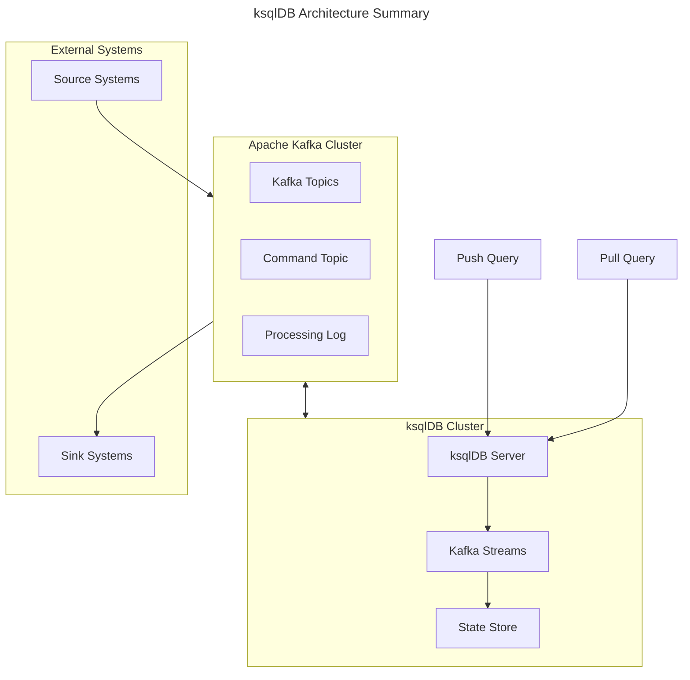
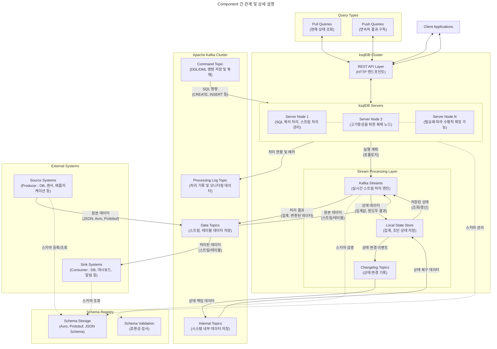

## ksqlDB : Kafka Event Streaming Database

- ksqlDB는 Apache Kafka를 위해 특별히 설계된 데이터베이스로, **스트리밍 데이터를 실시간으로 처리하고 분석할 수 있는 이벤트 스트리밍 데이터베이스**입니다.
    - Confluent에서 만든 streaming processing tool입니다.

- SQL과 유사한 문법을 사용하여 Kafka의 스트리밍 데이터를 쉽게 처리할 수 있게 해줍니다.
    - ksqlDB는 Kafka 생태계 메인 제품인 Kafka Streams와 Kafka Connect를 활용하여 만들어졌으며, 따라서 동작도 해당 제품들의 원리를 따릅니다.
    - ksqlDB의 메인 동작은 SQL을 변환하여 각 제품의 기능을 사용해 사용자가 원하는 결과를 만드는 것입니다.

- ksqlDB는 실시간 데이터 처리, 스트리밍 분석, 이벤트 기반 애플리케이션 개발 등의 다양한 용도로 활용할 수 있습니다.
    - 특히 마이크로서비스 아키텍처에서 이벤트 중심의 데이터 처리가 필요한 경우에 유용하게 사용됩니다.

### ksqlDB의 특징

- **스트림 처리 중심 설계** : 실시간으로 흐르는 데이터를 지속적으로 처리할 수 있습니다.
    - 이벤트 시간 기반의 윈도우 처리를 지원하여 시계열 분석이 가능합니다.
    - 스트림과 테이블이라는 두 가지 주요 추상화를 제공합니다.

- **SQL 기반 인터페이스** : 기존 SQL 개발자들이 쉽게 적응할 수 있는 친숙한 문법을 제공합니다.
    - 복잡한 스트림 처리 로직을 간단한 SQL문으로 표현할 수 있습니다.
    - SELECT, CREATE, INSERT 등 표준 SQL 명령어를 지원합니다.

- **확장성과 신뢰성** : Kafka의 분산 아키텍처를 기반으로 하여 높은 확장성을 제공합니다.
    - 장애 발생 시에도 데이터 손실 없이 처리할 수 있는 내결함성을 갖추고 있습니다.
    - 수평적 확장이 용이하여 대규모 데이터 처리가 가능합니다.

- **실시간 처리 기능** : 밀리초 단위의 지연 시간으로 데이터를 처리할 수 있습니다.
    - Push 쿼리를 통해 실시간 업데이트를 구독할 수 있습니다.
    - 스트리밍 ETL, 실시간 모니터링 등 다양한 유스케이스를 지원합니다.

- **통합 개발 환경** : REST API를 통한 프로그래밍적 접근이 가능합니다.
    - 다양한 데이터 포맷(JSON, Avro, Protobuf 등)을 지원합니다.
    - 내장된 커넥터를 통해 외부 시스템과의 통합이 용이합니다.

- **상태 관리** : 지속적인 쿼리 처리를 위한 상태 저장소를 제공합니다.
    - 분산 환경에서도 일관된 상태 관리가 가능합니다.
    - 장애 복구 시 상태를 자동으로 복구할 수 있습니다.

### ksqlDB의 주요 개념

- **KSQL** : ksqlDB에서 사용하는 SQL 스타일의 쿼리 언어입니다.

- **Stream** : Kafka 토픽의 메시지 스트림을 나타내며, 실시간으로 데이터가 추가되는 무한한 시퀀스입니다.
    - 스트림은 데이터의 흐름을 나타내며, 이를 통해 실시간으로 데이터를 처리하고 분석할 수 있습니다.
    - ksqlDB에서 데이터는 Stream 단위로 처리됩니다.

- **Table** : 스트림의 상태를 나타내는 뷰(View)입니다.
    - 스트림의 데이터를 테이블 형태로 변환하여 상태를 유지하고, 이력을 추적할 수 있습니다.
    - 테이블은 스트림의 데이터를 쿼리하여 실시간으로 조회하거나 분석할 수 있습니다.

- **Persistent Query** : 한 번 실행되면 종료하지 않고 지속적으로 실행되는 쿼리입니다.
    - 새로운 데이터가 들어올 때마다 자동으로 처리하여 결과를 업데이트합니다.
    - CREATE STREAM AS SELECT 또는 CREATE TABLE AS SELECT 문으로 생성됩니다.

- **Push & Pull Query** : ksqlDB에서 제공하는 두 가지 유형의 쿼리 방식입니다.
    - Push Query는 실시간으로 업데이트되는 결과를 지속적으로 받아보는 쿼리입니다.
    - Pull Query는 특정 시점의 현재 상태만을 조회하는 일회성 쿼리입니다.

- **Windowing** : 시간을 기준으로 데이터를 그룹화하여 처리하는 기능입니다.
    - Tumbling Window는 고정된 시간 간격으로 데이터를 분할합니다.
    - Hopping Window는 일정 시간 간격으로 이동하면서 겹치는 구간을 처리합니다.
    - Session Window는 이벤트 발생 시간을 기준으로 세션 단위로 처리합니다.

- **Connector** : 외부 시스템과 ksqlDB를 연결하는 컴포넌트입니다.
    - Source Connector는 외부 시스템의 데이터를 ksqlDB로 가져옵니다.
    - Sink Connector는 ksqlDB의 처리 결과를 외부 시스템으로 내보냅니다.

- **Materialized View** : 스트림 처리 결과를 저장하고 유지하는 특별한 형태의 테이블입니다.
    - 실시간으로 업데이트되며, 빠른 조회가 가능합니다.
    - 주로 집계나 조인 연산의 결과를 캐싱하는 용도로 사용됩니다.

- **Schema Registry** : 데이터의 스키마 정보를 중앙에서 관리하는 시스템입니다.
    - 스키마 버전 관리와 호환성 검사를 제공합니다.
    - Avro, Protobuf, JSON Schema 등의 형식을 지원합니다.

### KSQL과 SQL의 차이점

| 특징 | KSQL | SQL |
| --- | --- | --- |
| **데이터 모델** | 스트림(무한 시퀀스)과 테이블 중심 | 테이블 중심의 관계형 모델 |
| **처리 방식** | 연속적인 실시간 처리 (Continuous Processing) | 요청 시점의 일회성 처리 (Request-Response) |
| **쿼리 실행** | 지속적으로 실행되며 결과가 계속 업데이트 | 한 번 실행되고 결과가 즉시 반환 |
| **시간 개념** | 이벤트 시간과 처리 시간을 모두 고려 | 쿼리 실행 시점의 현재 상태만 고려 |
| **조인 연산** | 스트림-스트림, 스트림-테이블 조인 지원 | 테이블-테이블 조인만 지원 |
| **윈도우 처리** | 시간 기반 윈도우 연산 기본 제공 | 윈도우 함수는 제한적으로 제공 |
| **상태 관리** | 분산 상태 저장소 필수 | 트랜잭션 기반 상태 관리 |
| **확장성** | 수평적 확장 용이 (Kafka 기반) | 수직적 확장 중심 |
| **데이터 보존** | 이벤트 기록 영구 보존 가능 | 최신 상태만 유지 |
| **트랜잭션** | 제한적인 트랜잭션 지원 | ACID 트랜잭션 완벽 지원 |
| **사용 사례** | 실시간 분석, 이벤트 처리, 스트리밍 ETL | 비즈니스 데이터 관리, 보고서 생성, OLTP/OLAP |
| **스키마** | 스키마 진화 지원 | 엄격한 스키마 제약 |

---

## ksqlDB Architecture Component

- **ksqlDB 서버** : ksqlDB의 핵심 실행 엔진입니다.
    - REST API 엔드포인트를 제공하여 쿼리 실행과 스트림 처리를 담당합니다.
    - 여러 서버를 클러스터로 구성하여 고가용성과 확장성을 제공합니다.

- **Kafka Streams** : ksqlDB의 기반이 되는 스트림 처리 엔진입니다.
    - 상태 저장소(State Store)를 관리하고 스트림 처리 로직을 실행합니다.
    - 장애 복구와 스케일링을 자동으로 처리합니다.

- **Apache Kafka** : 이벤트 스토리지로 활용됩니다.
    - 토픽을 통해 데이터를 영구 저장하고 스트리밍합니다.
    - 소스 커넥터와 싱크 커넥터를 통해 외부 시스템과 통합됩니다.

- **Command Topic** : ksqlDB 쿼리와 애플리케이션 상태를 저장합니다.
    - 클러스터 내 서버 간 동기화에 사용됩니다.
    - DDL 명령어와 영구 쿼리 정보를 보관합니다.

- **Processing Log** : 스트림 처리 중 발생하는 오류와 예외를 기록합니다.
    - 디버깅과 모니터링에 활용됩니다.
    - Kafka 토픽에 저장되어 추후 분석이 가능합니다.

- **Pull/Push Query** : 데이터를 조회하는 질의문입니다.
    - Pull Query : 특정 시점의 상태를 조회하는 요청-응답 방식의 쿼리입니다.
    - Push Query : 지속적으로 결과를 스트리밍하는 실시간 쿼리입니다.

