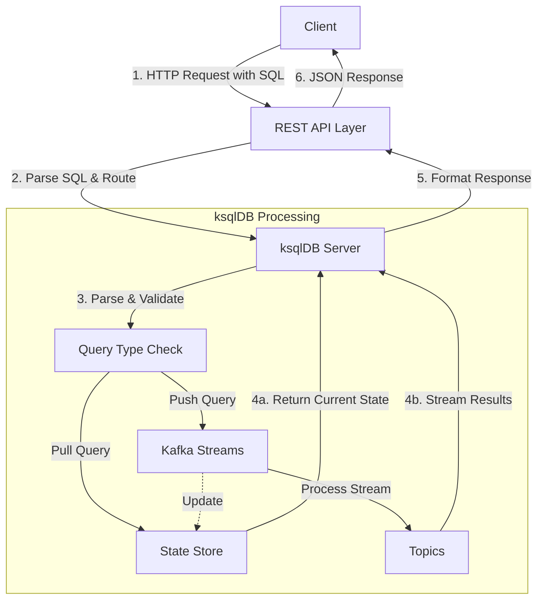

```mermaid
flowchart TD
    A[Client] -->|1. HTTP Request with SQL| B[REST API Layer]
    B -->|2. Parse SQL & Route| C[ksqlDB Server]
    
    subgraph ksqlDB["ksqlDB Processing"]
        C -->|3. Parse & Validate| D[Query Type Check]
        D -->|Pull Query| E[State Store]
        D -->|Push Query| F[Kafka Streams]
        F -->|Process Stream| G[Topics]
        F -.->|Update| E
    end
    
    E -->|4a. Return Current State| C
    G -->|4b. Stream Results| C
    C -->|5. Format Response| B
    B -->|6. JSON Response| A
```
