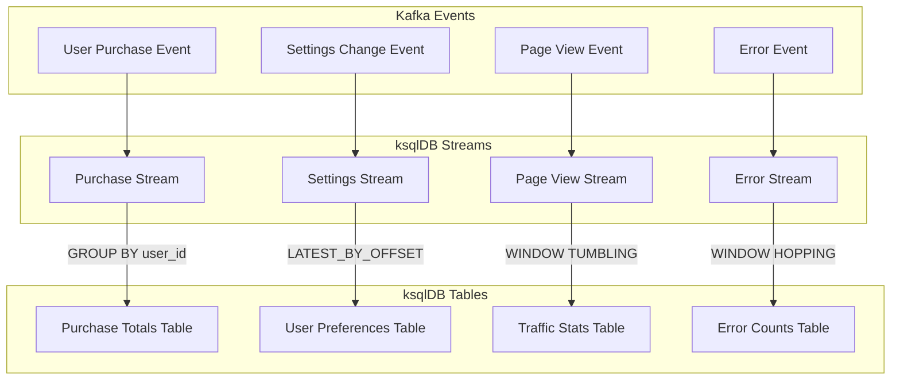

## Stream & Table : ksqlDB Data Model

- ksqlDB의 Stream과 Table은 데이터를 처리하는 두 가지 주요 추상화 모델입니다.

| 특성 | Stream | Table |
| --- | --- | --- |
| **데이터 성격** | 이벤트 기반 (Event-based) | 상태 기반 (State-based) |
| **변경 가능성** | 변경 불가능 (Immutable) | 변경 가능 (Mutable) |
| **데이터 저장** | 모든 이벤트 기록 | 각 키의 최신 값만 유지 |
| **지원 연산** | INSERT만 가능 | INSERT, UPDATE, DELETE 가능 |
| **사용 사례** | 트랜잭션 로그, 센서 데이터, 로그 데이터 | 사용자 프로필, 재고 현황, 계좌 잔액 |
| **시간 관점** | 시간에 따른 모든 변경 이력 보존 | 현재 시점의 상태만 표현 |
| **다른 유형으로 변환** | Table로 변환 가능 | Stream으로 변환 불가 |
| **데이터 처리 방식** | 순차적 이벤트 처리 | 상태 업데이트 및 조회 |

- **데이터의 전체 이력과 시간별 변화를 추적하고 분석할 때는 스트림**을 사용하고, **특정 시점의 최신 상태만 유지하고 관리할 때는 테이블**을 사용합니다.
    - append-only 모델인 스트림은 이벤트의 전체 히스토리를 보관하기 때문에, 시간 기반 처리에 적합합니다.
    - update 모델인 테이블은 최신 상태만 유지하기 때문에, 상태 기반 처리에 적합합니다.


---


## Stream : 무한히 지속되는 이벤트의 흐름

- Stream은 ksqlDB에서 **시간에 따라 연속적으로 발생하는 이벤트들을 표현하는 데이터 모델**입니다.
    - 무한히 지속되는 이벤트의 흐름을 나타내며, 한 번 저장된 데이터는 수정이나 삭제가 불가능한 **append-only** 형태로 관리됩니다.

- 각 레코드는 고유한 타임스탬프를 가지며, 이를 통해 시간 기반의 데이터 처리와 분석이 가능합니다.

- Stream은 실시간 데이터 처리와 이벤트 기반 시스템 구축에 적합한 모델입니다.
    - 신용카드 거래 내역 추적, IoT 센서 데이터 수집 및 분석, 애플리케이션 로그 처리, 사용자 행동 분석, 실시간 모니터링 시스템 등.


### Stream의 특징

- **불변성** (Immutability) : 한 번 저장된 레코드는 수정하거나 삭제할 수 없습니다.
   - INSERT 연산만 지원되며, UPDATE나 DELETE 연산은 불가능합니다.

- **시간 기반 처리** : 모든 레코드는 고유한 타임스탬프를 가집니다.
   - 시간을 기준으로 이벤트를 처리하고 분석할 수 있습니다.
   - Stream 간의 JOIN 연산 시 타임스탬프를 기준으로 매칭됩니다.

- **무한한 데이터 시퀀스** : 시간에 따라 계속해서 새로운 데이터가 추가됩니다.
   - 또한 과거의 모든 이벤트 기록이 보관됩니다.


### Stream 생성

```sql
-- Kafka 토픽으로부터 Stream 생성
CREATE STREAM stream_name (
    column1 TYPE,
    column2 TYPE,
    ...
) WITH (
    KAFKA_TOPIC='topic_name',
    VALUE_FORMAT='FORMAT_TYPE',
    PARTITIONS=1,
    REPLICAS=1
);

-- 기존 Stream으로부터 새로운 Stream 생성
CREATE STREAM new_stream
    WITH (KAFKA_TOPIC='new_topic_name') AS
    SELECT column1, column2
    FROM existing_stream
    WHERE condition;
```


### Stream 수정

- Stream의 데이터는 수정이 불가능하지만, Stream의 메타데이터는 수정할 수 있습니다.

```sql
-- Stream 속성 변경
ALTER STREAM stream_name
    WITH (KAFKA_TOPIC='new_topic_name');
```


### Stream 삭제

```sql
-- Stream 삭제
DROP STREAM stream_name;

-- Stream과 연관된 토픽도 함께 삭제
DROP STREAM stream_name DELETE TOPIC;
```


### Stream Data 삽입

```sql
-- Stream에 데이터 삽입
INSERT INTO stream_name (column1, column2)
VALUES (value1, value2);
```


### Stream Query Example

```sql
-- Stream 데이터 조회
SELECT column1, column2
FROM stream_name
EMIT CHANGES;

-- 시간 윈도우 기반 집계
SELECT column1, COUNT(*) as count
FROM stream_name
WINDOW TUMBLING (SIZE 1 HOUR)
GROUP BY column1
EMIT CHANGES;
```


---


## Table : 특정 시점의 상태

- Table은 ksqlDB에서 **특정 시점의 상태를 나타내는 데이터 모델**입니다.
    - **각 키에 대한 최신 값을 유지**하며, 새로운 데이터가 들어올 때마다 해당 키의 기존 값이 업데이트되는 변경 가능한(mutable) 특성을 가집니다.

- Table은 상태 기반의 데이터 관리와 현재 상태 조회가 필요한 시스템 구축에 적합한 모델입니다.
    - 사용자 프로필 관리, 상품 재고 현황 추적, 계좌 잔액 관리, 시스템 설정값 관리, 실시간 대시보드 상태 표시 등.


### Table의 특징

1. **변경 가능성** (Mutability) : 레코드는 변경 가능하며 업데이트될 수 있습니다.
   - INSERT, UPDATE, DELETE 연산이 모두 지원됩니다.
   - 동일한 키에 대한 새로운 값이 들어오면 기존 값이 업데이트됩니다.

2. **상태 관리** : 각 키에 대한 최신 상태만을 유지합니다.
   - 스냅샷 형태로 현재 상태를 저장합니다.
   - Table 간의 JOIN 연산 시 현재 상태값을 기준으로 매칭됩니다.

3. **키 기반 처리** : 모든 레코드는 고유한 키를 가집니다.
   - 키를 기준으로 데이터가 관리되고 업데이트됩니다.


### Table 생성

```sql
-- Kafka 토픽으로부터 Table 생성
CREATE TABLE table_name (
    column1 TYPE,
    column2 TYPE,
    ...
    PRIMARY KEY (column1)
) WITH (
    KAFKA_TOPIC='topic_name',
    VALUE_FORMAT='FORMAT_TYPE',
    PARTITIONS=1,
    REPLICAS=1
);

-- 기존 Table이나 Stream으로부터 새로운 Table 생성
CREATE TABLE new_table
    WITH (KAFKA_TOPIC='new_topic_name') AS
    SELECT column1, column2
    FROM existing_table
    GROUP BY column1;
```


### Table 수정

```sql
-- Table 속성 변경
ALTER TABLE table_name
    WITH (KAFKA_TOPIC='new_topic_name');
```


### Table 삭제

```sql
-- Table 삭제
DROP TABLE table_name;

-- Table과 연관된 토픽도 함께 삭제
DROP TABLE table_name DELETE TOPIC;
```


### Table Data 조작

- ksqlDB에서는 일반적인 UPDATE 구문을 사용하지 않고, **INSERT를 통해 업데이트를 수행**합니다.
    - 같은 키 값을 가진 새로운 레코드가 들어오면 기존 값을 덮어쓰게 됩니다.
    - Table 생성 시 key column을 지정할 수 있습니다.

```sql
-- 데이터 삽입
INSERT INTO table_name (column1, column2)
VALUES (value1, value2);

-- 데이터 업데이트 (column1 is primary key)
INSERT INTO table_name (column1, column2)
VALUES (value1, new_value2);

-- 데이터 삭제
DELETE FROM table_name
WHERE column1 = value1;
```


### Table Query Example

```sql
-- Table 데이터 조회
SELECT column1, column2
FROM table_name
EMIT CHANGES;

-- Table 집계
SELECT column1, COUNT(*) as count
FROM table_name
GROUP BY column1
EMIT CHANGES;

-- Table과 Stream JOIN
SELECT t.column1, s.column2
FROM table_name t
    JOIN stream_name s
    ON t.id = s.id
EMIT CHANGES;
```


---


## Stream을 Table로 변환하기

- **CREATE 뒤에 Table 이름**을, **FROM 뒤에 Stream 이름**을 넣어, Stream으로부터 Tatble을 생성할 수 있습니다.
    - 스트림의 모든 이벤트는 테이블에 반영되며, 테이블은 항상 각 키에 대한 최신 상태만을 유지합니다.
    - 동일한 키에 대한 새로운 데이터가 들어오면 테이블의 해당 레코드가 업데이트됩니다.

```sql
CREATE TABLE table_name AS
SELECT column1, column2, ..., columnN,
       aggregation_function(value_column) as aggregated_value
FROM stream_name
GROUP BY column1, column2, ..., columnN
EMIT CHANGES;
```

- Stream을 Table로 전환할 때, **GROUP BY 절은 필수**입니다.
    - table은 각 키에 대한 최신 상태를 유지해야 하므로, 어떤 컬럼을 기준으로 그룹화할지 명시해야 합니다.
    - GROUP BY를 사용하기 때문에, **집계 함수(COUNT, SUM, MAX 등)도 함께 사용**하여, Stream의 이벤트들을 어떻게 집계할지 정의해야 합니다.

- 반대로, **Table을 Stream으로 변환하는 것은 근본적인 특성 차이로 인해 불가능**합니다.
   - Table은 상태 기반으로 각 키의 최신 값만 유지하며, 이전 상태를 저장하지 않고 덮어씁니다.
   - Stream은 이벤트 기반으로 모든 변경 이벤트를 순서대로 기록하며, 전체 이력을 보존하고 있습니다.
   - 최종 값인 최신 정보(Table)만을 가지고, 모든 변경 이벤트(Stream)를 추측해낼 수는 없습니다.
   - 또한 Stream으로부터 만들어진 Table을 다시 Stream으로 변환해야 할 이유도 없습니다.


### Stream to Table 변환 예시

- Stream to Table 변환은 **실시간 집계**나 **현재 상태를 추적**해야 하는 경우에 유용합니다.
    1. 실시간 집계가 필요할 때.
    2. 최신 상태만 유지하면 될 때.
    3. 시간 윈도우 기반의 분석이 필요할 때.
    4. 상태 기반의 모니터링이 필요할 때.
    - 이벤트 데이터(Stream)를 집계하여 상태(Table)로 저장해야할 때, 변환이 필요합니다.



#### 실시간 집계가 필요한 경우

```sql
-- 구매 이벤트 스트림 생성
CREATE STREAM purchase_stream (
    user_id VARCHAR,
    purchase_amount DECIMAL,
    timestamp TIMESTAMP
) WITH (
    kafka_topic = 'purchases',
    value_format = 'JSON',
    timestamp = 'timestamp'
);

-- 사용자별 총 구매액을 추적하는 테이블 생성
CREATE TABLE user_purchase_totals AS
    SELECT user_id,
           SUM(purchase_amount) AS total_spent
    FROM purchase_stream
    GROUP BY user_id
    EMIT CHANGES;
```

- 사용자별 총 구매액을 실시간으로 추적합니다.
- 새로운 구매가 발생할 때마다 자동으로 합계가 업데이트됩니다.

#### 최신 상태 관리가 필요한 경우

```sql
-- 사용자 설정 변경 스트림 생성
CREATE STREAM user_settings_stream (
    user_id VARCHAR,
    theme_color VARCHAR,
    language VARCHAR,
    update_time TIMESTAMP
) WITH (
    kafka_topic = 'user_settings',
    value_format = 'JSON',
    timestamp = 'update_time'
);

-- 사용자별 최신 설정을 유지하는 테이블 생성
CREATE TABLE user_preferences AS
    SELECT user_id,
           LATEST_BY_OFFSET(theme_color) AS current_theme,
           LATEST_BY_OFFSET(language) AS current_language
    FROM user_settings_stream
    GROUP BY user_id
    EMIT CHANGES;
```

- 사용자의 최신 설정 정보만 유지합니다.
- 새로운 설정 변경이 있을 때 자동으로 최신 상태로 갱신합니다.

#### 기간별 통계를 보는 경우

```sql
-- 페이지뷰 이벤트 스트림 생성
CREATE STREAM pageview_stream (
    url_path VARCHAR,
    user_id VARCHAR,
    view_time TIMESTAMP
) WITH (
    kafka_topic = 'pageviews',
    value_format = 'JSON',
    timestamp = 'view_time'
);

-- 시간별 트래픽 집계 테이블 생성
CREATE TABLE hourly_traffic AS
    SELECT url_path,
           COUNT(*) AS visit_count,
           WINDOWSTART AS window_start
    FROM pageview_stream 
    WINDOW TUMBLING (SIZE 1 HOUR)
    GROUP BY url_path
    EMIT CHANGES;
```

- 웹사이트 각 페이지의 시간당 방문자 수를 집계합니다.
- 1시간 단위로 트래픽 통계를 자동으로 업데이트합니다.

#### 이상 탐지나 임계값 모니터링

```sql
-- 에러 이벤트 스트림 생성
CREATE STREAM error_stream (
    service_name VARCHAR,
    error_code VARCHAR,
    error_message VARCHAR,
    error_time TIMESTAMP
) WITH (
    kafka_topic = 'service_errors',
    value_format = 'JSON',
    timestamp = 'error_time'
);

-- 서비스별 에러 카운트 테이블 생성
CREATE TABLE error_counts AS
    SELECT service_name,
           COUNT(*) AS error_count
    FROM error_stream
    WINDOW HOPPING (SIZE 5 MINUTES, ADVANCE BY 1 MINUTE)
    GROUP BY service_name
    EMIT CHANGES;
```

- 서비스별 에러 발생 횟수를 실시간으로 모니터링합니다.
- 특정 임계값을 넘으면 경고를 발생시키는 용도로 활용합니다.

