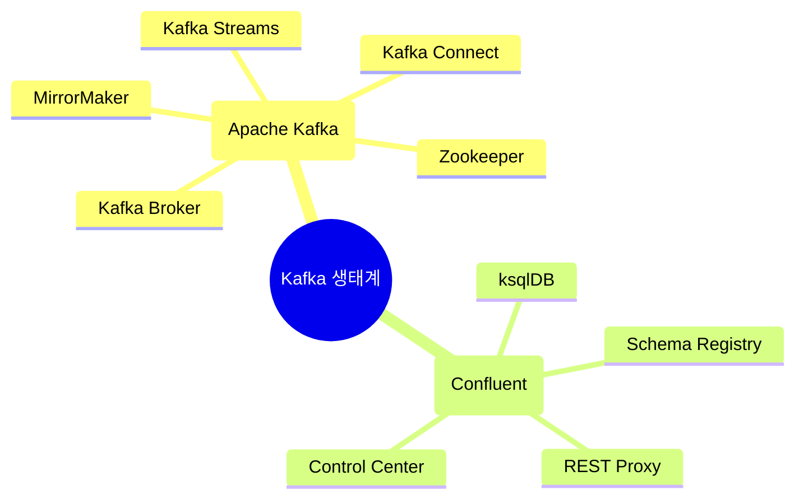

- 

네, Kafka 생태계에는 더 많은 컴포넌트들이 있습니다. 크게 나누면 Apache Kafka 프로젝트에 포함된 핵심 컴포넌트들과, Confluent 등 기업에서 제공하는 추가 컴포넌트들이 있습니다.

Apache Kafka 프로젝트의 핵심 컴포넌트들:
1. Kafka Broker: 실제 메시지를 저장하고 관리하는 서버
2. Kafka Streams: 앞서 설명한 스트림 처리 라이브러리
3. Kafka Connect: 데이터 통합 프레임워크
4. Kafka MirrorMaker: 서로 다른 Kafka 클러스터 간 데이터 복제 도구
5. Zookeeper: Kafka 클러스터의 메타데이터 관리 (단, 최신 버전에서는 선택적 사용)

Confluent에서 제공하는 추가 컴포넌트들:
1. Schema Registry: 데이터 스키마를 중앙 관리하는 도구
2. ksqlDB: SQL 문법으로 스트림 처리를 할 수 있는 도구
3. Control Center: Kafka 클러스터 모니터링 및 관리 UI
4. REST Proxy: HTTP를 통해 Kafka와 통신할 수 있는 인터페이스

이렇게 다양한 컴포넌트들이 존재하는 이유는 분산 시스템의 각기 다른 요구사항들(스키마 관리, 모니터링, 데이터 복제, REST 통신 등)을 해결하기 위해서입니다. 필요한 기능에 따라 선택적으로 사용할 수 있습니다.

# Apache Kafka 생태계의 핵심 컴포넌트 이해하기

## 1. Apache Kafka의 기본 구성 요소

Apache Kafka는 현대적인 데이터 파이프라인의 중추적인 역할을 담당하는 분산 스트리밍 플랫폼입니다. 기본적인 구성 요소들을 살펴보겠습니다.

## 2. 핵심 컴포넌트 상세 설명

### 2.1. Apache Kafka 프로젝트의 기본 컴포넌트

1. Kafka Broker (메시지 브로커)
    - 실제 메시지를 저장하고 관리하는 서버로, Kafka의 가장 핵심적인 컴포넌트입니다.
    - 토픽과 파티션을 관리하며, 고가용성을 위해 여러 브로커가 클러스터를 구성합니다.
    - 데이터의 복제와 장애 복구를 자동으로 처리하여 안정성을 보장합니다.

2. Kafka Streams (스트림 처리 엔진)
    - Java/Scala 기반의 스트림 처리 라이브러리로, 실시간 데이터 처리를 지원합니다.
    - 상태 기반 처리와 시간 윈도우 연산을 제공하여 복잡한 스트림 분석이 가능합니다.
    - 특징적인 기능들:
        - 실시간 집계와 조인 연산
        - 이벤트 시간 기반 처리
        - 정확히 한 번 처리 의미론(exactly-once semantics) 지원
        - 내결함성 있는 로컬 상태 관리

3. Kafka Connect (데이터 통합 프레임워크)
    - 외부 시스템과 Kafka 사이의 데이터 이동을 담당하는 확장 가능한 도구입니다.
    - 두 가지 주요 커넥터 유형:
        - Source Connector: 외부 시스템의 데이터를 Kafka로 가져옵니다.
        - Sink Connector: Kafka의 데이터를 외부 시스템으로 내보냅니다.
    - 특징:
        - 선언적 설정으로 코드 없이 데이터 파이프라인 구축
        - 분산 모드 지원으로 확장성 확보
        - 다양한 데이터 포맷과 변환 지원

4. MirrorMaker (클러스터 간 복제 도구)
    - 서로 다른 Kafka 클러스터 간의 데이터 복제를 담당합니다.
    - 재해 복구, 지역 간 데이터 동기화, 데이터 백업 등에 활용됩니다.

### 2.2. Confluent 플랫폼의 확장 컴포넌트

1. Schema Registry (스키마 레지스트리)
    - 데이터 스키마를 중앙에서 관리하고 버전을 추적합니다.
    - Avro, Protobuf, JSON Schema 등 다양한 스키마 형식을 지원합니다.
    - 스키마 진화(evolution)를 관리하여 하위 호환성을 보장합니다.

2. ksqlDB (스트리밍 SQL 엔진)
    - SQL 문법으로 스트림 처리를 수행할 수 있는 데이터베이스입니다.
    - 특징:
        - 실시간 쿼리와 지속적인 쿼리 모두 지원
        - 내장된 스트리밍 기능으로 복잡한 처리 로직 구현 가능
        - REST API를 통한 접근 지원

3. Control Center (관리 및 모니터링 도구)
    - Kafka 클러스터의 상태를 실시간으로 모니터링합니다.
    - 주요 기능:
        - 클러스터 헬스 체크
        - 처리량과 지연시간 모니터링
        - 스키마 관리
        - 보안 설정

4. REST Proxy (HTTP 인터페이스)
    - HTTP를 통해 Kafka와 통신할 수 있는 REST API를 제공합니다.
    - 다양한 프로그래밍 언어에서 Kafka 접근을 용이하게 합니다.

## 3. 컴포넌트 선택 및 활용

1. 기본 메시징 시스템
    - 단순한 발행/구독 모델이 필요한 경우 Kafka Broker만으로 충분합니다.
    - 고가용성이 필요한 경우 여러 브로커로 클러스터를 구성합니다.

2. 실시간 데이터 처리
    - 실시간 처리가 필요한 경우 Kafka Streams나 ksqlDB를 활용합니다.
    - Java/Scala 개발자는 Kafka Streams를, SQL 친화적인 개발자는 ksqlDB를 선택합니다.

3. 데이터 통합
    - 외부 시스템과의 연동이 필요한 경우 Kafka Connect를 사용합니다.
    - 많은 수의 커넥터가 이미 개발되어 있어 재사용이 가능합니다.

4. 엔터프라이즈 확장
    - 대규모 운영 환경에서는 Schema Registry와 Control Center가 필수적입니다.
    - REST Proxy는 다양한 클라이언트 지원이 필요한 경우에 도입합니다.

이러한 컴포넌트들은 독립적으로 또는 조합하여 사용할 수 있으며, 각 조직의 요구사항과 기술 스택에 따라 적절히 선택하여 활용할 수 있습니다.

