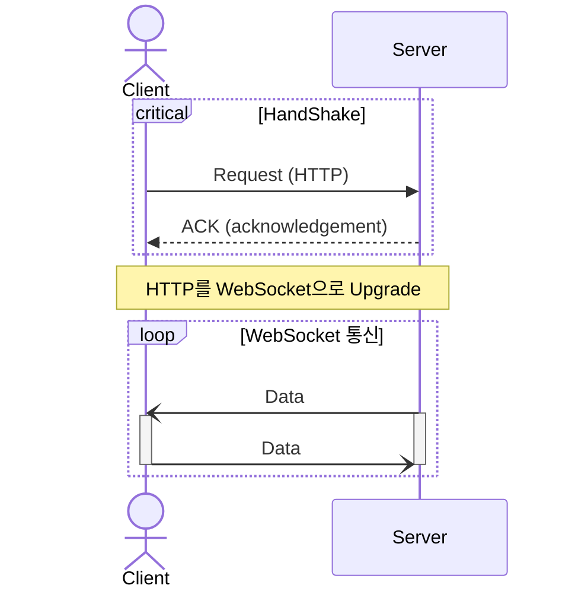

- WebSocket은 **server와 client 간에 양방향 통신(Full-Duplex)을 가능하게 하는 통신 Protocol**로, 연결(connection)을 유지해서 지속적으로 data를 주고받을 수 있습니다.
    - **WebSocket의 연결은 영구적**이기 때문에, message를 전송할 때 매번 새롭게 연결을 맺을 필요가 없어 빠르고 효율적입니다.
    - WebSocket 연결은 client의 HTTP 요청을 통해 시작되며, 특정 **Handshake 절차를 거쳐 HTTP 연결이 WebSocket 연결로 upgrade**됩니다.
        - HTTP 연결은 처음 접속 확립에만 사용되고, 일정 시간이 지나면 자동으로 끊어집니다.
    - WebSocket 연결 후의 통신은 독자적인 WebSocket Protocol로만 이루어집니다.

- WebSocket은 전통적인 HTTP 기반 통신 방식에 비해 server 부하와 지연 시간을 크게 줄일 수 있으며, 주로 **Real-Time(실시간) Web Application을 구현하기 위해 사용**됩니다.
    - WebSocket Protocol의 header는 HTTP의 header보다 작고 가벼워서, 더 비용(overhead)으로 통신할 수 있습니다.
    - HTTP 통신을 사용하는 **Polling이나 Long Polling보다 WebSocket이 양방향 data 교환에 있어서 더 효율적**입니다.

- WebSocket은 **상태 유지(Stateful) 통신을 제공**하며, 한 번 연결되면 해당 connection line을 사용하여 양방향으로 data를 주고받을 수 있습니다.
    - 기존의 HTTP 통신은 client가 server에 요청을 보내고 server가 응답하는 단방향 통신이었으며, 이는 상태를 유지하지 않는(Stateless) 특성 때문에 연속된 data의 실시간 update에 한계가 있었습니다.

- WebSocket은 **HTTP가 사용하는 기본 port number(80 or 443)를 그대로 사용**하기 때문에, 방화벽이 있는 환경에서도 문제 없이 동작합니다.
    - 평문 message 전송 방식이므로, SSL/TLS 보안 계층으로 암호화해야 data 탈취를 방지할 수 있습니다.

- 양방향 통신이 가능하기에, **수신 client 뿐만 아니라 송신 client에서도 사용**할 수 있습니다.
    - data의 송신과 수신에 connection을 각각 맺을 필요가 없어, 하나의 connection으로 data를 송신하고 수신할 수 있습니다.
    - message를 보낼 때와 받을 때 모두 같은 Protocol을 사용할 수 있게 되므로, 구현이 단순하고 직관적이게 됩니다.

- WebSocket Protocol은 TCP Socket과 이름만 유사할 뿐 browser의 Socket이며, HTTP와 동일한 Application Layer(Application 계층)에 위치합니다.
    - 또한 TCP의 양방향 전이중 통신을 사용하기 때문에 Transport Layer(전송 계층)에 의존하고 있기도 합니다.

- 유의할 점은 WebSocket 연결은 항구적으로 유지되어야 하기 때문에, server 측에서 연결 관리를 효율적으로 해야 한다는 점입니다.

## Reference

- <https://ko.wikipedia.org/wiki/%EC%9B%B9%EC%86%8C%EC%BC%93>
- <https://seongsu.me/skill/socket/>
