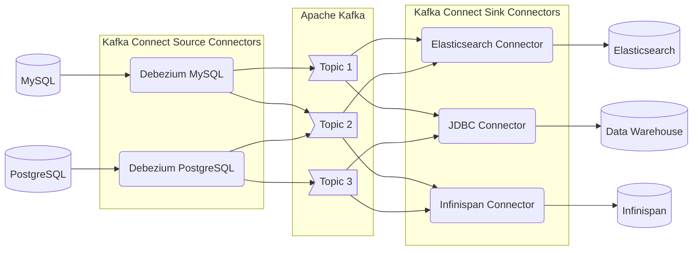

```mermaid
flowchart LR
    mysql[(MySQL)]
    postgres[(PostgreSQL)]

    subgraph KafkaSourceConnectors["Kafka Connect Source Connectors"]
        debezium_mysql("Debezium MySQL")
        debezium_postgres("Debezium PostgreSQL")
    end

    subgraph ApacheKafka["Apache Kafka"]
        topic1>Topic 1]
        topic2>Topic 2]
        topic3>Topic 3]
    end

    subgraph KafkaSinkConnectors["Kafka Connect Sink Connectors"]
        elastic_conn("Elasticsearch Connector")
        infinispan_conn("Infinispan Connector")
        jdbc_conn("JDBC Connector")
    end

    elastic[(Elasticsearch)]
    infinispan[(Infinispan)]
    warehouse[(Data Warehouse)]

    mysql --> debezium_mysql
    postgres --> debezium_postgres
    
    debezium_mysql --> topic1 & topic2
    debezium_postgres --> topic2 & topic3
    
    topic1 & topic2 --> elastic_conn
    topic2 & topic3 --> infinispan_conn
    topic1 & topic3 --> jdbc_conn
    
    elastic_conn --> elastic
    infinispan_conn --> infinispan
    jdbc_conn --> warehouse
```

---

## Reference

- <https://cjw-awdsd.tistory.com/53>
- <https://velog.io/@holicme7/Apache-Kafka-Kafka-Connect-란>

