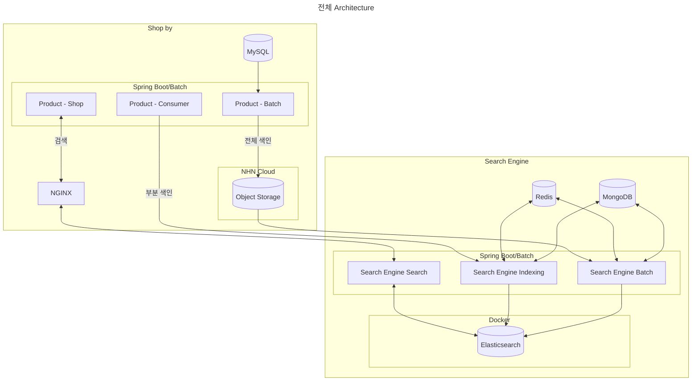
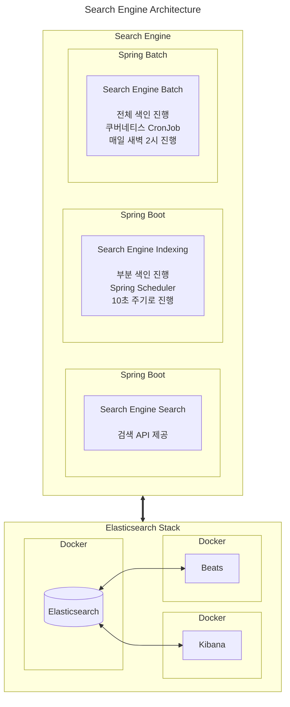
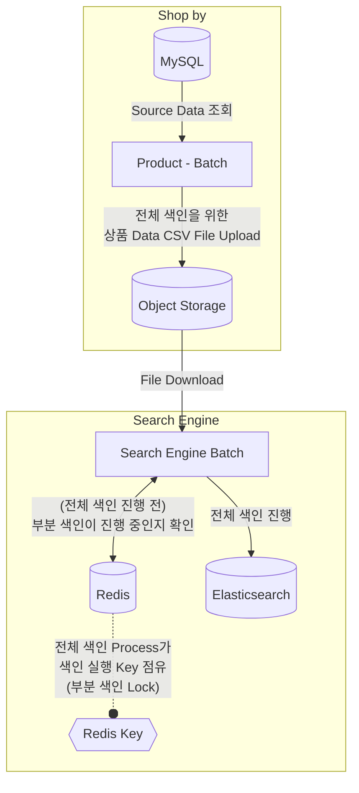
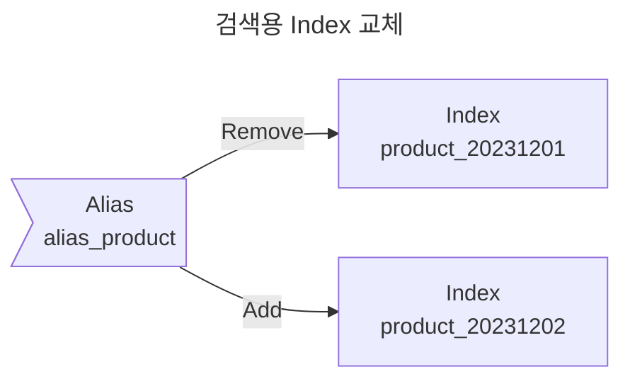
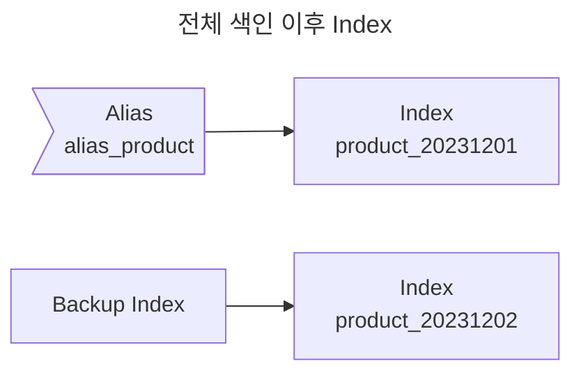
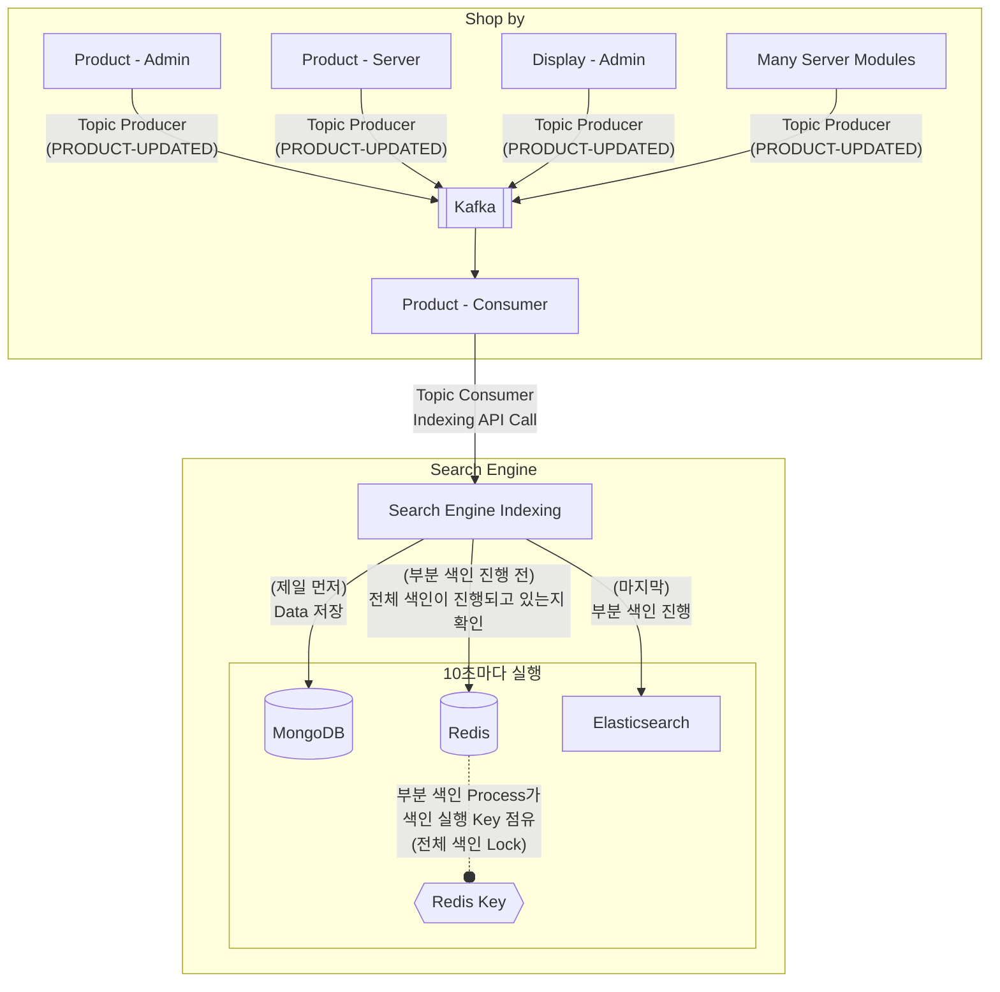

## NHN의 커머스 플랫폼을 위한 상품 검색 Engine 설계

- NHN FORWARD 22 행사에서 발표한 "엘라스틱서치를 이용한 상품 검색 엔진 개발 일지" 내용을 정리한 글입니다.
    - 발표 영상은 [YouTube](https://youtu.be/fBfUr_8Pq8A)를 참고해주세요.


---


## 1. 검색 엔진 도입 배경

- 기존의 Shop by 상품 검색 시스템에서는 NHN Cloud Search를 활용하여 상품 검색 서비스를 제공해 왔습니다.

- NHN 클라우드 서치는 우수한 검색 엔진이었으나, 커머스 플랫폼에 특화되지 않은 범용 검색 엔진이라는 한계가 있었습니다.
    - NHN 클라우드 서치는 커머스 플랫폼 특유의 요구 사항을 반영하는 데 제약이 있었습니다.

- 따라서 커머스 플랫폼에 특화된 검색 서비스를 제공하기 위해, 새로운 검색 엔진을 자체 구축하기로 결정하였습니다.
    - 커머스 환경에 최적화된 검색 엔진을 Elasticsearch로 직접 구현합니다.


### Elasticsearch 선택 배경과 운영 환경

- **Elasticsearch**는 근실시간(Near Real-time) 검색 및 분석이 가능한 open source 검색 엔진입니다.
    - Lucene 기반으로 구축되어 있고 역 인덱스 구조를 지원하여 매우 빠른 검색 성능을 제공합니다.
    - 분산형 설계가 가능하여, 데이터 보관의 안전성을 확보할 수 있습니다.
    - 속도, 확장성, 복원력 등 광범위한 기능을 제공합니다.
    - 현재 검색 엔진 시장에서 가장 높은 점유율을 보유하고 있습니다.
        - 높은 점유율은 활발한 사용자 커뮤니티와 지속적인 문서 업데이트를 통한 안정적인 지원을 의미합니다.

- 우수한 검색 속도와 성능, 시장 점유율 1위로 인한 높은 신뢰성, 활발한 커뮤니티 지원과 문서화, 그리고 다양한 추가 기능과 확장성 등의 이유로 Elasticsearch를 도입하기로 결정하였습니다.

| 도구 | 설명 |
| --- | --- |
| **Elasticsearch** | JSON 기반의 분산형 검색 및 분석 엔진 |
| **Logstash** | 수집된 데이터 가공 파이프라인 |
| **Kibana** | Elasticsearch에 저장된 데이터를 분석 및 시각화하는 도구 |
| **Beats** | 데이터 수집기 (무료 오픈 소스 플랫폼) |

- 운영 환경은 Elastic Stack에서 Logstash를 제외한 Elasticsearch, Kibana, Beats로 구성되어 있습니다.

- 별도의 데이터 필터링은 불필요하다고 판단하여 Logstash는 운영하지 않습니다.
    - Beats를 통한 데이터 수집만으로 충분했기 때문입니다.


---


## 2. 검색 엔진 Architecture



- Object Storage는 많은 양의 데이터를 저장할 수 있는 온라인 저장소 서비스를 의미합니다.

- 데이터는 "SQL DB -> Elasticsearch -> Client"의 방향으로 순차적으로 흐릅니다.
    - 먼저 SQL DB에 저장된 상품 데이터가 Elasticsearch로 전송되어 검색 가능한 형태로 구축됩니다.
        - 상품 데이터(source data)들은 전부 SQL DB에 저장되어 있습니다.
    - 이후 클라이언트가 검색 API를 통해 요청을 보내면, Elasticsearch에 구축된 검색 데이터를 기반으로 검색 결과를 제공받게 됩니다.
    - 단방향 데이터 흐름을 통해 효율적이고 일관성 있는 검색 서비스가 가능합니다.

- 검색 데이터 구축을 위한 인덱싱은 두 가지 방식으로 운영됩니다.
    1. 전체 색인 : 전체 데이터를 대상으로 하는 인덱싱입니다.
    2. 부분 색인 : 변경된 데이터만을 대상으로 하는 인덱싱입니다.

- 시스템은 세 개의 독립적인 서버 모듈로 구성되어 있습니다.
    1. 검색 API 서버 : 클라이언트 검색 요청을 처리하고 API를 제공합니다.
    2. 인덱싱 서버 : Spring Scheduler를 활용하여 10초 주기로 부분 색인 작업을 수행합니다.
    3. 배치 서버 : Kubernetes CronJob을 통해 매일 새벽 2시에 전체 색인 작업을 실행합니다.



- 시스템 운영을 위해서 Elasticsearch, Kibana, Beats 등의 Elastic Stack의 세 가지 핵심 기술을 활용하고 있습니다.


---


## 3. 데이터 색인 구조

- 색인(indexing)은 **원본 문서를 검색 가능한 형태로 변환**하는 과정입니다.
    - 색인이란, 책 속의 낱말이나 구절, 또 이에 관련한 지시자를 찾아보기 쉽도록 일정한 순서로 나열한 목록입니다.
    - Elasticsearch에서도 상품 정보를 검색하기 위해서는, **원본 문서를 검색어 토큰들로 변환하는 색인 과정**이 필수적입니다.

- 색인 유형에는 **전체 색인**과 **부분 색인** 두 가지가 있습니다.
    - **전체 색인**은 하루에 한 번씩 실행되며, SQL DB에 저장된 모든 상품 데이터를 Elasticsearch에 새롭게 색인하는 프로세스입니다.
        - 배치 작업을 통해 전체 데이터를 CSV 파일로 저장하고 이를 Object Storage에 업로드한 후, 다시 이 파일을 다운로드하여 Elasticsearch에 색인하는 방식으로 진행됩니다.
        - data를 CSV file로 저장하는 과정은 새벽 1시에, 전체 색인은 새벽 2시에 진행합니다.
    - **부분 색인**은 10초 간격으로 실행되며, 실시간으로 수정된 상품 데이터만을 대상으로 재색인을 수행합니다.
        - Kafka Topic을 통해 상품 수정 정보를 전달받아 MongoDB에 임시 저장한 후, 이를 Elasticsearch에 반영하는 방식으로 운영됩니다.
        - 이러한 부분 색인을 통해 전체 색인 사이의 기간 동안 데이터의 최신성을 유지할 수 있습니다.

- **데이터 정합성을 관리**하기 위해, **전체 색인과 부분 색인이 동시에 실행되는 것을 방지**하는 로직이 추가되어 있습니다.
    - 전체 색인과 부분 색인이 동시에 실행될 경우 데이터 정합성에 문제가 발생할 수 있기 때문에, 두 프로세스 간의 실행 시점을 제어하는 메커니즘을 구현했습니다.
    - 따라서 전체 색인이 시작될 때는 부분 색인이 실행되지 않아야 하며, 반대로 부분 색인이 진행 중일 때는 전체 색인이 시작되지 않도록 설계되어 있습니다.
    - 두 프로세스의 동시 실행을 방지하기 위한 제어는 **Redis를 활용한 Lock 메커니즘**을 통해 구현됩니다.
        - 전체 색인이 시작되기 전에 시스템은 Redis를 통해 부분 색인의 실행 여부를 확인합니다.
        - 부분 색인이 실행 중이지 않은 경우에만 Lock을 획득하고 전체 색인을 시작합니다.
        - 전체 색인이 완료되면 Lock을 해제하여 부분 색인이 다시 실행될 수 있도록 합니다.
        - 부분 색인도 마찬가지로 전체 색인의 실행 여부를 확인하고 Lock을 관리하는 동일한 메커니즘을 따릅니다.


### 전체 색인 Process



1. **사전 작업 단계**를 실행합니다. 
    - 모든 상품 데이터를 CSV 파일로 변환하여 Object Storage에 업로드합니다.
    - Product Batch를 통해 매일 새벽 1시경에 작업을 완료합니다.

2. **색인 준비 단계**를 새벽 2시에 시작합니다.
    - Redis를 통해 부분 색인의 실행 여부를 확인합니다.
    - 부분 색인이 미실행 중인 경우, Redis Lock을 획득합니다.
    - Object Storage에서 CSV 파일을 다운로드하고 데이터를 파싱합니다.

3. **데이터 적재 단계**를 수행합니다.
    - Elasticsearch의 Bulk API를 활용하여 새로운 인덱스에 데이터를 적재합니다.
    - 2,000개 단위로 데이터를 묶어 20개의 비동기 작업으로 병렬 처리합니다.
    - 약 300만 개의 상품 데이터를 6-7분 내에 처리합니다.

4. **인덱스 전환 단계**를 진행합니다.
    - Alias API를 활용하여 새로운 인덱스로 무중단 전환합니다.
    - 기존 인덱스는 백업용으로 보관합니다.
    - 예를 들어, 'product_20231201'에서 'product_20231202'로 'alias_product' alias를 전환합니다.

5. **작업 완료 단계**를 실행합니다.
    - Redis Lock을 해제하여 부분 색인 재개 가능 상태로 전환합니다.
    - 전체 색인 프로세스를 종료합니다.


### 전체 색인 성능 최적화를 위한 처리

- 전체 색인의 성능을 최적화하기 위해, **Bulk API 활용**, **비동기 병렬 처리**, **벌크 사이즈 최적화** 등의 방법을 사용합니다.
    - 총 3,000,000개 이상의 상품 data를 가지고 성능 test를 진행하였습니다.

1. **Bulk API**는 여러 데이터를 하나의 요청으로 처리할 수 있는 기능입니다.
    - 현재 시스템에서는 2,000개의 데이터를 하나의 단위로 묶어 처리함으로써 개별 요청 대비 처리 효율을 크게 향상시켰습니다.

2. **비동기 병렬 처리**는 대량의 데이터를 여러 작업으로 분할하여 동시에 처리하는 방식입니다.
    - 구체적으로 2,000개의 데이터를 20개씩 병렬로 처리하도록 indexing logic을 구현했습니다.
    - 이러한 최적화를 통해 전체 색인 처리 시간을 기존 50분에서 6-7분으로 대폭 단축했습니다.

3. **벌크 사이즈 최적화**는 시스템의 처리 성능을 극대화하기 위한 중요한 요소입니다.
    - 무조건 size를 늘린다고 좋은 것은 아니며, cluster 구성이나 data 크기에 따라서 적합한 벌크 사이즈를 찾아 설정해주어야 합니다.
    - 일반적으로 5-15MB 크기를 시작점으로 하여 클러스터 구성과 데이터 크기에 따라 점진적으로 조정하는 것이 권장됩니다.
    - 현재는 2,000개 단위가 최적의 성능을 보여주고 있으며, 향후 상품 데이터 증가에 따라 유연하게 조정할 수 있도록 설계되어 있습니다.

#### 전체 색인 Code 최적화 전

```kotlin
// Only 1 request for N products
runBlocking {
    indexData.chunked(5000).forEach {
        documentCount += it.size
        domainService.bulkIndexingProducts(
            targets = EsProductIndex.createBy(it),
            indexName = indexName,
        )
    }
}
```

```json
// POST /_bulk
{ "index": { "_index": "product", "_id": 10616 } }
{ "mallNo": 99, "productName": "난방기" }
{ "index": { "_index": "product", "_id": 10617 } }
{ "mallNo": 100, "productName": "냉장고" }
{ "index": { "_index": "product", "_id": 10618 } }
{ "mallNo": 101, "productName": "에어컨" }
```

- 5000개씩 끊어서 Bulk API를 호출하면, 3,000,000개의 data를 모두 처리하는 데에 50분에서 1시간 정도의 시간이 소요됩니다.
    - 전체 색인 도중에 장애가 발생하거나 빠르게 rollback이 필요하다면, 1시간의 색인 시간은 문제가 됩니다.

#### 전체 색인 Code 최적화 후

```kotlin
// async로 2,000개의 data를 20개씩 병렬 처리로 indexing 요청
val deferredJobs = mutableListOf<Deferred<Unit>>()

runBlocking {
    indexData.chunked(2000).forEach { products ->
        documentCount += products.size
        deferredJobs.add(
            async { domainService.bulkIndexingProducts(products, indexName) }
        )
        
        if (deferredJobs.count() == 20) {
            deferredJobs.awaitAll()
            deferredJobs.clear()
        }
    }
}
```

- 병렬 처리 logic을 추가하여, 500,000개의 data를 색인하는 데에 1분 정도가 소요되게 되었고, 전체 3,000,000개의 data를 모두 색인하는 데에는 6-7분이 소요되게 되었습니다.


### 전체 색인에서의 Alias API 활용 : 안정적인 서비스 운영

- 안정적인 서비스 운영을 위해, **Alias API를 활용**하여 무중단으로 인덱스를 전환하고, **백업 인덱스 유지**하는 시스템을 구현하여 사용합니다.



```json
// API : POST _aliases
{
    "actions": [
        {
            "remove": {
                "index": "기존 Index",
                "alias": "alias_product"
            }
        },
        {
            "add": {
                "index": "전체 색인으로 생성된 Index",
                "alias": "alias_product"
            }
        }
    ]
}
```



1. Elasticsearch의 **Alias API**를 사용하여 **인덱스를 전환하는 과정에서 서비스 중단 없이 새로운 데이터로 검색 서비스를 제공**합니다.
    - Alias API는 **인덱스에 alias를 부여**하여 실제 인덱스를 유연하게 전환할 수 있게 해줍니다.
    - 예를 들어, 'product_20231201' 인덱스에 'alias_product'라는 alias가 매핑되어 있다면, 클라이언트는 'alias_product'라는 alias만으로 해당 인덱스에 접근할 수 있습니다.
        - 반대로, 'product_20231202' 인덱스에 'alias_product'라는 alias가 새로 매핑된다면, 클라이언트는 'alias_product'라는 alias로 'product_20231201'가 아닌, 'product_20231202' 인덱스에 접근합니다.
    - 전체 색인 과정에서 새로운 인덱스가 생성되면, **Alias API의 multiple action 기능을 사용하여 alias를 새 인덱스로 무중단 전환**합니다.
        - multiple action option을 사용하면, 무중단 alias 교체가 가능합니다.
        - 예를 들어, 'product_20231202' 인덱스가 새로 생성되면, 'alias_product' alias가 기존 인덱스에서 새 인덱스로 자연스럽게 전환됩니다.

2. **alias 연결이 끊어진 이전 인덱스는 백업 용도로 보관**하여, 새 인덱스에 문제가 발생했을 경우 신속하게 이전 상태로 롤백할 수 있도록 합니다.
    - 예를 들어, 'product_20231202' 인덱스에 문제가 발견되면 alias를 이전 'product_20231201' 인덱스로 즉시 되돌릴 수 있어 서비스의 안정성을 보장합니다.
    - 새 인덱스가 생기더라도 이전 인덱스는 삭제하지 않고 alias만 새 index로 옮기기 때문에 가능한 rollback 방법입니다.
    - 이 방식은 저장 공간을 더 많이 사용하게 되는 단점이 있기 때문에, 적절한 보관 기간을 설정하고, 일정 기간이 지난 백업 인덱스는 삭제하는 정책을 수립하는 것이 중요합니다.


### 부분 색인 Process

- 부분 색인 프로세스는 상품 데이터의 실시간성을 보장하기 위한 메커니즘입니다.
    - 전체 색인 사이의 간격에서도 검색 데이터의 최신성을 유지할 수 있도록 합니다.



1. **데이터 수정 감지와 전파** : 상품 데이터가 수정되면, 시스템은 'product_update'라는 Kafka Topic을 발행합니다.
    - 여러 서버 모듈에서 발생하는 상품 수정 사항을 효과적으로 감지하고 전파하기 위해 Kafka를 활용합니다.

2. **임시 저장소 활용** : 수정된 데이터는 먼저 MongoDB에 임시 저장됩니다.
    - data를 그냥 바로 Elasticsearch에 넣어도 상관 없지만, 가용성과 재색인 실패 방지를 위해 중간에 MongoDB를 둡니다.
    - MongoDB는 Elasticsearch 서버의 장애나 네트워크 이슈 발생 시에도 데이터 손실을 방지하기 위한 안전 장치입니다.
    - MongoDB에 저장되는 데이터는 `UPDATE`와 `DELETE` 두 가지 액션 타입으로 구분되며, 각각 최신 상품 정보와 삭제할 상품 번호를 포함합니다.

3. **스케줄링과 실행** : 부분 색인은 10초 간격으로 실행되는 스케줄러에 의해 관리됩니다.
    - 실행 전에는 항상 전체 색인 작업의 진행 여부를 Redis를 통해 확인합니다.
    - 전체 색인이 진행 중이지 않을 때만 부분 색인이 실행되며, 이를 통해 데이터 정합성을 보장합니다.

4. **데이터 처리** : MongoDB에서 가져온 데이터는 액션 타입에 따라 다르게 처리됩니다.
    - `UPDATE` 액션의 경우 해당 상품 문서를 최신 데이터로 업데이트하고, `DELETE` 액션의 경우 해당 상품 문서를 Elasticsearch에서 삭제합니다.
    - 이 과정에서도 Bulk API를 활용하여 효율적인 처리를 보장합니다.

#### MongoDB에 저장되는 임시 Data 예시

- `action` 항목에 `UPDATE`와 `DELETE`가 저장됩니다.

| _id | action | productNo | product | updatedDateTime |
| --- | --- | --- | --- | --- |
| 1 | UPDATE | 100000000 | {"serviceNo":1000, "mallNo":1122, "partnerNo":14232} | 2022-11-14T09:52:06.733Z |
| 2 | UPDATE | 100000001 | {"serviceNo":1000, "mallNo":1122, "partnerNo":14732} | 2022-11-14T09:52:06.733Z |
| 3 | UPDATE | 100000002 | {"serviceNo":1000, "mallNo":1122, "partnerNo":67312} | 2022-11-14T09:52:06.733Z |
| 4 | DELETE | 100000003 | <unset> | 2022-11-14T09:52:06.733Z |
| 5 | UPDATE | 100000004 | {"serviceNo":1000, "mallNo":1122, "partnerNo":64312} | 2022-11-14T09:52:06.733Z |
| 6 | UPDATE | 100000005 | {"serviceNo":1000, "mallNo":1122, "partnerNo":34564} | 2022-11-14T09:52:06.733Z |
| 7 | UPDATE | 100000006 | {"serviceNo":1000, "mallNo":1122, "partnerNo":54143} | 2022-11-14T09:52:06.733Z |
| 8 | DELETE | 100000007 | <unset> | 2022-11-14T09:52:06.733Z |
| 9 | UPDATE | 100000008 | {"serviceNo":1000, "mallNo":1122, "partnerNo":74523} | 2022-11-14T09:52:06.733Z |
| 10 | UPDATE | 100000009 | {"serviceNo":1000, "mallNo":1122, "partnerNo":97657} | 2022-11-14T09:52:06.733Z |
| 11 | UPDATE | 100000010 | {"serviceNo":1000, "mallNo":1122, "partnerNo":45654} | 2022-11-14T09:52:06.733Z |
| 12 | UPDATE | 100000011 | {"serviceNo":1000, "mallNo":1122, "partnerNo":64353} | 2022-11-14T09:52:06.733Z |
| 13 | DELETE | 100000012 | <unset> | 2022-11-14T09:52:06.733Z |
| 14 | UPDATE | 100000013 | {"serviceNo":1000, "mallNo":1122, "partnerNo":96759} | 2022-11-14T09:52:06.733Z |
| 15 | UPDATE | 100000014 | {"serviceNo":1000, "mallNo":1122, "partnerNo":34233} | 2022-11-14T09:52:06.733Z |
| 16 | UPDATE | 100000015 | {"serviceNo":1000, "mallNo":1122, "partnerNo":87576} | 2022-11-14T09:52:06.733Z |
| 17 | DELETE | 100000016 | <unset> | 2022-11-14T09:52:06.733Z |
| 18 | UPDATE | 100000017 | {"serviceNo":1000, "mallNo":1122, "partnerNo":43222} | 2022-11-14T09:52:06.733Z |
| 19 | DELETE | 100000018 | <unset> | 2022-11-14T09:52:06.733Z |
| 20 | UPDATE | 100000019 | {"serviceNo":1000, "mallNo":1122, "partnerNo":12334} | 2022-11-14T09:52:06.733Z |

#### 부분 색인 Source Code

- MongoDB에 있는 Data를 토대로 부분 색인을 진행합니다.

- 부분 색인도 Bulk API를 사용하며, action 항목이 `UPDATE`인지 `DELETE`인지에 따라 분기하여 다르게 처리합니다.
    - `UPDATE`인 경우에는 해당 document를 수정된 정보로 최신화합니다.
    - `DELETE`인 경우에는 해당 document를 삭제합니다.

```kotlin
indexingTargets.forEach { target ->
    when (target.action) {
        UPDATE -> {
            bulkRequestBuilder.operations { bulkOperation ->
                bulkOperation.index {
                    it.index(indexName).id(target.productNo.toString()).document(target.product)
                }
            }
        }
        DELETE -> {
            bulkRequestBuilder.operations { bulkOperation ->
                bulkOperation.delete {
                    it.index(indexName).id(target.productNo.toString())
                }
            }
        }
        // ...
    }
}
```


### 부분 색인이 있는데 전체 색인을 추가로 하는 이유

- 업데이트가 필요한 data에 대해 10초에 한 번씩 실시간 부분 색인을 하기 때문에, 전체 색인을 하지 않아도 data의 정합성은 보장할 수 있습니다.
- 그러나 NHN의 검색 엔진에서 전체 색인은 **시스템의 안정성을 확보**하고 **검색 서비스의 품질을 향상**시키기 위한 필수 기능입니다.

1. **안정적인 백업**과 **신속한 장애 대응**이 가능합니다.
    - 매일 새벽 전체 색인을 수행할 때마다 새로운 인덱스가 생성되며, 이전 인덱스는 백업용으로 보존됩니다.
    - 현재 사용 중인 인덱스에 문제가 발생하더라도 이전 인덱스로 즉시 전환할 수 있어, 서비스 중단을 최소화하고 신속하게 대응할 수 있습니다.

2. **검색 품질 개선을 위한 유연한 대응**이 가능합니다.
    - 현재 시스템은 Elasticsearch의 Nori 플러그인을 활용하여 검색 품질을 향상시키고 있습니다.
    - 이 플러그인을 사용하면서 새로운 동의어를 추가해야 하는 경우가 생기는데, 이러한 변경 사항은 인덱스 갱신을 필요로 합니다.
        - 추가된 동의어에 맞추어 모든 index를 갱신해야 합니다.
    - 매일 수행되는 전체 색인 작업을 통해 새롭게 추가된 동의어가 자동으로 인식되므로, 검색 품질을 지속적으로 개선할 수 있습니다.


---


## 검색 품질 개선 방안

- NHN은 커머스 플랫폼의 검색 품질을 개선하기 위해 **텍스트 분석 기능**과 **검색 쿼리 기능**을 최적화하였습니다.


### 텍스트 분석 기능 : 형태소 분석, 사용자 사전, 동의어 사전

- NHN은 Elasticsearch의 analyzer를 통해 포괄적인 텍스트 분석 기능을 구현했습니다.

- 특히, 사용자 사전과 동의어 사전은 지속적인 update가 필요하기 때문에, 자동화된 배포 시스템을 구축했습니다.
    - 사전 파일이 NHN 클라우드 스토리지에 업로드되면 모든 클러스터 노드에 자동으로 배포되고 적용됩니다.

#### Nori 토크나이저 : 형태소 분석

- Elasticsearch의 **Nori 토크나이저**를 한국어 처리를 위해 도입했습니다.
    - 토크나이저는 검색어를 의미 있는 구성 요소로 효과적으로 분리합니다.
    - 예를 들어, "남성 운동화"라는 검색어는 "남성", "운동", "화" 세 부분으로 토큰화됩니다.

#### 사용자 사전 : 단어의 분리 제어

- 유사하지만 관련성은 없는 결과가 함께 표시되는 문제는 **사용자 사전**을 구현하여 해결하였습니다.

- 초기에는 "운동화"를 검색했을 때 "운동복"이나 "운동기구"와 같은 관련 없는 결과가 함께 표시되는 문제가 있었습니다.

- 이를 해결하기 위해 사용자 사전을 구현하여 형태소 분석 과정에서 특정 단어가 불필요하게 분리되는 것을 방지했습니다.
    - 예를 들어, "운동화"라는 단어가 "운동"과 "화"로 분리되면 "운동복", "운동기구" 등 관련 없는 검색 결과가 나올 수 있습니다.
    - 따라서 사용자 사전에 "운동화"를 등록하면 이 단어가 하나의 완전한 단어로 취급되어 더 정확한 검색이 가능해집니다.

#### 동의어 사전 : 같은 의미를 가진 다양한 표현 연결

- 사용자들이 같은 상품을 다양한 방식으로 검색할 수 있도록 포괄적인 **동의어 사전**을 개발했습니다.
    - 예를 들어, 사용자가 "신발"이라는 단어를 검색했을 때 "러닝화", "운동화", "스니커즈" 등 같은 의미를 가진 상품들도 함께 검색될 수 있도록 합니다. 
    - 이를 통해 사용자가 어떤 표현을 사용하더라도 원하는 상품을 찾을 수 있게 됩니다.


### 검색 쿼리 개선 전략

- 여러 query 전략들의 조합으로 커머스 플랫폼의 검색 정확도와 사용자 경험이 크게 향상되었으며, 검색의 유연성을 유지하면서도 더 정확하고 관련성 높은 상품 검색이 가능해졌습니다.

1. **Copy-to 필드 구현** : Elasticsearch의 copy-to 기능을 사용하여 여러 검색 가능한 필드(상품명, 키워드, 브랜드명)를 하나의 필드로 통합했습니다.
    - 이를 통해 쿼리 구조가 크게 단순화되고 검색 효율성이 향상되었습니다.
    - 여러 필드를 검색하는 복잡한 쿼리를 작성하는 대신, 통합된 단일 필드만 검색하면 됩니다.

2. **Minimum Should Match 구현** : 관련성 없는 검색 결과를 방지하기 위해 minimum_should_match 파라미터를 구현했습니다.
    - 예를 들어 "김치냉장고"를 검색할 때, 시스템은 이전에는 개별 토큰과 매칭되는 와인냉장고나 김치만두와 같은 관련 없는 상품들을 반환했습니다.
    - 적절한 임계값으로 minimum_should_match를 구현함으로써 더 관련성 높은 검색 결과를 보장할 수 있게 되었습니다.

3. **하이브리드 쿼리 방식** (Match Query + Term Query) : 분석된 검색과 비분석 검색 기능을 모두 활용하는 하이브리드 방식을 구현했습니다.
    - **Match Query** : 형태소 분석을 위해 검색어를 분석기를 통해 처리합니다.
    - **Term Query** : 분석 없이 정확한 매칭을 수행합니다.
    - 하이브리드 방식은 특히 의성어/의태어("폭신폭신" 등)와 같은 특수한 경우를 처리하는 데 유용합니다.
        - 이러한 용어들이 부사로 인식되어 분석기에 의해 필터링되더라도, term query를 통해 정확한 매칭을 찾을 수 있어 포괄적인 검색 결과를 보장합니다.


---


## 검색 성능 테스트 결과 비교

- 초기 구현 당시 검색 엔진은 초당 100-200건의 처리량(TPS)과 1.2초 이상의 응답 시간을 보였습니다.

- 목표였던 초당 350건의 동시 요청 처리를 달성하기 위해 다양한 성능 개선 전략을 실행했습니다.
    1. Elasticsearch 클러스터 최적화를 진행했습니다.
        - 샤드 크기와 스레드 수를 조정했는데, 특히 노드당 스레드 수를 25개에서 35개로 증가시켜 성능 향상을 이끌어냈습니다.
    2. 쿼리 튜닝을 통해 검색 속도를 개선했습니다.
        - 특히 카테고리별 상품 개수와 같은 집계성 쿼리의 경우, 카테고리 구조를 단순화하고 쿼리를 최적화하여 응답 시간을 0.5-1.5초에서 0.3-0.8초로 단축했습니다.
    3. 서버 인프라를 강화했습니다.
        - 노드별 사양을 8코어 CPU/8GB 메모리에서 16코어 CPU/16GB 메모리로 스케일업하여 CPU 부하 문제를 해결했습니다.
    4. Nginx를 활용한 웹 캐시를 도입했습니다.
        - 캐시 적용 후 대규모 검색(140만 건)의 응답 시간이 1.1-1.5초에서 캐시 히트 시 0.2-0.7초로 크게 개선되었습니다.

- 종합적인 개선 방안을 통해 최종적으로 400-500 TPS의 처리량과 평균 0.7초 이하의 응답 속도를 달성했습니다.
    - 이는 초기 목표였던 초당 350건의 처리량을 상회하는 성과입니다.


---


## Reference

- <https://youtu.be/fBfUr_8Pq8A>
