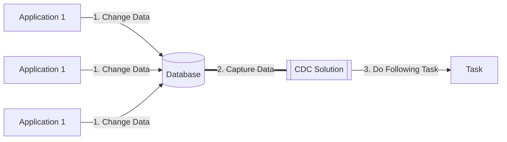
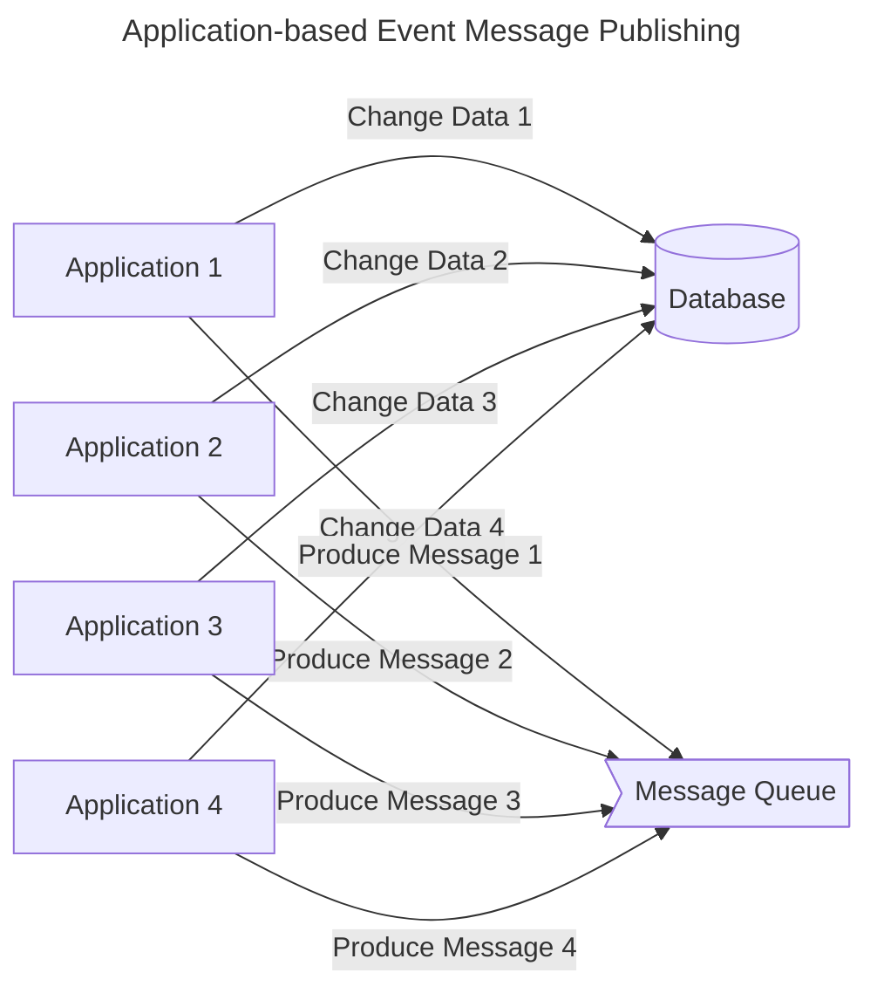
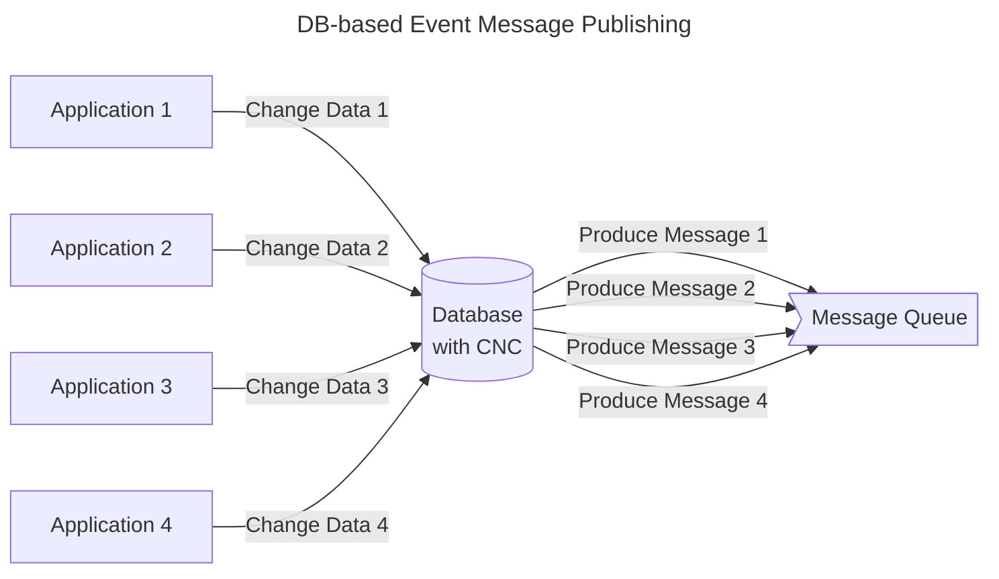

## CDC (Change Data Capture)

- CDC(Change Data Capture)는 **DB에 있는 데이터에 대한 변경을 감지해 필요한 후속 처리(데이터 전송/공유 등)를 자동화하는 기법**을 통칭합니다.
    - 데이터베이스 안에서 일어나는 모든 변화를 감지하고, 이를 각각의 이벤트로 기록하며 이벤트 스트림으로 전달합니다.

### CDC의 활용 사례

1. **마이크로서비스 통합** : CDC를 통해 데이터 변경 사항을 레거시 시스템에서 마이크로서비스 기반 애플리케이션으로 원활하게 전송할 수 있습니다.
    - 마이크로서비스를 기존의 모놀리식 애플리케이션과 동기화하여, migration 시 발생할 수 있는 data 불일치 문제를 해결합니다.
    
2. **데이터 복제** : 데이터베이스, 데이터 레이크, 데이터 웨어하우스 등의 저장소에 데이터를 복제하여, 각 리소스가 최신 버전 데이터를 보유하도록 할 수 있습니다.
    - data가 분산되어 있거나 data silo 문제가 있는 경우에도, 여러 부서가 동일한 최신 데이터에 접근하도록 지원할 수 있습니다.
        - data silo : 데이터가 격리되어 특정 조직/부서/단위에서만 정보 접근 및 공유가 가능하여 다른 조직/부서/단위에서는 데이터가 격리되는 현상.
            - data silo는 부서 간의 단절을 유발하는 등, 기업에 부정적인 영향을 끼칩니다.

3. **분석 대시보드** : CDC는 비즈니스 인텔리전스와 같은 목적으로 데이터 변경 사항을 분석 대시보드에 제공하여, 의사결정을 도울 수 있습니다.

4. **감사 및 컴플라이언스** : 감사 또는 보관 요건에 따라 특정 데이터의 변경 이력을 저장할 수 있습니다.
   - 엄격한 데이터 컴플라이언스 요건을 준수하고 규정 미준수에 대한 엄격한 처벌을 피하려면 데이터 변경 이력을 저장하는 것이 중요합니다.

5. **캐시 무효화** : 캐시에서 오래된 항목을 교체하거나 제거하여 최신 버전을 표시할 수 있습니다.

6. **CQRS 모델 업데이트** : CDC를 사용하여 CQRS(Command Query Responsibility Separation) 읽기 모델을 기본 모델과 동기화할 수 있습니다.

7. **전체 Text 검색** : CDC를 사용하면 전체 텍스트 검색 인덱스를 데이터베이스와 자동으로 동기화할 수 있습니다.

---

## Event 기반 Architecture에서 CDC를 사용하는 이유

- data 변경에 대한 event message는 Application 기반으로 발행할 수도 있고, DB 기반으로 발행할 수도 있습니다.
    - CDC는 DB 기반으로 message를 발행하는 쪽에 속합니다.

- CDC는 DB 기반으로 message를 발행하기 때문에, **data 변경에 의해 발행되는 모든 event의 관리 지점을 data로 모을 수 있다는 장점**이 있습니다.
    - CUD(Create, Update, Delete)에 의해 데이터가 수정되면 자동으로 이벤트가 발행되기 때문입니다.

- **Application 기반 Message 발행 방식**은 **병렬** 형태로 data를 처리합니다.
    - event가 발생했을 때, application이 DB에 변경 사항도 반영하고 message queue에 message도 등록합니다.
        - DB CUD와 message를 등록하는 두 가지 작업을 application이 주체가 되어 모두 처리(dual write)합니다.
    - 해당 data를 변경(CUD)하는 곳은 application 상에 무수히 많이 존재하므로, event message를 발행하는 logic도 data를 변경하는 모든 곳에 추가해줘야 합니다.
        - DB에 CUD를 하는 logic이 API, Batch, Worker 등 여러가지가 있다면, 모든 logic에 event message 발행 과정을 추가해야 하며, 개발자가 놓치면 message 발행이 누락됩니다.

- **DB 기반 Message 발행 방식**은 **직렬** 형태로 data를 처리합니다.
    - event가 발생했을 때, **application은 DB에 변경 사항을 반영**하고, **message queue에 message 등록은 DB 변경 감지 도구(CDC solution)가** 합니다.
        - CDC solution이 DB 수준에서 data 변경을 감지하고, 변경된 data에 대한 message를 생성하여 queue에 등록합니다.
    - DB 수준에서는 특정 data가 변경되는 지점을 하나로 관리할 수 있으므로, event message를 발행하는 곳도 단 한 곳이 됩니다.

- event 기반 architecture에서 장애 조치, CS 건 처리 등의 이유로 **DB의 data를 수기로 변경(DDL 직접 실행)해야하는 경우**에도, CDC를 통한 event 발행 기능은 유용하게 사용됩니다.
    - 어떤 data를 수기로 수정하는 경우, 해당 data에 관련된 event를 application logic을 전부 점검하여, logic에 포함된 event를 모두 직접 발행해줘야 합니다.
        - 일반적으로 이벤트는 어플리케이션을 통해 발행되므로, 틀어지거나 수정된 데이터를 보정한 event 내역 또한 어플리케이션 logic에서 찾아, 이벤트 trigger API를 호출하여 이벤트를 직접 발행해야 합니다.
    - 그러나 만약 **data가 수정될 때 자동으로 관련 event가 발행**된다면, application logic을 확인하지 않아도 누락 없이 처리가 가능하게 됩니다.
        - CDC를 통해 data 변경을 감지하고, event를 자동으로 발행해주기 때문입니다.

### Event 기반 Architecture에 CDC를 적용하는 경우 생기는 단점

- 애플리케이션 기반으로 message가 발행되는 것이 아니어서 생기는 단점도 있습니다.
    - 따라서 CDC를 맹목적으로 적용해서는 안 되며, 득과 실을 잘 따져보아야 합니다.

1. **단일 table에 대한 변경 사항만 capture가 가능**합니다.
    - table에 있는 row(또는 collection에 있는 document) 레벨에서의 변경 사항을 캡처하기 때문에, 여러 table(또는 collection)에 대한 변경 사항을 하나의 message(Kafka topic 등)에 담을 수 없습니다.
    - DB에 담기지 않는 데이터 변경 사항은 Kafka message에 포함할 수 없습니다.

2. 메시지를 직접 produce하는 것이 아니기 때문에, 변경된 데이터를 담을 메시지 스키마의 커스터마이징이 제한적입니다.
    - 예를 들어, operation type 구분을 `C`, `U`, `D` 3개로만 할 수 있습니다.
    
3. CDC 구축 및 관리에 비용이 어느 정도 들 수 있습니다.
    - 경우에 따라 DB에 부하가 추가될 수도 있습니다.

---

## CDC 작동 방식

- CDC는 DB data의 변경 사항을 감지하는 기법을 통칭하는 용어일 뿐이며, 이를 실제로 구현할 때는 여러가지 방식을 사용할 수 있습니다.
    - 보통은 직접 구현하여 사용하지는 않고, Debezium, Apache NiFi, Oracle GoldenGate, Maxwell 등의 CDC Solution 제품을 사용합니다.

- 상황에 따라 여러 방식을 조합하여 사용하는 하이브리드 방식도 존재합니다.
    - 로그 기반과 트리거 기반을 함께 사용하여 장점을 취하는 경우가 있습니다.
    - 시스템 요구 사항과 성능 특성에 따라 적절한 방식을 선택해야 합니다.

### Log 기반 CDC (Log-based Change Data Capture)

- Log 기반 CDC는 **데이터베이스의 트랜잭션 로그를 읽어서 데이터 변경 사항을 캡처하는 방식**을 사용하며, 가장 널리 사용되는 방식입니다.
    - 데이터베이스는 모든 트랜잭션 변경사항(삽입, 수정, 삭제)을 트랜잭션 로그에 순차적으로 기록합니다.
    - Log 기반 CDC는 이 트랜잭션 로그를 직접 읽어 변경 데이터를 캡처합니다.
    - 이는 데이터베이스 테이블을 직접 조회하지 않고도 변경 사항을 파악할 수 있게 해줍니다.

- Log 기반 CDC는 데이터베이스의 트랜잭션 로그를 직접 읽어 실시간으로 변경 사항을 추적하므로, 데이터베이스 성능 저하 없이 정확한 데이터 동기화가 가능합니다.
    1. **데이터베이스 성능에 미치는 영향이 최소화**됩니다.
        - 트랜잭션 로그를 읽는 방식이므로 데이터베이스 테이블에 직접적인 쿼리를 실행하지 않습니다.
    2. **실시간에 가까운 데이터 동기화가 가능**합니다.
        - 변경 사항이 발생하는 즉시 트랜잭션 로그에 기록되므로, 이를 실시간으로 캡처하여 처리할 수 있습니다.
    3. **데이터 정확성이 보장**됩니다.
        - 트랜잭션 로그는 모든 변경 사항을 정확한 순서로 기록하므로, 데이터의 일관성과 무결성을 유지할 수 있습니다.

- 모든 환경에서 Log 기반 CDC를 사용할 수 있는 것은 아닙니다.
    - 특히 클라우드 기반 데이터베이스나 호스팅된 데이터베이스 솔루션에서는 트랜잭션 로그에 대한 접근이 제한될 수 있으며, 이런 경우에는 다른 CDC 방식을 고려해야 합니다.

- Log 기반 CDC는 **대규모 트랜잭션이 발생하는 미션 크리티컬한 시스템에서 유용**합니다.
    - 예를 들어, 실시간 데이터 복제, 데이터 웨어하우스 동기화, 마이크로서비스 간 데이터 동기화 등에 활용될 수 있습니다.
    - 또는 금융 시스템(은행, 증권 등), 대규모 전자 상거래 플랫폼, 실시간 데이터 분석 시스템, 대규모 트랜잭션이 발생하는 엔터프라이즈 시스템 등의 **고성능이 요구되는 중요 시스템**에서 사용됩니다.

### Trigger 기반 CDC (Trigger-based Change Data Capture)

- Trigger 기반 CDC는 **데이터베이스의 변경 사항을 실시간으로 감지하고 기록하는 방식**입니다.
    - 데이터베이스에 변경이 발생할 때마다 **트리거가 자동으로 실행되어 해당 변경 내용을 별도의 테이블에 저장**합니다.

- Trigger 기반 CDC는 실시간 데이터 추적이 필요하지만 시스템 성능에 큰 제약이 없는 환경에서 효과적입니다.
    - **실시간 데이터 동기화**가 필요한 경우 : 데이터베이스의 변경 사항을 즉시 다른 시스템이나 애플리케이션에 반영해야 하는 상황에서 적합합니다.
        - 예를 들어, 실시간 데이터 웨어하우스 동기화나 마이크로서비스 간 데이터 일관성 유지에 활용됩니다.
    - 시스템이 **충분한 처리 용량을 보유**한 경우 : 트리거로 인한 추가적인 프로세싱 오버헤드를 처리할 수 있는 충분한 CPU, 메모리, 스토리지 용량이 확보된 환경을 의미합니다.
    - 데이터의 **완전한 감사 추적**이 필요한 경우 : 규제 준수나 보안 요구 사항으로 인해 모든 데이터 변경 사항의 이력을 상세하게 추적해야 하는 상황에 적합합니다.
        - 금융 거래나 중요 비즈니스 데이터의 변경 이력 관리에 특히 유용합니다.

- Trigger 기반 CDC는 고성능 트랜잭션과 대용량 데이터 처리가 필요하거나 시스템 리소스가 제한적인 환경에서는 적합하지 않습니다.
    - 고성능의 트랜잭션 처리가 필요한 경우 : 초당 수천 건 이상의 트랜잭션이 발생하는 환경에서는 **트리거로 인한 지연**이 시스템 전반의 응답 시간에 부정적인 영향을 미칩니다.
        - 예를 들어, 실시간 결제 시스템이나 고빈도 거래 시스템에서는 적합하지 않습니다.
    - 시스템 리소스가 제한적인 경우 : 시스템의 CPU, 메모리, 디스크 I/O 등의 리소스의 사용률이 이미 높은 상황에서는 **트리거로 인한 추가적인 리소스 소비**가 시스템 안정성을 떨어뜨립니다.
        - 특히 클라우드 환경에서 비용 효율성을 고려해야 하는 경우 부담이 될 수 있습니다.
    - 대용량 데이터 처리가 필요한 환경 : 대규모 데이터 마이그레이션이나 배치 처리 작업이 빈번한 환경에서는 트리거가 **병목 현상**을 일으킬 수 있습니다.
        - 수백만 건 이상의 레코드를 처리해야 하는 경우, 각 변경마다 실행되는 트리거는 전체 처리 시간을 크게 증가시킵니다.
    - 기존 애플리케이션에 트리거 추가가 제한되는 경우 : 레거시 시스템이나 보안 정책상 데이터베이스 수정이 제한된 환경, 또는 데이터베이스 관리자 권한이 제한된 상황에서는 트리거 구현 자체가 불가능합니다.
        - 이런 경우 로그 기반 CDC와 같은 대안을 고려해야 합니다.

#### Trigger 기반 CDC의 두 가지 구현 방법

1. **전체 변경 기록 방식** : 모든 변경 사항의 완전한 기록을 유지하기 위해, 변경된 데이터의 이전 상태와 새로운 상태를 모두 저장합니다.
    - 변경의 전체 기록에 액세스할 수 있지만, 원본 트랜잭션에 대한 데이터 양이 두 배로 증가합니다.
    - 데이터 조회가 간단하고 직관적입니다.
        - 모든 변경 데이터가 별도의 테이블에 저장되므로 검색이 간단합니다.

2. **최소 로깅 방식** : 변경된 행의 식별 키와 수행된 작업 유형(Create, Update, Delete)만을 기록합니다.
    - 저장 공간 사용이 효율적이고, 시스템 부하가 상대적으로 낮습니다.
        - 원본 트랜잭션에 미치는 영향을 최소화할 수 있습니다.
   - 데이터를 추출할 때는 변경 테이블과 기본 테이블 간의 조인이 필요하므로 추가 리소스를 사용합니다.
        - 키와 작업 유형만으로는 전체 변경 기록을 재구성하는 데 충분하지 않기 때문에, 전체 변경 내용을 확인하기 위해서는 원본 테이블과의 조인이 필요합니다.

### Timestamp 기반 CDC (Timestamp-based Change Data Capture)

- 타임스탬프 기반 CDC는 **데이터베이스의 각 레코드에 마지막 수정 시간을 기록하여 변경 사항을 추적하는 방식**입니다.
    - 데이터베이스의 각 테이블에는 `LAST_MODIFIED`와 같은 타임스탬프 열이 포함되어 있으며, 레코드가 생성되거나 수정될 때마다 이 값이 자동으로 업데이트됩니다.
    - CDC 프로세스는 이전 추출 시점 이후의 타임스탬프를 가진 레코드들을 주기적으로 조회하여 변경 사항을 식별합니다.

- 타임스탬프 기반 CDC는 **구현이 단순**하고 **기존 데이터베이스 구조에 최소한의 변경만으로 적용**할 수 있습니다.
    - 소규모 시스템이나 변경 빈도가 낮은 환경에서 효과적입니다.

- 타임스탬프 기반 CDC에는 중요한 한계점들이 존재하기 때문에, 신중히 사용해야 합니다.
    1. 삭제된 데이터를 감지할 수 없습니다.
        - 레코드가 삭제되면 해당 타임스탬프도 함께 사라지기 때문에, 삭제 작업을 추적할 방법이 없습니다.
    2. 트랜잭션의 정확한 순서를 보장할 수 없습니다.
        - 동시에 여러 변경이 발생하는 경우, 타임스탬프만으로는 정확한 트랜잭션 순서를 파악하기 어렵습니다.
    3. 시스템 시간 동기화 문제가 발생할 수 있습니다.
        - 여러 서버나 노드가 관련된 경우, 시간 차이로 인해 데이터 불일치가 발생할 수 있습니다.

- 타임스탬프 기반 CDC는 소규모 시스템의 간단한 데이터 변경 추적에 적합합니다.
    - **단순한 감사 추적**이 필요한 경우 : 기본적인 데이터 변경 이력 추적이 필요한 시스템에서 효과적입니다.
        - 사용자 프로필 변경 이력이나 일반적인 문서 수정 이력을 추적하는 경우에 적합합니다.
    - **삭제 작업 추적이 중요하지 않은 환경** : 주로 데이터 추가와 수정이 중심이 되는 시스템에 적합합니다.
        - 로그 데이터 수집이나 센서 데이터 기록과 같이 삭제가 거의 발생하지 않는 시스템에서 효과적입니다.
    - 실시간성보다는 **주기적인 데이터 동기화**가 필요한 경우 : 일별 또는 주별 데이터 동기화가 충분한 환경에서 유용합니다.
        - 분석용 데이터 웨어하우스 업데이트나 정기적인 리포트 생성 시스템에 적합합니다.
    - 시스템 리소스가 제한적이어서 **경량화된 솔루션**이 필요한 경우 : 임베디드 시스템이나 소규모 애플리케이션과 같이 리소스가 제한된 환경에서 효율적으로 작동합니다.
        - 단순한 타임스탬프 컬럼만으로 구현이 가능하기 때문입니다.

- 타임스탬프 기반 CDC는 정확한 순서와 실시간성이 중요하거나 데이터 삭제 추적이 필요한 대규모 시스템에는 부적합합니다.
    - 정확한 트랜잭션 순서가 중요한 경우 : 금융 거래나 재고 관리 시스템과 같이 정확한 순서가 중요한 환경에서는 **타임스탬프만으로는 정확한 순서를 보장할 수 없어** 부적합합니다.
        - millisecond 단위의 동시 트랜잭션이 발생할 경우 순서가 뒤바뀔 수 있습니다.
    - 삭제된 데이터의 추적이 필수적인 경우 : 규제 준수나 법적 요구 사항으로 **데이터 삭제 이력을 반드시 추적해야 하는 시스템에서는 사용할 수 없습니다.**
        - 예를 들어, 의료 기록 시스템이나 금융 거래 시스템에서는 부적합합니다.
    - 실시간 데이터 동기화가 필요한 경우 : 실시간 알림 시스템이나 즉각적인 데이터 복제가 필요한 환경에서는 **타임스탬프 기반 방식의 지연 시간**이 허용되지 않습니다.
        - 예를 들어, 실시간 모니터링 시스템이나 즉각적인 장애 감지가 필요한 시스템에는 적합하지 않습니다.
    - 고가용성이 요구되는 미션 크리티컬한 시스템 : 24/7 운영되는 핵심 비즈니스 시스템이나 대규모 트랜잭션 처리가 필요한 환경에서는 타임스탬프 기반 CDC의 한계로 인해 **신뢰성 있는 데이터 동기화를 보장할 수 없습니다.**
        - 예를 들어, 대규모 전자 상거래 플랫폼이나 글로벌 배송 추적 시스템에는 부적합합니다.

### 차이 기반 CDC (Difference-based Change Data Capture)

- 차이 기반 CDC는 **데이터베이스의 두 시점 간 스냅샷을 비교하여 변경 사항을 식별하는 방식**입니다.
    - **가장 단순한 형태의 CDC**로, 두 스냅샷 간의 차이를 전체적으로 비교하여 어떤 데이터가 추가, 수정, 또는 삭제되었는지 파악합니다.

- 차이 기반 CDC는 **구현이 매우 직관적**입니다.
    - 소스 데이터의 현재 상태와 이전 상태를 비교하여 변경 사항을 감지하므로, 특별한 데이터베이스 기능이나 복잡한 설정이 필요하지 않습니다.
    - 그러나 이러한 단순성 때문에 여러 제약 사항이 있습니다.

- 차이 기반 CDC는  데이터 볼륨이 작고 변경 빈도가 낮은 환경에서만 실용적입니다.
    - 모든 데이터를 스캔해야 하므로 **상당한 시스템 리소스를 소비**합니다.
        - 각 비교 시점마다 전체 데이터세트를 읽어야 하기 때문에, 대규모 데이터베이스에서는 성능 저하가 발생합니다.
    - 또한 스냅샷 간의 간격 동안 발생한 중간 변경 사항을 포착할 수 없어, 세밀한 변경 이력 추적이 어렵습니다.
    - 따라서 소규모 구성 데이터베이스나 참조 데이터의 변경 사항을 추적하는 경우에 적합합니다.
    - 그러나 트랜잭션의 정확성이 중요하거나 실시간 변경 감지가 필요한 시스템에서는 사용해선 안 됩니다.
    

---

## CDC Solution 비교 : Debezium, Apache NiFi, Oracle GoldenGate, Maxwell

1. **Debezium**은 Kafka 생태계와의 강력한 통합과 다양한 데이터베이스 지원이 강점이며, 대규모 분산 환경에 적합합니다.
2. **Apache NiFi**는 광범위한 데이터 소스 지원과 시각적 관리 도구를 제공하여 복잡한 데이터 파이프라인 구성에 탁월합니다.
3. **Oracle GoldenGate**는 엔터프라이즈급 안정성과 성능을 제공하며, 특히 Oracle 환경에서 강력한 기능을 발휘합니다.
4. **Maxwell**은 MySQL에 특화된 간단한 구조로, 빠른 구축과 간단한 데이터 파이프라인이 필요한 소규모 프로젝트에 적합합니다.

### CDC 방식

| 도구 | CDC 방식 | 특징 | 장단점 |
| --- | --- | --- | --- |
| **Debezium** | 로그 기반 CDC | MySQL binlog, PostgreSQL WAL 등 데이터베이스의 바이너리 로그를 직접 읽어 변경 사항 포착 | + 데이터베이스 성능 영향 최소화 + 실시간 변경 감지 - 데이터베이스별 로그 구조 이해 필요 |
| **Apache NiFi** | 폴링 방식과 에이전트 기반 CDC | 폴링 : 정기적 데이터베이스 조회로 변경 확인 에이전트 : 데이터베이스에 설치된 에이전트가 변경 감지 | + 다양한 데이터 소스 지원 + 구현 방식 선택 가능 - 폴링 방식의 경우 실시간성 떨어짐 |
| **Oracle GoldenGate** | 로그 기반 CDC와 트리거 기반 CDC | LogMiner : 리두 로그에서 변경 추출 트리거 : 데이터베이스 트리거로 변경 감지 XStream : 실시간 변경 스트리밍 | + 엔터프라이즈급 안정성 + 다양한 구현 옵션 - 상대적으로 높은 비용 - 복잡한 설정 |
| **Maxwell** | 단순 로그 기반 CDC | MySQL 바이너리 로그만을 대상으로 변경 사항을 JSON으로 변환 | + 설정 간단 + 직관적 사용 - MySQL에만 특화 - 제한적 기능 |

### 성능

| 도구 | 성능 아키텍처 | 처리 용량 및 확장성 | 튜닝 및 최적화 |
| --- | --- | --- | --- |
| **Debezium** | Kafka 기반 분산 처리 | 대규모 데이터 처리 가능 초당 수만 건 이상 처리 수평적 확장 지원 | Kafka 환경 최적화 커넥터 성능 조정 배치 크기 조절 가능 |
| **Apache NiFi** | 메모리 기반 처리 엔진 | 유연한 처리량 조절 백프레셔 메커니즘 지원 자원 사용량 제어 | 메모리 관리 최적화 프로세서 스케줄링 버퍼 크기 조정 |
| **Oracle GoldenGate** | 엔터프라이즈급 처리 엔진 | 대용량 트랜잭션 처리 초고속 데이터 복제 글로벌 규모 확장 | 상세 성능 튜닝 병렬 처리 최적화 네트워크 최적화 |
| **Maxwell** | 단일 프로세스 구조 | 소규모 데이터 처리 제한된 처리량 수직적 확장만 가능 | 기본적 설정 조정 제한된 튜닝 옵션 단순한 구성 변경 |

### 데이터베이스 지원

| 도구 | 지원 데이터베이스 | 특징 | 고려 사항 |
| --- | --- | --- | --- |
| **Debezium** | 관계형 DB : MySQL, PostgreSQL, Oracle, SQL Server, Db2 NoSQL : MongoDB, Cassandra | 폭넓은 데이터베이스 생태계 지원 오픈소스/상용 DB 모두 지원 | 데이터베이스별 커넥터 구성 방식 상이 각 DB 버전별 호환성 확인 필요 |
| **Apache NiFi** | 관계형 DB : 대부분의 RDBMS NoSQL : MongoDB, Cassandra 등 기타 : 파일 시스템, 메시징 시스템 등 | 200여 개의 다양한 데이터 소스 연결 프로세서 기반의 유연한 연동 | 데이터 소스별 프로세서 설정 방식 학습 필요 연결 유형에 따른 성능 차이 존재 |
| **Oracle GoldenGate** | 상용 DB : Oracle, SQL Server, DB2 오픈소스 DB : MySQL, PostgreSQL 클라우드 DB : Amazon RDS, Azure DB | 엔터프라이즈급 DB 지원 이기종 DB 간 복제 지원 | 라이선스 비용 고려 필요 DB 버전별 최적화 설정 필요 |
| **Maxwell** | MySQL, MariaDB | MySQL 생태계에 특화 단순하고 명확한 지원 범위 | 제한적인 DB 지원 MySQL 기반 시스템에만 적합 |

### 확장 가능성

| 도구 | 확장 아키텍처 | 주요 특징 | 확장성 수준 |
| --- | --- | --- | --- |
| **Debezium** | Kafka 기반 분산 아키텍처 | Kafka Connect 프레임워크 통합 분산 처리 및 장애 복구 지원 컨테이너 기반 배포 용이 | 높음 대규모 데이터 처리 가능 처리량에 따른 유연한 확장 엔터프라이즈급 워크로드 지원 |
| **Apache NiFi** | 클러스터 기반 분산 시스템 | 수평적 노드 확장 동적 워크로드 조정 중앙 집중식 관리 지원 | 높음 클러스터 노드 동적 추가 자동 로드 밸런싱 실시간 처리량 조정 |
| **Oracle GoldenGate** | 엔터프라이즈급 분산 구조 | 양방향 복제 지원 다중 마스터 구성 복잡한 토폴로지 구현 | 매우 높음 글로벌 규모 확장 가능 다양한 복제 토폴로지 고가용성 아키텍처 |
| **Maxwell** | 단일 프로세스 구조 | 단순한 아키텍처 제한된 확장 옵션 경량화된 구성 | 제한적 소규모 환경에 적합 수직적 확장만 가능 단일 장애점 존재 |

### 가용성

| 도구 | 고가용성 아키텍처 | 장애 대응 기능 | 가용성 수준 |
| --- | --- | --- | --- |
| **Debezium** | Kafka 기반 분산 시스템 | 자동 장애 감지 및 복구 분산 복제를 통한 데이터 안정성 상태 추적 및 복구 지원 | 높음 Kafka의 고가용성 활용 무중단 운영 가능 자동화된 복구 체계 |
| **Apache NiFi** | Zero Master 클러스터 | 노드 간 자동 장애 조치 분산 작업 큐 관리 실시간 상태 모니터링 | 매우 높음 단일 장애점 없음 자동 워크로드 재분배 무중단 클러스터 운영 |
| **Oracle GoldenGate** | 엔터프라이즈급 고가용성 | 내장된 모니터링 시스템 실시간 장애 감지 자동화된 복구 프로세스 | 매우 높음 엔터프라이즈급 안정성 포괄적 모니터링 자동화된 장애 관리 |
| **Maxwell** | 단일 프로세스 구조 | 기본적인 오류 처리 수동 복구 필요 제한된 모니터링 | 제한적 단일 장애점 존재 수동 개입 필요 별도 HA 구성 필요 |

### 라이센스

각 도구의 라이선스 정보와 상업적 이용 가능성을 다음과 같이 표로 정리했습니다.

| 도구 | 라이선스 유형 | 주요 라이선스 조항 | 상업적 이용 가능성 |
| --- | --- | --- | --- |
| **Debezium** | Apache License 2.0 (오픈소스) | 소스 코드 수정 및 배포 자유 특허 사용 권한 포함 저작권 고지 필수 | 가능 무료 상업적 이용 재배포 및 수정 허용 별도 라이선스 비용 없음 |
| **Apache NiFi** | Apache License 2.0 (오픈소스) | 자유로운 사용 및 수정 2차 저작물 작성 가능 라이선스 및 저작권 표시 필수 | 가능 제한 없는 상업적 이용 독점 소프트웨어 포함 가능 무료 사용 |
| **Oracle GoldenGate** | 상용 라이선스 | Oracle 계약 조건 적용 사용자 수 기반 과금 기술 지원 포함 | 제한적 라이선스 구매 필요 사용량 기반 비용 지불 계약 조건 준수 필요 |
| **Maxwell** | MIT License (오픈소스) | 최소한의 제약 조건 저작권 표시 필요 책임 제한 조항 포함 | 가능 자유로운 상업적 이용 최소한의 제약 무료 사용 |

### 구축 복잡도

| 도구 | 복잡도 수준 | 구축 요구사항 | 자원 및 전문성 필요성 |
| --- | --- | --- | --- |
| **Debezium** | 중간 | Kafka 인프라 구축 필수 커넥터별 상세 설정 모니터링 환경 구성 | Kafka 운영 전문성 데이터베이스 시스템 이해 약 1-2주 초기 구축 기간 |
| **Apache NiFi** | 높음 | 클러스터 환경 구성 복잡한 데이터 흐름 설계 보안 설정 및 최적화 | 데이터 파이프라인 전문성 시스템 아키텍처 이해 약 2-3주 초기 구축 기간 |
| **Oracle GoldenGate** | 매우 높음 | Oracle 환경 최적화 상세한 복제 설정 성능 튜닝 필수 | Oracle DBA 수준 전문성 엔터프라이즈 운영 경험 약 3-4주 초기 구축 기간 |
| **Maxwell** | 낮음 | 기본 MySQL 설정 단순한 구성 파일 최소한의 모니터링 | 기본적인 MySQL 지식 최소한의 운영 경험 약 1-3일 초기 구축 기간 |

### 모니터링 및 관리 기능

| 도구 | 모니터링 도구 | 관리 기능 | 운영 편의성 |
| --- | --- | --- | --- |
| **Debezium** | Kafka Connect 모니터링 JMX 메트릭스 커넥터 상태 추적 | 웹 기반 커넥터 관리 구성 변경 API 제공 로그 집계 시스템 연동 | 중간 표준화된 모니터링 통합 관리 도구 활용 기존 Kafka 도구 활용 |
| **Apache NiFi** | 실시간 웹 UI 대시보드 프로세스 그룹 모니터링 세부 메트릭스 시각화 | 드래그 앤 드롭 인터페이스 버전 관리 통합 접근 제어 관리 | 높음 직관적 인터페이스 실시간 상태 확인 중앙집중식 관리 |
| **Oracle GoldenGate** | 전용 관리 콘솔 상세 성능 메트릭스 알림 시스템 | 복제 토폴로지 관리 성능 튜닝 도구 문제 해결 가이드 | 매우 높음 포괄적 관리 도구 전문적 모니터링 자동화된 운영 |
| **Maxwell** | 기본 로깅 기능 표준 출력 로그 제한된 상태 정보 | 설정 파일 기반 관리 수동 프로세스 제어 기본적 상태 확인 | 낮음 제한된 모니터링 외부 도구 필요 수동 관리 필요 |

### 커뮤니티

| 도구 | 커뮤니티 규모 | 지원 체계 | 리소스 접근성 |
| --- | --- | --- | --- |
| **Debezium** | 대규모 활성 커뮤니티 | Red Hat 공식 지원 기술 문서 지속 업데이트 정기적인 릴리스 관리 | 우수 풍부한 기술 문서 활발한 이슈 해결 다수의 실제 사례 공유 |
| **Apache NiFi** | 대규모 활성 커뮤니티 | Apache 재단 공식 지원 체계적인 거버넌스 커뮤니티 주도 개발 | 우수 상세한 개발 가이드 다양한 사용 사례 신속한 커뮤니티 응답 |
| **Oracle GoldenGate** | 전문가 중심 커뮤니티 | Oracle 공식 기술 지원 전담 지원 인력 SLA 기반 서비스 | 매우 우수 전문적 기술 지원 공식 교육 프로그램 보장된 문제 해결 |
| **Maxwell** | 소규모 커뮤니티 | 자발적 커뮤니티 지원 제한적 문서화 비정기적 업데이트 | 제한적 기본적 사용 문서 제한된 사례 공유 느린 이슈 해결 |

---

## Reference

- <https://ko.wikipedia.org/wiki/%EB%B3%80%EA%B2%BD_%EB%8D%B0%EC%9D%B4%ED%84%B0_%EC%BA%A1%EC%B2%98>
- <https://sihyung92.oopy.io/architecture/cdc#7fd9d64f-c2b9-4878-952a-67dc337544df>
- <https://sanggi-jayg.tistory.com/entry/CDC-Change-Data-Capture>
- <https://tillog.netlify.app/posts/cdc>
