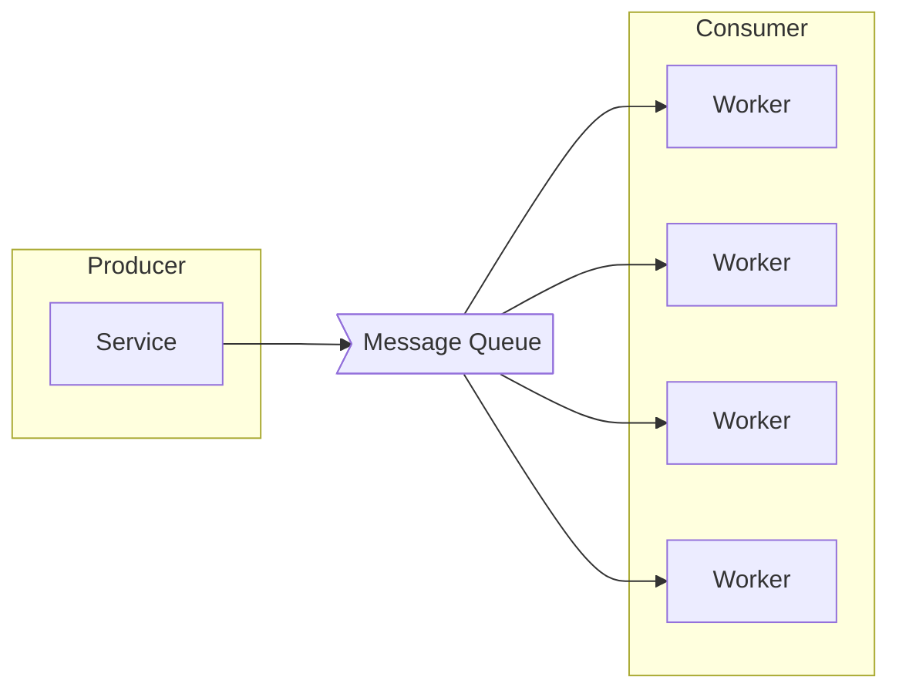

## Message Queue : 시스템 간 비동기 통신을 위한 메시지 중개 미들웨어

- "Message Queue"에서 Queue란 선입선출(First in First out) 구조를 가진 자료 구조입니다.
    - Queue 는 2개의 끝을 가지며 각각은 입구와 출구입니다.
    - 새로운 데이터는 입구로 들어오고 나가는 데이터는 출구에서 나갑니다.

- 따라서 Message Queue란, Queue라는 자료 구조를 채택해서 메세지를 전달하는 시스템입니다.

- Message Queue에는 Message Queue 외에도 **Producer**와 **Consumer**가 있습니다.
    - Message Queue를 통해 메세지를 전달하려면, 메세지를 전달하는 부분과 메세지를 받는 부분이 필요합니다.
    - **메세지를 발행하고 전달하는 부분을 Producer**라고 하고, **메세지를 받아서 소비하는 부분을 Consumer**라고 합니다.
    - Message Queue는 Producer와 Consumer 사이에서 메세지 전달 역할을 하는 매개체입니다.

- 메세지 큐는 **MSA(Microservice Architecture) System**의 전반적인 **안정성, 확장성, 유연성**을 높이는 데 핵심적인 역할을 합니다.
    1. **서비스 간 느슨한 결합(Loose Coupling)** : 서비스 간 의존성이 낮아집니다.
        - 마이크로서비스들이 직접 통신하지 않고 메시지 큐를 통해 비동기적으로 통신하기 때문입니다.
        - 한 서비스의 장애가 다른 서비스로 전파되는 것을 방지할 수 있습니다.
    2. **시스템 안정성과 신뢰성** : 시스템의 안정성을 높여줍니다.
        - 일시적인 트래픽 폭주 시에도 메시지 큐가 버퍼 역할을 수행하기 때문입니다.
        - 메시지 손실 없이 reliable한 데이터 전달을 보장합니다.
    3. **확장성(Scalability)** : 서비스들을 독립적으로 확장할 수 있습니다.
        - 처리량에 따라 consumer를 동적으로 늘리거나 줄일 수 있습니다.

### MOM에 속하는 Message Queue

- MOM(Message Oriented Middleware)이란 **응용 소프트웨어 간의 비동기적 데이터 통신을 위한 소프트웨어**입니다.
    - MOM은 **비동기적인(asynchronous) 방식**을 이용해서 프로세스 간의 데이터를 주고 받는 기능을 위한 시스템입니다.

- 메세지를 전달하는 과정에서 **message를 보관, 라우팅, 변환**할 수 있다는 장점을 가집니다.
    - **보관** : 메세지의 백업 기능을 유지함으로써 지속성을 제공하며, 이 덕분에 송수신 측은 동시에 네트워크 연결을 유지할 필요가 없습니다.
    - **라우팅** : 미들웨어 계층 자신이 직접 메세지 라우팅을 수행하기 때문에, 하나의 메세지를 여러 수신자에게 배포할 수 있습니다.
    - **변환** : 송수신 측의 요구에 따라 전달하는 메세지를 변환할 수 있습니다.

- 메세지 큐는 메세지 지향 미들웨어(MOM)를 구현한 시스템입니다.

### Message Broker vs Event Broker : Data 운반 방식의 차이

- 메세지 큐가 메세지 혹은 이벤트가 송신되고 수신되는 하나의 통신 통로라고 한다면, **브로커는 메세지 큐에 메세지 혹은 이벤트를 넣어주고 중개하는 역할을 하는 주체**입니다.
    - message queue와 broker는 엄연히 다른 개념입니다.
        - 하지만 broker가 하는 일이 곧 message queue service가 하는 일이기 때문에, 메세지 큐 자체가 메세지 브로커 혹은 이벤트 브로커라고 이해하여도 무방합니다.

#### Message Broker

- 메세지 브로커는 **Producer가 생산한 메세지를 메세지 큐에 저장**하고, **저장된 메세지를 Consumer가 가져갈 수 있도록** 합니다.
- 메세지 브로커는 Consumer가 메세지 큐에서 데이터를 가져가게 되면 **짧은 시간 내에 메세지 큐에서 삭제**된다는 특징이 있습니다.
- RabbitMQ, ActiveMQ, AWS SQS, Redis 등이 Message Broker입니다.

#### Event Broker

- 이벤트 브로커가 관리하는 데이터는 message가 아니라 이벤트라고 합니다.
- 이벤트 브로커는 **메세지 브로커보다 더 많은 용량의 데이터를 처리**할 수 있습니다.
- 이벤트 브로커 방식에서는 **Consumer가 소비한 데이터를 필요한 경우 다시 소비**할 수 있습니다.
    - 메세지 브로커에서는 메세지를 Consumer가 가져가면, message를 짧은 시간 내에 삭제하기 때문에 재사용이 불가능합니다.
- 이벤트 브로커는 기본적으로 메세지 브로커의 역할을 할 수 있지만, 반대로 메세지 브로커는 이벤트 브로커의 기능을 하지 못합니다.
- Kafka, Pulsar 등이 Event Broker입니다.

---

## Message Queue의 장점

- Message Queue는 메시지를 임시로 저장하고 중개하는 미들웨어로서의 특성 때문에, 도입 시 여러 이점을 얻을 수 있습니다.

### 비동기 처리 (Asynchronous Processing)

- Producer는 **Consumer의 처리 여부와 관계없이 메시지를 큐에 전송**할 수 있습니다.
    - Producer는 메시지를 큐에 전송한 후 즉시 다른 작업을 수행할 수 있어 리소스 활용도가 높아집니다.
    - Consumer가 일시적으로 중단되거나 과부하 상태여도 메시지 전송에는 영향을 주지 않습니다.

- 동기 방식의 End-to-End 통신과 달리, **시스템 부하를 분산**시킬 수 있습니다.
    - 특히 비동기 처리 방식은 대용량 트래픽 처리에 효과적입니다.
    - 피크 시간대의 급격한 트래픽 증가도 큐를 통해 완충할 수 있습니다.
    - Consumer는 자신의 처리 능력에 맞춰 메시지를 소비할 수 있어 과부하를 방지합니다.

### 느슨한 결합 (Loose Coupling)

- **애플리케이션 간의 직접적인 의존성을 제거**합니다.
    - Producer와 Consumer는 서로의 존재를 알 필요가 없으며, 오직 메시지 형식만 알면 됩니다.
    - 새로운 Consumer를 추가하거나 제거해도 Producer의 코드 변경이 필요 없습니다.

- 각 서비스는 메시지 큐를 통해서만 통신하므로 **독립적인 확장과 수정이 가능**합니다.
    - 서비스 간 직접적인 API 호출이 없어 버전 관리가 용이합니다.
    - 한 서비스의 변경이 다른 서비스에 영향을 주지 않습니다.

- **MSA(Microservices Architecture) 구현의 핵심 요소**입니다.
    - 서비스 간 동기식 통신의 복잡성을 줄일 수 있습니다.
    - 각 마이크로서비스의 자율성과 독립성을 보장합니다.

### 탄력성 (Resilience)

- **시스템에 부하가 발생하거나 문제가 생겨도 안정적으로 작동**합니다.
    - 메시지는 큐에 안전하게 보관되어 시스템 장애 시에도 손실되지 않습니다.
    - 부하 발생 시 자동으로 메시지 처리 속도를 조절할 수 있습니다.

- **장애 발생 시 자동으로 복구**하고 정상 상태로 돌아올 수 있습니다.
    - 메시지 재전송 메커니즘을 통해 실패한 처리를 자동으로 재시도합니다.
    - Dead Letter Queue를 통해 실패한 메시지를 별도로 관리하고 처리할 수 있습니다.

- 예기치 못한 상황에서도 **서비스의 연속성을 보장**합니다.
    - Circuit Breaker 패턴과 결합하여 장애 전파를 방지합니다.
    - 부분적 장애가 전체 시스템 장애로 확대되는 것을 막습니다.

### 고가용성 (High Availability)

- **중복성(Redundancy)** : 메시지를 여러 노드에 복제하여 저장하고 장애 시 다른 노드에서 처리가 가능합니다.
    - Active-Active 또는 Active-Standby 구성으로 무중단 서비스가 가능합니다.
    - 지리적으로 분산된 데이터 센터 간에도 메시지 복제가 가능합니다.

- **내구성(Durability)** : 메시지가 안전하게 저장되어 시스템 장애 시에도 손실되지 않고 재처리가 가능합니다.
    - 디스크 저장을 통해 메모리 손실에도 메시지를 보존할 수 있습니다.
    - 메시지 저장소의 백업과 복구 메커니즘을 제공합니다.

- **장애 격리(Fault Isolation)** : 시스템 일부에 문제가 생겨도 전체 시스템은 계속 작동할 수 있습니다.
    - 각 큐는 독립적으로 운영되어 한 큐의 장애가 다른 큐에 영향을 주지 않습니다.
    - 장애 발생 시 자동으로 다른 노드로 전환되어 서비스가 중단되지 않습니다.

### 신뢰성 (Reliability)

- **메시지의 전달을 보장**합니다.
    - At-least-once, At-most-once, Exactly-once 등 다양한 전달 보증 수준을 제공합니다.
    - 메시지 손실이나 중복 전송을 방지하는 메커니즘을 제공합니다.

- **메시지 처리 상태를 추적**할 수 있습니다.
    - 메시지의 생성, 전송, 수신, 처리 각 단계를 모니터링할 수 있습니다.
    - 문제 발생 시 원인 분석과 디버깅이 용이합니다.

- 필요한 경우 **메시지 순서 보장도 가능**합니다.
    - FIFO(First-In-First-Out) 큐를 통해 메시지 순서를 유지할 수 있습니다.
    - 메시지 그룹별로 순서를 보장하는 기능을 제공합니다.

### 확장성 (Scalability)

- **Producer와 Consumer를 독립적으로 확장**할 수 있습니다.
    - 처리량에 따라 Producer나 Consumer의 인스턴스를 개별적으로 증감할 수 있습니다.
    - 로드 밸런싱을 통해 여러 Consumer 간에 작업을 분산할 수 있습니다.

- 처리량에 따라 **유연하게 시스템을 확장**할 수 있습니다.
    - 큐의 파티션 수를 조정하여 처리량을 증가시킬 수 있습니다.
    - 자동 스케일링 설정으로 트래픽 변화에 동적으로 대응할 수 있습니다.

- **수평적 확장(Horizontal Scaling)이 용이**합니다.
    - 클러스터에 노드를 추가하여 전체 시스템 용량을 늘릴 수 있습니다.
    - 샤딩을 통해 대규모 데이터를 여러 노드에 분산 저장할 수 있습니다.
    - 클라우드 환경에서 필요에 따라 리소스를 동적으로 할당할 수 있습니다.

---

## 메시지 큐 솔루션 비교 : Redis, ActiveMQ, RabbitMQ, Kafka, Pulsar

- **Apache Kafka**는 **분산 스트리밍 플랫폼**으로서, **대용량 실시간 데이터 처리**에 최적화되어 있습니다.
    - 특히 **높은 처리량과 확장성이 요구되는 빅데이터 환경**에서 좋습니다.
    - **로그 기반의 아키텍처**를 통해 **메시지의 영속성**을 보장하며, **수평적 확장이 용이**합니다.

- **Apache Pulsar**는 **차세대 메시징 시스템**으로, **스토리지와 컴퓨팅을 분리**한 현대적인 아키텍처를 제공합니다.
    - 다중 테넌트 지원과 지리적 복제 기능이 기본으로 제공되어, **글로벌 규모의 시스템에 적합**합니다.

- **RabbitMQ**는 **전통적인 메시지 브로커**로, **AMQP 프로토콜**을 기반으로 다양한 메시징 패턴을 지원합니다.
    - **마이크로서비스 아키텍처에서 널리 사용**되며, **구축과 운영이 상대적으로 간단**합니다.

- **ActiveMQ**는 **JMS 표준을 완벽하게 구현한 메시지 브로커**입니다.
    - **자바 기반 엔터프라이즈 환경**에서 안정적인 메시징 기능을 제공하며, 다양한 프로토콜을 지원합니다.

- **Redis**는 **인메모리 데이터 스토어의 pub/sub 기능**을 통해 **경량화된 메시징 기능을 제공**합니다.
    - 간단한 메시징 요구 사항에 적합하며, **높은 성능**을 제공하지만 **메시지 영속성은 제한적**입니다.

| 비교 항목 | Kafka | Pulsar | RabbitMQ | ActiveMQ | Redis |
| --- | --- | --- | --- | --- | --- |
| **메시징 모델** | 분산 로그 스트림 (이벤트를 시간 순서대로 저장하는 로그 중심 구조) | 분산 Pub/Sub (세그먼트 기반 스토리지로 유연한 토픽 관리) | AMQP 기반 브로커 (Exchange를 통한 유연한 라우팅 지원) | JMS 기반 브로커 (Point-to-Point와 Pub/Sub 모두 지원) | Pub/Sub (단순하지만 빠른 메시지 배포) |
| **최대 메시지 크기** | 무제한 (기본 1MB, 설정으로 조정 가능) | 무제한 (기본 5MB, 설정으로 조정 가능) | 제한적 (기본 128MB, 성능 고려 시 1MB 이하 권장) | 제한적 (기본 64MB, 메모리 제약 고려 필요) | 제한적 (기본 512MB, 메모리 상황에 따라 제한) |
| **순서 보장** | 파티션 단위 (파티션 내에서만 순서 보장, 키 설정으로 제어) | 파티션 단위 (파티션 내 순서 보장, 키 기반 라우팅) | FIFO 큐 단위 (큐 단위로 완벽한 순서 보장) | FIFO 큐 단위 (큐 단위 순서 보장, 우선순위 설정 가능) | 미보장 (Pub/Sub 특성상 순서 보장이 어려움) |
| **영속성** | 디스크 기반 (로그 세그먼트 파일로 저장, 보관 기간 설정) | 디스크 기반 (BookKeeper를 통한 분산 저장, 계층화된 스토리지) | 디스크 기반 (메모리와 디스크 혼합 사용, 트랜잭션 지원) | 디스크 기반 (KahaDB 저장소 사용, 트랜잭션 지원) | 메모리 기반 (RDB/AOF로 선택적 영속성 제공) |
| **최대 처리량** | ~100만 msg/s (배치 처리로 높은 처리량 달성) | ~100만 msg/s (세그먼트 기반 처리로 높은 확장성) | ~10만 msg/s (단일 노드 기준, 클러스터로 확장 가능) | ~10만 msg/s (JVM 기반으로 처리량 제한) | ~100만 msg/s (인메모리 처리로 높은 성능) |
| **지연 시간** | 밀리초 단위 (배치 처리로 인한 추가 지연 발생 가능) | 밀리초 단위 (스토리지 계층으로 인한 약간의 오버헤드) | 마이크로초 단위 (단순한 브로커 구조로 빠른 전달) | 밀리초 단위 (JVM 환경으로 인한 기본 지연 존재) | 마이크로초 단위 (인메모리 처리로 매우 빠른 응답) |
| **메시지 재전송** | 지원 (Consumer 그룹과 오프셋 관리로 제어) | 지원 (구독 위치 추적으로 유연한 재전송) | 지원 (메시지 확인 및 재전송 메커니즘) | 지원 (JMS 명세에 따른 재전송 처리) | 미지원 (메시지 전달 후 복구 불가) |
| **장애 복구** | 자동 복구 (리플리케이션, ISR 메커니즘으로 안정성 확보) | 자동 복구 (BookKeeper의 자동 복구, 지리적 복제) | 수동/자동 (클러스터 구성에 따른 복구 정책 설정) | 수동/자동 (Master-Slave 구조의 장애 복구) | 제한적 (Sentinel을 통한 감시 및 장애 조치 필요) |
| **클라이언트 언어** | 다양한 언어 지원 (공식/커뮤니티 클라이언트 풍부) | 다양한 언어 지원 (공식 클라이언트 다수 제공) | 다양한 언어 지원 (AMQP 프로토콜 기반) | Java 중심 (JMS 기반, 타 언어는 제한적) | 다양한 언어 지원 (간단한 프로토콜) |
| **운영 복잡도** | 복잡 (클러스터 관리, 주키퍼 의존성, 파티션 관리 필요) | 매우 복잡 (BookKeeper 클러스터 추가 관리, 3계층 아키텍처 운영) | 보통 (단순한 브로커 구조, 관리 UI 제공) | 보통 (JMX 기반 모니터링, 설정 관리 필요) | 단순 (단일 인스턴스 운영 가능, 최소한의 설정) |
| **리소스 사용량** | 높음 (대용량 메모리, 디스크 I/O 많음) | 높음 (BookKeeper로 인한 추가 리소스, 메모리 사용량 많음) | 중간 (메시지 처리량에 따른 적절한 메모리 사용) | 중간 (JVM 기반 메모리 관리, 디스크 사용 효율적) | 낮음 (인메모리 처리로 디스크 부하 적음) |
| **주요 활용 사례** | 로그 수집, 스트림 처리 (대규모 실시간 데이터 처리) | 글로벌 메시징 (지리적 분산 환경의 실시간 통신) | 마이크로서비스 통신 (기업 내부 시스템 연동) | 엔터프라이즈 통합 (레거시 시스템 연동) | 실시간 알림 (간단한 메시징 요구사항) |
| **필요 인프라 수준** | 높음 (대규모 클러스터, 고성능 디스크, 주키퍼 인프라 필요) | 매우 높음 (브로커/BookKeeper 클러스터, Zookeeper 등 복잡한 인프라) | 중간 (기본적인 클러스터 구성, 로드밸런서 필요) | 중간 (이중화 구성, 공유 스토리지 권장) | 낮음 (단순한 마스터-슬레이브 구성 가능) |

- **대규모 실시간 처리**가 필요한 경우 **Kafka**나 **Pulsar**를 추천합니다.
- **일반적인 기업 환경**에서는 **RabbitMQ**가 균형 잡힌 선택이 될 수 있습니다.
- **자바 기반 시스템**에서는 **ActiveMQ**를 사용할 수도 있습니다.
- **경량화된 메시징**이 필요한 경우에는 **Redis**가 적합합니다.

---

## Reference

- <https://velog.io/@choidongkuen/%EC%84%9C%EB%B2%84-%EB%A9%94%EC%84%B8%EC%A7%80-%ED%81%90Message-Queue-%EC%9D%84-%EC%95%8C%EC%95%84%EB%B3%B4%EC%9E%90>
- <https://expertinsights.com/insights/the-top-message-queue-mq-software>
