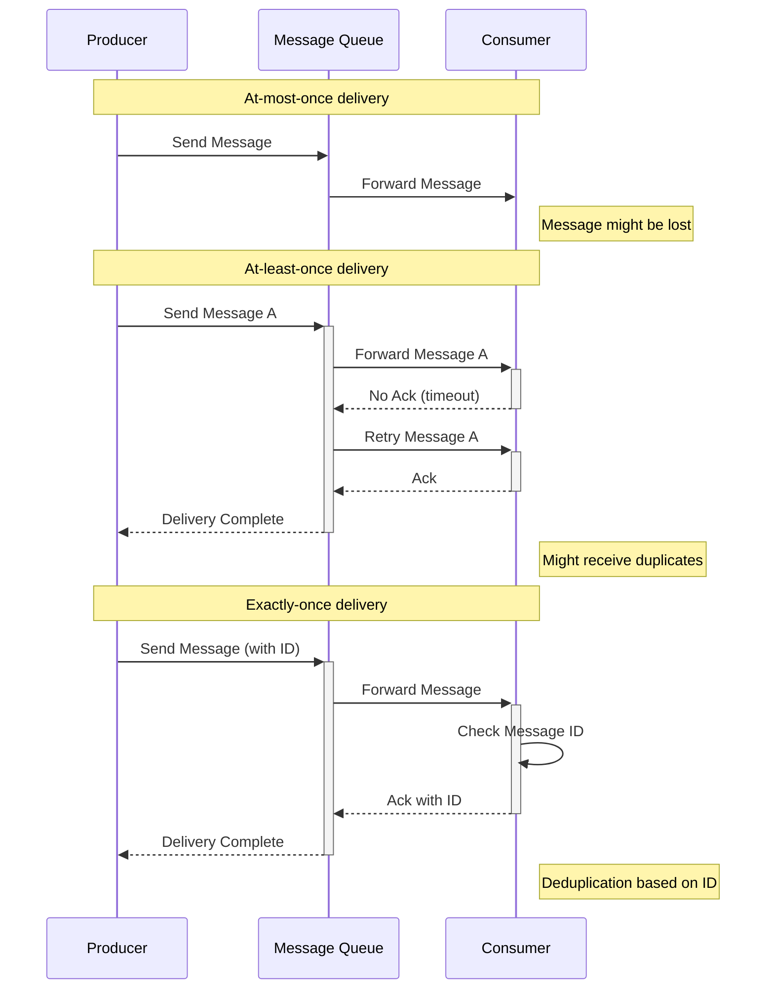
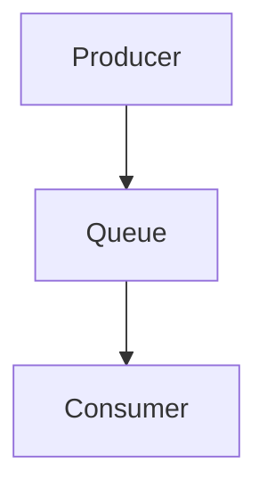
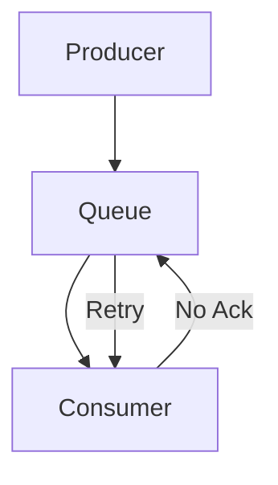
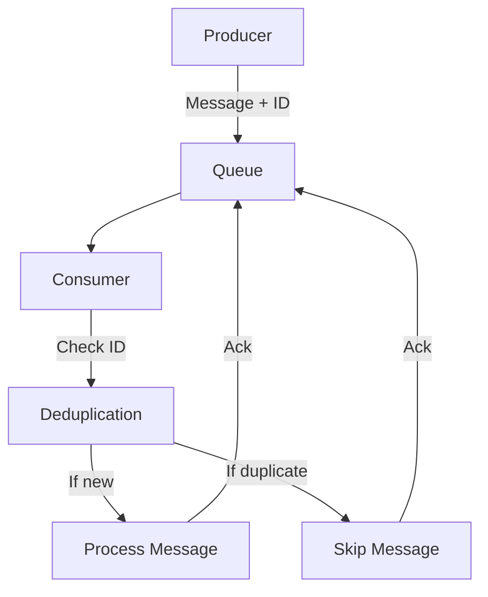

## 이벤트 처리 보장 방식 (Event Delivery Guarantees)

- 이벤트 처리 보장 방식이란 ~~~~~~~~

- 각 방식은 사용 사례와 요구 사항에 따라 적절히 선택하여 사용해야 합니다.
    - 데이터의 중요도, 시스템의 복잡성, 성능 요구 사항 등을 고려하여 결정하면 됩니다.

### At-most-once (최대 한 번 전달)

- 메시지가 한 번만 전송되며, 수신 확인을 하지 않습니다.
- 처리 속도가 빠르고 구현이 단순하지만, 메세지 손실 가능성이 있습니다.
- 로그 데이터와 같이 일부 손실이 허용되는 경우에 사용합니다.

### At-least-once (최소 한 번 전달)

- 수신 확인이 올 때까지 메시지를 계속 재전송합니다.
- 메시지 손실을 방지할 수 있고, 구현이 비교적 단순하지만, 메시지를 중복 전달할 가능성이 있습니다.
- 데이터 손실이 중요하고 중복 처리가 가능한 경우에 사용합니다.

### Exactly-once (정확히 한 번 전달)

- 메시지를 정확히 한 번만 전달합니다.
- 메시지를 손실과 중복 없이 완벽히 전달할 수 있지만, 구현이 매우 복잡합니다.
    - Producer와 Consumer 모두 상태를 저장하여 관리합니다.
