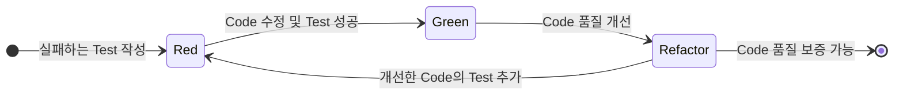

## TDD : Test-Driven Development

- TDD는 Test-Driven Development의 약자로, **test code를 먼저 작성한 후 실제 code를 개발**하는 software 개발 방법론입니다.
    - 한국말로 번역하면 "Test 주도 개발"입니다.

### TDD Cycle : TDD로 개발하기

- TDD는 "Red-Green-Refactor" cycle을 기본 원칙으로 합니다.
    - 실패하는 test를 먼저 작성(Red)하고, test를 통과(Green)한 뒤, code를 개선(Refactor)합니다.

1. **Red** : 실패하는 test를 작성합니다.
    - 구현하려는 기능에 대한 test를 작성합니다.
    - red 단계에서 test는 실행 시 반드시 실패해야 합니다.

2. **Green** : test를 통과하는 최소한의 code를 작성합니다.
    - test를 통과할 수 있는 가장 간단한 code를 작성합니다.
    - green 단계에서는 code의 품질보다 기능 구현에 집중합니다.

3. **Refactor** : code를 refactoring합니다.
    - 중복을 제거하고 code를 개선합니다.
    - code 품질을 향상시키되, 모든 test가 계속 통과하는지 확인합니다.

<!-- 
### TDD의 장점

- 높은 test coverage를 보장합니다.
    - 모든 기능은 최소 하나 이상의 test case를 가집니다.

- bug를 조기에 발견하고 수정할 수 있습니다.
- code의 품질과 신뢰성이 향상됩니다.
- 설계가 단순하고 명확해집니다.
    - 필요한 기능만 구현하게 되어 불필요한 복잡성을 줄입니다.
- refactoring에 대한 자신감을 높입니다.
    - test가 있기 때문에 code 변경 시 기존 기능 손상 여부를 빠르게 확인할 수 있습니다.
- 개발 문서로서의 역할을 합니다.
    - test code는 system이 어떻게 동작해야 하는지 보여주는 살아있는 문서입니다.

### TDD의 단점

- 초기 개발 속도가 느릴 수 있습니다.
    - test를 작성하는 추가 시간이 필요합니다.

- 학습 곡선이 있습니다.
    - 효과적인 test 작성 방법을 배우는 데 시간이 필요합니다.

- 모든 상황에 적합하지 않을 수 있습니다.
    - UI 개발이나 legacy code 관리 등에서는 적용하기 어려울 수 있습니다.

- test code 자체의 유지보수가 필요합니다.

- 잘못된 test는 오히려 개발을 방해할 수 있습니다.

---

## 단계적으로 TDD 실현하기

1. 실패하는 test 작성하기.
    - 구현하려는 기능에 대한 test를 작성합니다.
    - 이 test는 실행 시 반드시 실패해야 합니다.

2. test를 통과하는 최소한의 code 작성하기.
    - test를 통과할 수 있는 가장 간단한 code를 작성합니다.
    - 이 단계에서는 code의 품질보다 기능 구현에 집중합니다.

3. code 리팩토링하기.
    - 중복을 제거하고 code를 개선합니다.
    - code 품질을 향상시키되, 모든 test가 계속 통과하는지 확인합니다.

4. 1~3 단계 반복하기.
    - 모든 기능이 구현될 때까지 이 과정을 반복합니다. -->

---

## Reference

- <https://hanamon.kr/tdd%EB%9E%80-%ED%85%8C%EC%8A%A4%ED%8A%B8-%EC%A3%BC%EB%8F%84-%EA%B0%9C%EB%B0%9C/>
