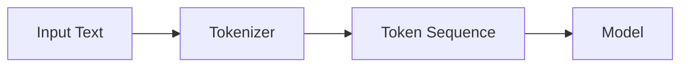

## 문서 구조와 Front Matter

- 모든 문서는 YAML front matter로 시작하며, `layout`, `permalink`, `title`, `description`, `date` field를 포함합니다.
    - `permalink`는 숫자로 지정합니다.
    - `description`은 정확히 한 문장으로 작성합니다.

- `##`(2단계 heading)부터 `####`(4단계 heading)까지 사용하며, `#`과 `#####` 이하는 사용하지 않습니다.

- heading 바로 아래에는 반드시 bulleted 문장(`- `)이 하나 이상 있어야 합니다.
    - heading에서 바로 하위 heading이나 code block으로 넘어가지 않습니다.


---


## 문장 작성 규칙

- 제목을 제외한 **모든 문장은 `- `로 시작하여 목록화**합니다.
    - 상하위 항목은 4칸 들여쓰기로 구분합니다.
    - 상위 항목이 있더라도 하위 항목이 없으면 단독으로 완결된 문장이어야 합니다.

- 영어 원어 단어는 영어로 표기합니다.
    - 고유 명사는 대문자, 일반 명사는 소문자로 작성합니다.
    - 첫 등장 시 괄호로 한글 병기가 가능하며, 이후에는 영어만 사용합니다.
    - 예 : `default parameter(기본 매개 변수)는 parameter에 기본값을 지정하는 기능입니다.`

- colon(`:`) 앞뒤에는 공백 하나씩 추가합니다.

- code 요소(`class`, `function`, `keyword`, `annotation`)는 backtick으로 감쌉니다.
    - 수식과 Big O 표기는 `O(1)`, `O(n)`, `n²`처럼 backtick으로 감쌉니다.
    - scope, buffer, handler, pattern 같은 개념적 용어는 backtick 없이 작성합니다.


### 단락 구분 방법

- `##` 단락 사이에는 `---` 구분선과 빈 줄 두 개를 넣습니다.

- `###` 단락 사이에는 빈 줄 두 개를 넣습니다.

- `####` 단락 사이에는 빈 줄 한 개를 넣습니다.


---


## Table과 Code Block

- table과 code block은 문장 사이에 자연스럽게 배치합니다.


### Table

- table의 구분자는 `| --- |`로 통일하며, 내용은 명사형으로 작성합니다.

| 구분 | 설명 |
| --- | --- |
| **table 내용** | 명사형 작성, 마침표 없음 |
| **code 요소** | backtick 사용 |
| **개념적 용어** | backtick 미사용 |


### Code Block

- code block은 해당 언어를 명시하여 작성합니다.

#### 함수 선언

- `fun` keyword로 function을 선언하고, default parameter를 지정할 수 있습니다.

```kotlin
fun greet(name: String = "World"): String {
    return "Hello, $name!"
}
```

#### 함수 호출

- default parameter가 있으면 argument를 생략할 수 있습니다.

```kotlin
fun main() {
    println(greet())
    println(greet("Kotlin"))
}
```


---


## Diagram

- image 대신 Mermaid.js 문법을 사용합니다.
    - `@` 기호와 color style은 사용하지 않습니다.
    - node ID는 lower_snake_case로 작성합니다.




---


## Reference

- <https://www.simin.im/0>

