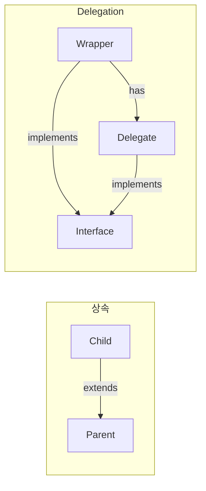

## Delegation

- **Delegation**은 **기능 구현을 다른 객체에 위임**하는 design pattern입니다.
    - 상속(is-a) 대신 composition(has-a)을 사용합니다.
    - Kotlin은 언어 차원에서 delegation을 지원합니다.




---


## Class Delegation

- **`by` keyword**로 interface 구현을 **다른 객체에 위임**합니다.
    - 위임받은 객체의 method가 자동으로 호출됩니다.
    - boilerplate 없이 decorator pattern을 구현합니다.

```kotlin
interface Printer {
    fun print(message: String)
}

class ConsolePrinter : Printer {
    override fun print(message: String) = println(message)
}

class LoggingPrinter(private val printer: Printer) : Printer by printer

val printer = LoggingPrinter(ConsolePrinter())
printer.print("Hello")  // ConsolePrinter.print() 호출
```


### Method Override

- **위임받은 method를 override**하여 동작을 변경합니다.
    - override하지 않은 method는 delegate에 위임됩니다.


---


## Property Delegation

- **property의 getter/setter를 delegate 객체에 위임**합니다.
    - `by` keyword 뒤에 delegate 객체를 지정합니다.
    - `getValue`와 `setValue` operator를 구현한 객체가 delegate입니다.


### Standard Delegates

- Kotlin은 **자주 사용되는 delegate를 표준 library**로 제공합니다.
    - `lazy` : 지연 초기화.
    - `observable` : 변경 감지.
    - `vetoable` : 변경 거부.

| Delegate | 설명 |
| --- | --- |
| **`lazy`** | 처음 접근 시 초기화, 이후 cache 반환 |
| **`observable`** | 변경 후 callback 호출 |
| **`vetoable`** | callback이 false 반환 시 변경 거부 |


---


## Reference

- <https://kotlinlang.org/docs/delegation.html>
- <https://kotlinlang.org/docs/delegated-properties.html>
