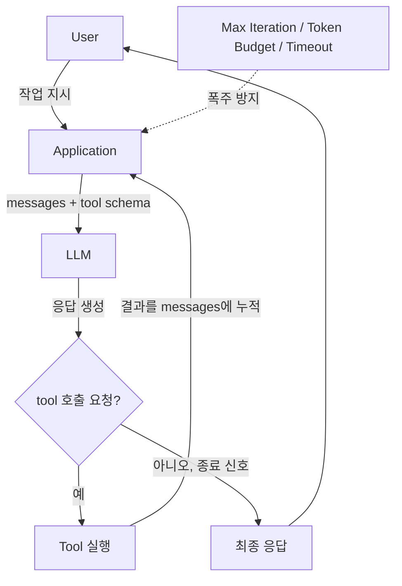
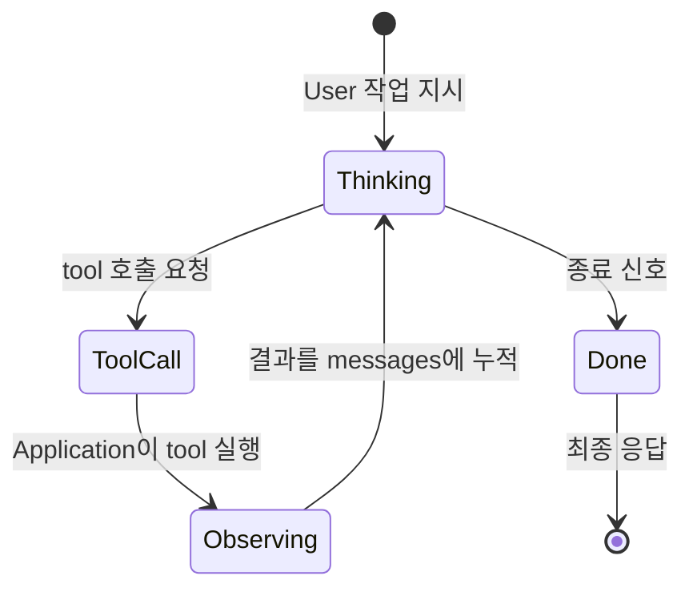
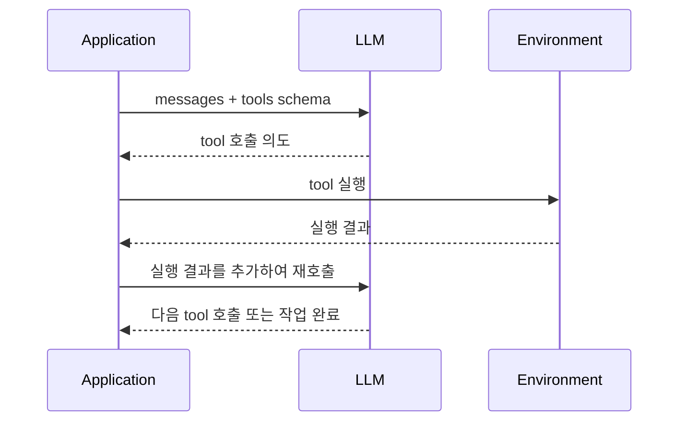
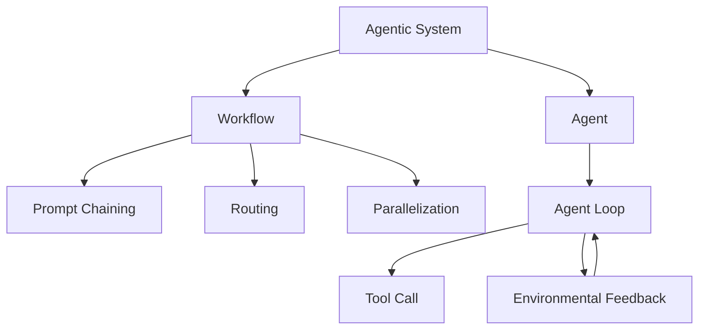
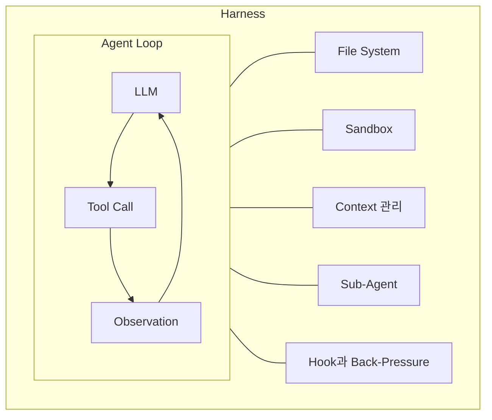

## Agent Loop

- agent loop는 **LLM이 tool 호출과 결과 관찰을 반복하면서 하나의 작업을 완수하도록 만드는 제어 구조**입니다.
    - 한 번의 LLM 호출로 끝나는 단발성 응답이 아니라, "생각 -> 행동 -> 관찰 -> 다시 생각"이 자동으로 이어집니다.
    - 이 반복 구조 덕분에 LLM은 처음부터 모든 정보를 알지 못해도, 환경에서 ground truth를 가져오며 점진적으로 작업을 완성합니다.

- agent loop는 모든 LLM agent의 가장 근본적인 골격입니다.
    - "채팅"이라는 단순한 UX조차 이전 message를 추적하고 이어붙이는 while loop의 산물입니다.
    - workflow pattern, sub-agent, state machine 같은 더 복잡한 구조도 결국 agent loop의 변형이거나 그것을 감싸는 layer입니다.

- agent loop는 **harness engineering의 출발점**입니다.
    - LLM 자체는 stateless하므로, 상태와 반복은 LLM 바깥의 code가 책임집니다.
    - 이 바깥 code 전체를 harness라고 부르며, agent loop는 harness의 가장 원초적인 형태입니다.




---


## LLM이 Stateless하다는 것의 의미

- LLM은 **이전 호출의 어떤 정보도 기억하지 않는 함수**입니다.
    - 입력으로 받은 message 배열만 보고 다음 token을 생성합니다.
    - 같은 입력에 같은 model로 호출하면 sampling을 제외하면 같은 출력이 나옵니다.

- "대화"가 가능한 이유는 application code가 message를 누적하기 때문입니다.
    - 사용자가 새 message를 보낼 때마다, application은 이전 모든 message에 새 message를 덧붙여 LLM에 다시 전달합니다.
    - LLM은 매 호출마다 전체 대화를 처음 보는 듯이 처리하며, 기억은 application의 message 배열에만 존재합니다.

- agent loop는 message 누적을 application code가 책임지는 동일한 방식으로 작동합니다.
    - LLM이 tool을 호출하면, application이 tool을 실행하고 결과를 message 배열에 추가한 뒤 LLM을 다시 부릅니다.
    - LLM은 이전 호출과 현재 호출 사이의 연결을 직접 알지 못하며, message 배열에 누적된 history만 보고 다음 행동을 결정합니다.


---


## Agent Loop의 기본 구조

- 가장 단순한 agent loop는 **LLM 호출과 tool 실행을 번갈아 수행하는 while loop**입니다.
    - LLM이 tool을 더 이상 호출하지 않을 때까지 반복하며, 종료 조건은 LLM의 응답 자체가 알려줍니다.
    - 한 turn 안에서 application은 message 배열을 LLM에 전달하고, LLM은 다음 행동(tool 호출 또는 최종 답변)을 결정하여 반환합니다.

```text
messages = [user의 첫 message]

loop:
    response = LLM 호출 (messages, tools)
    messages에 LLM 응답 추가

    if 응답이 tool 호출 요청이면:
        각 tool을 application이 실행
        실행 결과를 messages에 추가
        loop 계속
    else:
        loop 종료
```

- agent loop를 상태 전이로 보면, **Thinking, ToolCall, Observing 세 상태가 순환하다가 종료 신호로 Done에 도달**하는 state machine으로 표현됩니다.



- 매 turn마다 LLM은 전체 message 배열을 처음부터 다시 받으며, 누적된 history만이 LLM이 참조할 수 있는 유일한 정보원입니다.

- LLM은 tool을 직접 실행하지 않고 "이 tool을 이 인자로 부르고 싶다"고 선언만 하며, 실제 호출은 application code가 수행합니다.

- application은 tool 실행 결과를 다시 message로 감싸 다음 호출에 포함시키며, 누적된 message가 LLM의 다음 판단 근거가 됩니다.

- loop 종료는 LLM이 "더 이상 tool을 부를 필요 없다"는 신호를 응답에 담을 때 일어나며, application은 그 신호를 만날 때까지 호출을 이어갑니다.


### Tool Use Contract

- tool use는 **application과 model 사이의 계약**입니다.
    - application은 tool의 schema(이름, 설명, parameter 형식)를 정의합니다.
    - model은 schema를 보고 언제 어떤 인자로 tool을 부를지 결정하지만, 실제 실행은 절대 하지 않습니다.

- schema 기반 호출 계약 덕분에 LLM은 자유 형식 text 생성기가 아니라, **호출 가능한 함수처럼** 동작합니다.
    - 일반적인 typed interface처럼 schema 정의, callback 처리, 결과 반환의 흐름으로 통합할 수 있습니다.
    - 다만 호출 주체가 결정론적 code가 아니라, 대화 맥락을 보고 판단하는 LLM이라는 점이 다릅니다.




---


## Agent Loop가 안전하게 끝나기 위한 조건

- agent loop는 **종료 조건 없이 작동하면 무한 호출에 빠질 수 있으므로**, application이 명시적인 안전 장치를 둬야 합니다.
    - LLM이 종료 신호를 반환하지 않고 tool 호출을 끊임없이 시도할 수 있습니다.
    - tool 실행 결과가 비어 있거나 오류일 때, LLM이 같은 호출을 반복할 수도 있습니다.

- **max iteration**은 loop 횟수 상한을 두어, 일정 turn 이상 진행되면 강제 종료시킵니다.
    - LLM이 종료 신호 없이 tool 호출만 반복하더라도, 정해진 turn 수에 도달하면 application이 loop를 끊습니다.

- **token budget**은 누적 token 사용량 상한을 두어, 비용 폭주를 막습니다.
    - context가 길어질수록 한 호출당 비용이 누적 message 길이에 비례해 커지므로, 누적 사용량을 측정해 한도를 넘으면 종료합니다.

- **timeout**은 tool 실행과 전체 loop에 시간 제한을 두어, 무응답 상황에서 빠져나옵니다.
    - tool이 외부 system을 부르다 hang되거나 LLM 호출이 지연될 때, 시간 제한이 없으면 agent가 영원히 멈춰 있을 수 있습니다.

```text
MAX_ITERATIONS = 50

for iteration in range(MAX_ITERATIONS):
    response = LLM 호출 (messages, tools)
    messages에 LLM 응답 추가

    if 응답이 tool 호출 요청이 아니면:
        loop 종료
    
    각 tool을 application이 실행
    실행 결과를 messages에 추가

# 한도 초과 시
raise "agent가 max iteration에 도달했습니다."
```


---


## Agentic System에서 Agent Loop의 위치

- Anthropic은 LLM과 tool로 구성된 system을 **workflow와 agent**로 구분합니다.
    - workflow는 사전 정의된 code 경로를 따라 LLM과 tool이 orchestration되는 system입니다.
    - agent는 LLM이 자신의 process와 tool 사용을 동적으로 결정하는 system이며, 그 핵심 mechanism이 바로 agent loop입니다.

- workflow는 agent loop 없이도 작동할 수 있지만, agent는 agent loop가 곧 본체입니다.
    - workflow는 prompt chaining, routing, parallelization처럼 단계와 분기가 사람에 의해 미리 정의됩니다.
    - agent는 어떤 tool을 몇 번 부를지 미리 정해지지 않으며, LLM이 매 turn 환경에서 ground truth를 받아 다음 행동을 정합니다.




### Agent Loop와 Workflow의 차이

- agent loop는 **반복 횟수와 경로가 LLM에 의해 결정**됩니다.
    - 사용자가 "버그를 찾아 고쳐줘"라고 지시하면, 어떤 file을 몇 번 읽고 어떤 명령을 실행할지는 LLM이 매 turn 결정합니다.
    - 결과적으로 동일 입력이 동일 경로로 처리되지 않으며, 자율성과 비용 및 오류 누적 위험이 함께 커집니다.

- workflow는 **반복 횟수와 경로가 code에 의해 결정**됩니다.
    - "문서를 요약하고 번역해줘"라는 작업을 두 단계 LLM 호출로 미리 정의합니다.
    - 자율성은 낮지만 latency와 비용이 예측 가능하며, 결과의 일관성이 높습니다.


---


## Agent Loop가 풀어야 하는 본질적 문제

- agent loop는 동작 원리는 단순하지만, **실제로 안정적인 agent를 만들려면 여러 본질적 문제**를 해결해야 합니다.
    - 단순 loop만으로는 장시간 작업, 대규모 tool 출력, 복합 sub task 등에서 한계를 드러냅니다.
    - 장시간 작업, 대규모 출력, 복합 sub task에서 드러나는 한계가 곧 harness engineering이 다루는 문제 영역입니다.


### Context 부패

- LLM은 context 길이가 늘어날수록 추론 능력이 떨어집니다.
    - 이를 context 부패(context rot)라고 부르며, agent loop가 길어질수록 응답 품질이 저하됩니다.
    - tool 결과가 누적되어 context가 가득 차면, agent가 이전 정보를 잘못 참조하거나 작업을 절반만 마치고 종료합니다.

- compaction과 tool call offloading으로 대응합니다.
    - compaction은 일정 길이를 넘으면 이전 history를 요약하여 일부 message를 덜어냅니다.
    - tool call offloading은 큰 tool 출력을 file로 빼고 요약만 context에 남깁니다.


### 조기 종료와 폭주

- LLM은 작업이 끝나지 않았는데 종료 신호를 반환하기도 하고, 끝났는데도 tool 호출을 계속 시도하기도 합니다.
    - 조기 종료는 system prompt와 tool description으로 작업 완료 기준을 명확히 명시하여 줄입니다.
    - 폭주는 max iteration, token budget, hook 기반 검증으로 막습니다.


### Sub Task의 Context 오염

- 한 agent loop 안에서 조사, 탐색, 구현을 모두 처리하면 중간 noise가 쌓여 핵심 context를 흐립니다.
    - sub-agent는 별도 loop를 spawn하여 sub task를 격리 처리하고, 상위 agent에게는 요약된 결과만 전달합니다.
    - 이를 context 방화벽이라고 부르며, sub-agent의 진짜 가치는 역할 분담이 아니라 context 격리에 있습니다.


### 검증 불가능성

- LLM 내부에서 일어나는 world modeling, planning, reflection은 hidden state로 처리되어 검증할 수 없습니다.
    - 동일 input이 동일 output을 보장하지 않으며, audit과 재현이 어렵습니다.
    - state machine agent는 결정론적인 부분을 LLM loop 밖 state machine에 두고, LLM은 잔여 판단에만 호출하는 방식으로 검증 불가능성을 완화합니다.


---


## Agent Loop 설계 원칙

- Anthropic이 제시한 agent 구현의 핵심 원칙은 **단순성, 투명성, ACI(Agent-Computer Interface) 품질**입니다.
    - 복잡성은 측정 가능한 개선이 있을 때만 추가합니다.
    - agent의 planning 단계를 명시적으로 노출하여 동작을 추적 가능하게 합니다.
    - tool documentation과 testing을 prompt만큼 정성껏 다듬습니다.


### 단순성

- 가장 단순한 해결책을 먼저 시도하고, 부족할 때만 복잡성을 추가합니다.
    - agent loop가 필요 없으면 단발 호출로 끝냅니다.
    - workflow로 충분하면 agent를 쓰지 않습니다.
    - sub-agent가 필요 없으면 단일 loop로 처리합니다.

- framework는 시작에는 도움이 되지만, production에서는 추상화 layer를 줄이는 방향이 권장됩니다.
    - LangChain, LlamaIndex 같은 framework는 표준 작업을 단순화하지만, debug를 어렵게 만들 수 있습니다.
    - basic component로 직접 구축하면 동작을 정확히 통제할 수 있습니다.


### 투명성

- agent의 planning 단계를 명시적으로 노출하면 동작을 추적할 수 있습니다.
    - thinking을 활용하여 model이 다음 행동을 결정하기 전에 reasoning을 출력하도록 합니다.
    - tool 호출 전후의 상태 변화를 log로 남겨 audit이 가능하도록 합니다.


### ACI 품질

- ACI(Agent-Computer Interface)는 agent와 환경 사이의 interface, 즉 tool의 schema와 description입니다.
    - tool 이름과 parameter 이름은 model 입장에서 분명해야 합니다.
    - description에는 사용 예시, edge case, 입력 형식, 다른 tool과의 경계가 포함되어야 합니다.
    - SWE-bench agent를 만들 때 Anthropic은 prompt보다 tool 설계에 더 많은 시간을 들였습니다.

- poka-yoke(실수 방지) 원칙을 적용합니다.
    - relative path가 혼란을 일으키면 absolute path만 받도록 schema를 바꿉니다.
    - 잘못된 인자가 들어올 수 없는 형태로 parameter를 설계합니다.


---


## Agent Loop와 Harness의 관계

- agent loop는 harness의 가장 안쪽 골격이며, harness의 다른 구성 요소들은 모두 **agent loop를 감싸거나 보강하는 layer**입니다.
    - file system은 loop가 session을 넘어 상태를 유지하게 합니다.
    - sandbox는 loop 안에서 실행되는 code를 격리합니다.
    - context 관리(compaction, offloading, skill)는 loop가 길어질 때 추론 품질을 유지합니다.
    - sub-agent는 loop 안에서 새 loop를 spawn하여 context를 격리합니다.
    - hook과 back-pressure는 loop의 특정 시점에 자동 검증을 끼워 넣습니다.



- agent loop를 먼저 깊이 이해해야 harness 전체의 설계 의도가 이해됩니다.
    - file system, sandbox, context 관리, sub-agent, hook은 각각 agent loop의 어떤 한계를 보완하는지를 기준으로 도출된 결과물입니다.
    - 즉 harness engineering은 "agent loop를 어떻게 안정적으로 운영할 것인가"에 대한 응답입니다.


---


## Reference

- <https://www.anthropic.com/engineering/building-effective-agents>
- <https://docs.anthropic.com/en/docs/agents-and-tools/tool-use/how-tool-use-works>
- <https://docs.anthropic.com/en/docs/build-with-claude/tool-use>

