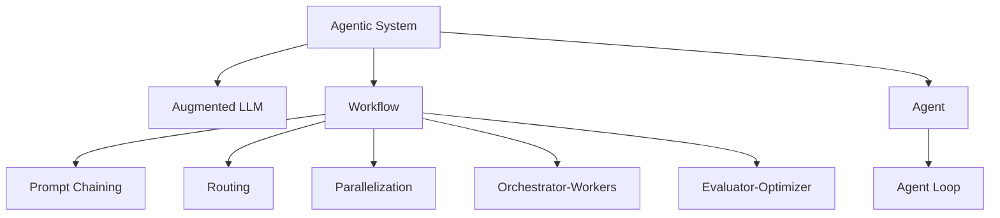
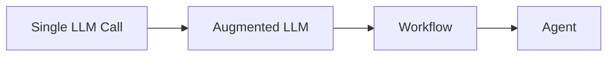
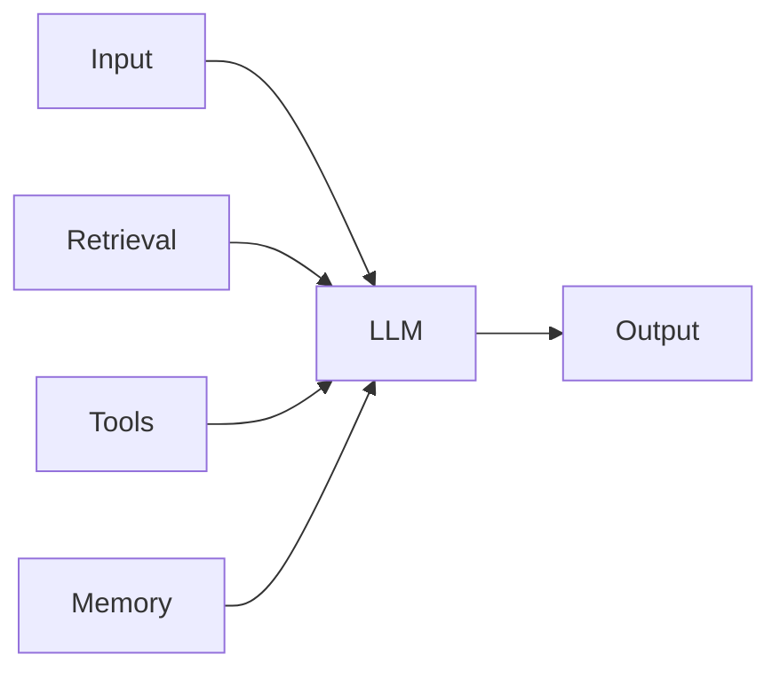
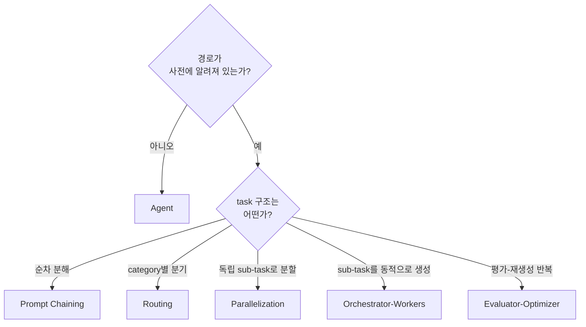
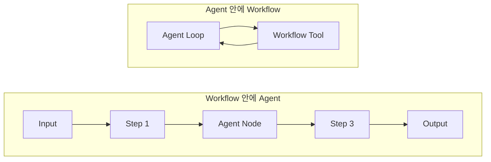

## Agentic System

- agentic system은 **LLM과 tool이 결합되어 사용자 task를 수행하는 system 전체**를 가리키는 umbrella term(포괄 용어)입니다.
    - Anthropic이 [Building effective agents](https://www.anthropic.com/engineering/building-effective-agents) 글에서 도입한 용어로, [LangChain](https://docs.langchain.com/oss/python/langgraph/workflows-agents)을 비롯한 주요 framework가 동일한 분류를 채택했습니다.
    - 흐름 제어의 주체가 누구인지에 따라 다시 workflow와 agent로 나뉩니다.

- agentic system이라는 상위 용어가 따로 존재하는 이유는 **"agent"라는 단어가 넓은 의미와 좁은 의미로 모두 쓰여 혼란이 발생**하기 때문입니다.
    - 넓은 의미의 agent는 환경을 인식하고 목표를 향해 행동하는 system 일반을 가리키며, 이 정의로는 workflow도 agent의 한 형태입니다.
    - Anthropic은 분류의 명확성을 위해 자율성이 높은 system에만 좁은 의미의 "agent"라는 이름을 붙이고, 넓은 의미의 system 전체는 "agentic system"으로 분리해 부릅니다.
    - 이 문서에서 "agent"는 별다른 수식이 없으면 좁은 의미의 agent, 즉 LLM이 자신의 process를 동적으로 결정하는 system을 가리킵니다.

### Autonomy Spectrum

- agentic system은 **단일 LLM 호출에서부터 완전 자율 agent까지 연속적인 autonomy spectrum(자율성 spectrum)** 위에 놓입니다.
    - augmented LLM은 단발 호출에 retrieval, tool, memory를 더한 가장 단순한 형태입니다.
    - workflow는 여러 LLM 호출을 사전 정의된 code 경로로 묶어 자율성을 제한적으로 허용합니다.
    - agent는 LLM이 매 turn 다음 행동을 결정하므로 자율성이 가장 높습니다.

- 자율성을 올리면 **유연성은 커지지만 예측 가능성과 비용 통제력은 떨어집니다**.
    - workflow는 동일 입력에 대해 동일한 경로로 작동하므로 latency와 비용이 예측 가능합니다.
    - agent는 LLM의 판단에 따라 경로가 달라지므로 자율성이 높은 대신 token 비용과 오류 누적 위험이 커집니다.

- 설계의 첫 원칙은 **필요한 만큼만 자율성을 올리는 것**입니다.
    - 단발 호출로 충분하면 augmented LLM에서 멈추고, workflow로 충분하면 agent를 쓰지 않습니다.
    - 높은 자율성은 task가 사전에 분해되지 않거나 단계 수를 예측할 수 없을 때만 도입할 가치가 있습니다.

---

## 구성 요소

- agentic system은 **augmented LLM이라는 building block을 어떻게 연결하느냐에 따라 workflow 또는 agent로 갈립니다**.
    - augmented LLM은 단일 LLM 호출에 retrieval, tool, memory를 더한 최소 단위이며, workflow와 agent 모두 이 단위의 조합으로 구성됩니다.
    - workflow는 augmented LLM 호출을 code가 정의한 경로로 연결하고, agent는 LLM 자신이 매 turn 다음 호출을 결정하도록 둡니다.

### Augmented LLM

- augmented LLM은 **단일 LLM 호출에 retrieval, tool, memory를 결합한 building block**입니다.
    - 모든 workflow와 agent는 augmented LLM을 기본 단위로 조합한 구조이며, 단독으로도 많은 task를 해결할 수 있습니다.
    - retrieval은 외부 지식을 호출 시점에 가져와 prompt에 주입하고, tool은 외부 system과의 상호 작용을 가능하게 하며, memory는 여러 호출에 걸친 상태를 유지합니다.

- augmented LLM은 workflow와 agent의 공통 기반이지만, **그 자체로 system이라기보다 building block에 가깝습니다**.
    - 한 번의 호출이 끝나면 결과를 반환하고 종료하며, 호출 사이에 흐름 제어가 끼어들지 않습니다.
    - 흐름 제어가 들어가는 순간부터 augmented LLM을 어떻게 연결하느냐가 workflow와 agent의 분기점이 됩니다.

### Workflow

- workflow는 **LLM 호출 순서와 결과 전달 방식이 code에 사전 정의된 system**입니다.
    - 동일 입력에 대해 동일한 경로로 작동하므로 latency와 비용이 예측 가능하고, 결과의 일관성이 높습니다.
    - 단계와 분기가 사람에 의해 미리 설계되므로 task 구조가 안정적인 경우에 효율이 높습니다.

- workflow는 LLM 호출을 어떻게 연결하느냐에 따라 **prompt chaining, routing, parallelization, orchestrator-workers, evaluator-optimizer** 같은 정형화된 pattern으로 분류됩니다.

| Pattern | 핵심 구조 | 적합한 상황 |
| --- | --- | --- |
| **Prompt Chaining** | 순차 LLM 호출 + 중간 gate | task를 고정된 sub-step으로 깔끔히 분해 가능 |
| **Routing** | classifier가 input을 분류 후 전용 path로 분기 | category가 명확히 갈리고 각각 다르게 처리 |
| **Parallelization** | sectioning(독립 task 분할) 또는 voting(같은 task 다회 실행) | latency 단축, 또는 다관점 검증 |
| **Orchestrator-Workers** | 중앙 LLM이 sub-task를 동적으로 분해해 worker에 위임 | sub-task를 미리 예측할 수 없는 경우 |
| **Evaluator-Optimizer** | generator와 evaluator의 feedback loop | 평가 기준이 명확하고 반복으로 품질이 향상 |

### Agent

- agent는 **LLM이 매 turn 환경에서 ground truth를 받아 다음 행동을 결정하는 system**입니다.
    - 사용자가 task를 지시하면 agent는 "생각 -> tool 호출 -> 관찰 -> 다시 생각"의 cycle을 LLM 스스로 멈출 때까지 반복합니다.
    - 단계 수, tool 호출 순서, 종료 시점이 모두 LLM의 판단으로 결정되며, code는 cycle을 돌리는 역할만 합니다.

- agent의 핵심 mechanism은 **agent loop**입니다.
    - agent loop는 LLM 호출과 tool 실행을 번갈아 수행하는 while loop이며, LLM의 종료 신호로 자연 종료합니다.
    - agent loop의 폭주를 막기 위해 max iteration, token budget, timeout 같은 안전 장치가 추가로 필요합니다.

- agent는 자율성이 높은 만큼 **운영 layer에서 보강이 필요**합니다.
    - context 부패, 조기 종료와 폭주, sub task의 context 오염, 검증 불가능성 같은 문제는 단순 loop만으로는 해결되지 않습니다.
    - file system, sandbox, context 관리, sub-agent, hook 같은 보조 구조를 묶어 agent를 안정적으로 운영하는 분야가 **harness engineering**입니다.

---

## Pattern 선택

- workflow와 agent는 **흐름 제어의 주체가 code인지 LLM인지**로 갈리며, 이 차이가 선택의 출발점입니다.

### Workflow와 Agent의 분기점

- 분기점은 결국 **"어떤 LLM을 언제 부를지"를 누가 결정하는가**의 차이입니다.
    - workflow는 task를 개발자가 미리 분해할 수 있을 때 적합하며, task 구조가 안정적일수록 효율이 높아집니다.
    - agent는 task의 단계와 경로를 사전에 예측할 수 없고, LLM이 환경에서 ground truth를 받아 다음 행동을 결정해야 하는 상황에 적합합니다.

| 구분 | Workflow | Agent |
| --- | --- | --- |
| **흐름 제어** | code가 사전 정의 | LLM이 매 turn 결정 |
| **경로 결정 시점** | 설계 시 | 실행 시 |
| **반복 횟수** | code에 명시 | LLM의 종료 신호 |
| **종료 조건** | 마지막 단계 완료 | LLM이 end_turn 반환 |
| **동일 입력의 재현성** | 높음 | 낮음 |
| **비용 예측 가능성** | 높음 | 낮음 |
| **자율성** | 낮음 | 높음 |
| **적합한 task** | 사전 분해 가능 | 단계 수 예측 불가 |

### 선택 기준

- **task의 경로가 사전에 알려져 있는지**가 가장 먼저 따져야 할 기준입니다.
    - 경로가 명확하면 workflow를 선택하고, 그중에서도 task 구조에 맞는 pattern을 고릅니다.
    - 경로가 task마다 다르고 단계 수를 예측할 수 없으면 agent를 선택합니다.
    - 경로도 결과도 모호하면 task 범위를 좁히거나 human-in-the-loop을 추가하는 편이 안전합니다.

- **단순한 pattern이 충분하면 복잡한 pattern을 도입하지 않습니다**.
    - 복잡한 framework보다 단순한 composable pattern이 실무에서 더 잘 작동한다는 것이 Anthropic의 결론입니다.
    - 같은 task를 prompt chaining으로 풀 수 있다면 routing이나 parallelization을 도입하지 않고, workflow로 풀 수 있다면 agent를 도입하지 않습니다.

- **복잡성을 더하기 전에 측정 가능한 개선이 있는지 확인합니다**.
    - latency, 정확도, 비용 중 어느 지표가 개선되는지 측정하지 못한다면 복잡성을 더하지 않습니다.
    - parallelization은 latency 개선이 측정될 때만, evaluator-optimizer는 반복으로 품질 향상이 측정될 때만 도입할 가치가 있습니다.

### Hybrid Pattern

- 실무에서는 workflow와 agent를 분리하지 않고 **서로의 내부 단위로 결합해 조합**하는 경우가 흔합니다.
    - 전체 흐름은 deterministic(결정적) workflow로 두고, 비결정성이 필요한 한 node에서만 agent를 호출하는 구조가 enterprise에서 가장 자주 등장하는 형태입니다.
    - 반대로 agent를 본체로 두고, agent가 사용하는 tool 중 하나가 내부적으로 workflow를 실행하는 형태도 가능합니다.

- hybrid pattern의 설계 원칙은 **"경로가 알려진 부분은 deterministic하게, 모호한 부분만 agent에 위임"**하는 것입니다.
    - 전체를 agent로 만들면 비용과 비결정성이 task 전체로 퍼지고, 전체를 workflow로 만들면 모호한 단계에서 막힙니다.
    - 모호한 부분이 좁게 한정되어 있다면 그 지점에만 agent를 두어, 자율성의 비용을 좁은 범위에 가둘 수 있습니다.

- human-in-the-loop도 같은 원리로 추가할 수 있습니다.
    - agent가 확신이 낮거나 영향 범위가 큰 행동을 하기 직전에 사람의 승인을 받는 checkpoint를 둡니다.
    - 자동화의 속도와 사람의 판단력을 같은 흐름 안에 결합하는 방식입니다.

---

## Reference

- <https://www.anthropic.com/engineering/building-effective-agents>
- <https://docs.langchain.com/oss/python/langgraph/workflows-agents>
- <https://claude.com/blog/common-workflow-patterns-for-ai-agents-and-when-to-use-them>

