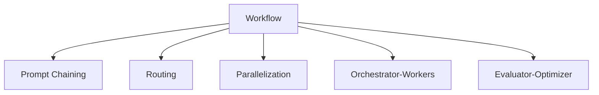
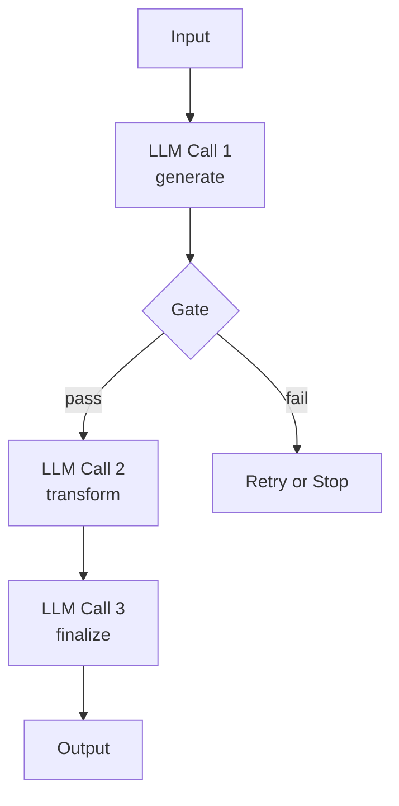
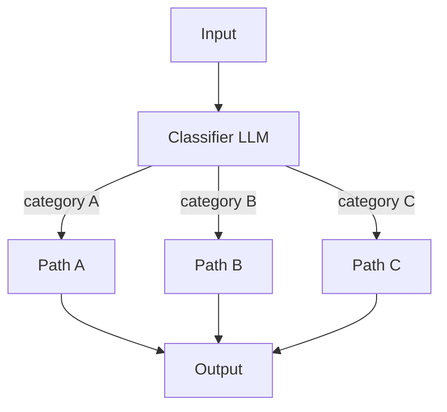
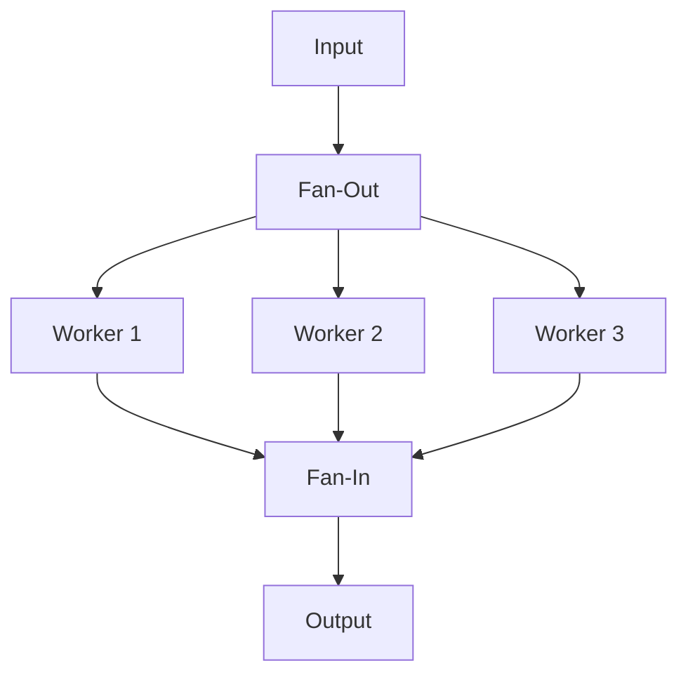
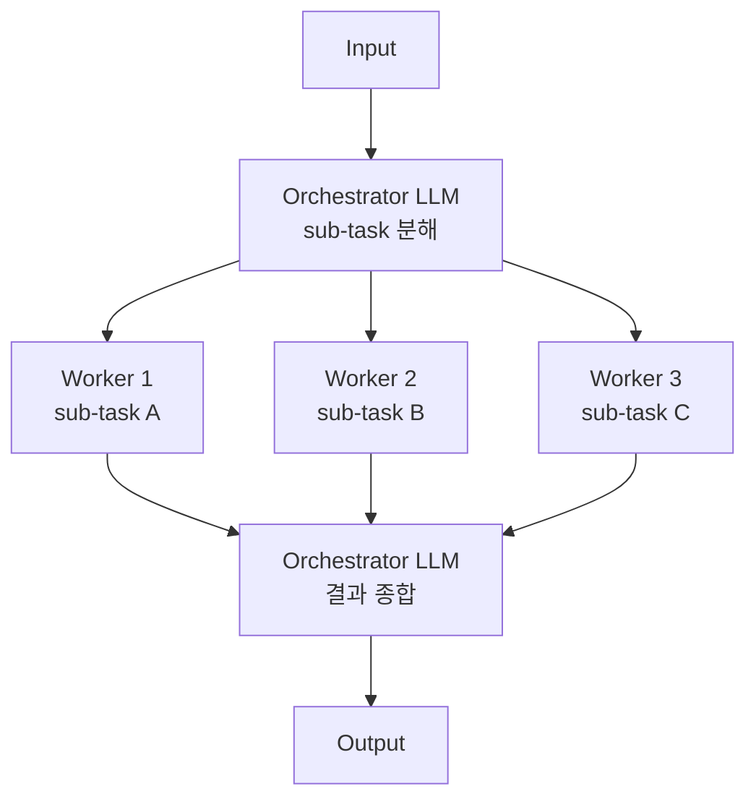
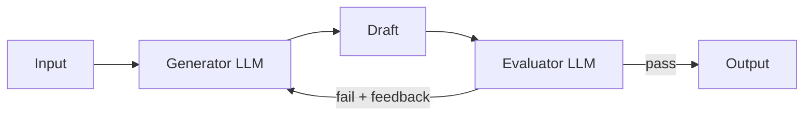

## Workflow

- workflow는 **LLM 호출 순서와 결과 전달 방식이 code에 사전 정의된 agentic system**입니다.
    - augmented LLM 호출을 어떻게 연결하느냐가 code에 적혀 있으며, 어떤 LLM을 언제 부르고 결과를 어디로 넘길지가 설계 시점에 결정됩니다.
    - 동일 입력에 대해 동일한 경로로 작동하므로 latency, 비용, 결과의 일관성이 모두 예측 가능합니다.

- workflow는 **task가 사전에 분해 가능할 때 효과적**입니다.
    - task의 단계와 분기 구조가 안정적일수록 효율이 높아지며, 흐름 자체는 code가 통제하므로 오류 누적 위험도 낮습니다.
    - LLM의 자율 판단이 필요한 부분이 늘어날수록 workflow의 가치는 떨어지고, 그 한계 너머는 agent의 영역입니다.

### Workflow의 한계

- workflow는 **task의 구조가 사전에 분해 가능**하다는 전제 위에 만들어집니다.
    - 단계와 분기를 미리 알 수 있을 때만 code에 흐름을 적을 수 있으며, 단계 수와 경로가 입력마다 달라지면 사전 정의가 불가능해집니다.

- workflow는 task의 단계 수가 입력의 결과에 따라 달라질 때 한계에 부딪힙니다.
    - 다음 행동이 직전 행동의 결과(특히 환경 feedback)에 따라 달라지므로 단계 수를 사전에 예측할 수 없습니다.
    - 분기 조건이 너무 많아 routing classifier가 비대해집니다.
    - orchestrator-workers로도 한 번에 분해되지 않고, 분해 자체가 반복적으로 조정되어야 합니다.

- agent는 LLM이 매 turn 환경에서 ground truth를 받아 다음 행동을 결정하므로, 사전에 흐름을 정의할 수 없는 task에 적합합니다.
    - 다만 자율성이 높아지는 만큼 비용과 비결정성도 함께 커지므로, hybrid pattern으로 모호한 부분을 좁게 한정해 두는 편이 안전합니다.

---

## Workflow Patterns

- workflow는 LLM 호출을 어떻게 연결하느냐에 따라 다섯 가지 정형화된 pattern으로 나뉘며, 각 pattern은 sub-task의 결정 시점, 반복 여부, 결과 합치는 방식이 서로 다릅니다.

| Pattern | 핵심 구조 | sub-task 결정 시점 | 반복 여부 | 결과 합치는 방식 |
| --- | --- | --- | --- | --- |
| **Prompt Chaining** | 순차 LLM 호출 + 중간 gate | 사전 정의 | 없음 | 마지막 단계의 출력 |
| **Routing** | classifier가 input을 분류 후 전용 path로 분기 | 사전 정의 | 없음 | 선택된 path의 출력 |
| **Parallelization** | sectioning(독립 분할) 또는 voting(다회 실행) | 사전 정의 | 없음 | fan-in으로 통합 |
| **Orchestrator-Workers** | 중앙 LLM이 sub-task를 동적으로 분해해 worker에 위임 | 실행 시 동적 결정 | 없음 | orchestrator가 종합 |
| **Evaluator-Optimizer** | generator와 evaluator의 feedback loop | 사전 정의 | 있음 | 통과 시점의 generator 출력 |

- 어떤 pattern을 선택해야 할지는 task 구조를 먼저 살펴 결정합니다.
    - 단계가 고정된 순차 분해이면 prompt chaining, category별 분기이면 routing, 독립 sub-task 분할이면 parallelization을 선택합니다.
    - sub-task를 동적으로 생성해야 하면 orchestrator-workers, 평가-재생성 반복이 필요하면 evaluator-optimizer를 선택합니다.

### Prompt Chaining

- prompt chaining은 **task를 고정된 sub-step으로 분해해 순차 LLM 호출로 처리하는 pattern**입니다.
    - 한 LLM 호출의 출력이 다음 호출의 입력이 되며, 단계 사이에 code 기반 gate(검증 단계)를 둘 수 있습니다.
    - gate는 결과가 기준에 맞는지 검사하고, 실패하면 재시도하거나 전체 흐름을 중단합니다.

#### 적용 예시 : 번역, ETL

- marketing copy 생성과 번역은 단계가 명확히 분리되어 순서가 고정되므로 prompt chaining에 잘 맞습니다.
    - 첫 호출은 영문 copy를 생성하고, 두 번째 호출은 그 copy를 한국어로 번역합니다.

- 문서에서 data를 추출한 뒤 schema로 검증하고 database에 적재하는 ETL 흐름도 prompt chaining입니다.
    - 추출 단계 뒤에 schema 검증 gate를 두어 형식이 맞지 않으면 추출을 재시도하게 만듭니다.

- code 생성 후 test를 작성하고, test가 통과하는지 확인하는 흐름도 같은 pattern으로 처리됩니다.

#### 적합한 상황 : 순차 분해

- task가 자연스럽게 순차 sub-step으로 나뉘고, 단계 사이에 명확한 dependency가 있는 경우 적합합니다.
    - 각 단계가 한 가지 일에 집중하므로 prompt가 짧고 명확해지며, 단계별로 다른 model을 선택해도 됩니다.

- prompt chaining이 잘 맞지 않는 경우는 task가 본질적으로 병렬이거나, 단계 수가 가변적인 경우입니다.
    - 본질적으로 병렬인 task를 순차로 묶으면 latency가 늘어나고, 단계 수가 가변적이면 prompt chaining의 사전 정의 전제가 무너집니다.

### Routing

- routing은 **input을 분류한 뒤 category에 맞는 전용 path로 분기시키는 pattern**입니다.
    - classifier 역할의 LLM이 input을 먼저 보고 어떤 path가 적절한지 결정하며, 분기된 path는 각자 다른 LLM 호출이나 workflow로 이어집니다.
    - 분류 결과는 structured output으로 받으며, code가 이 값을 보고 다음 호출을 선택합니다.

#### 적용 예시 : 고객 문의 분류, Model 선택

- 고객 문의 system은 문의 유형마다 처리 방식이 크게 다르므로 routing이 적합합니다.
    - "환불", "기술 지원", "일반 문의" 같은 category로 먼저 분류하고, 각 category마다 다른 prompt와 tool을 가진 path로 보냅니다.

- 질문 난이도에 따라 model을 다르게 고르는 경우도 routing입니다.
    - 간단한 질문은 작은 model로, 복잡한 질문은 큰 model로 보내어 비용과 latency를 동시에 최적화합니다.

- 입력 언어를 먼저 판별하고 언어별 전용 처리로 보내는 multilingual system도 같은 pattern입니다.

#### 적합한 상황 : 명확한 Category 분기

- input이 명확히 구분되는 category로 나뉘고, 각 category가 다른 처리 logic을 요구할 때 적합합니다.
    - 한 prompt로 모든 case를 다루려 하면 prompt가 비대해지고 정확도가 떨어지므로, 분리해서 각자 단순한 prompt로 처리하는 방식이 효과적입니다.

- routing이 잘 맞지 않는 경우는 category 경계가 모호하거나, 한 입력이 여러 category에 동시에 속하는 경우입니다.
    - classifier가 자주 틀리거나 결과가 일관되지 않으면 routing 자체가 병목이 되며, 이런 경우 분류 단계를 더 잘게 쪼개거나 parallelization으로 전환합니다.

### Parallelization

- parallelization은 **여러 LLM 호출을 동시에 실행하고 결과를 합치는 pattern**입니다.
    - 호출 사이에 dependency가 없으므로 동시에 시작할 수 있으며, fan-out으로 호출을 퍼뜨리고 fan-in으로 결과를 모으는 구조입니다.
    - parallelization은 sub-task를 어떻게 정의하느냐에 따라 sectioning과 voting 두 변형으로 나뉩니다.

#### Sectioning

- sectioning은 **task를 독립적인 sub-task로 쪼개 병렬 실행하는 변형**입니다.
    - 각 worker는 task의 서로 다른 부분을 처리하며, 합치는 시점에 결과를 통합합니다.
    - 한 prompt에 여러 책임을 넣지 않고 각 worker가 한 가지에 집중하므로 정확도가 올라갑니다.

- 문서 분석에서 주제 추출, 감성 분석, 사실 검증은 서로 의존하지 않으므로 sectioning으로 병렬 실행하면 latency가 단일 호출 수준으로 떨어집니다.
    - 한 prompt에 세 책임을 묶지 않고 각 worker가 한 가지에 집중하므로 정확도도 함께 올라갑니다.

- code review에서 보안 취약점, 성능 문제, code style 위반을 각자 다른 worker가 검사하는 흐름도 sectioning입니다.

#### Voting

- voting은 **같은 task를 여러 번 실행해 다수결이나 합의로 결과를 정하는 변형**입니다.
    - 동일 input에 동일 prompt로 여러 호출을 보내고, 결과를 비교해 가장 자주 등장한 답이나 합의된 답을 채택합니다.
    - 단일 호출의 sampling 불안정성을 줄이고 신뢰도를 끌어올리는 용도로 사용됩니다.

- content moderation에서 같은 글을 여러 model이 독립적으로 평가하게 하고, 다수가 "violation"으로 판정하면 차단하는 방식이 voting입니다.
    - 한 model이 잘못 판단해도 다른 model들이 견제하므로 false positive가 줄어듭니다.

- 평가 기준이 다른 reviewer를 각각 두고 합의를 거치는 방식도 voting에 해당합니다.

#### 적합한 상황 : Latency 단축, 다관점 검증

- sub-task가 서로 독립적이고 latency 단축이 중요한 경우 sectioning이 적합합니다.
    - 순차로 처리해도 결과는 같지만, 순차 처리 시 latency가 큰 task일수록 효과가 큽니다.

- 단일 호출의 신뢰도가 낮고 여러 관점에서 검증이 필요한 경우 voting이 적합합니다.
    - hallucination 방지, 보안 판단, 가치 판단처럼 한 번의 호출로 결론짓기 위험한 영역이 voting의 주된 사용처입니다.

- parallelization이 잘 맞지 않는 경우는 worker 간에 누적 context가 필요하거나, 결과 충돌을 해결할 명확한 기준이 없을 때입니다.
    - sub-task가 서로의 결과를 봐야 한다면 prompt chaining이나 orchestrator-workers가 더 적합합니다.

### Orchestrator-Workers

- orchestrator-workers는 **중앙 LLM이 sub-task를 동적으로 분해하고 worker에게 위임한 뒤 결과를 종합하는 pattern**입니다.
    - parallelization과 비슷해 보이지만, sub-task가 사전에 정해지지 않고 orchestrator의 판단으로 매번 다르게 생성됩니다.
    - 각 worker는 자신이 받은 sub-task만 처리하며, orchestrator가 받은 결과를 모아 최종 출력으로 합칩니다.

#### Parallelization과의 차이

- parallelization과 orchestrator-workers는 모두 여러 worker가 sub-task를 나눠 처리하지만, **sub-task가 언제 누구에 의해 결정되는지**가 다릅니다.

| 구분 | Parallelization | Orchestrator-Workers |
| --- | --- | --- |
| **sub-task 결정 시점** | 설계 시 고정 | 실행 시 LLM이 결정 |
| **sub-task 수** | 사전에 정해진 수 | 입력마다 가변 |
| **worker 역할** | 서로 다른 책임 분담(sectioning) 또는 같은 task 다회 실행(voting) | orchestrator가 동적으로 부여 |
| **결과 합치는 방식** | fan-in으로 단순 통합 | orchestrator가 종합 |
| **적합한 task** | 항상 같은 항목을 처리하는 task | 입력에 따라 분해가 달라지는 task |

- 문서 분석에서 추출할 항목 목록이 항상 같다면 parallelization이고, 입력 문서에 따라 추출 항목이 달라진다면 orchestrator-workers입니다.

- 동적 분해 능력이 orchestrator-workers를 agent에 가깝게 만들지만, **종료 조건이 LLM의 종료 신호가 아니라 "분해된 모든 sub-task의 완료"**라는 점에서 여전히 workflow입니다.
    - worker 수와 sub-task 내용은 LLM이 정하지만, 흐름 자체는 "분해 -> 실행 -> 종합" 단계로 code에 사전 정의되어 있습니다.

#### 적용 예시 : Multi-file Code 수정, Research

- multi-file code 수정은 수정할 file 수가 입력마다 달라 사전 정의가 불가능하므로 orchestrator-workers의 동적 분해가 필요합니다.
    - orchestrator가 "이 변경은 file A, B, C를 수정해야 한다"고 결정한 뒤, 각 file 수정을 worker에 위임하고 결과를 합칩니다.

- 여러 source에서 정보를 모으는 research 작업도 같은 pattern으로 처리됩니다.
    - orchestrator가 어떤 source에 어떤 질문을 던질지 결정하고, 각 worker가 자신의 source를 조사한 결과를 가져옵니다.

- 긴 문서를 여러 section으로 나눠 각각 요약하고 합치는 경우도, section 경계가 입력마다 다르면 orchestrator-workers입니다.

#### 적합한 상황 : 가변 Sub-task

- sub-task의 수와 내용을 사전에 예측할 수 없으나, 전체 흐름(분해 -> 위임 -> 종합)은 고정인 경우 적합합니다.
    - sub-task 자체는 동적이지만, 흐름이 사전 정의되어 있으므로 agent보다 비용과 결과의 예측 가능성이 높습니다.

- orchestrator-workers가 잘 맞지 않는 경우는 sub-task 사이에 깊은 dependency가 있거나, 분해 자체가 환경 feedback에 따라 반복적으로 조정되어야 하는 경우입니다.
    - 후자라면 agent loop로 넘어가야 합니다.

### Evaluator-Optimizer

- evaluator-optimizer는 **generator가 결과를 만들고 evaluator가 평가한 뒤, 기준을 충족할 때까지 반복하는 pattern**입니다.
    - 두 LLM이 역할을 나누어 한쪽은 작성, 다른 쪽은 평가만 담당하며, evaluator의 feedback이 generator의 다음 시도에 입력됩니다.
    - 종료 조건은 "evaluator가 통과 판정을 내리거나, 정해진 반복 횟수에 도달"하는 시점입니다.

#### 적용 예시 : 문학 번역, API 문서화

- 문학 번역은 한 번에 원문 뉘앙스를 다 담기 어려워 반복으로 품질을 끌어올려야 하므로 evaluator-optimizer가 효과적입니다.
    - generator가 번역 초안을 만들고 evaluator가 원문 뉘앙스를 비교해 부족한 부분을 지적하면, generator가 feedback을 받아 다시 번역합니다.

- API documentation 생성에서 generator가 docs를 쓰고 evaluator가 완전성, 명확성, 정확성을 검사하는 흐름도 같은 pattern입니다.

- 고객 email 초안 작성에서 generator가 email 내용을 쓰고 evaluator가 어조, 정책 준수, 어색한 표현을 평가해 수정 요청을 보내는 방식도 evaluator-optimizer입니다.

#### 적합한 상황 : 명확한 평가 기준

- 평가 기준이 명확하고, 반복으로 품질이 측정 가능하게 향상되는 경우 적합합니다.
    - 첫 시도의 품질과 최종 품질 사이에 의미 있는 격차가 있어야 token 비용을 들일 가치가 있습니다.

- evaluator-optimizer가 잘 맞지 않는 경우는 첫 시도가 이미 충분하거나, 평가 기준이 지나치게 주관적인 경우입니다.
    - 반복해도 품질이 더 오르지 않는 plateau가 빨리 오면 비용만 늘어나고, 평가가 일관되지 않으면 generator가 잘못된 방향으로 끌려갑니다.

---

## Workflow Pattern 조합

- pattern은 서로 배타적이지 않으며, **하나의 system 안에서 여러 pattern을 중첩하거나 이어붙여 사용**하는 경우가 흔합니다.
    - 실무에서 단일 pattern으로 풀 수 있는 task는 드물고, 한 단계 안에 다른 pattern을 끼워 넣는 식으로 자연스럽게 조합됩니다.
    - 조합할 때도 각 단계가 어떤 pattern인지 명확히 구분되어 있어야 흐름을 통제할 수 있습니다.

### Nested 조합 : Pattern 안에 다른 Pattern 넣기

- 한 pattern의 sub-step을 또 다른 pattern으로 구현하는 방식입니다.
    - 외곽 pattern이 전체 흐름을 통제하고, 내부 pattern이 특정 단계를 처리하므로 책임 분리가 자연스럽습니다.

- routing으로 분기된 한 path 안에서 prompt chaining을 돌리는 경우가 대표적입니다.
    - "환불 path"는 단순 응답이지만 "기술 지원 path"는 진단-해결책 제안-안내문 작성의 3단계 prompt chaining으로 구성됩니다.

- prompt chaining의 한 단계를 parallelization으로 구현하는 경우도 흔합니다.
    - 문서 ingest 흐름의 "분석" 단계를 sectioning으로 분해해 요약·keyword 추출·감성 분석을 동시에 처리한 뒤, 다음 단계로 합쳐 넘깁니다.

### 단계적 조합 : Pattern을 순차적으로 이어붙이기

- 한 pattern의 출력이 다음 pattern의 입력이 되는 방식입니다.
    - 각 단계가 독립적이라 디버깅이 쉽고, 단계별로 다른 model이나 cost를 적용할 수 있습니다.

- routing -> evaluator-optimizer 조합은 분류와 품질 검증을 함께 다룰 때 유용합니다.
    - 고객 message를 routing으로 분류한 뒤, 답변 생성을 evaluator-optimizer로 돌려 어조와 정책 준수를 반복 검증합니다.

- orchestrator-workers -> prompt chaining 조합은 동적 분해와 표준화된 처리를 결합합니다.
    - orchestrator가 수정할 file 목록을 결정하면, 각 file은 정해진 prompt chaining(이해 -> 수정 -> test 작성)을 거칩니다.

### 조합 시 주의점

- 조합이 깊어질수록 **흐름 추적이 어려워지고 비용이 빠르게 누적**됩니다.
    - 외곽 pattern과 내부 pattern이 모두 LLM 호출을 포함하면, 호출 수가 곱셈으로 늘어나 latency와 token 비용이 예상보다 커집니다.
    - 한 단계당 어떤 pattern을 쓰는지 명시적으로 적어 두지 않으면, 시간이 지나 흐름 의도가 모호해집니다.

- 단순한 조합이 효과적일 때만 깊이를 늘립니다.
    - 두 pattern 조합으로 풀리는 문제를 세 pattern으로 묶는 것은 거의 항상 과한 설계입니다.
    - 단일 pattern으로 충분하면 조합 자체를 도입하지 않습니다.

---

## Reference

- <https://www.anthropic.com/engineering/building-effective-agents>
- <https://docs.langchain.com/oss/python/langgraph/workflows-agents>
- <https://claude.com/blog/common-workflow-patterns-for-ai-agents-and-when-to-use-them>

