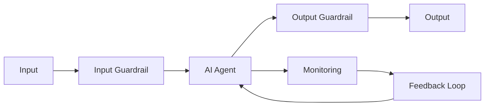
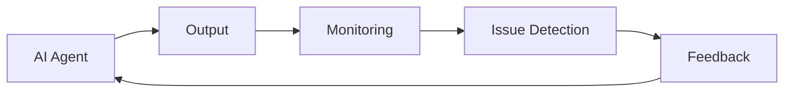

## Harness Engineering

- Harness Engineering은 **AI agent가 안전하고 예측 가능하게 동작하도록 설계된 제어 구조**입니다.
    - 자동차·항공 분야의 "안전 제어 시스템"에서 유래한 개념으로, AI 개발에 적용됩니다.
    - agent의 허용 범위 밖 행동을 차단하고, 동작을 감시하며, 오류를 다음 동작에 반영하는 체계 전체를 가리킵니다.

- 2025년이 AI agent 도입의 원년이었다면, **2026년은 agent를 안전하게 운용하는 harness가 핵심 과제**로 부상한 시기입니다.
    - AI agent가 단순 실험을 넘어 실제 service에 적용되면서, 제어되지 않은 동작으로 인한 보안 사고와 compliance 위반이 실질적 문제로 대두되었습니다.

### Harness의 3가지 기능

- **제어(Control)** : agent가 허용된 범위 밖의 행동을 하지 못하도록 제한합니다.
- **감시(Monitoring)** : 동작 상태와 출력 결과를 실시간으로 추적합니다.
- **개선(Feedback)** : 오류를 감지하고 차후 동작에 반영합니다.

---

## Guardrail

- Guardrail은 **입력과 출력 양쪽을 기술적으로 제어**하여 agent가 설계된 목적 범위 밖으로 동작하는 것을 차단합니다.
    - Meta의 Llama Guard, NVIDIA의 NeMo Guardrails 등이 대표적인 구현체입니다.

### 입력 단계 제어

- **prompt injection 탐지 및 차단** : 악의적인 지시를 숨긴 입력을 탐지합니다.
- **기밀 정보 혼입 방지** : 민감한 정보가 포함된 입력을 걸러냅니다.

### 출력 단계 제어

- **유해 Contents Filtering** : agent가 생성한 유해한 출력을 차단합니다.
- **Hallucination Filtering** : 사실과 다른 정보를 자동으로 걸러냅니다.

---

## Data Governance

- Data Governance는 **AI agent가 사용하는 data의 품질, 접근 권한, 관리 방식을 조직 차원의 통일된 기준으로 운용**하는 체계입니다.
    - Microsoft Purview 같은 도구로 기업 내 AI 사용 현황을 monitoring합니다.

- Data Governance는 세 가지 mechanism으로 구성됩니다.
    - **입력 관리** : 개인 정보와 기밀 data를 자동 검수하고 익명화합니다.
    - **접근 권한 제어** : 직급 및 역할에 따라 정보 접근 범위를 제한합니다.
    - **출력 검증** : 생성된 답변의 무결성과 compliance 충족 여부를 확인합니다.

---

## Monitoring과 Feedback Loop

- Monitoring은 **agent의 동작 상태와 출력 결과를 실시간으로 추적**합니다.
    - 비정상적인 행동 pattern을 감지하고 즉시 알림을 발송합니다.

- Feedback Loop는 **발견된 문제를 다음 동작에 반영하는 지속적 개선 구조**입니다.
    - 오류 사례가 축적될수록 agent의 동작이 점진적으로 정교해집니다.

---

## Shadow AI

- Shadow AI는 **조직의 공식 승인 없이 직원들이 무단으로 AI 도구를 도입하고 사용하는 현상**입니다.
    - data 유출, 품질 불균형, 책임 소재 불명확 등의 위험이 발생합니다.

- Harness는 Shadow AI를 방지하는 제도적 장치 역할을 합니다.
    - 승인된 AI 도구만 사용하도록 강제하고, 사용 이력을 추적합니다.

---

## Harness 적용 효과

- Harness를 적용하면 **service 안정성, 보안, 확장성, 예측 가능성**이 향상됩니다.

| 구분 | Harness 미적용 | Harness 적용 |
| --- | --- | --- |
| **안정성** | 동작 불안정 | service 안정성 확보 |
| **보안** | 보안 사고 위험 | 통일된 안전 기준 유지 |
| **확장성** | scale 확장 한계 | 빠른 scale 확장 기반 |
| **예측 가능성** | 낮음 | 예측 가능성 향상 |
| **규정 준수** | compliance 위반 위험 | compliance 확인 체계 확보 |

---

## Reference

- <https://channel.io/ko/blog/articles/what-is-harness-2611ddf1>
- <https://arxiv.org/abs/2404.01852>

