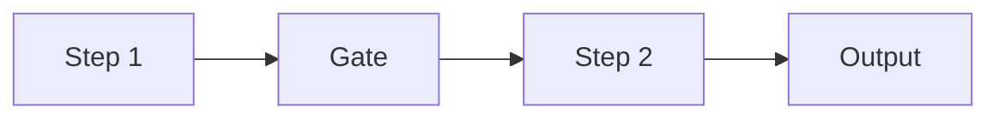
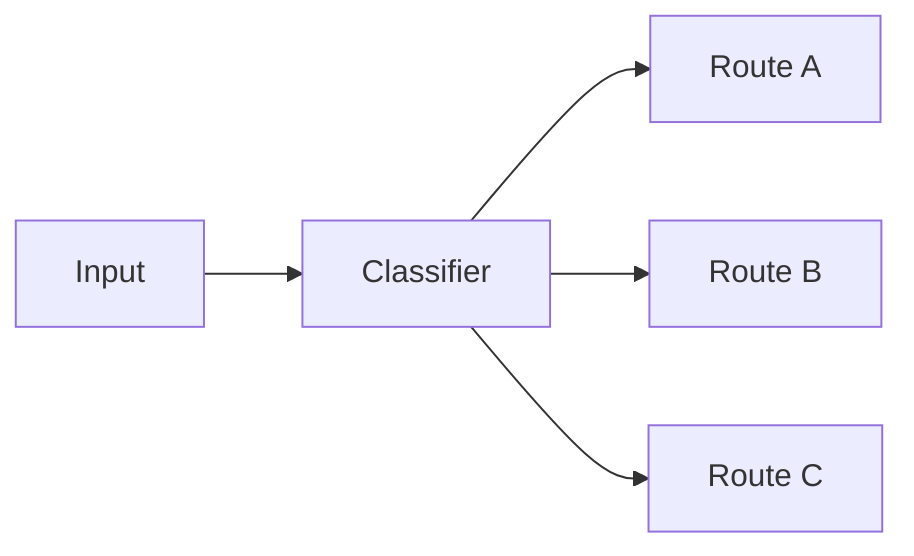
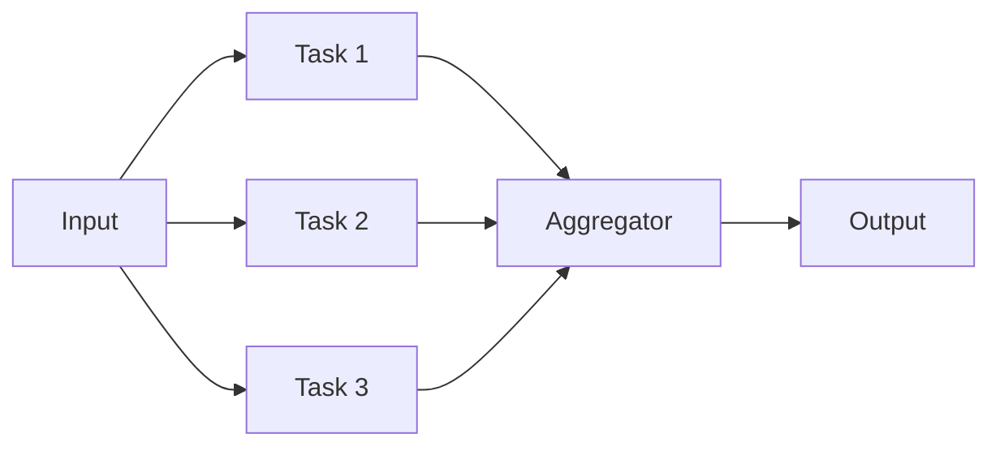
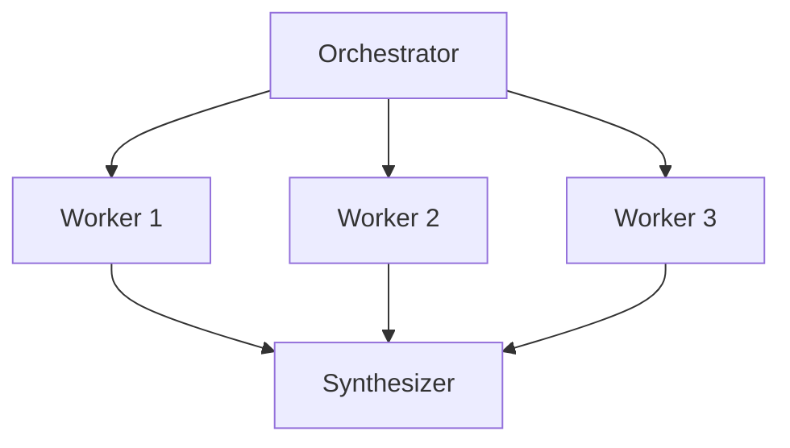
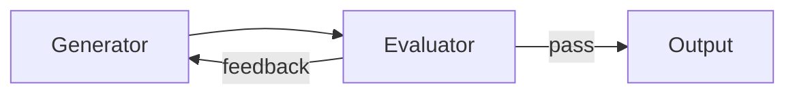
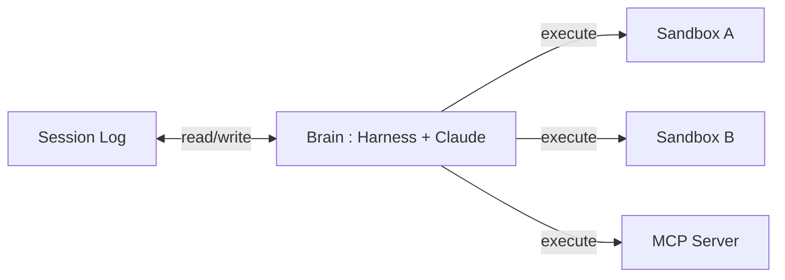
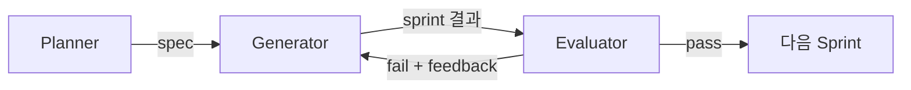

## Agentic System의 분류

- Anthropic은 agentic system을 **workflow와 agent**라는 두 갈래로 구분합니다.
    - 두 접근 방식은 배타적이지 않으며, 실제 production에서는 조합하여 사용합니다.
    - 핵심 원칙은 가능한 가장 단순한 해결책을 먼저 찾고, 필요할 때만 복잡성을 추가하는 것입니다.

- **workflow**는 LLM과 도구가 사전 정의된 code 경로를 따라 orchestration되는 system입니다.
    - 작업 단계가 미리 결정되어 있어 예측 가능하고 일관된 결과를 보장합니다.
    - 잘 정의된 작업에서 latency와 비용을 통제하면서 높은 정확도를 달성하는 데 적합합니다.

- **agent**는 LLM이 자신의 process와 도구 사용을 동적으로 결정하는 system입니다.
    - 각 단계에서 tool call 결과나 code 실행 같은 ground truth를 환경에서 얻어 진행 상황을 평가합니다.
    - 자율성이 높은 만큼 비용이 크고 error가 누적될 위험이 있어, sandbox와 guardrail이 필수입니다.

| 구분 | Workflow | Agent |
| --- | --- | --- |
| **제어 주체** | 사전 정의된 code 경로 | LLM의 동적 판단 |
| **경로 예측** | 예측 가능 | 예측 불가 |
| **적합한 작업** | 잘 정의된 반복 작업 | 열린 문제, 탐색적 작업 |
| **trade-off** | 일관성과 예측 가능성 | 유연성과 비용/latency 증가 |

---

## Workflow Pattern

- Anthropic은 production에서 반복적으로 효과가 검증된 5가지 workflow pattern을 **prompt chaining, routing, parallelization, orchestrator-workers, evaluator-optimizer**로 정리했습니다.
    - 이 pattern들은 따라야 하는 규칙이 아니라 필요에 따라 조합하고 변형하는 building block입니다.
    - 복잡성은 결과를 측정 가능하게 개선할 때만 추가하는 것이 원칙입니다.

### Prompt Chaining

- 작업을 **순차적 단계로 분해하여, 각 LLM 호출이 이전 출력을 입력으로 받는 구조**입니다.
    - 중간 단계에 programmatic check(gate)를 넣어 진행 방향을 검증합니다.
    - latency를 허용하는 대신 각 단계의 작업을 단순화하여 정확도를 높입니다.
    - marketing 문구 생성 후 번역, 문서 outline 작성 후 검증 후 본문 작성 같은 작업에 적합합니다.

### Routing

- 입력을 **분류하여 전문화된 후속 작업으로 분기하는 구조**입니다.
    - 관심사를 분리하여, 한 유형의 입력에 대한 최적화가 다른 유형의 성능을 해치지 않게 합니다.
    - LLM이나 기존 분류 algorithm으로 routing을 수행합니다.
    - 고객 문의를 일반 질문, 환불 요청, 기술 지원으로 분기하는 작업에 적합합니다.

### Parallelization

- 작업을 **동시에 실행하고 결과를 programmatic하게 집계하는 구조**로, 두 가지 변형이 있습니다.
    - **sectioning** : 작업을 독립적인 하위 작업으로 나누어 병렬 실행합니다.
    - **voting** : 같은 작업을 여러 번 실행하여 다양한 출력을 얻고 비교합니다.
    - guardrail과 core response를 별도 instance로 병렬 처리하거나, code 취약점 검토를 여러 prompt로 병렬 수행하는 작업에 적합합니다.

### Orchestrator-Workers

- 중앙 LLM이 **작업을 동적으로 분해하고, worker LLM에게 위임하고, 결과를 종합하는 구조**입니다.
    - parallelization과 위상적으로 유사하지만, 하위 작업이 사전 정의되지 않고 orchestrator가 입력에 따라 결정한다는 점이 다릅니다.
    - 여러 file을 동시에 수정하는 coding 작업이나, 다수 출처에서 정보를 수집하는 검색 작업에 적합합니다.

### Evaluator-Optimizer

- 하나의 LLM이 **결과를 생성하고, 다른 LLM이 평가와 feedback을 제공하는 반복 구조**입니다.
    - 명확한 평가 기준이 있고, 반복적 개선이 측정 가능한 가치를 제공할 때 효과적입니다.
    - 사람이 feedback을 주면 결과가 개선되는 작업, 그리고 LLM이 그 수준의 feedback을 제공할 수 있는 작업에 적합합니다.
    - 문학 번역에서 뉘앙스를 잡아내는 반복 개선이나, 여러 round의 검색과 분석이 필요한 복합 검색에 적합합니다.

---

## Brain과 Hands의 분리

- Anthropic의 Managed Agents가 도달한 핵심 설계 원리는 **brain(Claude와 harness)과 hands(sandbox와 도구)를 분리하는 것**입니다.
    - 초기에는 session, harness, sandbox를 하나의 container에 넣었으나, 이는 "pets vs cattle" 문제를 발생시켰습니다.
    - container가 죽으면 session이 유실되고, 응답이 없으면 container 안에 들어가 debugging해야 했으며, container에 사용자 data가 있어 접근 자체가 제한되었습니다.

- **pets vs cattle**은 infra 관리에서 자원을 다루는 두 가지 상반된 태도를 가리키는 비유입니다.
    - **pets** : 이름을 붙이고 정성껏 돌보는 애완 동물처럼, 각 instance가 고유하고 수작업으로 관리되며 죽으면 복구가 어려운 자원입니다.
    - **cattle** : 번호로 관리되는 가축처럼, instance가 서로 교체 가능하고 죽으면 새로 띄우면 그만인 자원입니다.
    - agentic system에서 session, harness, sandbox가 하나로 묶이면 전체가 pet이 되어 장애 복구가 어렵지만, 분리하면 각각을 cattle로 다룰 수 있어 어느 하나가 죽어도 system이 멈추지 않습니다.

- harness가 container를 떠나면서, **container는 다른 도구와 동일한 interface로 호출되는 cattle**이 됩니다.
    - harness는 container를 `execute(name, input)` 형태로 호출합니다.
    - container가 죽으면 harness가 tool call error로 처리하고, Claude가 재시도를 결정하면 새 container를 provision합니다.
    - harness 자체도 cattle입니다.
        - session log가 외부에 있으므로 harness가 죽어도 새 harness가 `wake(sessionId)`로 재개합니다.

### 보안 경계

- 결합된 설계에서는 Claude가 생성한 code가 credential과 같은 container에서 실행되어, prompt injection 한 번으로 token이 탈취될 수 있었습니다.
    - 구조적 해결책은 **token이 sandbox에서 절대 도달할 수 없게** 만드는 것입니다.

- Git의 경우 access token을 sandbox 초기화 시 local git remote에 내장하여, agent가 token 자체를 다루지 않고도 `push`와 `pull`이 작동합니다.
    - 외부 service의 경우 MCP proxy가 session에 연결된 token을 vault에서 가져와 호출하므로, harness와 sandbox 어디에도 credential이 노출되지 않습니다.

### 확장성

- brain과 hands가 분리되면 **many brains, many hands** 구조가 가능해집니다.

- brain 확장 측면에서, sandbox가 불필요한 session은 container를 기다리지 않고 바로 inference를 시작합니다.
    - p50 TTFT(Time To First Token)가 약 60%, p95가 90% 이상 감소했습니다.

- hands 확장 측면에서, 각 hand는 `execute(name, input)` interface를 따르므로 container, 전화기, 어떤 MCP server든 연결할 수 있습니다.
    - brain 간에 hand를 서로 넘겨줄 수도 있습니다.

---

## Session과 Context Window의 분리

- 장기 작업은 종종 Claude의 context window를 초과하며, 이를 해결하는 표준 방법은 모두 **어떤 token을 유지하고 어떤 token을 버릴지에 대한 비가역적 결정**을 수반합니다.
    - compaction은 요약을 남기고 원본을 제거하며, context trimming은 오래된 tool 결과나 thinking block을 선택적으로 삭제합니다.
    - 문제는 미래의 turn이 어떤 token을 필요로 할지 미리 알 수 없다는 점입니다.

- Managed Agents에서 session은 **context window 밖에 사는 durable log** 역할을 합니다.
    - `getEvents()` interface로 brain이 event stream의 특정 구간을 선택적으로 조회합니다.
    - 마지막으로 읽은 지점부터 이어 읽거나, 특정 시점 앞으로 되감아 맥락을 확인하거나, 특정 행동 전후를 다시 읽을 수 있습니다.

- session(복구 가능한 context 저장)과 harness(임의의 context 관리)의 관심사가 분리됩니다.
    - session은 durability와 조회 가능성만 보장합니다.
    - 어떤 context engineering이 필요한지는 harness가 결정하며, 미래 model에 어떤 방식이 필요할지 예측할 수 없으므로 이 분리가 필수적입니다.

---

## Multi-Agent Architecture

- 단일 agent의 한계를 극복하기 위해, **planner, generator, evaluator라는 세 역할을 분리한 architecture**가 등장했습니다.
    - Anthropic의 장기 실행 coding harness에서 발전한 구조로, GAN(Generative Adversarial Network)에서 영감을 받았습니다.
    - 핵심 통찰은 agent가 자기 작업을 스스로 평가하면 관대한 bias가 생기므로, 생성과 평가를 분리해야 한다는 것입니다.

- **planner**는 간단한 prompt를 받아 완전한 product spec으로 확장하는 agent입니다.
    - 1~4문장의 prompt를 구체적인 product 사양, 기능 목록, 기술 설계로 변환합니다.
    - 세부 구현보다 product context와 상위 기술 설계에 집중하도록 설계되어 있습니다.
    - planner가 세밀한 기술 사양을 미리 결정하면 오류가 하류로 전파되므로, 산출물의 범위만 제약하고 경로는 agent가 스스로 찾게 합니다.

- **generator**는 spec에서 기능을 하나씩 꺼내 sprint 단위로 구현하는 agent입니다.
    - 한 번에 하나의 기능만 작업하는 one-feature-at-a-time 방식으로 scope를 관리합니다.
    - 각 sprint 시작 전에 evaluator와 sprint 계약을 협상합니다. generator가 무엇을 만들고 어떻게 검증할지 제안하면, evaluator가 검토하고 합의될 때까지 반복합니다.

- **evaluator**는 generator의 산출물을 사용자 관점에서 실제로 test하고 점수를 매기는 agent입니다.
    - Playwright MCP를 사용하여 실행 중인 application을 직접 click하고 탐색하며, screenshot을 찍고 동작을 검증합니다.
    - 각 sprint를 product depth, functionality, visual design, code quality 같은 기준으로 평가하며, 어느 하나라도 임계값 미만이면 sprint를 실패 처리하고 구체적인 feedback을 generator에게 돌려보냅니다.

- agent 간 communication은 file을 통해 이루어집니다.
    - 한 agent가 file을 쓰면 다른 agent가 읽고 응답하는 방식으로, context window를 공유하지 않으면서 정보를 전달합니다.

---

## Model과 Harness의 공진화

- 현재의 frontier coding model은 **자신의 harness 안에서 후훈련(post-training)**됩니다.
    - Claude는 Claude Code harness에서, Codex model은 Codex harness에서 훈련됩니다.
    - 이는 model이 특정 harness에 최적화된다는 것을 의미합니다.

- Codex model이 `apply_patch`라는 file 편집 도구에 극도로 결합된 사례가 대표적입니다.
    - Claude Code의 open source 대안인 OpenCode는 Codex model을 지원하기 위해 별도의 `apply_patch` 도구를 추가해야 했습니다.
    - 범용 지능이라면 patch 방식이 바뀌어도 적응해야 하지만, harness와 함께 훈련된 model은 그렇지 못합니다.

- 역설적으로, **훈련된 harness가 항상 최선은 아닙니다**.
    - Terminal Bench 2.0에서 Opus 4.6은 Claude Code(자신이 훈련된 harness) 안에서 33위를 기록했지만, 다른 harness에서는 5위권까지 올라갔습니다.
    - 후훈련 때 보지 못한 harness가 오히려 더 나은 성능을 끌어낸 것으로, model이 자기 harness에 과적합될 수 있음을 시사합니다.
    - 기본 harness를 그대로 사용하는 것이 최선이 아닐 수 있으며, 자신의 작업 특성에 맞게 harness를 customization하면 의미 있는 성능 향상을 얻을 수 있습니다.

---

## Harness 설계 원칙

- 여러 팀의 실험과 연구에서 공통적으로 도출된, **도구와 시대에 종속되지 않는 설계 원칙**이 여럿 있습니다.
    - 특정 도구나 model에 의존하지 않고, agentic system을 설계할 때 보편적으로 적용할 수 있는 지침입니다.

### 실패에서 시작하라

- 이상적인 harness를 미리 설계하려 하지 말고, **agent가 실제로 실패할 때마다 그 실패를 구조적으로 방지하는 장치를 추가**합니다.
    - Mitchell Hashimoto의 원칙입니다.
    - 그의 terminal emulator Ghostty의 AGENTS.md에는 과거 agent가 저질렀던 실수들을 방지하는 규칙이 한 줄씩 쌓여 있습니다.

- 출하 편향을 가지고, agent가 실제로 실패한 경우에만 harness를 건드리는 것이 핵심입니다.

### 적게 넣어라

- ETH Zurich의 연구는 138개의 agent 설정 file을 test했는데, **LLM이 생성한 file은 성능을 오히려 떨어뜨리면서 비용만 20% 이상 높였고**, 사람이 작성한 file도 겨우 4% 개선에 그쳤습니다.
    - codebase 개요나 directory 목록은 아무 도움이 되지 않았습니다.

- 핵심은 보편적으로 적용되는 최소한의 지침만 넣는 것입니다.
    - agent는 저장소 구조를 스스로 충분히 탐색할 수 있고, 너무 많은 지침이 오히려 혼란을 줄 수 있습니다.

### 도구를 과하게 연결하지 마라

- MCP server를 많이 연결할수록 **도구 설명이 system prompt를 채우고, agent의 instruction 예산을 잡아먹습니다**.
    - CLI가 이미 훈련 data에 충분히 포함된 도구(GitHub, Docker, database 등)라면, MCP server 대신 CLI를 쓰라고 prompt하는 편이 낫습니다.

- 200K context window도 MCP 도구가 너무 많으면 실제로는 70K밖에 사용할 수 없게 됩니다.

### 점진적 작업을 강제하라

- Anthropic과 OpenAI 모두에서 **가장 큰 개선을 가져온 변화는 agent에게 한 번에 하나의 기능만 작업하게 한 것**이었습니다.

- 각 작업이 끝나면 Git commit과 진행 노트를 남기게 해서, 다음 session이 깨끗한 상태에서 시작할 수 있게 합니다.
    - agent가 고전하면 그것을 신호로 삼아 무엇이 빠져 있는지(도구, guardrail, 문서) 파악하고 수정합니다.

### 성공은 조용히, 실패만 시끄럽게

- 성공한 결과는 조용히 처리하고, 실패한 결과만 agent에게 노출합니다.

- HumanLayer 팀이 도달한 원칙이며, 이 원칙 하나로 context 효율이 극적으로 개선된 사례가 있습니다.
    - 초기에 전체 test suite를 매번 실행했더니 4,000줄의 통과 결과가 context를 범람시켰고, **agent가 실제 작업 맥락을 잃어버렸습니다**.
    - 성공한 test case는 context에 남기지 않고, 실패한 test case만 남겨서 agent가 문제 해결에 집중하도록 해, context 효율을 극적으로 개선했습니다.

---

## Reference

- <https://www.anthropic.com/engineering/building-effective-agents>
- <https://www.anthropic.com/engineering/effective-harnesses-for-long-running-agents>
- <https://www.anthropic.com/engineering/harness-design-long-running-apps>
- <https://www.anthropic.com/engineering/managed-agents>
- <https://openai.com/index/harness-engineering/>
- <https://mitchellh.com/writing/my-ai-adoption-journey>
- <https://magazine.sebastianraschka.com/p/components-of-a-coding-agent>
- <https://wikidocs.net/blog/@jaehong/9481/>

