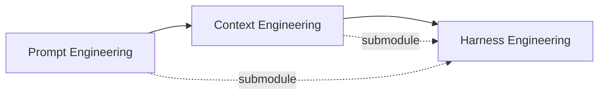
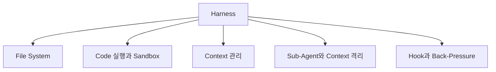
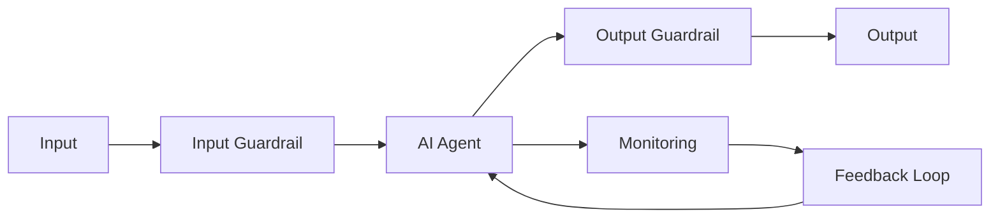

## Harness Engineering

- harness engineering은 **AI agent가 안정적이고 예측 가능하게 동작하도록, model 외부의 system 전체를 설계하는 분야**입니다.
    - harness(마구)는 원래 말의 힘을 올바른 방향으로 전달하는 장비를 뜻하며, AI에서는 model의 능력을 올바른 방향으로 발휘시키는 외부 system을 가리킵니다.
    - LangChain은 이 관계를 **Agent = Model + Harness** 라는 공식으로 정리했습니다.
    - model이 아닌 모든 것, 즉 system prompt, 도구 정의, sandbox 환경, orchestration logic, feedback loop, memory 관리, middleware hook까지 전부 harness의 영역입니다.

- harness를 computer에 비유하면, **model은 CPU이고, context window는 RAM이며, harness는 OS**입니다.
    - CPU가 아무리 빨라도 OS가 엉망이면 computer는 제대로 돌아가지 않습니다.
    - model이 아무리 뛰어나도 harness가 나쁘면 agent는 제대로 일하지 못합니다.

- harness engineering이라는 이름을 처음 붙인 사람은 HashiCorp 공동 창립자 Mitchell Hashimoto입니다.
    - 2026년 2월 blog에서 harness engineering을 "agent가 실수할 때마다, 그 실수가 다시는 발생하지 않도록 engineering하는 것"으로 정의했습니다.
    - 단순히 prompt를 고치는 것이 아니라, 구조적으로 재발을 막는 system을 만드는 것입니다.


---


## Paradigm 전환의 흐름

- AI 활용 방법론은 **Prompt Engineering, Context Engineering, Harness Engineering** 순서로 전환되어 왔으며, 각 시대는 이전 시대를 대체하지 않고 포함합니다.
    - prompt engineering이 사라진 것이 아니라 harness engineering의 하위 module이 되었습니다.
    - "agent가 실수하면 agent가 아니라 harness를 고쳐라"는 원칙이 핵심입니다.




### Prompt Engineering (2022~)

- **AI에게 어떻게 물어볼 것인가**에 집중한 시기입니다.
    - zero-shot, few-shot, chain-of-thought 같은 기법으로 단일 입력의 품질을 높이는 데 초점을 맞췄습니다.

- 한계 : prompt 하나로 복잡한 작업을 완결하기 어렵고, 맥락이 부족하면 결과가 불안정합니다.


### Context Engineering (2024~)

- **AI에게 무엇을 알려줄 것인가**로 초점이 이동한 시기입니다.
    - AGENTS.md, RAG, memory, MCP 같은 도구로 project 전체의 지식을 agent에게 전달하는 방법을 다뤘습니다.

- 한계 : 올바른 맥락을 줘도 agent가 중간에 탈선하거나, 맥락이 길어지면 추론 능력이 저하됩니다.


### Harness Engineering (2026~)

- **AI가 일하는 환경 전체를 어떻게 설계할 것인가**가 핵심 과제가 된 시기입니다.
    - "AI에게 깨끗한 code를 쓰라고 말하는 것"과 "깨끗한 code만 나올 수 있는 환경을 만드는 것"은 근본적으로 다른 문제입니다.

- LangChain은 동일한 model에서 harness만 개선하여 coding benchmark 순위를 30위권에서 5위권으로 끌어올렸고, OpenAI Codex 팀은 잘 설계된 harness 위에서 agent를 돌려 사람이 직접 작성한 code 없이 100만 줄 규모의 product을 만들어냈습니다.
    - 두 사례 모두 model의 한계가 아니라 harness의 설계가 결과를 가른다는 점을 보여줍니다.


---


## 왜 Model만으로는 부족한가

- LLM의 본질은 **text를 입력받아 text를 출력하는 stateless 함수**입니다.
    - session 간 상태 유지, code 실행, 실시간 정보 접근, 환경 구성과 package 설치 등은 LLM 자체로는 불가능합니다.
    - "채팅"이라는 단순한 UX조차 이전 message를 추적하고 이어붙이는 while loop, 즉 가장 기본적인 harness의 산물입니다.

- agent에게 복잡한 작업을 맡길수록 harness의 중요성은 기하급수적으로 커집니다.
    - Anthropic 연구팀이 최전선 model에게 고수준 지시를 주고 여러 context window에 걸쳐 작업시켰을 때, agent가 모든 것을 한 번에 해결하려 달려들다 context가 바닥나 절반만 구현된 code를 남기는 실패가 반복되었습니다.
    - 어느 정도 진행된 후에는 agent가 스스로 "다 됐다"라며 조기 종료를 선언하는 실패도 반복되었습니다.

- 교대 근무하는 engineer에 비유하면, **매번 새 engineer가 이전 근무자의 기억 없이 출근하는데 인수인계 문서도, 진행 상황 board도, test 환경도 없는 상태**와 같습니다.
    - 아무리 뛰어난 engineer라도 이런 환경에서는 제대로 일할 수 없습니다.
    - harness는 바로 이 인수인계 체계, 작업 환경, feedback 구조를 agent에게 제공합니다.


---


## Agent Loop : Harness의 골격

- agent loop는 **LLM이 tool 호출과 결과 관찰을 반복하면서 하나의 작업을 완수하도록 만드는 while loop**입니다.
    - 한 번의 LLM 호출로 끝나는 단발성 응답이 아니라, "생각 -> 도구 호출 -> 관찰 -> 다시 생각"이 자동으로 이어집니다.
    - LLM은 매 turn 환경에서 ground truth를 받아 다음 행동을 정하므로, 처음부터 모든 정보를 알지 못해도 점진적으로 작업을 완성합니다.

- agent loop는 모든 LLM agent의 가장 근본적인 골격이며, harness의 다른 모든 구성 요소는 이 loop를 감싸거나 보강합니다.
    - LLM은 stateless 함수이므로 반복과 상태 유지는 LLM 바깥의 application code가 책임집니다.
    - 이 바깥 code 전체가 harness이며, agent loop는 그중 가장 안쪽 골격에 해당합니다.

- 가장 단순한 agent loop는 **stop_reason을 조건으로 하는 while loop**로 표현됩니다.
    - LLM이 `stop_reason: "tool_use"`를 반환하면 application이 도구(tool)를 실행하고 결과를 다음 호출에 포함시킵니다.
    - LLM이 `stop_reason: "end_turn"`을 반환하면 loop를 종료합니다.
    - tool 실행은 항상 application이 담당하며, LLM은 호출 의도만 선언하고 절대 직접 실행하지 않습니다.

```python
while True:
    response = client.messages.create(model=..., tools=tools, messages=messages)
    messages.append({"role": "assistant", "content": response.content})

    if response.stop_reason == "end_turn":
        break

    if response.stop_reason == "tool_use":
        tool_results = execute_tools(response.content)
        messages.append({"role": "user", "content": tool_results})
```


### Agent Loop의 본질적 한계

- agent loop는 단순하지만, 단독으로는 본질적 한계를 갖습니다.
    - **상태 휘발** : LLM은 stateless하므로 loop가 끝나면 작업 결과가 사라지며, session을 넘어 정보를 이어가려면 외부 저장소가 필요합니다.
    - **code 실행 위험** : LLM이 생성한 명령을 application이 그대로 실행하면 file system, network, 인접 process까지 영향을 받을 수 있습니다.
    - **context 부패** : loop가 길어지면 누적된 message로 인해 LLM의 추론 품질이 떨어집니다.
    - **sub task 오염** : 조사, 탐색, 구현이 한 loop에 섞이면 중간 noise가 핵심 context를 흐려 본 작업의 정확도를 떨어뜨립니다.
    - **자동 검증 부재** : LLM은 자기 결과물의 lint, type, test 통과 여부를 스스로 보장하지 못하며, 외부 검증이 없으면 오류를 그대로 끌고 갑니다.


### Harness의 보완 방식

- **file system**은 agent의 작업 결과를 disk에 저장하여 상태 휘발을 막습니다.
    - 중간 결과물, progress file, Git history가 다음 session의 출발점이 되어 LLM의 stateless한 성격을 보완합니다.

- **sandbox**는 격리된 환경에서 code를 실행하여 실행 위험을 차단합니다.
    - 허용된 명령만 실행하고, network와 file system 접근을 제한하며, 작업이 끝나면 환경을 폐기하여 부수 효과가 host로 새지 않게 합니다.

- **context 관리**는 누적된 message를 정돈하여 context 부패를 늦춥니다.
    - compaction은 오래된 history를 요약으로 치환하고, tool call offloading은 큰 출력을 file로 빼서 요약만 남기며, skill은 필요한 시점에만 관련 지침을 context에 load합니다.

- **sub-agent**는 별도 loop에서 sub task를 처리하여 context 오염을 막습니다.
    - 조사, 탐색 같은 중간 단계의 noise를 sub-agent가 흡수하고 상위 agent에게는 정제된 결과만 전달하므로, 본 작업의 context가 깨끗하게 유지됩니다.

- **hook과 back-pressure**는 외부 검증을 자동으로 끼워 넣어 검증 부재를 메웁니다.
    - tool 호출 전후에 lint, type check, test가 자동 실행되며, 실패 시 결과를 LLM에 돌려보내 수정하게 하고 성공 시 조용히 통과시켜 LLM이 잘못된 결과를 그대로 끌고 가지 못하게 합니다.


---


## Harness의 핵심 구성 요소

- harness는 **file system으로 상태를 저장하고, sandbox로 code 실행을 격리하며, context 관리로 누적된 message를 정돈하고, sub-agent로 sub task를 분리하며, hook과 back-pressure로 결과물을 자동 검증**합니다.

- harness 구성은 사람이 정한 임의의 분류가 아니라, **agent가 스스로 발명해도 같은 결과에 도달하는 구조**라는 점이 Meta의 HyperAgents 연구에서 확인되었습니다.
    - HyperAgents는 agent가 자기 자신의 동작 방식을 개선하도록 반복 시켰을 때, 어떤 보조 구조가 자생적으로 등장하는지 관찰한 실험입니다.
    - 실험 결과 agent가 만들어낸 보조 구조는 file 기반 작업 공간, 격리된 실행 환경, context 압축, 역할 분담 sub-agent, 검증 hook으로 수렴했으며, 개발자가 수작업으로 다듬어 온 harness의 핵심 요소와 그대로 일치했습니다.
    - 즉 file system, sandbox, context 관리, sub-agent, hook은 LLM agent를 안정적으로 운영하려 할 때 필연적으로 도달하는 최소 조합에 가깝습니다.




### File System

- file system은 **가장 근본적인 harness primitive**입니다.
    - agent에게 작업 공간을 주고, 중간 결과물을 저장하게 하고, session을 넘어 상태를 유지하게 합니다.
    - Git을 더하면 version 관리가 가능해져서, agent가 실수를 되돌리거나 실험적 branch를 만들 수 있습니다.

- Anthropic이 장기 실행 agent를 위해 도입한 progress file이 좋은 예입니다.
    - 각 agent session이 자신이 한 일을 기록하고, 다음 session이 이 file과 Git log를 읽고 현재 상태를 파악합니다.


### Code 실행과 Sandbox

- tool call은 agent의 손과 발이지만, 모든 가능한 행동을 미리 도구로 만들어둘 수는 없습니다.
    - bash와 code 실행이 범용 도구로 등장하여, agent가 필요한 도구를 즉석에서 code로 만들어 사용합니다.

- agent가 생성한 code를 local에서 바로 실행하는 것은 위험하므로 sandbox가 필요합니다.
    - 격리된 환경에서 code를 실행하고, 허용된 명령만 실행하며, network를 제한합니다.
    - sandbox는 필요에 따라 생성하고 작업이 끝나면 폐기할 수 있어, 대규모 agent workload를 처리할 수 있습니다.


### Context 관리

- context 관리는 **harness engineering에서 가장 비중이 큰 영역**입니다.
    - model은 context 길이가 늘어날수록 추론 능력이 떨어지며, 이를 "context 부패(context rot)"라고 부릅니다.
    - context window가 채워질수록 agent가 점점 부정확해지는 현상이 발생합니다.

- harness는 context에 무엇을 넣고, 무엇을 덜어내고, 무엇을 필요할 때만 부르는지를 결정함으로써 context 부패에 대응합니다.
    - **compaction**(압축)은 context가 한계에 다다르면 기존 내용을 요약하고 덜어내 agent가 계속 작업할 수 있게 합니다.
    - **tool call offloading**은 대용량 tool 출력의 앞뒤만 남기고 전체를 file로 빼서, 필요할 때만 참조하게 합니다.
    - **skill**은 점진적 공개(progressive disclosure) 방식으로, agent가 실제로 필요할 때만 관련 지침과 도구를 context에 load합니다.


### Sub-Agent와 Context 격리

- sub-agent의 진짜 가치는 역할 분담이 아니라 **context 격리**에 있습니다.
    - sub-agent가 조사, 탐색, 구현 같은 중간 과정의 noise를 전부 흡수하고, 상위 agent에게는 최종 결과만 간결하게 전달합니다.
    - 일종의 "context 방화벽"입니다.

- "context window를 더 크게 만들면 해결되지 않느냐"는 반론이 있지만, 큰 context window는 더 큰 건초더미일 뿐입니다.
    - 바늘을 찾는 능력이 좋아지는 것이 아니라, 건초더미만 커집니다.
    - 필요한 것은 더 긴 context가 아니라 더 나은 context 격리입니다.


### Hook과 Back-Pressure

- hook은 **agent의 생명 주기 특정 시점에 자동으로 실행되는 사용자 정의 script**입니다.
    - agent가 작업을 마칠 때마다 type check와 formatter를 자동 실행하고, error가 있으면 agent에게 다시 돌려보내고, 성공하면 조용히 넘어갑니다.

- back-pressure는 **agent가 자기 작업을 스스로 검증하게 만드는 mechanism**입니다.
    - type check, test, coverage report, browser 자동화 test 등이 여기에 해당합니다.
    - "성공은 조용히, 실패만 시끄럽게"라는 원칙 하나로 context 효율이 극적으로 개선됩니다.


---


## 안전과 Governance

- harness는 agent의 생산성을 높이는 구조일 뿐 아니라, **agent가 허용된 범위 밖으로 벗어나지 못하도록 제어하는 안전 장치**이기도 합니다.
    - 2025년이 AI agent 도입의 원년이었다면, 2026년은 agent를 안전하게 운용하는 harness가 핵심 과제로 부상한 시기입니다.
    - agent가 실제 service에 적용되면서 제어되지 않은 동작으로 인한 보안 사고와 compliance 위반이 실질적 문제로 대두되었습니다.

- 안전 관점에서 harness는 **제어(Control), 감시(Monitoring), 개선(Feedback)** 세 기능을 수행합니다.
    - **제어** : agent가 허용된 범위 밖의 행동을 하지 못하도록 제한합니다.
    - **감시** : 동작 상태와 출력 결과를 실시간으로 추적합니다.
    - **개선** : 오류를 감지하고 차후 동작에 반영합니다.




### Guardrail

- Guardrail은 **입력과 출력 양쪽을 기술적으로 제어**하여 agent가 설계된 목적 범위 밖으로 동작하는 것을 차단합니다.
    - Meta의 Llama Guard, NVIDIA의 NeMo Guardrails 등이 대표적인 구현체입니다.

- 입력 단계에서는 **prompt injection 탐지**와 **기밀 정보 혼입 방지**가 핵심입니다.
    - 악의적인 지시를 숨긴 입력을 탐지하고, 민감한 정보가 포함된 입력을 걸러냅니다.

- 출력 단계에서는 **유해 contents filtering**과 **hallucination filtering**이 수행됩니다.
    - agent가 생성한 유해한 출력을 차단하고, 사실과 다른 정보를 자동으로 걸러냅니다.


### Data Governance

- Data Governance는 **AI agent가 사용하는 data의 품질, 접근 권한, 관리 방식을 조직 차원의 통일된 기준으로 운용**하는 체계입니다.
    - Microsoft Purview 같은 도구로 기업 내 AI 사용 현황을 monitoring합니다.

- Data Governance는 **입력 관리, 접근 권한 제어, 출력 검증** 세 mechanism으로 구성됩니다.
    - **입력 관리** : 개인 정보와 기밀 data를 자동 검수하고 익명화합니다.
    - **접근 권한 제어** : 직급 및 역할에 따라 정보 접근 범위를 제한합니다.
    - **출력 검증** : 생성된 답변의 무결성과 compliance 충족 여부를 확인합니다.


### Shadow AI

- Shadow AI는 **조직의 공식 승인 없이 직원들이 무단으로 AI 도구를 도입하고 사용하는 현상**입니다.
    - data 유출, 품질 불균형, 책임 소재 불명확 등의 위험이 발생합니다.

- harness는 Shadow AI를 방지하는 제도적 장치 역할을 합니다.
    - 승인된 AI 도구만 사용하도록 강제하고, 사용 이력을 추적합니다.


### Harness 적용 효과

- harness를 적용하면 **service 안정성, 보안, 확장성, 예측 가능성**이 향상됩니다.

| 구분 | Harness 미적용 | Harness 적용 |
| --- | --- | --- |
| **안정성** | 동작 불안정 | service 안정성 확보 |
| **보안** | 보안 사고 위험 | 통일된 안전 기준 유지 |
| **확장성** | scale 확장 한계 | 빠른 scale 확장 기반 |
| **예측 가능성** | 낮음 | 예측 가능성 향상 |
| **규정 준수** | compliance 위반 위험 | compliance 확인 체계 확보 |


---


## Reference

- <https://mitchellh.com/writing/my-ai-adoption-journey>
- <https://www.anthropic.com/engineering/building-effective-agents>
- <https://www.anthropic.com/engineering/managed-agents>
- <https://www.anthropic.com/engineering/harness-design-long-running-apps>
- <https://openai.com/index/harness-engineering/>
- <https://cobusgreyling.medium.com/hyperagents-by-meta-892580e14f5b>
- <https://wikidocs.net/blog/@jaehong/9481/>
- <https://magazine.sebastianraschka.com/p/components-of-a-coding-agent>
- <https://news.hada.io/weekly/202615>
- <https://channel.io/ko/blog/articles/what-is-harness-2611ddf1>
- <https://arxiv.org/abs/2404.01852>

