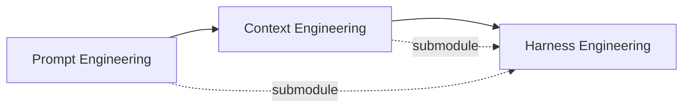
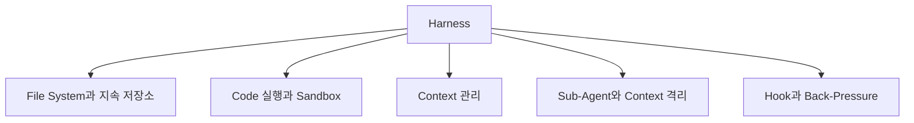

## Harness Engineering

- harness engineering은 **AI agent가 안정적이고 예측 가능하게 동작하도록, model 외부의 system 전체를 설계하는 분야**입니다.
    - harness(마구)는 원래 말의 힘을 올바른 방향으로 전달하는 장비를 뜻하며, AI에서는 model의 능력을 올바른 방향으로 발휘시키는 외부 system을 가리킵니다.
    - LangChain은 이 관계를 **Agent = Model + Harness** 라는 공식으로 정리했습니다.
    - model이 아닌 모든 것, 즉 system prompt, 도구 정의, sandbox 환경, orchestration logic, feedback loop, memory 관리, middleware hook까지 전부 harness의 영역입니다.

- harness를 computer에 비유하면, **model은 CPU이고, context window는 RAM이며, harness는 OS**입니다.
    - CPU가 아무리 빨라도 OS가 엉망이면 computer는 제대로 돌아가지 않습니다.
    - model이 아무리 뛰어나도 harness가 나쁘면 agent는 제대로 일하지 못합니다.

- 이 개념에 처음 이름을 붙인 사람은 HashiCorp 공동 창립자 Mitchell Hashimoto입니다.
    - 2026년 2월 blog에서 harness engineering을 "agent가 실수할 때마다, 그 실수가 다시는 발생하지 않도록 engineering하는 것"으로 정의했습니다.
    - 단순히 prompt를 고치는 것이 아니라, 구조적으로 재발을 막는 system을 만드는 것입니다.

---

## Paradigm 전환의 흐름

- AI 활용 방법론은 **Prompt Engineering, Context Engineering, Harness Engineering** 순서로 전환되어 왔으며, 각 시대는 이전 시대를 대체하지 않고 포함합니다.
    - prompt engineering이 사라진 것이 아니라 harness engineering의 하위 module이 되었습니다.
    - "agent가 실수하면 agent가 아니라 harness를 고쳐라"는 원칙이 핵심입니다.

### Prompt Engineering (2022~)

- **AI에게 어떻게 물어볼 것인가**에 집중한 시기입니다.
    - zero-shot, few-shot, chain-of-thought 같은 기법으로 단일 입력의 품질을 높이는 데 초점을 맞췄습니다.

- 한계 : prompt 하나로 복잡한 작업을 완결하기 어렵고, 맥락이 부족하면 결과가 불안정합니다.

### Context Engineering (2024~)

- **AI에게 무엇을 알려줄 것인가**로 초점이 이동한 시기입니다.
    - AGENTS.md, RAG, memory, MCP 같은 도구로 project 전체의 지식을 agent에게 전달하는 방법을 다뤘습니다.

- 한계 : 올바른 맥락을 줘도 agent가 중간에 탈선하거나, 맥락이 길어지면 추론 능력이 저하됩니다.

### Harness Engineering (2026~)

- **AI가 일하는 환경 전체를 어떻게 설계할 것인가**가 핵심 과제가 된 시기입니다.
    - "AI에게 깨끗한 code를 쓰라고 말하는 것"과 "깨끗한 code만 나올 수 있는 환경을 만드는 것"은 근본적으로 다른 문제입니다.

- LangChain은 동일한 model에서 harness만 개선하여 coding benchmark 순위를 30위권에서 5위권으로 끌어올렸고, OpenAI Codex 팀은 잘 설계된 harness 위에서 agent를 돌려 사람이 직접 작성한 code 없이 100만 줄 규모의 product을 만들어냈습니다.
    - 두 사례 모두 model의 한계가 아니라 harness의 설계가 결과를 가른다는 점을 보여줍니다.

---

## 왜 Model만으로는 부족한가

- LLM의 본질은 **text를 입력받아 text를 출력하는 stateless 함수**입니다.
    - session 간 상태 유지, code 실행, 실시간 정보 접근, 환경 구성과 package 설치 등은 LLM 자체로는 불가능합니다.
    - "채팅"이라는 단순한 UX조차 이전 message를 추적하고 이어붙이는 while loop, 즉 가장 기본적인 harness의 산물입니다.

- agent에게 복잡한 작업을 맡길수록 harness의 중요성은 기하급수적으로 커집니다.
    - Anthropic 연구팀이 최전선 model에게 고수준 지시를 주고 여러 context window에 걸쳐 작업시켰을 때, 두 가지 실패 pattern이 반복되었습니다.
    - 첫째, agent가 모든 것을 한 번에 해결하려 달려들다 context가 바닥나 절반만 구현된 code를 남겼습니다.
    - 둘째, 어느 정도 진행된 후에는 스스로 "다 됐다"라며 조기 종료를 선언했습니다.

- 교대 근무하는 engineer에 비유하면, **매번 새 engineer가 이전 근무자의 기억 없이 출근하는데 인수인계 문서도, 진행 상황 board도, test 환경도 없는 상태**와 같습니다.
    - 아무리 뛰어난 engineer라도 이런 환경에서는 제대로 일할 수 없습니다.
    - harness는 바로 이 인수인계 체계, 작업 환경, feedback 구조를 agent에게 제공합니다.

---

## Harness의 핵심 구성 요소

- 효과적인 harness는 **file system, code 실행 환경, context 관리, sub-agent, hook과 back-pressure**라는 다섯 가지 축으로 구성됩니다.
    - 이 구성 요소들은 Meta의 HyperAgents 연구에서도 확인되었는데, agent가 자기 개선을 반복했을 때 독립적으로 발명한 구조가 개발자가 수작업으로 만들던 harness의 핵심 요소와 정확히 일치합니다.

### File System과 지속 저장소

- file system은 **가장 근본적인 harness primitive**입니다.
    - agent에게 작업 공간을 주고, 중간 결과물을 저장하게 하고, session을 넘어 상태를 유지하게 합니다.
    - Git을 더하면 version 관리가 가능해져서, agent가 실수를 되돌리거나 실험적 branch를 만들 수 있습니다.

- Anthropic이 장기 실행 agent를 위해 도입한 progress file이 좋은 예입니다.
    - 각 agent session이 자신이 한 일을 기록하고, 다음 session이 이 file과 Git log를 읽고 현재 상태를 파악합니다.

### Code 실행과 Sandbox

- tool call은 agent의 손과 발이지만, 모든 가능한 행동을 미리 도구로 만들어둘 수는 없습니다.
    - bash와 code 실행이 범용 도구로 등장하여, agent가 필요한 도구를 즉석에서 code로 만들어 사용합니다.

- agent가 생성한 code를 local에서 바로 실행하는 것은 위험하므로 sandbox가 필요합니다.
    - 격리된 환경에서 code를 실행하고, 허용된 명령만 실행하며, network를 제한합니다.
    - sandbox는 필요에 따라 생성하고 작업이 끝나면 폐기할 수 있어, 대규모 agent workload를 처리할 수 있습니다.

### Context 관리

- context 관리는 **harness engineering의 핵심 전장**입니다.
    - model은 context 길이가 늘어날수록 추론 능력이 떨어지며, 이를 "context 부패(context rot)"라고 부릅니다.
    - context window가 채워질수록 agent가 점점 부정확해지는 현상이 발생합니다.

- harness는 context에 무엇을 넣고, 무엇을 덜어내고, 무엇을 필요할 때만 부르는지를 결정함으로써 context 부패에 대응합니다.
    - **compaction**(압축)은 context가 한계에 다다르면 기존 내용을 요약하고 덜어내 agent가 계속 작업할 수 있게 합니다.
    - **tool call offloading**은 대용량 tool 출력의 앞뒤만 남기고 전체를 file로 빼서, 필요할 때만 참조하게 합니다.
    - **skill**은 점진적 공개(progressive disclosure) 방식으로, agent가 실제로 필요할 때만 관련 지침과 도구를 context에 load합니다.

### Sub-Agent와 Context 격리

- sub-agent의 진짜 가치는 역할 분담이 아니라 **context 격리**에 있습니다.
    - sub-agent가 조사, 탐색, 구현 같은 중간 과정의 noise를 전부 흡수하고, 상위 agent에게는 최종 결과만 간결하게 전달합니다.
    - 일종의 "context 방화벽"입니다.

- "context window를 더 크게 만들면 해결되지 않느냐"는 반론이 있지만, 큰 context window는 더 큰 건초더미일 뿐입니다.
    - 바늘을 찾는 능력이 좋아지는 것이 아니라, 건초더미만 커집니다.
    - 필요한 것은 더 긴 context가 아니라 더 나은 context 격리입니다.

### Hook과 Back-Pressure

- hook은 **agent의 생명 주기 특정 시점에 자동으로 실행되는 사용자 정의 script**입니다.
    - agent가 작업을 마칠 때마다 type check와 formatter를 자동 실행하고, error가 있으면 agent에게 다시 돌려보내고, 성공하면 조용히 넘어갑니다.

- back-pressure는 **agent가 자기 작업을 스스로 검증하게 만드는 mechanism**입니다.
    - type check, test, coverage report, browser 자동화 test 등이 여기에 해당합니다.
    - "성공은 조용히, 실패만 시끄럽게"라는 원칙 하나로 context 효율이 극적으로 개선됩니다.

---

## Reference

- <https://mitchellh.com/writing/my-ai-adoption-journey>
- <https://www.anthropic.com/engineering/building-effective-agents>
- <https://www.anthropic.com/engineering/managed-agents>
- <https://www.anthropic.com/engineering/harness-design-long-running-apps>
- <https://openai.com/index/harness-engineering/>
- <https://cobusgreyling.medium.com/hyperagents-by-meta-892580e14f5b>
- <https://wikidocs.net/blog/@jaehong/9481/>
- <https://magazine.sebastianraschka.com/p/components-of-a-coding-agent>
- <https://news.hada.io/weekly/202615>

