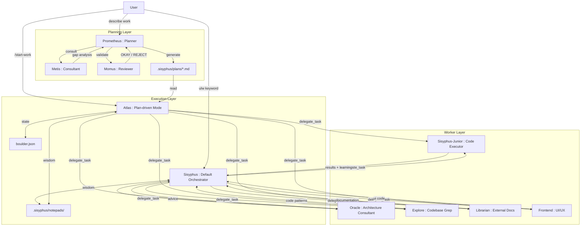

## Oh My OpenCode

- OMO는 **harness engineering의 주요 원칙이 하나의 plugin 안에서 어떻게 맞물려 동작하는지** 보여주는 참고 사례입니다.
    - brain과 hands의 분리는 Prometheus-Sisyphus-Worker의 3-layer로, planning과 execution의 분리는 markdown plan file이라는 contract로, session 가상화는 `boulder.json`과 `/start-work`로 구현됩니다.
    - 점진적 작업 강제는 todo continuation과 ralph loop로, 성공 조용히 실패 시끄럽게 원칙은 orchestrator의 trust-but-verify loop로 구현됩니다.

- OMO가 보여주는 공통 pattern은 **harness가 agent의 자유를 제약하는 구조적 장치들의 집합**이라는 점입니다.
    - Junior의 delegate 권한 차단, Prometheus의 write 권한 제한, todo 미완료 시 응답 차단, verification 실패 시 재위임 등은 모두 agent의 선택지를 줄여 일관된 행동을 유도합니다.
    - agent의 지능을 높이는 것이 아니라 agent가 실수할 수 있는 공간 자체를 줄이는 것이 harness engineering의 본질임을 OMO의 각 장치가 보여줍니다.

- Oh My OpenCode(이하 OMO)는 **OpenCode에 설치하는 agent harness plugin**으로, 이영규(code-yeongyu)가 개인 project로 개발한 open source software입니다.
    - OpenCode는 Claude Code와 유사한 terminal 기반 agentic coding tool의 open source 구현체입니다.
    - OMO는 OpenCode의 기본 동작을 덮어쓰지 않고, plugin 형태로 harness layer를 확장합니다.
    - project는 이후 `oh-my-openagent`로 이름을 바꾸었으며, 특정 tool 종속성을 벗어나 일반적인 agent harness를 지향하는 방향으로 재정의되고 있습니다.

- Sisyphus는 이 system의 **이름과 비유를 모두 규정하는 중심 agent**입니다.
    - `.sisyphus/` directory 구조, `boulder.json` state file, "boulder pushing"으로 비유되는 todo continuation 장치가 모두 Sisyphus 신화의 끝없는 노동이라는 상징에서 이름을 가져왔습니다.
    - Sisyphus는 일반 모드의 default orchestrator이며, Prometheus가 생성한 plan을 실행하는 특수 모드로 진입할 때 Atlas라는 역할로 동작합니다.
    - Prometheus와 Atlas는 Sisyphus의 작업을 정밀하게 설계하고 조율하기 위한 보조 역할입니다.

- OMO의 전체 구성은 **Planning, Execution, Worker라는 3-layer**로 정리됩니다.
    - 단일 agent가 모든 일을 처리하는 flat 구조의 한계를 context overload, cognitive drift, verification gap, human bottleneck으로 정리하고, 세 계층의 분업으로 대응합니다.




---


## 3-Layer Orchestration Architecture

- 3-layer 구조의 각 layer는 **관심사를 독립적으로 분리**하여 전체 system의 안정성을 확보합니다.
    - Planning Layer는 사용자 의도를 plan으로, Execution Layer는 plan을 실행 지시로, Worker Layer는 실행 지시를 실제 code 변경으로 변환합니다.


### 1. Planning Layer

- Planning Layer는 **사용자의 의도를 실행 가능한 markdown plan으로 변환**하는 계층입니다.
    - 이 단계에서 code는 한 줄도 작성되지 않으며, 모든 산출물은 `.sisyphus/` directory의 markdown file입니다.

- **Prometheus**는 interview 방식으로 요구 사항을 수집하는 planner입니다.
    - 최초 질문을 바로 plan으로 옮기지 않고, codebase를 탐색하고 사용자와 질의응답을 반복하며 context를 모읍니다.
    - Refactoring, Build from Scratch, Mid-sized Task, Architecture 등 intent 분류에 따라 interview 전략을 바꿉니다.
    - write 권한이 `.sisyphus/` 하위 markdown file로 제한되어 있어 구조적으로 code를 수정할 수 없습니다.

- **Metis**는 plan 작성 직전에 반드시 호출되는 gap analyzer입니다.
    - planner가 놓치기 쉬운 숨은 의도, ambiguity, over-engineering 경향, 누락된 acceptance criteria, edge case를 잡아냅니다.
    - Prometheus가 암묵적으로 알고 있지만 문서에 적지 않은 지식을 externalize하는 역할입니다.

- **Momus**는 high-accuracy mode에서 동작하는 ruthless reviewer입니다.
    - file reference 100% 검증, task의 80% 이상이 명확한 참조 출처 보유, 90% 이상이 구체적 acceptance criteria 보유, business logic에 대한 가정 0건이라는 기준을 통과해야 OKAY를 반환합니다.
    - REJECT를 받으면 Prometheus가 수정 후 재제출하는 loop가 제한 없이 반복됩니다.


### 2. Execution Layer

- Execution Layer는 **Sisyphus를 기본 orchestrator로 두고, plan 기반 실행 시 Atlas라는 특수 모드**로 동작하는 conductor 구조입니다.
    - Sisyphus는 사용자의 모든 요청을 가장 먼저 받는 primary agent이며, 직접 code를 작성하기보다 전문 worker에게 업무를 분배합니다.
    - Atlas는 Prometheus가 생성한 `.sisyphus/plans/*.md` plan을 따라 정밀하게 실행하는 모드로, `/start-work` 호출 시 진입합니다.

- Sisyphus는 **요청을 해석하고 적절한 worker를 골라 일을 주는 조율자**로 설계되었습니다.
    - 사용자가 작업을 맡기면 먼저 skill matching, 작업 유형 분류, codebase 성숙도 평가라는 세 단계의 판단을 거쳐 처리 방식을 결정합니다.
    - 이 판단의 매 단계가 system prompt로 명시되어 있어 Sisyphus의 행동이 deterministic하게 제어됩니다.

- Sisyphus가 허용되는 행위는 file read, command 실행, lsp diagnostics, grep/glob/ast-grep 같은 검증 행위입니다.
    - code 작성, 수정, 버그 수정, test 생성, git commit은 전부 worker에게 위임해야 합니다.
    - 단 "전문가가 없는 일"에 한해 직접 수행하지만, 가능하면 delegate가 원칙입니다.

- Atlas 모드는 `boulder.json`이라는 state file로 **session 중단 후에도 plan 실행을 이어서 수행**합니다.
    - 현재 처리 중인 plan 이름, session ID, 진행 상태가 기록되어 session crash나 재시작 시 `/start-work` 호출로 복구됩니다.

#### Sisyphus의 조율 Phase

- Sisyphus는 모든 사용자 message를 **4단계 phase**로 처리합니다.
    - Phase 0에서 skill matching과 의도 분류를, Phase 1에서 codebase 성숙도 평가를, Phase 2A에서 병렬 exploration을, Phase 2B에서 실제 구현을 수행합니다.
    - 각 phase는 건너뛸 수 없으며, blocking 규칙으로 작동합니다.

- **Phase 0 - Intent Gate**는 모든 message 처리 직전에 실행되는 관문입니다.
    - playwright, frontend-ui-ux, git-master 같은 skill trigger가 있으면 즉시 skill tool을 호출하고 다른 행동은 중단합니다.
    - 이어 요청을 Trivial, Explicit, Exploratory, Open-ended, GitHub Work, Ambiguous 중 하나로 분류합니다.
    - Ambiguous인 경우 반드시 하나의 명확화 질문을 던지고, 사용자의 설계가 명백히 잘못 보이면 우려를 먼저 제기합니다.

- **Phase 1 - Codebase Assessment**는 open-ended 작업에서 기존 pattern을 따를지 결정하기 위한 단계입니다.
    - linter/formatter/type config 확인, 유사 file 2~3개 sampling, 의존성과 pattern의 시대 확인을 수행합니다.
    - codebase를 Disciplined, Transitional, Legacy/Chaotic, Greenfield 중 하나로 분류하고 행동 방침을 정합니다.

- **Phase 2A - Exploration & Research**는 **explore, librarian agent를 background로 병렬 실행**하는 단계입니다.
    - explore는 내부 codebase grep을, librarian은 외부 document와 OSS 예시 조사를 담당합니다.
    - `run_in_background=true`로 여러 agent를 동시에 fire하고, 본 작업은 곧바로 진행하며 필요 시점에 `background_output`으로 결과를 수거합니다.
    - 동일 조사를 이어서 할 때는 `resume=session_id`로 이전 agent의 context를 재사용하여 token을 아낍니다.

- **Phase 2B - Implementation**은 실제 worker에게 일을 위임하는 단계입니다.
    - 2단계 이상의 작업은 즉시 todo list를 생성하고, 각 todo를 시작 전 `in_progress`, 완료 직후 `completed`로 표시합니다.
    - worker에 대한 delegation은 7-section prompt 규약을 따릅니다.

#### Delegation Protocol

- Sisyphus의 위임은 **category와 skill을 선택하는 2단계 결정**으로 이루어집니다.
    - category는 model을 결정하고, skill은 prompt에 주입될 전문 지식을 결정하는 직교적 차원입니다.

- `delegate_task`를 호출하기 전 Sisyphus는 **모든 category와 skill에 대해 채택/제외 이유를 명시**해야 합니다.
    - 특정 skill을 omit하려면 해당 skill의 domain과 현재 작업의 domain이 왜 겹치지 않는지 구체적으로 서술해야 합니다.
    - 이 강제 규약이 agent가 skill을 "귀찮아서" 빼먹는 lazy omission을 구조적으로 방지합니다.

- 위임 prompt는 **7개 section을 모두 포함**해야 하며, 하나라도 빠지면 anti-pattern으로 간주됩니다.

| Section | 내용 |
| --- | --- |
| **TASK** | 원자적이고 구체적인 목표, 한 delegation 당 하나의 action |
| **EXPECTED OUTCOME** | 구체적 산출물과 성공 기준 |
| **REQUIRED SKILLS** | 호출할 skill 명시 |
| **REQUIRED TOOLS** | 허용 tool whitelist로 tool sprawl 방지 |
| **MUST DO** | 모든 요구 사항을 명시, 암묵적 가정 금지 |
| **MUST NOT DO** | 금지 행위, rogue behavior 예측 차단 |
| **CONTEXT** | file 경로, 기존 pattern, 제약 조건 |

- 위임 완료 후에는 반드시 **독립 검증**을 수행합니다.
    - 기대대로 동작하는지, 기존 codebase pattern을 따랐는지, MUST DO/MUST NOT DO를 지켰는지 project 수준에서 확인합니다.


### 3. Worker Layer

- Worker Layer는 **실제로 code를 작성하거나 자료를 조사하는 전문화된 agent들**로 구성됩니다.
    - Sisyphus-Junior가 주된 code executor이며, Oracle, Explore, Librarian, Frontend 등이 특화된 역할을 수행합니다.

- Sisyphus-Junior는 delegate/task tool이 차단되어 **재위임이 불가능**합니다.
    - 이 구조적 제약이 infinite delegation loop를 원천 차단합니다.
    - Junior는 lsp diagnostics를 통과해야 작업을 완료로 표시할 수 있고, plan file을 수정할 수 없는 read-only 권한을 가집니다.

- Junior는 중간 tier model로도 충분히 동작하도록 설계되었습니다.
    - Orchestrator가 건네주는 50~200줄 분량의 상세한 prompt, 누적된 wisdom, MUST DO/MUST NOT DO 제약, 검증 요구 사항이 junior의 행동을 강제합니다.
    - 지능은 개별 agent에 있는 것이 아니라 system 자체에 있다는 설계 철학의 결과입니다.


---


## Planning과 Execution의 분리

- OMO의 가장 뚜렷한 설계 결정은 **Planning과 Execution을 서로 다른 agent와 서로 다른 model로 분리**한 것입니다.
    - 전통적 AI coding tool은 하나의 agent가 계획과 실행을 모두 수행하며, 이로 인해 context pollution과 goal drift가 발생합니다.
    - OMO는 Prometheus와 Atlas에 같은 high-tier model을 쓰되 역할과 권한만 분리하여 두 활동의 관심사를 격리합니다.

- 분리의 물리적 matter는 **markdown plan file**입니다.
    - Prometheus의 산출물은 `.sisyphus/plans/{name}.md` 단일 file이며, Atlas는 이 file을 입력으로 받아 실행합니다.
    - 두 agent 사이의 유일한 contract가 markdown file이므로, 한쪽이 교체되어도 다른 쪽이 영향받지 않습니다.

- **Single Plan Principle**은 작업 규모와 무관하게 모든 TODO를 하나의 plan file에 모으는 원칙입니다.
    - plan을 여러 file로 쪼개면 context fragmentation이 발생하여 agent가 전체 맥락을 놓칩니다.
    - 하나의 file이 compile 단위 역할을 하여, "markdown 문서가 들어가면 동작하는 code가 나온다"는 compiler metaphor의 기반이 됩니다.


---


## Category 기반 Delegation

- OMO는 model 이름 대신 **semantic category**로 작업을 위임합니다.
    - `delegate_task(agent="claude-opus-4.5")` 대신 `delegate_task(category="ultrabrain")`처럼 intent를 표현합니다.
    - model 이름을 넘기면 model이 자신의 한계에 대한 distributional bias를 갖지만, category는 의도만 표현하므로 이런 bias가 줄어듭니다.

- built-in category는 작업의 성격과 비용 효율을 기준으로 model에 연결됩니다.

| Category | Model | 용도 |
| --- | --- | --- |
| `visual-engineering` | Gemini 3 Pro | frontend, UI/UX, 시각 작업 |
| `ultrabrain` | GPT-5.2 Codex (xhigh) | 복잡한 logical reasoning |
| `artistry` | Gemini 3 Pro (max) | 창의적이고 예술적인 작업 |
| `quick` | Claude Haiku 4.5 | 사소한 수정, typo fix |
| `unspecified-low` | Claude Sonnet 4.5 | 분류 불가, 낮은 effort |
| `unspecified-high` | Claude Opus 4.5 (max) | 분류 불가, 높은 effort |
| `writing` | Gemini 3 Flash | 문서, prose, 기술 writing |

- custom category를 `.opencode/oh-my-opencode.json`에서 정의하여 model, temperature, prompt append를 조합할 수 있습니다.
    - `unity-game-dev` 같은 특정 분야 전용 category를 만들어 해당 분야 작업의 일관성을 확보합니다.

- skill은 category와 조합되는 직교적 차원으로, **특정 분야 지식을 prompt에 prepend**합니다.
    - `delegate_task(category="visual-engineering", load_skills=["frontend-ui-ux"])`처럼 조합합니다.
    - 같은 model을 써도 load_skills에 따라 전혀 다른 행동을 하게 만들 수 있어, model 조합 폭발을 방지합니다.


---


## Wisdom Accumulation

- Atlas는 task를 실행하며 **누적된 지식을 다음 task로 전달**하는 wisdom accumulation mechanism을 갖습니다.
    - 각 worker가 작업을 마치면 response에서 학습 내용을 추출하고, Conventions, Successes, Failures, Gotchas, Commands로 범주화하여 file에 저장합니다.
    - 다음 worker는 이 누적 지식을 prompt의 일부로 받아 동일한 실수를 반복하지 않습니다.

- Notepad system은 plan 단위로 지식을 저장합니다.

```
.sisyphus/notepads/{plan-name}/
├── learnings.md      # pattern, convention, 성공 접근법
├── decisions.md      # architecture 결정과 근거
├── issues.md         # 발생한 문제, blocker, gotcha
├── verification.md   # test 결과, 검증 결과
└── problems.md       # 미해결 문제, technical debt
```

- wisdom accumulation 구조는 harness engineering 원칙 중 "실패에서 시작하라"의 runtime 구현입니다.
    - 정적 AGENTS.md가 장기적 규칙을 담는다면, notepad는 **현재 plan 수명 동안만 유효한 학습 내용**을 담아 context 누적과 비용 증가를 막습니다.


---


## Trust But Verify

- Sisyphus와 Atlas는 worker의 완료 보고를 **절대 그대로 신뢰하지 않습니다**.
    - worker가 "완료했습니다"라고 보고해도 orchestrator가 독립적으로 검증한 후에만 task를 완료로 기록합니다.

- 검증 절차는 project 수준의 실측에 기반합니다.
    - `lsp_diagnostics`를 project 전체 수준에서 실행합니다.
    - 전체 test suite를 실행합니다.
    - 실제 변경된 file을 읽어 요구 사항과 대조합니다.

- 검증 실패 시 실패 context와 함께 동일한 worker에게 재위임합니다.
    - 성공은 조용히 기록하고, 실패만 요란하게 알리는 harness engineering의 원칙이 orchestrator 수준에서 구현된 형태입니다.


---


## Todo Continuation Mechanism

- OMO는 agent가 작업을 "대충 끝냈다"고 주장하는 early termination을 구조적으로 차단합니다.
    - hook system이 Junior의 todo 상태를 감시하여, 미완료 todo가 있는 채로 응답하려 하면 system reminder를 주입합니다.

```
[SYSTEM REMINDER - TODO CONTINUATION]

You have incomplete todos! Complete ALL before responding:
- [ ] Implement user service    <- IN PROGRESS
- [ ] Add validation
- [ ] Write tests

DO NOT respond until all todos are marked completed.
```

- 이 장치는 Sisyphus 신화의 boulder pushing에서 이름을 가져왔으며, agent가 작업을 끝까지 밀어 올리도록 강제합니다.
    - harness가 "완료 여부"라는 가장 기본적인 결정조차 agent에게 맡기지 않고, file system 기반 todo list를 외부 ground truth로 사용하는 사례입니다.


---


## Ralph Loop

- **Ralph Loop는 agent가 완료 신호를 낼 때까지 session을 자동으로 재시작하는 self-referential loop**입니다.
    - Anthropic의 Ralph Wiggum plugin에서 이름을 따왔으며, `/ralph-loop "<goal>"` 명령으로 시작합니다.

- loop는 완료 신호 감지, 최대 반복 횟수 도달, 사용자 중단 중 하나가 발생하면 종료합니다.
    - agent가 `<promise>DONE</promise>` 문자열을 출력하면 완료로 판단합니다.
    - `default_max_iterations` 값에 도달하면 종료하며, 기본값은 100회입니다.
    - 사용자가 `/cancel-ralph` 명령으로 중단할 수 있습니다.

- `/ulw-loop`는 Ralph Loop 위에 ultrawork mode를 얹은 변형입니다.
    - parallel agent, background task, aggressive exploration 같은 고강도 mode로 동시 실행됩니다.

- Ralph Loop는 harness engineering의 "점진적 작업을 강제하라" 원칙을 session 수준에서 실현한 장치입니다.
    - 단일 session의 context 한계를 넘어서는 장기 작업을, 여러 session으로 쪼개면서도 목표는 유지하는 외부 control loop입니다.


---


## Hook 생태계

- OMO는 **agent lifecycle의 4가지 시점에 hook을 주입**합니다.

| Event | 시점 | 가능한 행위 |
| --- | --- | --- |
| **PreToolUse** | tool 실행 직전 | 차단, input 수정, context 주입 |
| **PostToolUse** | tool 실행 직후 | 경고 추가, output 수정, message 주입 |
| **UserPromptSubmit** | 사용자 prompt 제출 시 | 차단, message 주입, prompt 변형 |
| **Stop** | session idle 진입 시 | follow-up prompt 주입 |

- hook은 기능 범주별로 분류되며, 각 범주가 harness engineering의 특정 원칙에 대응합니다.


### Context Injection Hook

- `directory-agents-injector`는 file을 읽을 때 해당 file부터 project root까지 walking하며 모든 `AGENTS.md`를 자동으로 주입합니다.
    - 계층적 context가 on-demand로만 load되어 context window 낭비를 줄입니다.

- `rules-injector`는 `.claude/rules/` 하위의 조건부 rule을 glob pattern과 `alwaysApply` flag에 따라 주입합니다.
    - 일부 rule은 특정 file pattern에만 적용되어, 모든 rule을 항상 load하지 않습니다.


### Productivity & Control Hook

- `keyword-detector`는 사용자 prompt에서 `ultrawork`, `ulw`, `search`, `analyze` 같은 keyword를 감지하여 mode를 자동 전환합니다.
    - 자연어 trigger로 harness behavior를 바꾸는 convention over configuration 방식입니다.

- `think-mode`는 "think deeply", "ultrathink" 같은 표현을 감지하여 extended thinking token budget을 자동 조정합니다.


### Quality & Recovery Hook

- `comment-checker`는 과도한 comment를 줄이라는 reminder를 주입하며, BDD description, directive, docstring은 지능적으로 제외합니다.
- `edit-error-recovery`는 edit tool 실패 시 복구를 시도합니다.
- `session-recovery`는 missing tool result, thinking block 오류, 빈 message 등 session 오류에서 회복합니다.
- `anthropic-context-window-limit-recovery`는 Claude context window 초과를 우아하게 처리합니다.


### Truncation Hook

- `grep-output-truncator`는 현재 context window 크기에 따라 grep 출력을 동적으로 잘라냅니다.
    - 50% headroom을 유지하고 최대 50k token으로 제한하는 정책을 hook level에서 강제합니다.

- `tool-output-truncator`는 Grep, Glob, LSP, AST-grep 도구의 출력을 일관된 규칙으로 truncation합니다.
    - 대용량 tool 출력이 context를 범람시키는 문제를 structural하게 방지합니다.


---


## Ultrawork Manifesto

- OMO는 **"Human in the loop is a bottleneck"이라는 manifesto**를 전면에 내세웁니다.
    - 자율 주행 차량에서 사람이 handle을 잡아야 하는 상황이 feature가 아니라 system 실패라는 비유를 그대로 coding agent에 적용합니다.
    - 사용자가 AI의 반쯤 작성된 code를 고치거나, 명백한 실수를 수정하거나, 단계별 지시를 주고 있다면, 그것은 협업이 아니라 agent의 실패 신호입니다.

- manifesto는 **human intervention 실패론, code 구별 불가능성, token 비용 정당화, 인지 부하 최소화**라는 네 명제로 구성됩니다.
    - Human intervention은 실패 신호이며, 올바르게 설계된 system에서는 agent가 babysitting 없이 작업을 완결합니다.
    - 산출물은 senior engineer의 결과물과 **구별 불가능**해야 하며, "AI-generated code that needs cleanup"은 실패 상태입니다.
    - token 비용은 10x~100x 생산성으로 정당화되며, 불필요한 낭비는 저가 model과 category routing으로 회피합니다.
    - 사용자는 what만 표현하고 how는 agent가 처리하여, intent는 사람이 구조는 agent가 제공합니다.

- ultrawork 철학은 Prometheus mode와 Ultrawork mode라는 두 가지 진입 방식으로 사용자에게 노출됩니다.
    - **Prometheus mode**(Tab key)는 interview로 의도를 정밀하게 추출합니다.
    - **Ultrawork mode**(`ulw` keyword)는 interview 없이 agent가 모든 것을 스스로 탐색하고 실행합니다.

- 이 철학은 harness engineering이 단순 생산성 향상을 넘어 **개입 최소화라는 설계 목표**를 갖는 분야임을 보여줍니다.
    - agent 자율성의 한계는 model의 지능이 아니라 harness의 설계 품질에서 결정된다는 OMO의 전제가 manifesto에 응축되어 있습니다.


---


## Self-Diagnostic Harness

- OMO는 **harness 자체의 건강을 진단하는 doctor 명령**을 제공합니다.
    - `bunx oh-my-opencode doctor` 명령이 17개 이상의 health check를 수행합니다.

| 범주 | 점검 항목 |
| --- | --- |
| **Installation** | OpenCode version, plugin 등록 상태 |
| **Configuration** | config file 유효성, JSONC parsing |
| **Authentication** | Anthropic, OpenAI, Google API key 유효성 |
| **Dependencies** | Bun, Node.js, Git 설치 상태 |
| **Tools** | LSP server, MCP server 상태 |
| **Updates** | 최신 version 확인 |

- harness가 스스로를 관찰하고 진단하는 meta-layer는 harness engineering의 "제어, 감시, 개선" 중 감시와 개선에 해당합니다.
    - agent가 동작하지 않는 원인을 human이 수작업으로 추적하지 않고, harness 자체가 보고하게 만드는 구조입니다.


---


## Reference

- <https://github.com/opensoft/oh-my-opencode>
- <https://github.com/opensoft/oh-my-opencode/blob/dev/docs/ultrawork-manifesto.md>
- <https://github.com/opensoft/oh-my-opencode/blob/dev/docs/orchestration-guide.md>
- <https://github.com/opensoft/oh-my-opencode/blob/dev/docs/guide/understanding-orchestration-system.md>
- <https://github.com/opensoft/oh-my-opencode/blob/dev/docs/category-skill-guide.md>
- <https://github.com/opensoft/oh-my-opencode/blob/dev/docs/features.md>
- <https://github.com/opensoft/oh-my-opencode/blob/dev/docs/configurations.md>

