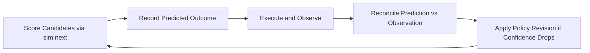

## 논문 출처

- "How Much LLM Does a Self-Revising Agent Actually Need?"는 2026년 4월 arXiv에 공개된 논문입니다.
    - 저자는 Sungwoo Jung과 Seonil Son이며, Manifesto framework의 개발자와 공동 연구자입니다.
    - arXiv:2604.07236으로 등록되었고, cs.AI와 cs.CL 분야에 분류됩니다.


### 핵심 주장

- 논문은 **"agent의 능력 중 LLM이 기여하는 비중은 우리가 생각하는 것보다 훨씬 작다"** 를 실험으로 증명합니다.
    - world model과 자기 수정 구조를 LLM 밖으로 꺼내 runtime 규칙으로 선언하는 순간, LLM이 담당할 일은 대부분 사라집니다.
    - 남은 "잔여 판단"에만 LLM을 투입했을 때의 기여는 전체 turn의 `4.3%`에 그치며, 호출을 늘려도 성능이 올라가지 않는 단조롭지 않은 구간이 발견됩니다.

- 주장은 agent 능력을 상승시키는 원천이 LLM이 아니라 runtime 구조임을 보이는 세 단계 실험으로 뒷받침됩니다.
    - **world model을 규칙으로 꺼내면 승률이 `+24.1pp` 뛴다** : LLM 호출을 하나도 추가하지 않고, belief 추론기 위에 runtime world model만 얹어도 승률이 `50.0%`에서 `74.1%`로 상승합니다.
    - **자기 수정은 LLM 없이 규칙만으로 동작한다** : 예측-비교-수정 loop를 MEL 규칙으로 선언하면, LLM 호출 없이 특정 board에서 `+0.14 F1`까지 회복하는 사례가 나옵니다.
    - **LLM을 더 쓴다고 더 좋아지지 않는다** : LLM 호출을 허용할수록 공격 정확도(F1)는 오르지만 승률은 오히려 떨어지는 구간이 확인됩니다.

- LLM의 기여가 작다는 주장은 agent 설계자에게 질문 자체를 바꾸도록 요구합니다.
    - 기존 질문은 "agent에게 LLM을 얼마나 써야 할까"라는, 답하기 어려운 얽힌 물음이었습니다.
    - 새 질문은 "LLM 투입이 경험적으로 정당화되는 지점은 어디인가"이며, 선언된 runtime 구조 위에서 수치로 답할 수 있는 물음입니다.


### 왜 중요한가

- 기존 LLM agent는 자기 능력이 어디서 오는지 **분해할 수 없는 black box**였습니다.
    - world model 구성, 행동 계획, 자기 수정이 모두 LLM 내부 추론에 뒤섞여 있어, "지금 성능이 LLM 덕인지, prompt 덕인지, 우연인지"를 분리할 방법이 없었습니다.
    - LLM agent를 개선하려는 모든 시도가 "더 좋은 prompt", "더 큰 model"로 귀결되어, 비용은 늘고 원인은 여전히 모르는 상태가 지속되었습니다.

- 논문은 agent의 내부 기능을 runtime 규칙으로 꺼내 **층별 기여를 수치로 분리**합니다.
    - belief 추론기 한 층만 남긴 agent부터 LLM 수정까지 얹은 agent까지 네 계층을 쌓아, 한 층씩 추가될 때 성능이 얼마나 오르는지 측정합니다.
    - "LLM을 빼면 얼마나 손해인가"를 처음으로 정량적으로 답할 수 있게 됩니다.

- 층별 기여 분해의 결과는 LLM 중심 agent 설계의 **비용 구조가 뒤집힌다**는 사실을 드러냅니다.
    - 승률 상승의 대부분을 차지하는 부분은 LLM이 아니라 "runtime에 선언된 world model"입니다.
    - LLM은 마지막 4.3%의 판단에만 필요한 **희소 자원**이며, 전면에 두는 것은 과잉 설계입니다.


---


## 주장을 가능하게 한 설계 : Runtime에 선언된 자기 수정 구조

- 논문의 핵심 기법은 agent의 자기 수정을 prompt 지시가 아니라 **runtime에 선언된 규칙 구조**로 만든 것입니다.
    - 기존 agent에서 "이전 행동을 돌아보고 전략을 고쳐 봐"는 prompt 안의 지시어였으므로, 어떤 신호로 수정이 발동했는지 외부에서 관찰할 수 없었습니다.
    - 논문은 수정 loop의 모든 구성 요소를 MEL로 선언하여, 매 순간의 신뢰도와 수정 자격을 `computed` 값으로 드러냅니다.

- runtime에 선언되는 네 가지 요소는 자기 수정을 관찰 가능한 구조로 바꿉니다.
    - **명시된 state** : 지금 세계의 모습, 지금까지 agent가 내린 예측과 그 오차, 현재 정책 parameter를 모두 runtime 상태로 기록합니다.
    - **계산된 신뢰 신호** : 예측 신뢰도, 수정 자격 여부, action 선호도를 state에서 자동으로 파생 계산합니다.
    - **선행 조건이 붙은 action** : 모든 action에 "지금 실행해도 괜찮은가"를 판정하는 조건이 붙으며, 수정 action은 신뢰도가 연속으로 낮고 수정 후 결과가 개선되리라 예상될 때만 legal합니다.
    - **가상 실행** : `sim.next(snapshot, action)` 호출로 "지금 이 action을 하면 세계가 어떻게 바뀌는가"를 실행 전에 미리 계산해, 비교 대상 예측값을 확보합니다.

- 매 turn 동작은 다섯 단계가 순환하는 구조로 돌아갑니다.
    - **score** : 후보 action 각각에 `sim.next`로 가상의 다음 snapshot을 계산하고 기대 효용을 매깁니다.
    - **record** : 실제로 선택한 action의 예측 결과를 먼저 기록합니다.
    - **execute** : action을 실행하고 실제 관찰 결과를 받습니다.
    - **reconcile** : 예측과 실제를 비교하여 예측 오차와 calibration 오차를 갱신합니다.
    - **revise** : 최근 신뢰도가 연속으로 낮으면 정책 parameter를 조정하여 다음 score 단계에 반영합니다.



- 예측-비교-수정 loop 자체는 새롭지 않습니다.
    - "예측하고 비교하고 수정한다"는 구조는 군사 의사결정 이론의 OODA loop(Observe-Orient-Decide-Act)와 뇌 과학의 free-energy principle로 거슬러 올라가는 오래된 pattern입니다.
    - 논문의 기여는 **기존에 암묵적이던 loop를 runtime에 명시 선언하여, 단계마다 값이 드러나고 측정 가능하게 만든 점**입니다.

- 수정 자격 판정은 prompt 지시어가 아니라 runtime에 선언된 계산식으로 표현됩니다.

```
computed modelConfidence = 1 - (predictionErrorEMA + calibrationErrorEMA) / 2
computed confident = modelConfidence >= confidenceThreshold
computed needRevision = not confident
computed canRevise = needRevision and (cooldownRemaining = 0)
computed sustained = lowConfidenceStreak >= 2
computed revisionRequested = canRevise and sustained
                             and positivePreview and (revisionKind != "")
computed shouldRevise = revisionEnabled and revisionRequested

action applyRevision available when shouldRevise:
    patch policyParameters <- nextParameters
    patch cooldown <- cooldownTurns
```

- MEL로 기술된 수정 자격 선언이 만든 차이는 "수정이 언제 왜 발동했는가"를 외부에서 그대로 읽을 수 있다는 점입니다.
    - 신뢰도, 수정 자격, 수정 실행이 모두 선언된 계산식과 선행 조건으로 드러납니다.
    - agent를 개선하려는 연구자는 prompt를 바꾸는 대신 규칙 자체를 수정하고 재측정할 수 있습니다.


---


## 주장을 검증한 실험 : 잡음이 있는 협업 Battleship

- 실험 환경은 Grand et al.이 제안한 협업 Battleship benchmark를 가져와, 잡음이 섞인 설정에서 재구현한 것입니다.
    - 두 agent가 서로 보지 못하는 `8x8` board 위에서 ship이 숨은 위치를 함께 맞혀야 합니다.
    - 한쪽 agent가 총 14개 cell을 차지하는 ship을 배치하고, 다른 쪽 agent는 최대 40발의 공격과 15회의 질문을 써서 ship을 찾아냅니다.
    - 질문 응답에는 `ε=0.1`의 확률로 잡음이 끼어, agent가 받은 답변 일부는 틀릴 수 있습니다.
    - agent의 belief(ship 위치에 대한 확률 분포)는 500개의 sample로 근사하는 MCMC로 관리됩니다.

- 실험 규모는 54 game이며, 18개 board와 3개 random seed의 조합으로 구성됩니다.
    - board는 Grand et al. 원 benchmark와 정확히 같지 않고 논문이 별도로 합성한 suite이므로, 원 논문 수치와는 방향성 비교만 유효합니다.
    - 54 game은 질적 pattern을 관찰하기에는 충분하나, 좁은 신뢰 구간을 그리기에는 부족한 규모입니다.

- 비교 대상은 "점점 더 많은 기능을 쌓은" 네 agent입니다.
    - **greedy+MCMC** : belief 분포에서 가장 확률이 높은 cell에 매 turn 공격만 하고, 질문도 자기 수정도 없습니다.
    - **WMA (World-Model Agent)** : greedy+MCMC에 runtime으로 선언된 world model을 더해, `sim.next`로 공격과 질문 후보의 기대 가치를 계산해 선택합니다.
    - **MRA (Metacognitive Reflective Agent)** : WMA 위에 예측-비교-수정 loop와 규칙 기반 수정 preset 세 개를 얹어, LLM 호출 없이 전략을 스스로 바꿉니다.
    - **MRA-LLM** : MRA의 신뢰도 조건이 발동할 때만 local 9B LLM에 수정 결정을 위임하며, LLM 사용 비율을 실험 변수로 둡니다.

| Agent | 쌓은 기능 | LLM 사용 |
| --- | --- | --- |
| **greedy+MCMC** | belief 분포에서 최고 확률 cell 발사 | 0% |
| **WMA** | + 선언된 world model로 공격과 질문 평가 | 0% |
| **MRA** | + 예측-비교-수정 loop와 규칙 기반 수정 | 0% |
| **MRA-LLM** | + 신뢰도 조건이 열릴 때 LLM에 수정 위임 | 가변 |

- MRA에 내장된 세 수정 preset은 각각 서로 다른 실패 양상을 겨냥합니다.
    - **`coarse_roi_collapse`** : 큰 영역(Region of Interest)의 belief가 갑자기 쏠려 무너질 때, 공격을 분산시키도록 정책을 되돌립니다.
    - **`late_diffuse_reprobe`** : game 후반까지 belief가 퍼져 있으면 추가 질문을 유도해 belief를 다시 모읍니다.
    - **`cluster_closeout_bias`** : ship 후보가 특정 cluster에 모여 있으면, 그 cluster를 빠르게 마무리하도록 탐색 편향을 조정합니다.

- MRA-LLM은 수정 시점에 LLM을 부를지 말지를 신뢰도 문턱(threshold)으로 조절합니다.
    - threshold를 `0.0`으로 두면 LLM은 한 번도 호출되지 않고 MRA와 동일하게 동작합니다.
    - threshold를 `1.0`으로 두면 신뢰도 조건이 열리는 모든 turn에서 LLM을 호출하지만, 실제 측정치는 전체 turn의 `4.3%`에 그칩니다.


---


## 결과 근거 1 : World Model이 승률을 결정한다

- belief만 가진 agent와 world model을 얹은 agent를 비교하면, world model 선언 하나만으로 승률이 `50.0%`에서 `74.1%`로 뜁니다.

| System | Avg F1 | Wins | Win Rate | Avg Q | LLM Rate |
| --- | --- | --- | --- | --- | --- |
| **greedy+MCMC** | 0.522 | 27/54 | 50.0% | 0.0 | 0% |
| **WMA** | 0.539 | 40/54 | 74.1% | 11.9 | 0% |
| **Delta** | +0.017 | +13 | +24.1pp | +11.9 | 동일 |

- 두 agent는 같은 MCMC belief 계산기를 공유하므로, 차이는 전적으로 "runtime에 선언된 world model과 질문 전략"에서 발생합니다.
    - 공격 정확도 지표인 평균 F1은 `+0.017`로 크지 않지만, 승률은 `+24.1pp` 뛰는 비대칭이 나타납니다.
    - `sim.next`로 평가된 질문 전략이 승패가 갈리는 경계 game을 승리로 뒤집는 **마지막 한 걸음** 역할을 한다는 해석이 가능합니다.

- "baseline이 질문을 전혀 하지 않으니 약한 비교 아닌가"라는 반론은 성립하지 않습니다.
    - 언제 어떤 질문을 할지를 결정하는 정책 자체가 `sim.next`로 평가되고, 40발과 15질문이라는 예산 제약 안에서 조율됩니다.
    - 승률 상승은 "질문을 추가해서"가 아니라, **선언된 world model이 선택하고 시점을 잡은 질문**에서 나옵니다.


---


## 결과 근거 2 : 규칙 기반 자기 수정은 실재하며 Calibration이 관건이다

- MRA에서 수정 기능을 켠 경우와 끈 경우를 54 game 전체 평균으로 비교하면, 두 수치는 거의 동률입니다.

| System | Avg F1 | Wins | Win Rate |
| --- | --- | --- | --- |
| **수정 기능 끔** | 0.552 | 31/54 | 57.4% |
| **수정 기능 켬** | 0.551 | 30/54 | 55.6% |
| **Delta** | -0.001 | -1 | -1.8pp |

- 평균이 동률이라는 수치는 자기 수정 mechanism이 존재하지 않는다는 뜻이 아닙니다.
    - 규칙 기반 수정은 runtime에 실재하는 mechanism이며, 평균이 중립인 원인은 "어떤 board에서 어떤 preset이 발동해야 하는가"를 맞추지 못한 **calibration 부족**입니다.
    - 더 중요한 관찰은 board별로 효과가 극단적으로 갈린다는 사실입니다.

- board별 수치 분해가 수정의 실재를 증명합니다.
    - 수정이 성공해 회복한 board 예시 : B02 `+0.140 F1`, B14 `+0.099`, B17 `+0.092`, B09 `+0.076`.
    - 수정이 과하게 일어나 해가 된 board 예시 : B01 `-0.148`, B15 `-0.085`, B11 `-0.079`.

- 가장 대비가 분명한 사례는 board B17, seed 0 조합입니다.
    - 수정 기능을 켜면 승리하며 F1 `0.609`를 기록하고, turn 2에서 `coarse_roi_collapse`가, turn 12와 15에서 `cluster_closeout_bias`가 순서대로 발동합니다.
    - 수정 기능을 끄면 F1 `0.333`으로 40발을 모두 쓰고도 ship을 찾지 못해 패배합니다.
    - 동일 mechanism이 특정 board에서는 결정적 효과를 내는 동시에, 전체 분포에서는 calibrate되지 않았음을 보여 주는 사례입니다.

- board별 targeted diagnosis가 가능한 이유는 mechanism이 prompt 속이 아니라 runtime 구조로 드러나 있기 때문입니다.
    - board별로 어떤 preset이 언제 발동했는지 trace를 그대로 볼 수 있으므로, "어떤 규칙을 어떤 상황에서 억제해야 하는지"를 겨냥해 고칠 수 있습니다.
    - 기존 prompt 기반 자기 수정에서는 불가능했던 **targeted diagnosis**가 여기서 처음 가능해집니다.


---


## 결과 근거 3 : LLM은 소량으로만 기여하며 더 쓸수록 나빠지는 구간이 있다

- 네 agent 계층과 MRA-LLM의 threshold 변화를 한 표로 놓으면, LLM의 한계 기여가 또렷해집니다.

| System | Avg F1 | Wins | Win Rate | Avg Q | LLM Rate |
| --- | --- | --- | --- | --- | --- |
| **greedy+MCMC** | 0.522 | 27/54 | 50.0% | 0.0 | 0% |
| **WMA** | 0.539 | 40/54 | 74.1% | 11.9 | 0% |
| **MRA 수정 끔** | 0.552 | 31/54 | 57.4% | 8.0 | 0% |
| **MRA 수정 켬** | 0.551 | 30/54 | 55.6% | 8.0 | 0% |
| **MRA-LLM, threshold 0.0** | 0.552 | 31/54 | 57.4% | 8.0 | 0% |
| **MRA-LLM, threshold 1.0** | 0.557 | 29/54 | 53.7% | 8.9 | 4.3% |

- LLM 호출을 최대한 허용한 `threshold=1.0` 수치가 결과 해석의 축입니다.
    - 54 game에서 LLM이 실제 호출된 turn은 총 101회로, 전체 turn의 **`4.3%`** 에 해당합니다.
    - 평균 F1은 `0.557`로 MRA 계열 중 가장 높지만, 승률은 `53.7%`로 MRA 계열 중 가장 낮습니다.

- 공격 정확도는 오르는데 승률은 떨어지는 **F1-승률 괴리**가 논문이 발견한 가장 의미 있는 현상입니다.
    - LLM 수정은 한 수 한 수의 국소 정확도를 개선하지만, game을 40발 안에 끝내야 하는 전체 완결 경로를 흐트러뜨립니다.
    - 평균 질문 수가 `8.0`에서 `8.9`로 늘지만, 늘어난 질문은 "규칙이 전략적으로 시점을 잡은 질문"만큼 가치 있지 않을 수 있습니다.
    - LLM 수정에 소비된 turn은 그만큼 완결에 도움 되었을 질문 기회를 빼앗는 **기회 비용**을 낳습니다.

- 18 game 규모의 예비 실험은 threshold 변화가 단조롭지 않음을 뒷받침합니다.
    - `threshold=0.0`과 `0.5`는 LLM이 거의 호출되지 않는 동일 영역으로 수렴합니다.
    - `threshold=1.0`은 예비 실험에서 F1과 승률이 모두 최고였으나, 54 game으로 규모를 키우면 승률이 부분적으로 역전됩니다.
    - 더 큰 규모 평가가 필요하지만, "LLM을 더 쓸수록 좋아지지 않는다"는 질적 결론은 두 실험 모두에서 유지됩니다.


---


## 설계 원칙과 선행 연구 속 위치

- 세 결과는 agent 설계에 세 줄의 원칙을 남깁니다.
    - **선언 가능한 것은 선언한다** : 세계 구조, 질문 정책, 수정 조건처럼 규칙으로 표현 가능한 것은 모두 runtime에 넣습니다.
    - **가능한 곳에서는 규칙으로 수정한다** : 자기 수정도 규칙으로 표현 가능하다면 LLM 없이 처리합니다.
    - **LLM은 잔여에만 투입한다** : 규칙으로 해결 불가능한 판단에만 LLM을 호출하여 비용과 불확실성을 최소화합니다.

- reflection을 LLM 내부에 두는 선행 연구 네 갈래와 비교하면 논문의 위치가 분명해집니다.

| 계열 | 대표 연구 | 논문 접근과의 차이 |
| --- | --- | --- |
| **LLM agent** | ReAct, Reflexion, DisCIPL | reflection을 LLM 내부 추론에 맡기는 방식과 달리, runtime에 명시 선언하여 외부화합니다. |
| **Program-guided agent** | WorldCoder, LLM+P | LLM이 world model을 생성하는 방식과 달리, 사람이 Turing-incomplete DSL로 world model을 직접 선언합니다. |
| **Metacognitive agent** | Soar, MIDCA, HYDRA | 별도의 상위 meta loop를 두는 방식과 달리, world model 안에 metacognition을 바로 통합합니다. |
| **Self-model** | Pathak et al. | 별도 self-model로 예측 오차를 추적하는 방식과 달리, 같은 선언된 substrate에 예측 기록을 포함시킵니다. |

- 네 갈래 중 metacognitive agent 계열의 HYDRA가 가장 가깝지만, 논문은 세 지점에서 구별됩니다.
    - metacognition을 독립된 meta loop가 아니라, world model 내부의 파생 신호와 선행 조건 action으로 선언합니다.
    - 전략 수정이 한 game이 끝난 뒤가 아니라 **game이 진행되는 도중에** 일어납니다.
    - 전체 loop가 LLM 호출 없이 작동하도록 설계되어, LLM 의존도를 실험 변수로 둘 수 있습니다.


---


## 적용 범위와 한계

- 논문에서는 여섯 가지 한계를 명시적으로 언급하면서, 결과의 일반화를 주의하라고 권고합니다.

| 한계 | 설명 |
| --- | --- |
| **단일 domain** | Battleship 외 domain에서는 검증되지 않았으므로, 다른 게임이나 실무 domain에서는 결론이 달라질 수 있음 |
| **재구현 설정** | Grand et al.의 원 benchmark와 정확히 동일한 board 구성이 아니므로, 공개된 기존 수치와는 방향성 비교만 가능 |
| **통계적 검정력** | 54 game은 질적 pattern 관찰에 충분하나 좁은 신뢰 구간을 그리기에는 부족 |
| **자기 수정 calibration 부족** | 세 수정 preset이 전체 평균에서 순효과가 플러스가 아니어서, 현재 규칙 집합은 튜닝 여지가 큼 |
| **sweep 범위 협소** | LLM 호출 threshold를 몇 점만 실험해 LLM 기여 곡선 전체를 규명하지 못함 |
| **model 특이성** | local 9B LLM 한 종만 사용했으므로, 다른 크기 또는 다른 종류의 LLM에서는 trade-off가 달라질 수 있음 |

- 여섯 가지의 한계는 논문의 **주장을 약화하기보다 적용 범위를 좁힌다**는 점에서 중요합니다.
    - "world model을 꺼내면 LLM이 덜 필요하다"는 주장은 유지되지만, 그 구체적 비율은 domain과 LLM에 따라 달라질 수 있습니다.
    - 추가 domain과 더 큰 LLM으로 sweep을 확장하는 후속 연구가 설계 원칙 자체를 검증하거나 정제할 여지입니다.


---


## Reference

- <https://arxiv.org/abs/2604.07236>
- <https://arxiv.org/pdf/2604.07236>
- <https://arxiv.org/html/2604.07236v2>
- <https://github.com/manifesto-ai/core>
- <https://github.com/eggplantiny/battleship-manifesto>

