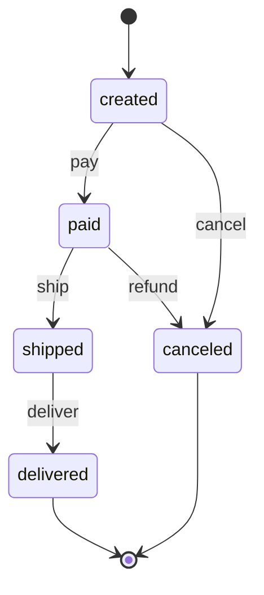
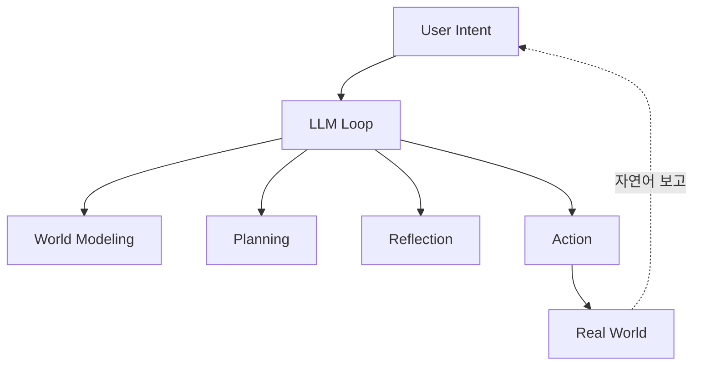
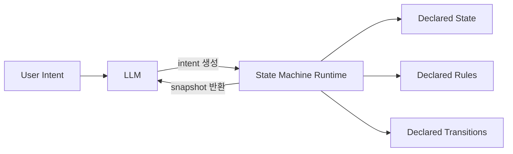
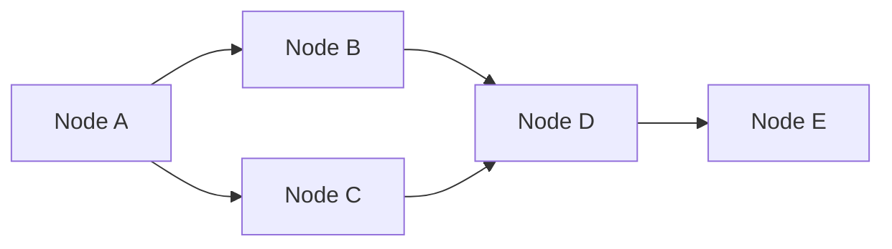
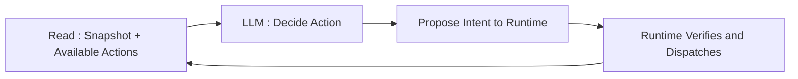

## State Machine Agent

- state machine agent는 **agent의 world model과 행동 규칙을 선언된 state machine으로 외부화하고, LLM은 그 위를 걷도록 설계하는 agent harness 접근**입니다.
    - 기존 LLM agent는 world modeling, planning, reflection을 단일 LLM loop 안에 뒤섞어 두어, agent의 어떤 능력이 model에서 나오고 어떤 능력이 주변 구조에서 나오는지 구분하기 어렵습니다.
    - **world modeling** : agent가 "지금 세계가 어떤 상태이고, 내가 행동하면 어떻게 바뀌는가"를 내부적으로 simulation하는 기능.
    - **planning** : 현재 state에서 목표 state까지 도달하기 위해 어떤 action을 어떤 순서로 수행할지 결정하는 기능.
    - **reflection** : 실행 결과를 돌아보고 다음 행동 전략을 수정하는 기능.
    - state machine agent는 "계산으로 풀 수 있는 모든 것을 runtime으로 옮기고, LLM은 판단이 필요한 부분에만 호출한다"는 원칙 위에 서 있습니다.

- harness engineering의 연장선에서 볼 때, state machine agent는 **agent가 실수할 수 있는 공간 자체를 줄이는 구조적 제약 장치**입니다.
    - agent에게 더 나은 prompt를 주거나 더 똑똑한 model을 붙이는 대신, 세계 자체를 규칙으로 정의해 환각할 여지를 없앱니다.
    - "agent에게 '이 행동을 하면 무슨 일이 일어나는가'에 대해 항상 결정론적인 답이 존재하는 세계를 제공한다"는 한 문장이 state machine agent의 지향을 압축합니다.

### State Machine이란

- state machine은 **유한한 state 집합, 각 state에서 허용된 transition, transition을 촉발하는 input, 초기 state로 구성된 수학적 model**입니다.
    - 현재 state가 주어지면 가능한 transition이 명시적으로 정의되며, 각 transition의 결과가 deterministic하게 결정됩니다.
    - 같은 state에서 같은 input을 주면 항상 같은 다음 state에 도달합니다.

- 신호등, TCP 연결, 주문 처리 flow처럼 "지금 어디에 있고, 다음으로 어디로 갈 수 있는가"가 분명한 system을 기술할 때 오래 쓰여 왔습니다.
    - 신호등은 빨강, 노랑, 초록 세 state와 timer input만으로 동작이 완전히 정의됩니다.
    - 주문은 created, paid, shipped, delivered, canceled 같은 state 사이를 결제와 배송 event에 따라 이동합니다.

- state machine의 핵심 속성은 **"지금 상태에서 무엇이 가능한가"가 선언으로 명시된다**는 점입니다.
    - `paid` state에서는 `ship`과 `refund`만 허용되고, `deliver`를 직접 호출하는 경로는 언어 차원에서 차단됩니다.
    - agent에 적용하면 prompt가 잘못된 action을 지시해도 runtime이 거부하므로, LLM의 환각이 실제 state 변경으로 이어지지 못합니다.

- state machine은 LLM의 확률적 next-token 생성과 정반대 축에 있는 구조이며, 두 성질의 대비가 state machine agent 접근의 핵심 동력입니다.
    - LLM은 "그럴듯한 다음 token"을 확률로 고르고, state machine은 "허용된 다음 state"를 규칙으로 고릅니다.
    - 두 성질을 한 system 안에 두되 역할을 분리하는 것이 state machine agent 설계의 출발점입니다.

---

## 기존 LLM Agent의 Black Box 문제

- 기존 LLM agent의 근본 문제는 **무슨 행동을 왜 했는지, 그 행동이 실제로 어떤 결과를 낳았는지 검증할 수 없다**는 점입니다.
    - prompt로 행동 규칙을 부탁하더라도 LLM은 확률적으로 그 규칙을 따릅니다.
    - "99% 지키고 1% 어긴다"가 demo에서는 용인되지만, 금융, 의료, infra 같은 실제 상태를 바꾸는 영역에서는 사고가 됩니다.

- LLM agent의 검증 불가능성은 실행 현장에서 결과 예측 불가, 환각성 보고, 재현성 부재, audit 불가 네 가지 형태로 드러납니다.
    - **결과 예측 불가** : 실행 전에 결과를 예측할 수 없어, 행동의 영향이 배포 전 검증되지 못합니다.
    - **환각성 보고** : 실행 후 상태 변화를 agent가 말로 보고하므로, 실제 결과와 보고 사이에 환각이 들어갑니다.
    - **재현성 부재** : 동일 상황에서 동일 결과가 보장되지 않아 재현성이 무너집니다.
    - **audit 불가** : 사고가 난 뒤 "왜 이 행동을 했는가"를 LLM log에서 추정해야 하므로 audit이 사실상 불가능합니다.

- world modeling, planning, reflection을 단일 LLM loop에 몰아 두는 구조는 세 기능이 모두 LLM 내부의 hidden state로 처리된다는 점에서 검증 불가능합니다.
    - 중간 과정을 검사할 수 없고, 동일한 input이 동일한 output을 보장하지 않습니다.
    - agent의 "능력"이 어느 부품에서 오는지 경험적으로 분해할 방법이 없습니다.

---

## 계산 가능한 것과 계산 불가능한 것

- state machine agent의 설계 전제는 **agent 내부의 작업을 계산 가능성에 따라 분리**하는 것입니다.
    - 계산 가능한 작업은 입력이 같으면 같은 결과가 수학적으로 결정되는 작업입니다.
    - 계산 불가능한 작업은 맥락 해석, 의도 파악, 자연어 응답 같은 확률적 판단이 필요한 작업입니다.

- 실제 agent의 내부 질문들을 두 범주로 나누면 계산 가능한 쪽이 압도적으로 많다는 점이 드러납니다.

| 질문 유형 | 예시 | 처리 주체 |
| --- | --- | --- |
| **의도 해석** | "어제 완료한 일"이 무엇을 의미하는가 | LLM |
| **상태 조회** | 지금 완료된 항목이 몇 개인가 | runtime |
| **행동 가능성** | 이 action을 지금 실행해도 legal한가 | runtime |
| **결과 예측** | 실행하면 어떤 항목이 사라지는가 | runtime |
| **상태 반영** | 실행 후 남은 항목 수는 얼마인가 | runtime |
| **응답 생성** | 결과를 어떤 어투로 전달할까 | LLM |

- 내부 질문을 계산 가능성 기준으로 재분류하면 "LLM에 모든 것을 맡긴다"는 기존 접근이 **"계산 가능한 건 계산으로, 계산 불가능한 것만 LLM으로"** 라는 원칙으로 바뀝니다.
    - 계산 가능한 영역에 LLM을 쓰면 느리고, 비싸고, 확률적으로 틀리는 세 가지 손실이 생깁니다.
    - runtime이 계산하면 즉시 결정되며 비용이 없고, 동일 입력에 동일 출력이 보장됩니다.

---

## Deterministic State Machine Runtime

- state machine agent는 **선언된 state machine runtime을 agent 바깥에 두고, LLM이 그 runtime과 상호 작용**하게 설계합니다.
    - runtime은 domain의 상태, 상태 전이, 제약 조건을 형식적으로 기술합니다.
    - LLM은 runtime이 허용하는 action 중에서만 선택할 수 있으며, 선택한 action은 runtime이 검증하고 실행합니다.

- runtime은 state 조회, 가용 action 조회, 결과 simulation, 실행과 검증의 네 기능을 담당합니다.
    - **state 조회** : 현재 snapshot을 반환하여 agent가 "지금 어떤가"를 추측하지 않게 합니다.
    - **가용 action 조회** : 현재 snapshot에서 legal한 action 목록을 반환합니다.
    - **결과 simulation** : action을 실행하기 전 결과 snapshot을 미리 계산해 보여줍니다.
    - **실행과 검증** : 실제로 action을 실행하고, 변경된 snapshot을 반환합니다.

- 결과적으로 agent는 **자신이 "무엇을 했다"고 주장할 수 없으며, runtime이 반환하는 snapshot만이 진실**입니다.
    - agent가 "삭제했습니다"라고 응답할 수 있는 유일한 근거는 runtime이 dispatched 상태를 반환한 경우뿐입니다.
    - 환각이 구조적으로 차단됩니다.

---

## 왜 DAG 기반인가

- state machine agent의 대표 구현체들은 단순 state machine이 아니라 **DAG(Directed Acyclic Graph) 기반 제한 구조**로 domain을 기술합니다.
    - 단순 state machine은 cycle을 허용하여, 어떤 state에서 출발해도 결국 어디까지 갈 수 있는지를 실행 전에 계산하기 어렵습니다.
    - Turing-complete 언어는 halting problem 때문에 "이 action이 언젠가 끝나는가"조차 일반적으로 판정 불가능하여, 실행 전에 결과를 보장할 수 없습니다.
    - DAG는 두 제약을 동시에 해결하여 실행 전에 결과를 계산하고 정적으로 검증할 수 있게 합니다.

### DAG란

- DAG는 **Directed Acyclic Graph의 약자로, 방향이 있는 간선으로 연결되되 cycle이 없는 graph**입니다.
    - "directed"는 간선에 방향이 있어 `A -> B`와 `B -> A`가 서로 다른 관계로 구별됨을 뜻합니다.
    - "acyclic"은 어느 node에서 출발해도 간선을 따라가다 자기 자신으로 돌아오지 못함을 뜻합니다.

- DAG는 task 의존성 관리, build system, data pipeline, version control 같은 곳에서 오래 사용되어 왔습니다.
    - Makefile이나 Airflow DAG가 대표 예로, 선행 task가 끝나야 후행 task가 시작되는 구조를 명시합니다.
    - git의 commit graph는 merge가 있어 branching은 허용하지만, 과거 commit을 미래 commit으로 거슬러 참조할 수 없다는 점에서 DAG입니다.

- DAG의 핵심 속성은 **모든 node를 "선행 -> 후행"이 되도록 일렬로 늘어놓을 수 있다는 점**입니다.
    - 선행이 앞에 오도록 node를 일렬로 나열하는 작업을 topological sort라 하며, cycle이 없는 graph에서는 항상 가능합니다.
    - 덕분에 각 node의 값이나 결과를 선행 node의 계산 결과에서 순차적으로 도출할 수 있습니다.

- state machine agent 맥락에서 DAG는 world model을 표현하는 계산 구조입니다.
    - `state` 선언은 입력 node, `computed` 파생값과 `action` 결과는 선행 state에서 계산되는 후행 node로 대응됩니다.
    - cycle이 없으므로 현재 snapshot에서 모든 `computed`와 모든 `action`의 결과 snapshot을 **사전에 한 번의 topological sort로 계산**할 수 있습니다.

### DAG 기반 설계가 Agent에 주는 이점

- DAG 기반 설계가 agent에게 주는 이점은 실행 전 검증 가능성, 정적 분석 가능성, 추론 대신 계산 세 가지로 요약됩니다.
    - **실행 전 검증 가능성** : 모든 action의 결과 state가 사전에 계산 가능하므로, agent는 실제 실행 전에 "이 action을 하면 세계가 어떻게 바뀔지"를 확인할 수 있습니다.
    - **정적 분석 가능성** : state 공간이 유한하게 열거되므로, 어떤 불변 조건(예 : 잔액이 음수가 되지 않는다)이 항상 유지되는지를 실행 없이 검사할 수 있습니다.
    - **추론 대신 계산** : agent는 세계의 규칙을 LLM 추론으로 추측하지 않고, runtime이 제공하는 deterministic 계산 결과로 이해합니다.

- DAG 기반 설계는 business logic의 대부분이 **원래 state machine**이라는 관찰과 맞닿습니다.
    - 주문 상태, 결제 단계, 할 일 완료 여부, 거래 승인 흐름은 모두 state machine으로 환원 가능합니다.
    - business logic을 LLM 내부 추론에 녹여 재구성하는 대신, LLM 바깥에 선언해 두고 LLM이 그 위를 걷게 만듭니다.

---

## Agent와 Runtime의 상호 작용 방식

- state machine agent는 매 turn마다 read, decide, propose, verify 네 단계를 순환하면서 runtime과 상호 작용합니다.
    - read는 snapshot(지금 세계의 상태를 담은 read-only 객체)을 runtime에서 꺼내는 단계, decide는 LLM이 다음 행동을 고르는 단계, propose는 그 선택을 runtime에 공식 요청으로 보내는 단계, verify는 runtime이 요청을 검증해 실행하는 단계입니다.
    - 마지막 verify가 끝나면 새 snapshot을 돌려받아 다시 다음 turn의 read로 들어가며, read에서 verify까지의 순환이 agent의 전체 동작을 이룹니다.

- read, decide, propose, verify의 역할 분담은 간단한 TODO list agent scenario로 풀어 보면 또렷해집니다.
    - 사용자가 "어제 완료한 일 지워 줘"라고 요청했고, 현재 runtime에는 할 일 3개가 담겨 있으며 그중 id 2번이 어제 완료된 상황입니다.
    - 사용자 요청부터 state 반영까지 read, decide, propose, verify가 어떻게 맞물리는지 따라가면 "어느 책임이 runtime에, 어느 책임이 LLM에 있는가"가 드러납니다.
    - **read** : runtime에서 현재 snapshot(`items: [{id:1, done:false}, {id:2, done:true}, {id:3, done:false}]`)과 지금 legal한 action 목록(`addTodo`, `completeTodo`, `removeTodo`, `clearCompleted`)을 꺼내 LLM prompt에 함께 실어 보내며, LLM이 허공에서 action 이름을 지어내지 못하도록 막는 단계입니다.
    - **decide** : LLM은 "어제 완료한 일"을 snapshot 속 `done:true`이면서 어제 완료된 id 2번에 연결하고, 가용 action 중 `removeTodo(id=2)`를 후보로 고르며, decide만 자연어 해석이 필요하므로 LLM이 유일하게 필수인 구간입니다.
    - **propose** : agent code가 LLM의 선택을 `intent` 객체(action 이름, 인자, 호출 주체가 type으로 고정된 구조화 요청)로 변환해 runtime에 제출하며, LLM이 직접 state를 건드리는 경로는 존재하지 않고 모든 변경 요청은 intent 형태여야 합니다.
    - **verify** : runtime이 "id 2번이 실제로 `done:true`인가" 같은 선행 조건을 다시 검사한 뒤 통과하면 item을 실제로 삭제하고 바뀐 snapshot(`items: [{id:1}, {id:3}]`)을 반환하며, 검증이 실패하면 실행되지 않고 이유가 error로 돌아옵니다.

- read-decide-propose-verify 순환의 본질은 **"자연어 해석은 LLM에, state 변경은 runtime에"** 라는 책임의 단방향 분리입니다.
    - **action 목록을 runtime에서 실시간 조회** : system prompt에 action 목록을 고정해 두지 않고, 매 turn 현재 snapshot에 맞는 legal action 목록만 꺼내 LLM에 제시하여, prompt에 적힌 action과 실제 runtime이 허용하는 action이 엇갈리는 상황을 구조적으로 차단합니다.
    - **state 직접 변경 금지, intent로만 제안** : agent가 "내가 이 값을 바꿨다"고 주장할 수 없으며, 모든 변경은 runtime에 intent로 제출하고 runtime이 실제 수행합니다.
    - **승인 규칙은 prompt가 아니라 runtime이 강제** : "거래액이 얼마 이상이면 사람 승인" 같은 규칙을 prompt로 부탁하지 않고, runtime의 governance 계층이 선언된 규칙대로 강제합니다.
    - **응답마다 최신 snapshot 포함** : tool의 응답에는 항상 방금 갱신된 snapshot이 들어 있어, agent가 이전 step의 기억으로 결과를 추정하지 않습니다.

---

## 자기 수정 기능을 Runtime으로 꺼내기

- 자기 수정(reflection)은 "agent가 이전 행동을 돌아보고 다음 전략을 고친다"는 기능이며, 기존 LLM agent에서는 prompt 안의 지시 문구로만 존재했습니다.
    - prompt 안에서 "이전 행동을 반성해서 전략을 바꿔 봐"라고 요청해도, 실제로 LLM이 언제 어떤 신호로 전략을 바꿨는지는 외부에서 관찰할 수 없습니다.
    - 자기 수정이 성능에 정말 도움이 되었는지, 아니면 token만 더 쓴 비용 증가인지 분해할 방법이 없었습니다.

- state machine agent는 자기 수정을 결정하는 변수들을 prompt 속에 두지 않고, runtime에 직접 선언된 값으로 꺼내 놓습니다.
    - 예측 오차(agent가 예측한 결과와 실제 결과의 차이), calibration 오차(agent가 자기 확신 수준을 얼마나 맞게 보고하는지의 차이), 신뢰도, 수정 자격 같은 값이 runtime의 파생 계산값(computed signal)으로 표현됩니다.
    - 전략을 바꾸는 action은 선행 조건이 붙은 action(guarded action)이 되어, 선언된 조건이 참일 때만 legal하게 실행됩니다.

- 자기 수정 구조를 runtime에 꺼내면 관찰 가능, 측정 가능, 분해 가능이라는 세 가지 성질이 자연스럽게 따라옵니다.
    - **관찰 가능(inspectable)** : 신뢰도, 예측 오차 같은 모든 내부 신호가 snapshot에 드러나, debugging과 audit 때 그대로 들여다볼 수 있습니다.
    - **측정 가능(measurable)** : "전체 turn 중 몇 %에서 전략 수정이 실제로 발동했는가" 같은 수치를 숫자로 잴 수 있습니다.
    - **분해 가능(decomposable)** : 세계 상태 추적, 행동 계획, 규칙 기반 수정, LLM 수정을 각각 끄고 켜 가며 실험하여, 각 기능의 기여도를 따로 평가할 수 있습니다.

---

## LLM의 역할 재정의

- state machine agent에서 LLM은 **agent의 전체가 아니라 잔여 판단 자원**입니다.
    - 선언된 runtime이 해결하지 못하는 부분에만 호출됩니다.
    - LLM이 담당해야 할 잔여 판단의 크기와 종류가 state machine agent가 답하려는 질문입니다.

- Manifesto 팀의 Battleship 실험은 선언된 runtime 위에서 LLM 호출이 실제로 얼마나 필요한지 실증 측정한 대표 사례입니다.
    - 54 game 실험에서 world-model planning 추가만으로 승률이 `+24.1pp` 상승했습니다.
    - LLM revision은 전체 turn 중 `4.3%`에서만 호출되었고, F1은 `+0.005`로 미미, 승률은 오히려 하락했습니다.
    - "LLM을 많이 쓸수록 좋다"는 가정이 적어도 Battleship setting에서는 성립하지 않았습니다.

- Battleship 실험은 declare what you can, reflect symbolically where possible, reserve the LLM for the residual 세 줄의 **design principle**로 수렴합니다.
    - **declare what you can** : 선언할 수 있는 모든 것을 runtime에 선언합니다.
    - **reflect symbolically where possible** : 규칙으로 기술 가능한 reflection은 symbolic rule로 처리합니다.
    - **reserve the LLM for the residual** : 선언된 substrate가 해결하지 못하는 잔여에만 LLM을 호출합니다.

---

## 대표 구현체

- state machine agent 접근을 구체 framework 형태로 구현한 대표 사례는 Manifesto입니다.
    - Sungwoo Jung과 Seonil Son이 2026년 공개한 open source project로, `@manifesto-ai/sdk`와 MEL(Manifesto Expression Language)라는 DSL을 제공합니다.
    - domain을 `.mel` file로 선언하고, `createManifesto(schema).activate()`로 runtime을 생성해 사용합니다.
    - 같은 domain schema에 frontend, backend, AI agent가 모두 typed intent로 접근합니다.

- Manifesto는 선언된 상태 전이 규칙, action legality 검증, runtime-owned write와 fresh snapshot feedback, HITL 강제라는 state machine agent의 네 원칙을 각각의 구성 요소로 구현합니다.
    - **선언된 상태 전이 규칙** : computed signal과 guarded action으로 표현됩니다.
    - **action legality 검증** : `available when` 조건이 담당합니다.
    - **runtime-owned write와 fresh snapshot feedback** : `dispatchAsync`와 snapshot 반환으로 구현됩니다.
    - **HITL 강제** : `withGovernance`와 proposal 생명 주기로 제공됩니다.

- Manifesto 팀이 쓴 논문 "How Much LLM Does a Self-Revising Agent Actually Need?" 는 state machine agent 설계의 실증 근거입니다.
    - 논문은 reflective runtime protocol의 네 계층을 progressive하게 쌓으며 각 계층의 기여도를 측정합니다.
    - state machine agent가 단순한 engineering style이 아니라, 측정 가능한 agent 설계 방법론임을 보여줍니다.

---

## 언제 적용해야 하는가

- state machine agent는 모든 agent에 필요한 설계가 아닙니다.
    - 설계 비용이 작지 않으며, 단순한 대화형 agent나 정보 검색 agent에는 overkill입니다.
    - state machine agent가 필요한 조건은 **agent가 실제 state를 바꾸고, 그 변경이 검증되어야 하는 영역**입니다.

| 영역 | 필요성 | 이유 |
| --- | --- | --- |
| **대화형 chatbot** | 낮음 | state 변경이 대화 맥락에 한정, 환각의 대가가 작음 |
| **정보 검색 agent** | 낮음 | read-only, 결과가 틀려도 rollback 비용이 작음 |
| **할 일 관리 app** | 중간 | state 변경은 있으나 사용자가 즉시 확인 가능 |
| **금융 거래 agent** | 높음 | 환각이 곧 금전 손실, audit 의무 존재 |
| **의료 기록 agent** | 높음 | 환각이 환자 안전 위협, compliance 의무 존재 |
| **infra 조작 agent** | 높음 | 환각이 운영 장애, rollback 어려움 |

- 공통 원칙은 **"LLM이 실제 세계에 실제 영향을 주는 행동을 할 때"**입니다.
    - demo나 copilot 수준이면 기존 LLM agent로 충분합니다.
    - production에서 사람의 승인 없이 실제 상태를 바꾸는 agent라면 state machine runtime이 전제 조건이 됩니다.

---

## Harness Engineering과의 관계

- state machine agent는 harness engineering의 하위 분야입니다.
    - harness engineering이 "agent가 실수할 공간을 줄이는 구조적 장치"라면, state machine agent는 그 장치를 **world model의 선언**으로 구현한 계열입니다.
    - hook, guardrail, sandbox 같은 다른 harness 장치들이 agent의 행동 경계를 주변에서 감싼다면, state machine runtime은 agent가 조작하는 세계 자체를 구조화합니다.

- 기존 harness 장치와의 차이는 추상화 수준에 있습니다.
    - **guardrail** : agent의 input/output을 filter합니다.
    - **sandbox** : agent의 code 실행 환경을 격리합니다.
    - **hook** : agent lifecycle의 특정 시점에 개입합니다.
    - **state machine runtime** : agent가 조작하는 domain state 전체를 선언적 규칙으로 감쌉니다.

- 결국 state machine agent의 기여는 agent harness에 **"world model layer"** 를 추가한 것입니다.
    - agent를 둘러싼 harness 주변부뿐 아니라, agent가 상대하는 세계의 구조까지 harness의 설계 대상으로 확장합니다.
    - "agent가 실수하면 harness를 고쳐라"는 harness engineering 원칙이 "agent가 환각하면 세계의 규칙을 선언해라"로 확장됩니다.

---

## Reference

- <https://manifesto-ai.dev/>
- <https://github.com/manifesto-ai/core>
- <https://arxiv.org/abs/2604.07236>
- <https://eggp.dev/essays/ko/superintelligence-in-my-hands/>

