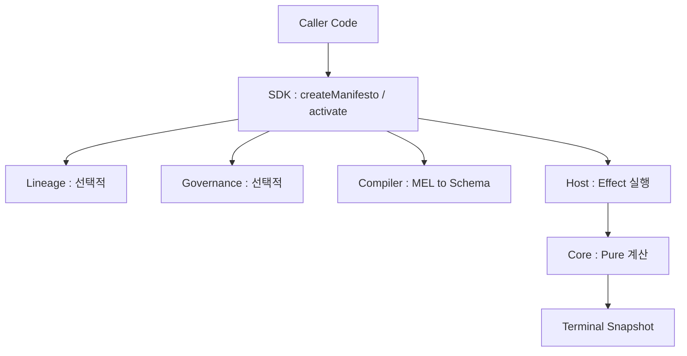

## Manifesto

- Manifesto는 **domain state를 deterministic하게 다루는 semantic layer**를 표방하는 TypeScript open source framework입니다.
    - Sungwoo Jung과 Seonil Son이 2026년 공개했으며, GitHub `manifesto-ai/core`와 npm `@manifesto-ai/core`에서 배포됩니다.
    - state machine agent 접근을 실제 production framework로 구현한 대표 사례이며, 논문 "How Much LLM Does a Self-Revising Agent Actually Need?"(<https://arxiv.org/abs/2604.07236>)의 실증 기반이 되는 runtime입니다.

- Manifesto는 MEL이라는 domain 선언 DSL, base runtime, Lineage와 Governance 확장 package, 다층 통합 interface의 네 축으로 구성됩니다.
    - MEL(Manifesto Expression Language)이라는 domain 선언 DSL입니다.
    - `createManifesto(schema).activate()`로 구성되는 base runtime입니다.
    - Lineage와 Governance라는 composable 확장 package입니다.
    - frontend, backend, AI agent가 같은 schema에 typed intent로 접근하는 통합 interface입니다.

- Manifesto는 state 관리 library, AI framework, database/ORM, workflow engine 중 어느 것도 아니며, 그 surface들의 **아래에 깔리는 의미론적 layer**로 자리 매김합니다.
    - state 관리 library가 아니며, Redux/Zustand를 대체하지 않습니다.
    - AI framework가 아니며, LangChain을 대체하지 않습니다.
    - database, ORM, workflow engine이 아닙니다.


---


## 핵심 철학

- Manifesto의 창시자는 "모든 domain은 하나의 의미론적 공간 위의 좌표"라는 공리에서 출발했다고 밝혔습니다.
    - e-commerce의 "장바구니-결제-배송"과 robotics의 "임무 할당-실행-보고"가 표면은 완전히 다르지만, 상태 전이 방식, 조건 분기 pattern, 예외 처리 구조가 닮았다는 관찰이 출발점입니다.
    - domain이 달라도 state, transition, constraint라는 보편적 구성 요소의 좌표만 다를 뿐이라는 가설입니다.

- domain이 보편 좌표 공간 위의 점이라는 공리에서 형식 언어, deterministic runtime, 의미론적 interface, audit 가능한 runtime이라는 네 설계 결정이 도출됩니다.
    - **형식 언어** : domain의 구조를 형식적으로 기술하는 MEL이 필요합니다.
    - **deterministic runtime** : AI가 언어 위에서 추론하려면 실행이 결정적이어야 하며, DAG 기반 runtime이 이를 보장합니다.
    - **의미론적 interface** : 사람과 AI가 같은 world model을 공유하려면 양쪽 모두에게 읽히는 typed intent가 필요합니다.
    - **audit 가능한 runtime** : 검증, audit, simulation을 지원하는 Lineage와 Governance 계층이 필요합니다.

- 결과적으로 Manifesto가 agent에게 제공하는 것은 **"이 행동을 하면 무슨 일이 일어나는가에 대해 항상 deterministic한 답이 존재하는 세계"**입니다.
    - agent는 prompt로 부탁하는 것이 아니라 runtime에 질문합니다.
    - runtime은 계산으로 답하며, 답은 snapshot으로 반환됩니다.


---


## 전체 Architecture

- Manifesto의 runtime은 여섯 개 layer가 위에서 아래로 흐르는 구조로 구성됩니다.



- 각 layer의 책임은 SDK, Lineage, Governance, Compiler, Host, Core 순으로 분리됩니다.

| Layer | 책임 | Package |
| --- | --- | --- |
| **SDK** | runtime 진입점과 handle 제공 | `@manifesto-ai/sdk` |
| **Lineage** | 연속성, sealed history, branch/head 관리 | `@manifesto-ai/lineage` |
| **Governance** | 정당성, proposal 생명 주기, 승인/거부 | `@manifesto-ai/governance` |
| **Compiler** | MEL text를 DomainSchema로 변환 | `@manifesto-ai/compiler` |
| **Host** | effect 실행과 patch 적용 loop | `@manifesto-ai/sdk` 내부 |
| **Core** | 다음 semantic state의 pure 계산 | `@manifesto-ai/core` |

- Core의 본질은 **pure, total, traceable한 함수**입니다.

```
compute(schema, snapshot, intent, context) -> (snapshot', requirements, trace)
```

- `compute` 함수는 같은 입력이 주어지면 항상 같은 출력을 반환하며, 실패 없이 결과를 반환하고, 모든 step이 기록됩니다.
    - **pure** : 같은 입력에 같은 출력을 반환하여 결정론을 보장합니다.
    - **total** : 모든 입력에 대해 실패 없이 결과를 반환하여 예측 가능성을 보장합니다.
    - **traceable** : 모든 step이 기록되어 audit 가능성을 보장합니다.


---


## MEL : Manifesto Expression Language

- MEL은 **domain을 선언하는 Turing-incomplete DSL**입니다.
    - `.mel` 확장자 file로 저장되며, Compiler가 `DomainSchema` 객체로 변환합니다.
    - cycle, 무한 recursion, halting 불가능한 구성이 언어 차원에서 배제됩니다.

- MEL domain은 `state`, `computed`, `action`, `available when` / `dispatchable when` 네 가지 구성 요소로 선언됩니다.
    - **`state`** : 변할 수 있는 값입니다.
    - **`computed`** : state에서 자동으로 파생되는 값입니다.
    - **`action`** : state를 변경하는 유일한 경로입니다.
    - **`available when` / `dispatchable when`** : action의 legality를 선언하는 조건입니다.

- 가장 단순한 Counter domain은 state 하나와 action 하나로 정의됩니다.

```mel
domain Counter {
  state {
    count: number = 0
  }

  computed doubled = mul(count, 2)

  action increment() {
    onceIntent {
      patch count = add(count, 1)
    }
  }
}
```

- 조금 더 현실적인 Todo domain 예시는 legality 선언을 포함합니다.

```mel
domain Todo {
  state {
    items: list<{ id: string, title: string, done: boolean }> = []
  }

  computed activeCount = count(filter(items, i => not(i.done)))
  computed hasCompleted = any(items, i => i.done)

  action addTodo(title: string) {
    onceIntent { ... }
  }

  action completeTodo(id: string) {
    available when any(items, i => and(eq(i.id, id), not(i.done)))
    onceIntent { ... }
  }

  action clearCompleted() {
    available when hasCompleted
    onceIntent { patch items = filter(items, i => not(i.done)) }
  }
}
```

- `available when`의 의미는 **"이 action은 이 조건이 참일 때만 legal하다"**입니다.
    - 조건이 거짓이면 `getAvailableActions()` 결과에서 해당 action이 빠집니다.
    - prompt에 "완료된 항목이 없으면 호출하지 마세요"라고 부탁하지 않고, runtime이 강제합니다.

- compile 결과는 **의존성 DAG**입니다.
    - action이 state를 mutate하고, state가 computed를 feed하는 방향성 비순환 graph가 만들어집니다.
    - agent는 compile된 DAG를 읽고 "이 action을 실행하면 어떤 값이 바뀌는지"를 계산으로 알 수 있습니다.


---


## 기본 사용법

- Manifesto를 처음 사용할 때는 **CLI 설치, domain 선언, runtime 활성화** 세 단계가 필요합니다.


### 설치

- CLI interactive init이 가장 간단한 경로입니다.

```bash
npx @manifesto-ai/cli init
```

- 수동 설치는 runtime package만 먼저 설치하는 방식입니다.

```bash
npm install @manifesto-ai/sdk
npm install -D @manifesto-ai/compiler
```

- Vite project의 경우 MEL plugin을 vite config에 등록합니다.

```typescript
import { defineConfig } from "vite";
import { melPlugin } from "@manifesto-ai/compiler/vite";

export default defineConfig({
  plugins: [melPlugin()],
});
```


### Domain 선언과 Runtime 활성화

- domain을 `.mel` file로 작성합니다.

```mel
domain Counter {
  state { count: number = 0 }
  action increment() {
    onceIntent { patch count = add(count, 1) }
  }
}
```

- TypeScript에서 schema를 import하고 runtime을 생성합니다.

```typescript
import { createManifesto } from "@manifesto-ai/sdk";
import CounterSchema from "./counter.mel";

const app = createManifesto(CounterSchema, {}).activate();
```

- intent를 생성하고 dispatch하여 state를 변경합니다.

```typescript
await app.dispatchAsync(
  app.createIntent(app.MEL.actions.increment),
);

const snapshot = app.getSnapshot();
console.log(snapshot.data.count);       // 1
console.log(snapshot.computed.doubled); // 2
```

- MEL 선언부터 dispatch까지 다섯 단계가 Manifesto의 base runtime path입니다.
    - **schema 선언** : MEL file에 domain의 state, computed, action을 기술합니다.
    - **manifesto 생성** : `createManifesto`가 composable manifesto를 만듭니다.
    - **runtime 개시** : `activate`가 base runtime surface를 엽니다.
    - **intent 생성** : `createIntent`가 typed 요청을 만듭니다.
    - **dispatch** : `dispatchAsync`가 terminal snapshot을 발행합니다.


---


## AI Agent Integration

- AI agent를 Manifesto와 통합하는 표준 pattern은 **snapshot-driven tool binding**입니다.

```
Snapshot + getAvailableActions()
  -> agent context for this step
  -> model이 stable app-owned tool을 선택
  -> tool이 runtime 가용성을 재확인
  -> tool이 typed Manifesto Intent 생성
  -> runtime이 dispatch 또는 propose
  -> fresh context가 다음 step에 반환
```

- agent context 함수는 snapshot과 가용 action을 동시에 반환합니다.

```typescript
import { app } from "./manifesto-app";

export function readAgentContext() {
  const snapshot = app.getSnapshot();
  const availableActionNames = app.getAvailableActions();

  return {
    data: snapshot.data,
    computed: snapshot.computed,
    availableActions: availableActionNames.map((name) =>
      app.getActionMetadata(name),
    ),
  };
}
```

- tool은 action마다 하나씩 만들며, 각 tool이 typed intent를 생성합니다.

```typescript
import { tool } from "ai";
import { z } from "zod";

export const todoTools = {
  addTodo: tool({
    description: "Add one todo through the Manifesto runtime.",
    inputSchema: z.object({ title: z.string().min(1) }),
    execute: async ({ title }) => {
      if (!app.getAvailableActions().includes("addTodo")) {
        return {
          status: "blocked" as const,
          reason: "addTodo is not available in the current Snapshot.",
        };
      }

      await app.dispatchAsync(
        app.createIntent(app.MEL.actions.addTodo, title),
      );

      return {
        status: "dispatched" as const,
        context: readAgentContext(),
      };
    },
  }),
};
```

- Manifesto는 live capability discovery, runtime-owned write, snapshot feedback, simple HITL escalation 네 가지 구조적 보장을 agent에 추가합니다.
    - **live capability discovery** : `getAvailableActions()`가 현재 snapshot 기준 legal action 목록을 반환합니다.
    - **runtime-owned write** : agent는 state를 직접 변경할 수 없고, 반드시 intent를 통해야 합니다.
    - **snapshot feedback** : tool 결과에 항상 변경된 snapshot이 포함됩니다.
    - **simple HITL escalation** : `withGovernance`로 dispatch를 proposal로 바꾸는 데 domain code 변경이 필요 없습니다.


---


## 피해야 할 Anti-Pattern

- Manifesto 공식 문서는 prompt 내 action 기술, state 직접 수정, prompt 내 승인 logic, effect 결과 반환이라는 네 anti-pattern을 명시합니다.

| Anti-pattern | 문제 | 올바른 접근 |
| --- | --- | --- |
| **action 목록을 system prompt에만 기술** | prompt와 runtime 현실의 괴리 | `getAvailableActions()` / `getActionMetadata()` 사용 |
| **agent가 state를 직접 수정** | runtime 검증 우회 | tool을 통해 intent dispatch |
| **승인 logic을 prompt에 부탁** | 감사 불가능한 결정 | Governance로 강제 |
| **effect 결과를 action 결과로 반환** | effect와 state의 혼동 | snapshot에서 결과 조회 |

- `getAvailableActions()` 결과를 한 turn 동안 cache하는 것도 안티 pattern입니다.
    - 매 dispatch나 approved proposal 이후 결과가 바뀔 수 있습니다.
    - runtime이 dispatch 시점에 다시 검증하므로 stale action을 밀어넣을 수는 없지만, 불필요한 tool call이 발생합니다.


---


## Governance : HITL Upgrade

- base runtime은 dispatch가 즉시 state를 변경합니다.
    - 사람 승인이 필요한 production에서는 **proposal 기반 flow**로 전환해야 합니다.
    - Manifesto는 domain code 수정 없이 runtime composition만 바꾸어 dispatch에서 proposal로의 전환을 지원합니다.

- Governance를 붙이는 방식은 `withLineage`와 `withGovernance`를 활성화 전에 chain하는 것입니다.

```typescript
import { createManifesto } from "@manifesto-ai/sdk";
import { createInMemoryLineageStore, withLineage } from "@manifesto-ai/lineage";
import {
  createInMemoryGovernanceStore,
  waitForProposal,
  withGovernance,
} from "@manifesto-ai/governance";

export const app = withGovernance(
  withLineage(createManifesto(todoSchema, {}), {
    store: createInMemoryLineageStore(),
  }),
  {
    governanceStore: createInMemoryGovernanceStore(),
    bindings: [
      {
        actorId: "actor:todo-agent",
        authorityId: "authority:human-reviewer",
        policy: {
          mode: "hitl",
          delegate: {
            actorId: "actor:reviewer",
            kind: "human",
            name: "Reviewer",
          },
        },
      },
    ],
  },
).activate();
```

- agent tool은 `dispatchAsync` 대신 `proposeAsync`를 호출합니다.

```typescript
const addTodoForReview = tool({
  description: "Propose a todo. A human reviewer must approve before it changes state.",
  inputSchema: z.object({ title: z.string().min(1) }),
  execute: async ({ title }) => {
    const proposal = await app.proposeAsync(
      app.createIntent(app.MEL.actions.addTodo, title),
    );

    if (proposal.status === "evaluating") {
      return {
        status: "needs_review" as const,
        proposalId: proposal.proposalId,
      };
    }

    const settlement = await waitForProposal(app, proposal);
    return { status: settlement.kind, proposalId: proposal.proposalId };
  },
});
```

- `mode: "hitl"` 정책에서는 proposal이 `evaluating` 상태로 남고, snapshot이 바뀌지 않습니다.
    - 사람이 `app.approve(proposalId)`를 호출하면 그제서야 실제 dispatch가 일어납니다.
    - 모든 proposal이 sealed history에 기록되어 audit이 가능합니다.


---


## 실전 Use Case

- Manifesto가 overkill인 영역과 정당한 영역은 명확히 다릅니다.
    - 단순 Todo app에서는 추가 학습 비용이 이득보다 큽니다.
    - 금융 거래 agent, 의료 기록 agent, infra 조작 agent 같이 **환각이 금전 손실, 환자 안전, 운영 장애로 직결되는 영역**에서 Manifesto의 구조적 보장이 필수가 됩니다.

- 금융 거래 domain 예시가 Manifesto의 가치를 가장 선명하게 보여줍니다.

```mel
domain Trading {
  state {
    balance: number = 0
    openPositions: list<Position> = []
    dailyLossLimit: number = 10000
  }

  computed currentDayLoss = ...
  computed canTrade = lt(currentDayLoss, dailyLossLimit)

  action placeOrder(symbol: string, amount: number) {
    available when canTrade
    dispatchable when lte(amount, balance)
    onceIntent { ... }
  }
}
```

- 거래 domain에 Governance를 얹으면 agent의 모든 `placeOrder`가 proposal로만 제출됩니다.
    - 리스크 팀이 proposal을 검토하고 `app.approve(id)`를 호출해야 실행됩니다.
    - 모든 proposal, 승인, 거부가 sealed history에 남아 규제 audit에 대응 가능합니다.

- 같은 결과를 Manifesto 없이 구현하려면 tool마다 승인 대기열, 검토 UI, audit log, rollback logic을 직접 구현해야 합니다.
    - Manifesto는 domain code를 한 줄도 고치지 않고 runtime composition만 바꾸어 승인 대기열, 검토 UI, audit log, rollback logic을 모두 확보합니다.


---


## Base Runtime부터 시작하기

- 공식 권장은 **base runtime으로 시작하고, 실제 요구가 생길 때만 Lineage와 Governance를 얹는 것**입니다.

| 상황 | 권장 runtime 구성 |
| --- | --- |
| **학습, UI 연동, 단순 backend** | `createManifesto().activate()` |
| **AI agent 직접 실행** | base + `getAvailableActions` 기반 tool layer |
| **승인, audit, sealed history 필요** | `createManifesto() -> withLineage() -> withGovernance() -> activate()` |

- base runtime에서 시작해 필요할 때만 Lineage와 Governance를 얹는 점진적 확장 pattern이 Manifesto 설계의 중요한 결정입니다.
    - Governance와 Lineage가 domain schema에 영향을 주지 않으므로, 개발 초기에 필요 없는 복잡성을 떠안지 않아도 됩니다.
    - 규모가 커지고 compliance 요구가 생기면 그 시점에 decorator chain만 추가하면 됩니다.


---


## 논문과의 관계

- Manifesto는 논문 "How Much LLM Does a Self-Revising Agent Actually Need?"의 실험 기반 runtime입니다.
    - 논문은 Battleship 실험에서 agent를 네 계층으로 분해하여 각 계층의 기여도를 측정합니다.
    - 층별 분해가 가능한 이유가 Manifesto의 declared reflective runtime protocol이기 때문입니다.

- Manifesto의 언어 구성이 논문의 실험 protocol과 1대1 대응됩니다.
    - `computed`가 논문의 confidence signal 선언에 해당합니다.
    - `available when`이 guarded action 선언에 해당합니다.
    - snapshot 비교가 prediction-observation reconciliation에 해당합니다.
    - DAG 기반 실행 model이 hypothetical transition인 `sim.next()`의 기반입니다.

- 논문의 핵심 결론은 Manifesto 설계의 실증 근거가 됩니다.
    - declared world model planning만 추가해도 승률이 `+24.1pp` 상승했습니다.
    - LLM revision은 turn의 `4.3%`에서만 호출되었고 net-positive가 아니었습니다.
    - "declare what you can, reflect symbolically where possible, reserve the LLM for the residual"이라는 Manifesto의 design principle이 숫자로 뒷받침됩니다.


---


## 한계와 현재 상태

- Manifesto는 2026년 4월 기준 초기 단계 framework이며, 표현력, eco system, 실증 범위, persistent store라는 네 축에서 한계가 뚜렷합니다.
    - MEL은 Turing-incomplete이므로 일반 함수형 언어의 표현력을 제공하지 않으며, 특정 domain은 Turing-incomplete 제약 하에 표현이 어려울 수 있습니다.
    - eco system이 작아 TypeScript/Vite 이외 환경에서는 제공되는 tooling이 제한적입니다.
    - 논문의 실험이 단일 domain(Battleship)에 한정되어 있어, 일반 domain에서의 효과는 아직 검증되지 않았습니다.
    - Governance의 store 구현이 현재는 in-memory가 중심이며, production용 persistent store는 직접 구현하거나 확장해야 합니다.

- 현재 시점에도 TypeScript 기반 tool 생태계 결합, Vite plugin 통합, MCP 조회 지원이라는 명확한 장점이 있습니다.
    - TypeScript로 작성되어 type 기반 agent tool 생태계(Vercel AI SDK 등)와 자연스럽게 결합합니다.
    - Compiler가 Vite plugin으로 통합되어 일반 frontend/backend project에 쉽게 도입됩니다.
    - `@manifesto-ai/studio-mcp`로 agent가 graph, trace, lineage, governance를 MCP로 조회할 수 있습니다.


---


## Reference

- <https://manifesto-ai.dev/>
- <https://github.com/manifesto-ai/core>
- <https://www.npmjs.com/package/@manifesto-ai/core>
- <https://arxiv.org/abs/2604.07236>
- <https://eggp.dev/essays/ko/superintelligence-in-my-hands/>

