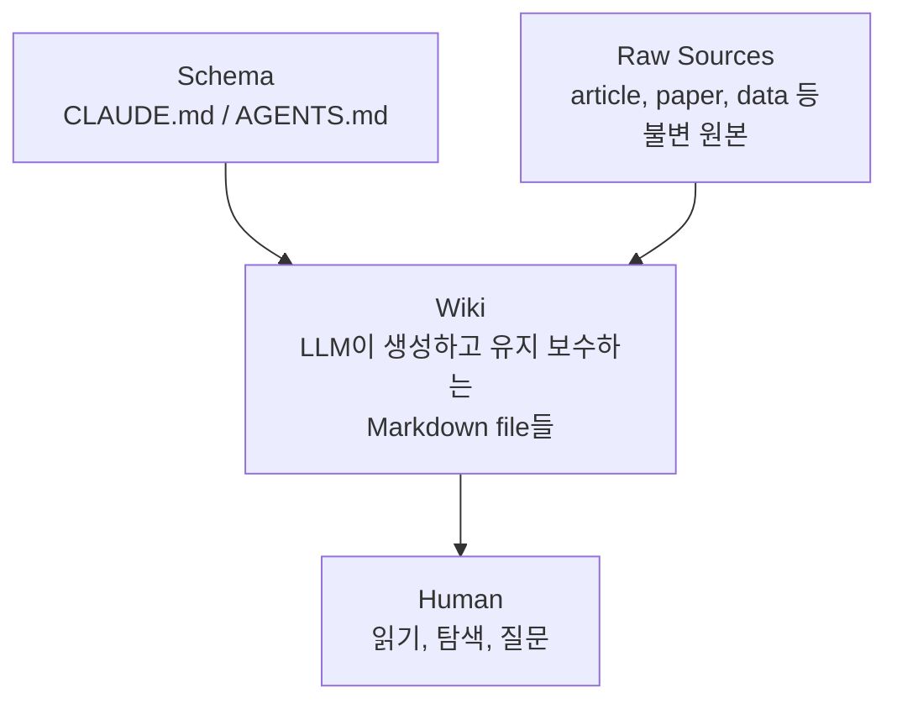
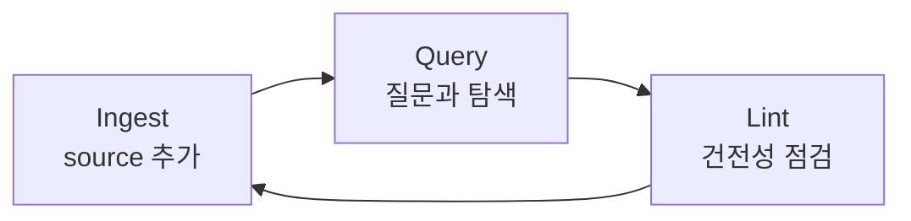

## Main Idea : RAG와의 차이

- RAG는 매 query마다 원본 문서에서 관련 chunk를 검색하고 답변을 재조합하지만, LLM Wiki는 지식을 미리 compile하여 persistent wiki로 유지합니다.

| 구분 | RAG | LLM Wiki |
| --- | --- | --- |
| **지식 처리 시점** | query 시마다 재조합 | source 추가 시 한 번 compile |
| **cross-reference** | 매번 새로 탐색 | 미리 구축되어 있음 |
| **모순 감지** | 감지하지 않음 | ingest 시 자동 표시 |
| **지식 축적** | 없음 (stateless) | 누적 (compounding) |
| **인간의 역할** | query 작성 | source 선별, 질문, 방향 설정 |
| **LLM의 역할** | chunk 검색 + 답변 생성 | wiki 전체 유지 보수 |

- RAG(Retrieval-Augmented Generation)는 매 query마다 원본 문서에서 관련 chunk를 검색하고 답변을 조합합니다.
    - 5개 문서를 종합해야 하는 질문이라면, 매번 관련 조각을 찾아 조립하는 과정을 반복합니다.
    - 지식이 축적되지 않고, 이전 질문에서 얻은 통찰이 다음 질문에 반영되지 않습니다.

- LLM Wiki는 LLM이 **persistent wiki를 점진적으로 구축하고 유지 보수하는 pattern**입니다.
    - 새로운 source가 추가되면 LLM이 읽고, 핵심을 추출하여 기존 wiki에 통합합니다.
    - entity page를 갱신하고, topic summary를 수정하며, 기존 주장과 모순되는 부분을 표시합니다.
    - cross-reference와 synthesis가 이미 완료된 상태이므로 query 시 재조합이 필요 없습니다.

- wiki는 **persistent하고 compounding되는 artifact**입니다.
    - source를 추가할수록, 질문을 던질수록 wiki가 풍부해집니다.
    - 인간은 wiki를 직접 작성하지 않고, source 선별과 탐색과 질문에 집중합니다.
    - LLM이 요약, cross-referencing, filing, bookkeeping을 전담합니다.


---


## 3 Layer Architecture

- LLM Wiki는 raw source, wiki, schema 세 layer로 구성되며, 각 layer는 명확한 소유권과 역할 분리를 갖습니다.
    - raw source는 인간이 소유하고, wiki는 LLM이 소유하며, schema는 인간과 LLM이 공동으로 발전시킵니다.
    - data flow는 단방향입니다 : raw source -> wiki -> 인간의 읽기/탐색.



| layer | 소유자 | 변경 가능 여부 | 예시 |
| --- | --- | --- | --- |
| **Raw Sources** | 인간 | 불변 (immutable) | article, paper, image, transcript |
| **Wiki** | LLM | LLM만 수정 | summary, entity page, concept page |
| **Schema** | 인간 + LLM | 공동 발전 | `CLAUDE.md`, `AGENTS.md` |


### Raw Sources

- 인간이 수집한 원본 자료 모음으로, wiki의 **single source of truth** 역할을 합니다.
    - article, paper, image, data file, meeting transcript 등이 포함됩니다.

- LLM은 읽기만 하고 절대 수정하지 않습니다.
    - web article은 browser extension 등으로 markdown 변환하여 수집합니다.

- image를 local directory에 download해 놓으면 외부 URL이 깨지더라도 LLM이 직접 읽을 수 있습니다.


### Wiki

- LLM이 생성하고 전적으로 관리하는 markdown file directory입니다.
    - summary, entity page, concept page, comparison, overview, synthesis 등으로 구성됩니다.
    - 새 source가 도착하면 page를 생성하고, 기존 page를 갱신하며, cross-reference를 유지합니다.
    - 인간은 wiki를 읽고 탐색하되, 직접 작성하지 않습니다.

- 실제 작업 환경에서는 LLM agent와 markdown editor를 나란히 열어두고 사용합니다.
    - LLM이 대화를 기반으로 wiki를 수정하면, 인간은 editor에서 실시간으로 결과를 탐색합니다.
    - graph view를 지원하는 editor라면 page 간 연결 구조, hub page, orphan page를 시각적으로 파악합니다.
    - 비유하면 editor는 IDE, LLM은 programmer, wiki는 codebase입니다.


### Schema

- LLM에게 wiki의 구조, convention, workflow를 지시하는 설정 문서입니다.
    - Claude Code의 `CLAUDE.md`, Codex의 `AGENTS.md` 등이 해당합니다.
    - source를 ingest할 때, query에 답변할 때, wiki를 유지 보수할 때 따를 절차를 정의합니다.
    - LLM을 generic chatbot이 아닌 **체계적인 wiki maintainer**로 만드는 핵심 설정입니다.

- schema가 없으면 LLM은 매 session마다 다른 방식으로 wiki를 수정하게 됩니다.
    - page naming convention, frontmatter 형식, cross-reference 방식 등을 schema에 명시하면 일관성이 유지됩니다.
    - domain에 맞게 인간과 LLM이 함께 발전시키며, 효과적인 workflow를 발견할 때마다 schema에 반영합니다.


---


## 핵심 Operation

- LLM Wiki의 운영은 ingest, query, lint 세 가지 operation으로 이루어집니다.
    - 세 operation이 순환하면서 wiki의 품질과 범위가 점진적으로 확장됩니다.




### Ingest : Source를 Wiki에 통합

- 새 source를 raw collection에 추가하고 LLM에게 처리를 지시하는 operation입니다.
    - LLM이 source를 읽고, 핵심을 논의하고, summary page를 작성합니다.
    - index를 갱신하고, 관련 entity/concept page를 전체적으로 update합니다.
    - log에 entry를 추가하며, 한 source가 10~15개의 wiki page에 영향을 줄 수 있습니다.

- ingest 방식은 인간이 얼마나 개입할지에 따라 두 가지로 나뉩니다.
    - source를 하나씩 처리하며 인간이 summary를 확인하고 강조점을 조율하는 interactive 방식이 있습니다.
    - 여러 source를 batch로 넘기고 결과만 검토하는 autonomous 방식도 가능합니다.
    - 어떤 방식이든 효과적이었던 workflow를 schema에 기록하면 이후 session에서 재현됩니다.


### Query : Wiki에 질문하고 답변을 축적

- wiki를 대상으로 질문하고 답변을 얻는 operation입니다.
    - LLM이 index를 먼저 읽어 관련 page를 파악한 뒤, 해당 page를 읽고 citation과 함께 답변을 생성합니다.
    - 답변 형태는 markdown page, comparison table, slide deck, chart 등 다양합니다.

- query의 핵심 통찰은 **좋은 답변을 wiki에 다시 filing**하는 것입니다.
    - 비교 분석, 발견한 연결 고리, 종합 정리 등은 chat history에 묻히면 사라집니다.
    - wiki의 새 page로 저장하면 탐색 결과도 ingest된 source와 동일하게 지식으로 축적됩니다.


### Lint : Wiki 건전성 점검

- wiki의 건전성을 주기적으로 점검하는 operation입니다.
    - page 간 모순, 최신 source에 의해 무효화된 주장, inbound link이 없는 orphan page를 식별합니다.
    - 언급만 되고 독립 page가 없는 주요 개념, 누락된 cross-reference를 찾아냅니다.

- lint는 wiki의 성장 방향을 제시하는 역할도 합니다.
    - web search로 채울 수 있는 data gap을 발견하고, 새로운 조사 방향을 제안합니다.
    - wiki가 커질수록 lint의 가치가 높아지며, 인간이 놓치기 쉬운 구조적 문제를 LLM이 발견합니다.


---


## Index와 Log

- wiki가 성장할수록 탐색을 돕는 두 가지 특수 file이 필요합니다.
    - `index.md`는 "지금 wiki에 무엇이 있는가"에, `log.md`는 "wiki에 무슨 일이 있었는가"에 답합니다.

| file | 성격 | 역할 |
| --- | --- | --- |
| `index.md` | content 중심 | 모든 page의 catalog, 한 줄 요약, category별 분류 |
| `log.md` | 시간순 | append-only 활동 기록 (ingest, query, lint) |


### Index : Wiki Content Catalog

- `index.md`는 LLM이 query에 답할 때 가장 먼저 읽는 file입니다.
    - 각 page의 link, 한 줄 요약, date나 source count 같은 metadata를 담고 있습니다.
    - entity, concept, source 등 category별로 정리되어 있어 관련 page를 빠르게 찾습니다.

- \~100개 source, \~수백 개 page 규모에서 embedding 기반 RAG infrastructure 없이도 잘 동작합니다.
    - LLM이 매 ingest마다 index를 갱신하므로 항상 최신 상태를 유지합니다.
    - wiki가 더 커지면 BM25/vector 기반 search engine으로 보완합니다.


### Log : 시간순 활동 기록

- `log.md`는 wiki에서 일어난 모든 활동의 시간순 기록입니다.
    - ingest, query, lint 등 각 operation을 append-only로 기록합니다.
    - 일관된 prefix(예 : `## [2026-04-02] ingest | Article Title`)로 작성하면 unix tool로 parsing이 가능합니다.

- LLM이 새 session을 시작할 때 log를 읽으면 최근 맥락을 빠르게 파악합니다.
    - 마지막으로 어떤 source를 ingest했는지, 어떤 질문이 있었는지 확인합니다.
    - wiki의 발전 timeline을 인간도 한눈에 추적할 수 있습니다.


---


## 활용 영역

- LLM Wiki pattern은 시간에 걸쳐 지식이 축적되는 모든 맥락에 적용됩니다.
    - 핵심 조건은 "source가 계속 추가되고, 그 사이의 관계가 중요한 domain"입니다.

| 영역 | 활용 방식 |
| --- | --- |
| **개인 성장** | journal entry, article, podcast note를 filing하여 자기 이해를 구조화 |
| **Research** | 주간/월간 단위로 paper, report를 읽으며 evolving thesis가 담긴 wiki 구축 |
| **독서** | chapter별로 filing하고, character, theme, plot thread page를 상호 연결 |
| **Business/Team** | Slack thread, meeting transcript, customer call을 LLM이 내부 wiki로 유지 보수 |
| **기타** | competitive analysis, due diligence, 여행 계획, course note, hobby deep-dive |

- 독서 활용의 경우, Tolkien Gateway 같은 fan wiki를 개인적으로 구축하는 것과 비슷합니다.
    - community가 수년에 걸쳐 만든 수천 개의 interlinked page를 LLM이 읽는 과정에서 자동 생성합니다.
    - character 간 관계, 사건의 인과, theme의 변화를 page 단위로 정리하고 상호 연결합니다.

- business/team 환경에서는 인간이 review loop에 참여하는 구조가 적합합니다.
    - LLM이 meeting transcript에서 결정 사항과 action item을 추출하여 wiki를 갱신합니다.
    - team member가 update 내용을 review하고 승인하는 절차를 거치면 정확도가 유지됩니다.


---


## 작동하는 이유

- knowledge base 유지의 어려운 부분은 reading이나 thinking이 아니라 **book keeping**입니다.
    - cross-reference 갱신, summary 최신화, 모순 표시, 수십 개 page 간 일관성 유지가 부담입니다.
    - 인간은 유지 보수 부담이 가치 증가 속도를 넘어서면 wiki를 포기합니다.
    - 개인 wiki, Notion, Confluence 등 도구는 많지만, 유지 보수하는 사람이 없어서 방치됩니다.

- LLM은 지루해하지 않고, cross-reference 갱신을 잊지 않으며, 한 번에 15개 file을 수정합니다.
    - 유지 보수 비용이 거의 0에 가까워지므로 wiki가 계속 유지됩니다.
    - 인간은 source 선별, 분석 방향 설정, 질문, 의미 해석에 집중합니다.
    - 역할이 명확히 분리됩니다.
        - 인간은 "무엇을, 왜" 결정하고, LLM은 "어떻게" 실행합니다.

- wiki는 git repository이므로 version history, branching, collaboration을 무료로 얻습니다.
    - LLM이 잘못 수정한 경우에도 이전 상태로 쉽게 복원할 수 있습니다.
    - 여러 사람이 각자의 branch에서 wiki를 발전시키고 merge하는 협업도 가능합니다.

- Vannevar Bush의 Memex(1945)와 정신적으로 맥이 닿습니다.
    - Memex는 문서 간 associative trail을 가진 개인 knowledge store를 구상한 개념입니다.
    - web은 public하고 분산된 방향으로 발전했지만, Memex의 원래 vision은 private하고 능동적으로 curate되는 구조였습니다.
    - Bush가 해결하지 못한 "누가 유지 보수를 하는가"라는 문제를 LLM이 해결합니다.


---


## Andrej Karpathy의 "LLM Wiki" 원문 전체

```markdown
# LLM Wiki

A pattern for building personal knowledge bases using LLMs.

This is an idea file, it is designed to be copy pasted to your own LLM Agent (e.g. OpenAI Codex, Claude Code, OpenCode / Pi, or etc.). Its goal is to communicate the high level idea, but your agent will build out the specifics in collaboration with you.

## The core idea

Most people's experience with LLMs and documents looks like RAG: you upload a collection of files, the LLM retrieves relevant chunks at query time, and generates an answer. This works, but the LLM is rediscovering knowledge from scratch on every question. There's no accumulation. Ask a subtle question that requires synthesizing five documents, and the LLM has to find and piece together the relevant fragments every time. Nothing is built up. NotebookLM, ChatGPT file uploads, and most RAG systems work this way.

The idea here is different. Instead of just retrieving from raw documents at query time, the LLM **incrementally builds and maintains a persistent wiki** — a structured, interlinked collection of markdown files that sits between you and the raw sources. When you add a new source, the LLM doesn't just index it for later retrieval. It reads it, extracts the key information, and integrates it into the existing wiki — updating entity pages, revising topic summaries, noting where new data contradicts old claims, strengthening or challenging the evolving synthesis. The knowledge is compiled once and then *kept current*, not re-derived on every query.

This is the key difference: **the wiki is a persistent, compounding artifact.** The cross-references are already there. The contradictions have already been flagged. The synthesis already reflects everything you've read. The wiki keeps getting richer with every source you add and every question you ask.

You never (or rarely) write the wiki yourself — the LLM writes and maintains all of it. You're in charge of sourcing, exploration, and asking the right questions. The LLM does all the grunt work — the summarizing, cross-referencing, filing, and bookkeeping that makes a knowledge base actually useful over time. In practice, I have the LLM agent open on one side and Obsidian open on the other. The LLM makes edits based on our conversation, and I browse the results in real time — following links, checking the graph view, reading the updated pages. Obsidian is the IDE; the LLM is the programmer; the wiki is the codebase.

This can apply to a lot of different contexts. A few examples:

- **Personal**: tracking your own goals, health, psychology, self-improvement — filing journal entries, articles, podcast notes, and building up a structured picture of yourself over time.
- **Research**: going deep on a topic over weeks or months — reading papers, articles, reports, and incrementally building a comprehensive wiki with an evolving thesis.
- **Reading a book**: filing each chapter as you go, building out pages for characters, themes, plot threads, and how they connect. By the end you have a rich companion wiki. Think of fan wikis like [Tolkien Gateway](https://tolkiengateway.net/wiki/Main_Page) — thousands of interlinked pages covering characters, places, events, languages, built by a community of volunteers over years. You could build something like that personally as you read, with the LLM doing all the cross-referencing and maintenance.
- **Business/team**: an internal wiki maintained by LLMs, fed by Slack threads, meeting transcripts, project documents, customer calls. Possibly with humans in the loop reviewing updates. The wiki stays current because the LLM does the maintenance that no one on the team wants to do.
- **Competitive analysis, due diligence, trip planning, course notes, hobby deep-dives** — anything where you're accumulating knowledge over time and want it organized rather than scattered.

## Architecture

There are three layers:

**Raw sources** — your curated collection of source documents. Articles, papers, images, data files. These are immutable — the LLM reads from them but never modifies them. This is your source of truth.

**The wiki** — a directory of LLM-generated markdown files. Summaries, entity pages, concept pages, comparisons, an overview, a synthesis. The LLM owns this layer entirely. It creates pages, updates them when new sources arrive, maintains cross-references, and keeps everything consistent. You read it; the LLM writes it.

**The schema** — a document (e.g. CLAUDE.md for Claude Code or AGENTS.md for Codex) that tells the LLM how the wiki is structured, what the conventions are, and what workflows to follow when ingesting sources, answering questions, or maintaining the wiki. This is the key configuration file — it's what makes the LLM a disciplined wiki maintainer rather than a generic chatbot. You and the LLM co-evolve this over time as you figure out what works for your domain.

## Operations

**Ingest.** You drop a new source into the raw collection and tell the LLM to process it. An example flow: the LLM reads the source, discusses key takeaways with you, writes a summary page in the wiki, updates the index, updates relevant entity and concept pages across the wiki, and appends an entry to the log. A single source might touch 10-15 wiki pages. Personally I prefer to ingest sources one at a time and stay involved — I read the summaries, check the updates, and guide the LLM on what to emphasize. But you could also batch-ingest many sources at once with less supervision. It's up to you to develop the workflow that fits your style and document it in the schema for future sessions.

**Query.** You ask questions against the wiki. The LLM searches for relevant pages, reads them, and synthesizes an answer with citations. Answers can take different forms depending on the question — a markdown page, a comparison table, a slide deck (Marp), a chart (matplotlib), a canvas. The important insight: **good answers can be filed back into the wiki as new pages.** A comparison you asked for, an analysis, a connection you discovered — these are valuable and shouldn't disappear into chat history. This way your explorations compound in the knowledge base just like ingested sources do.

**Lint.** Periodically, ask the LLM to health-check the wiki. Look for: contradictions between pages, stale claims that newer sources have superseded, orphan pages with no inbound links, important concepts mentioned but lacking their own page, missing cross-references, data gaps that could be filled with a web search. The LLM is good at suggesting new questions to investigate and new sources to look for. This keeps the wiki healthy as it grows.

## Indexing and logging

Two special files help the LLM (and you) navigate the wiki as it grows. They serve different purposes:

**index.md** is content-oriented. It's a catalog of everything in the wiki — each page listed with a link, a one-line summary, and optionally metadata like date or source count. Organized by category (entities, concepts, sources, etc.). The LLM updates it on every ingest. When answering a query, the LLM reads the index first to find relevant pages, then drills into them. This works surprisingly well at moderate scale (~100 sources, ~hundreds of pages) and avoids the need for embedding-based RAG infrastructure.

**log.md** is chronological. It's an append-only record of what happened and when — ingests, queries, lint passes. A useful tip: if each entry starts with a consistent prefix (e.g. `## [2026-04-02] ingest | Article Title`), the log becomes parseable with simple unix tools — `grep "^## \[" log.md | tail -5` gives you the last 5 entries. The log gives you a timeline of the wiki's evolution and helps the LLM understand what's been done recently.

## Optional: CLI tools

At some point you may want to build small tools that help the LLM operate on the wiki more efficiently. A search engine over the wiki pages is the most obvious one — at small scale the index file is enough, but as the wiki grows you want proper search. [qmd](https://github.com/tobi/qmd) is a good option: it's a local search engine for markdown files with hybrid BM25/vector search and LLM re-ranking, all on-device. It has both a CLI (so the LLM can shell out to it) and an MCP server (so the LLM can use it as a native tool). You could also build something simpler yourself — the LLM can help you vibe-code a naive search script as the need arises.

## Tips and tricks

- **Obsidian Web Clipper** is a browser extension that converts web articles to markdown. Very useful for quickly getting sources into your raw collection.
- **Download images locally.** In Obsidian Settings → Files and links, set "Attachment folder path" to a fixed directory (e.g. `raw/assets/`). Then in Settings → Hotkeys, search for "Download" to find "Download attachments for current file" and bind it to a hotkey (e.g. Ctrl+Shift+D). After clipping an article, hit the hotkey and all images get downloaded to local disk. This is optional but useful — it lets the LLM view and reference images directly instead of relying on URLs that may break. Note that LLMs can't natively read markdown with inline images in one pass — the workaround is to have the LLM read the text first, then view some or all of the referenced images separately to gain additional context. It's a bit clunky but works well enough.
- **Obsidian's graph view** is the best way to see the shape of your wiki — what's connected to what, which pages are hubs, which are orphans.
- **Marp** is a markdown-based slide deck format. Obsidian has a plugin for it. Useful for generating presentations directly from wiki content.
- **Dataview** is an Obsidian plugin that runs queries over page frontmatter. If your LLM adds YAML frontmatter to wiki pages (tags, dates, source counts), Dataview can generate dynamic tables and lists.
- The wiki is just a git repo of markdown files. You get version history, branching, and collaboration for free.

## Why this works

The tedious part of maintaining a knowledge base is not the reading or the thinking — it's the bookkeeping. Updating cross-references, keeping summaries current, noting when new data contradicts old claims, maintaining consistency across dozens of pages. Humans abandon wikis because the maintenance burden grows faster than the value. LLMs don't get bored, don't forget to update a cross-reference, and can touch 15 files in one pass. The wiki stays maintained because the cost of maintenance is near zero.

The human's job is to curate sources, direct the analysis, ask good questions, and think about what it all means. The LLM's job is everything else.

The idea is related in spirit to Vannevar Bush's Memex (1945) — a personal, curated knowledge store with associative trails between documents. Bush's vision was closer to this than to what the web became: private, actively curated, with the connections between documents as valuable as the documents themselves. The part he couldn't solve was who does the maintenance. The LLM handles that.


## Note

This document is intentionally abstract. It describes the idea, not a specific implementation. The exact directory structure, the schema conventions, the page formats, the tooling — all of that will depend on your domain, your preferences, and your LLM of choice. Everything mentioned above is optional and modular — pick what's useful, ignore what isn't. For example: your sources might be text-only, so you don't need image handling at all. Your wiki might be small enough that the index file is all you need, no search engine required. You might not care about slide decks and just want markdown pages. You might want a completely different set of output formats. The right way to use this is to share it with your LLM agent and work together to instantiate a version that fits your needs. The document's only job is to communicate the pattern. Your LLM can figure out the rest.
```


---


## Reference

- <https://gist.githubusercontent.com/karpathy/442a6bf555914893e9891c11519de94f/raw/ac46de1ad27f92b28ac95459c782c07f6b8c964a/llm-wiki.md>

