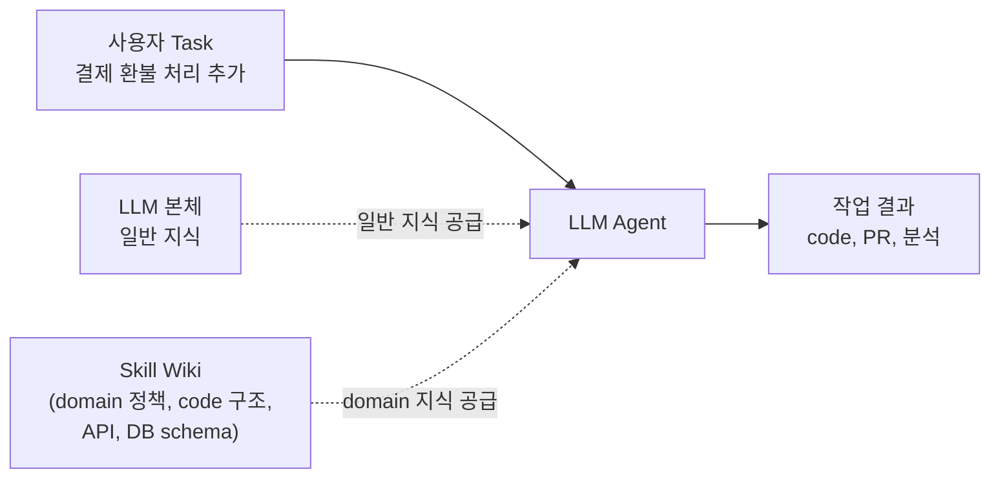
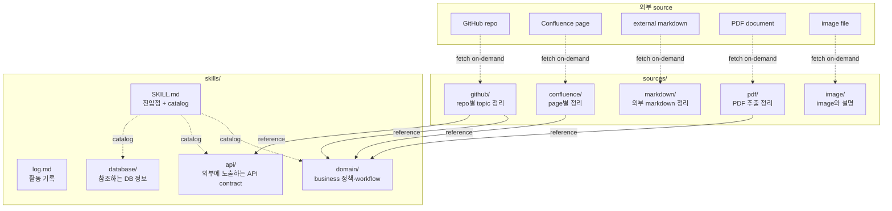
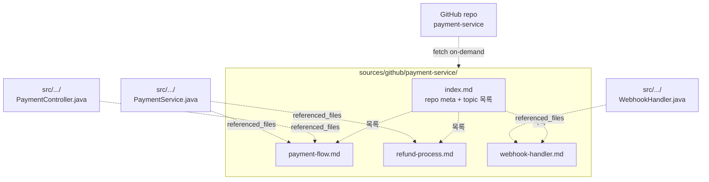
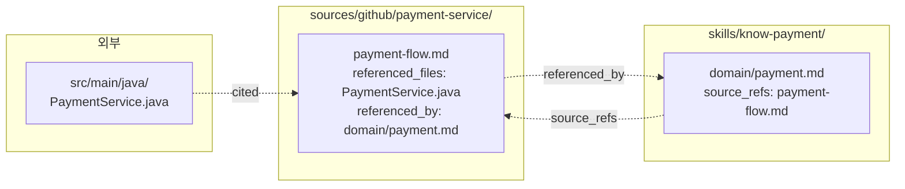

## Agent가 Domain을 다룬다는 것

- agent가 domain 작업을 반복 수행하려면 domain 지식이 **누적**되고, 그 지식을 호출 시점에 **활용** 가능해야 합니다.
    - 누적과 활용이 한 곳에서 일어나도록 domain 지식을 LLM Wiki 형태로 정리하고, skill 단위로 packaging합니다.
    - skill로 packaging하면 agent가 작업 시점에 `SKILL.md` 진입점을 통해 필요한 지식을 스스로 찾아 호출합니다.


### Domain 지식이 필요한 이유

- agent가 domain 작업을 수행하려면 일반 지식 외에 **그 domain의 정책과 system 구조**를 알아야 합니다.
    - 예를 들어, 일반적인 LLM은 결제 정책의 idempotency 규칙, 자사 service의 endpoint 구조, DB의 table 관계를 알지 못합니다.
        - idempotency는 같은 요청을 여러 번 보내도 한 번 처리한 것과 동일한 결과를 보장하는 성질입니다.
    - 이런 지식 없이 agent에게 "결제 환불 처리 추가" 같은 작업을 시키면 잘못된 가정으로 code를 작성하거나 system과 충돌하는 결과를 만듭니다.

- 한 번의 작업마다 인간이 필요한 맥락을 prompt로 주입하는 방식은 **반복 작업이 누적될수록 비효율적**입니다.
    - 인간이 매번 같은 정책을 설명하고 같은 file 위치를 알려주면 agent가 스스로 작업한다고 부를 수 없습니다.
    - **누적된 지식 저장소**가 있어야 agent가 호출 시점에 자기 task와 관련된 지식을 **스스로** 가져옵니다.


### Domain 지식의 누적

- LLM Wiki는 domain 정책, source code 구조, API contract, DB schema를 **영구적으로 누적**하여 agent가 매번 작업할 때 참조합니다.
    - RAG처럼 query마다 chunk를 재조합하지 않고, **미리 정리되고 cross-reference된 wiki**를 통째로 활용합니다.
    - 같은 domain에서 여러 task를 반복 수행하는 agent에게는 RAG보다 wiki가 자연스러운데, **지식이 누적되고 일관성이 유지**되기 때문입니다.



- **유지 비용이 작다는 점**이 wiki 형태의 강점이며, 이 비용 구조가 자주 변경되는 source를 유연하게 다룰 수 있게 만듭니다.
    - source code와 DB schema처럼 자주 변하는 자료는 수동 유지로는 며칠 만에 stale해지지만, **LLM이 sync, lint, cross-reference 갱신을 전담**하면 이 부담이 사라집니다.
    - **양방향 reference**(referenced_by, source_refs)가 자동으로 영향 범위를 추적하므로, Human은 sync 명령만 주면 됩니다.

- 자동화 구조가 없다면, wiki는 변경되는 source를 다루는 유지 비용을 감당하지 못해 금방 stale(낡은) 상태가 되며, **누적된 지식이라는 가치가 사라지게** 됩니다.


### Skill 형태로의 활용

- skill로 packaging한다는 것은 누적된 지식 wiki에 **이름표(`SKILL.md`)와 진입점**을 붙여 agent가 호출 시점에 쉽게 찾아 활용하도록 만드는 것입니다.
    - `SKILL.md` frontmatter의 name과 description이 agent에게 이 wiki가 무엇이고 언제 호출해야 하는지를 알립니다.
    - 진입점이 있어야 agent가 작업 시작 시점에 자기 task와 관련된 wiki를 식별하여 활용 가능합니다.
    - skill 형태는 **framework 중립적**이므로 Claude Code, OpenCode, Codex, 직접 만든 LLM application 모두에서 동일하게 사용됩니다.

- 한 skill의 범위는 단일 domain의 지식, API spec, DB schema, source code repository 등 한 작업 영역에 묶이는 자료 전체입니다.
    - business domain(결제, 주문, 환불), 외부 service와의 통합 contract, 자사 service의 code 구조가 한 skill에 함께 들어갈 수 있습니다.
    - 작업 영역이 **너무 넓으면** description이 모호해져 호출 정확도가 떨어지고, **너무 좁으면** cross-reference의 가치가 사라집니다.


---


## 기존 LLM Wiki와의 차이

- 활용 목적이 다르며, 기존 LLM Wiki는 **Human의 학습과 탐색**을 위해 만들어진 반면 skill로 packaging한 wiki는 **LLM agent의 자율 작업 reference**로 만들어집니다.
    - 활용 목적이 다르면 어떤 자료를 source로 넣을지, page를 어떻게 구조화할지가 달라집니다.
    - Human용 wiki는 **paper와 article 중심**이지만, agent용 wiki는 **system을 구성하는 모든 자료(code, schema, contract)**를 포함해야 자율 작업이 가능합니다.

- 외부 source의 성격도 달라지며, 기존 LLM Wiki는 article이나 paper처럼 **한 번 수집하면 변하지 않는 자료**를 가정합니다.
    - agent용 wiki에서는 GitHub repository, Confluence page, DB schema처럼 **외부에서 계속 변하는 자료**가 주가 되므로 **변경 추적**이 필수입니다.
    - 변경 추적은 source 종류별로 다르며 (commit hash, page version, content hash 등), 각 종류 folder의 `AGENTS.md`에 절차를 정의합니다.

| 구분 | 기존 LLM Wiki | Skill로 Packaging한 LLM Wiki |
| --- | --- | --- |
| **활용 목적** | Human의 학습·탐색 | LLM agent의 자율 작업 reference |
| **소비자** | Human (직접 읽기) | LLM agent (작업 중 invoke) |
| **진입점** | `index.md` | `SKILL.md` (frontmatter 포함) |
| **source 종류** | article, paper, transcript | github, confluence, markdown, pdf, image 등 |
| **source 변경** | 거의 없음 | 자주 발생, 종류별 추적 mechanism |
| **수집 방식** | Human이 markdown 변환 후 저장 | 외부 reference + on-demand fetch |
| **변경 대응** | 새 source 추가 (ingest) | 기존 source 변경 (sync) |
| **page 분류** | sources, concepts, entities, comparisons | domain, api, database (skill 단위) |

- 분류 축도 다르며, 단일 domain을 다루는 skill에서는 추상/구체 구분(concept vs entity)이나 종합 비교(comparisons)의 의미가 약해집니다.
    - domain 한정 wiki는 그 domain의 정책, workflow, 외부 contract만 다루면 충분하며, 추상 개념을 별도 page로 두는 빈도가 낮습니다.
    - comparisons는 여러 domain을 가로지르는 분석에 적합한 분류이므로, 단일 skill 안에서는 자연스럽지 않습니다.


### 가장 좋은 Domain 자료 : Source Code와 DB Schema

- 기존 LLM Wiki가 다루는 article과 paper가 domain을 **외부에서 설명한** 자료라면, source code와 DB schema는 **domain 그 자체**를 직접 드러내는 자료입니다.
    - source code는 어떤 logic이 어떻게 돌아가는지 실제 동작을 담고 있고, DB schema는 data 구조와 제약을 통해 domain의 형태를 담고 있습니다.
    - agent가 자율 작업을 하려면 그 작업을 수행할 system 자체를 알아야 하므로, 이 두 자료가 article과 paper에 더해 source 종류로 추가됩니다.

- 결제 환불 작업을 하려면 결제 service의 controller 구조, 환불 처리 logic 위치, 거래 table 구조를 모두 알아야 합니다.
    - 일반적인 LLM은 자사 system을 모르므로, 이 지식을 wiki로 정리해 agent에게 reference로 제공해야 합니다.

- 단순히 code를 읽으면 되지 않냐는 의문이 있을 수 있으나, 매 작업마다 전체 codebase를 탐색하는 것은 비효율적이고 작업 일관성도 떨어집니다.
    - codebase가 크면 탐색 비용이 매번 발생하며, agent가 매번 다른 부분을 보게 되어 작업 결과의 일관성이 흔들립니다.
    - wiki에 한 번 정리하면 그 정리 결과가 영속되어 모든 후속 작업이 동일한 mental model을 공유합니다.

- DB schema와 API spec은 **system의 contract**이므로, agent가 이 contract를 정확히 이해하지 못하면 작업 결과가 system과 충돌합니다.
    - DB의 nullable column, foreign key, unique constraint를 모르면 잘못된 SQL을 생성합니다.
    - API endpoint의 request/response 형식을 모르면 잘못된 client code를 작성합니다.

- 외부 source는 대부분 외부에서 계속 변하는 자료이므로, 변경에 wiki가 따라가야 합니다.
    - source code는 매일 commit이 쌓이고, DB schema는 migration으로 진화하며, Confluence page는 정책 갱신과 함께 변경됩니다.
    - 이 mutability가 sources layer 설계의 핵심 제약이며, 다음 section에서 다루는 sync operation의 출발점이 됩니다.


---


## Layer 구조

- skill로 packaging한 wiki는 외부 source, sources layer, skills layer 세 영역으로 나뉘며, 각 영역은 위치와 책임이 다릅니다.
    - 외부 source는 wiki repo 밖에 있고, sources는 그 외부 자료의 정리본이며, skills는 agent가 invoke하는 단위입니다.
    - sources는 source 종류별 folder로 분리되어 종류별 ingest와 변경 추적 절차를 `AGENTS.md`에 따로 정의합니다.



| layer | 위치 | 책임 |
| --- | --- | --- |
| **외부 source** | wiki repo 밖 | 진짜 source (GitHub repo, Confluence page, PDF 등) |
| `sources/<type>/` | wiki repo 안 | 종류별 외부 source의 file:line 또는 section:line 단위 참조 정리 |
| `sources/<type>/AGENTS.md` | source 종류 folder 안 | 해당 source 종류의 ingest와 변경 추적 절차 |
| `skills/know-<domain>/` | wiki repo 안 | skill 단위 business 관점 page (sources를 link로 참조) |
| `skills/know-<domain>/SKILL.md` | skill folder 안 | 진입점, page catalog, skill manifest |


### 외부 Source

- 외부 source는 wiki repo에 byte 단위로 들어오지 않으며, 필요할 때만 temp folder에 clone하거나 fetch하여 LLM이 읽습니다.
    - source 전체를 wiki에 두면 git history가 비대해지고, 외부 변경마다 wiki repo도 같이 dirty해지는 문제가 발생합니다.
    - reference만 두는 전략으로 wiki repo를 가볍게 유지하고, 변경 추적은 source 종류별 식별자 비교로 처리합니다.

- 변경 추적 식별자는 source 종류에 따라 다릅니다.
    - github은 commit hash, confluence는 page version, markdown과 pdf와 image는 content hash로 비교합니다.
    - 각 식별자 비교 절차는 source 종류 folder의 `AGENTS.md`에 정의됩니다.


### Sources Layer

- sources는 source 종류별 folder로 분리되며, 각 folder가 자기만의 ingest 절차와 변경 추적 mechanism을 갖습니다.
    - github은 `sources/github/<repo>/index.md` + `<topic>.md` 구조로 repo 단위로 묶고 그 안에서 topic 단위로 정리합니다.
    - confluence와 pdf와 markdown도 동일한 pattern을 따르되, 묶음 단위(page, document)와 식별자(version, hash)가 다릅니다.

- topic 또는 정리 단위의 분리가 **변경 동기화의 단위**가 되며, file이 바뀌면 그 file을 참조하는 정리본만 영향받습니다.
    - 한 source 변경 -> 영향받는 정리본 식별 -> 정리본의 referenced_by를 따라 skill page 갱신의 흐름이 일관되게 동작합니다.


### Skills Layer

- skills는 한 개 이상의 skill folder를 담는 container이며, 같은 wiki 안의 skill들은 sources를 공유합니다.
    - `skills/know-payment/`, `skills/know-order/` 처럼 domain별 skill을 같은 wiki 아래에 두면 외부 source 참조가 자연스럽게 재사용됩니다.
    - skill 사이의 cross-reference는 `skills/<skill-A>/page.md`에서 `skills/<skill-B>/page.md`로의 link로 표현합니다.

- skill 이름은 **`know-<domain>` 형태**로 그 skill이 어떤 domain을 아는가를 명시합니다.
    - `know-payment`는 payment domain을 아는 skill, `know-order`는 order domain을 아는 skill처럼 의도가 이름에 드러납니다.
    - skills/ folder 안에 write skill이나 scrape skill 같은 행위 skill이 함께 있어도 명명만으로 구분됩니다.


---


## Source 정리본의 구조

- sources layer의 각 source 종류는 외부 source를 wiki에 그대로 가져오지 않고, 참조 meta 정보 + 묶음 단위 정리본으로 표현합니다.
    - meta 정보에는 url과 변경 추적용 식별자(commit, version, content hash 등)가 포함되어 변경 감지의 기준점이 됩니다.
    - 정리본에는 source 종류에 맞는 단위(file:line, section, page)의 촘촘한 참조가 들어가며, 이 정보를 기반으로 LLM이 변경분의 영향 범위를 분석합니다.




### 묶음 단위 Index Page

- 각 source 묶음 (repo, page, document) 마다 `index.md`를 두어 meta 정보와 정리본 목록을 담습니다.
    - frontmatter에 url과 변경 추적용 식별자, 마지막 ingest 시각을 명시합니다.
    - 본문에는 source 개요, 정리본 link 목록, 이 index를 참조하는 skill page 목록(referenced_by)이 들어갑니다.

```markdown
---
type: github-repo
url: https://github.com/company/payment-service
default_branch: main
last_ingested_commit: abc123def
last_ingested_at: 2026-05-04
---

## Repository

- Payment service backend
- Spring Boot, Java 21
- 결제 승인, 환불, webhook 처리 담당

## Topics

- [payment-flow](payment-flow.md) - 결제 승인 흐름 (controller -> service -> 외부 PG)
- [refund-process](refund-process.md) - 환불 처리 절차 (정책 검증 -> 부분 환불 -> 정산 갱신)
- [webhook-handler](webhook-handler.md) - 외부 PG webhook 수신과 idempotency 처리

## Referenced By

- skills/know-payment/domain/payment.md
- skills/know-payment/api/payment-endpoints.md
```


### 정리본 Page에서의 촘촘한 참조

- 정리본 page는 한 묶음 안에서 한 주제와 관련된 file:line 또는 section 단위 참조를 모아 정리합니다.
    - frontmatter의 referenced_files에 path, last_seen_lines, last_seen_commit(또는 version, hash)을 기록하며, 이 정보가 sync 시 영향 분석의 핵심 자료가 됩니다.
    - referenced_by에는 이 정리본을 link로 참조하는 skill page 목록을 기록하여 양방향 연결을 만듭니다.

```markdown
---
type: github-topic
repo: payment-service
referenced_files:
  - path: src/main/java/com/payment/api/PaymentController.java
    last_seen_lines: [42, 78]
    last_seen_commit: abc123def
  - path: src/main/java/com/payment/service/PaymentService.java
    last_seen_lines: [15, 99, 134]
    last_seen_commit: abc123def
referenced_by:
  - skills/know-payment/domain/payment.md
  - skills/know-payment/api/payment-endpoints.md
---

## 결제 승인 흐름

- `POST /api/payments` 진입은 `PaymentController.createPayment()` (`PaymentController.java:42`)에서 처리합니다.
    - request validation을 거쳐 `PaymentService.process()` (`PaymentService.java:15`)를 호출합니다.

- `PaymentService.process()`는 외부 PG 호출 전에 idempotency key를 검사합니다.
    - `PaymentService.java:99`에서 Redis에 key 존재 여부를 확인합니다.
    - 중복 요청이면 기존 결과를 반환하고, 아니면 `ExternalPgClient.charge()`로 위임합니다.
```


### Source 종류별 차이

- 묶음 단위와 변경 추적 식별자가 source 종류에 따라 달라집니다.
    - github은 repo 단위로 묶고 commit hash로 변경 추적, 정리본은 topic 단위입니다.
    - confluence는 space나 page tree 단위로 묶고 page version으로 변경 추적, 정리본은 page 단위입니다.
    - markdown과 pdf는 document 단위로 묶고 content hash로 변경 추적, 정리본은 section 단위입니다.
    - image는 단일 file 단위이며, 정리본은 image와 설명을 함께 담습니다.

- 각 source 종류 folder의 `AGENTS.md`에 그 종류 고유의 ingest 절차와 frontmatter format을 정의합니다.
    - 여러 skill이 같은 source 종류를 공유할 때 `AGENTS.md`를 재사용하므로 절차가 한 곳에 모입니다.
    - 새로운 source 종류 (예: notion, slack, jira)를 추가할 때도 새 folder와 `AGENTS.md`를 두면 끝입니다.


---


## 양방향 연결

- source 정리본과 skill page는 frontmatter의 referenced_by와 source_refs로 **양방향 연결**됩니다.
    - 양방향 연결은 변경 감지 시 **영향 분석을 가능하게 하는 핵심 mechanism**이며, 한 방향만 있으면 영향 범위 추적이 불가능합니다.
    - LLM은 한 file 변경을 감지하면 정리본의 referenced_files로 영향받는 정리본을 찾고, 그 정리본의 referenced_by로 영향받는 skill page를 찾습니다.


### 연결 Mechanism

- 외부 file, source 정리본, skill page 세 layer가 frontmatter field로 서로를 가리키며 추적 chain을 이룹니다.




### Skill Page의 참조 규칙

- skill page에서 source 정리본으로 가는 link는 `source_refs` frontmatter로 관리합니다.
    - skill page 본문에는 file:line 단위의 **직접 참조를 적지 않고**, 정리본 link만 둡니다.
    - file:line 참조가 **분산되면** source 변경 시 모든 skill page를 다시 검사해야 하지만, **sources layer에 모아두면** 그 layer만 갱신해도 정합성이 유지됩니다.

```yaml
---
title: Payment Domain
type: domain
source_refs:
  - sources/github/payment-service/payment-flow.md
  - sources/github/payment-service/refund-process.md
  - sources/confluence/payment-policy/refund-rules.md
---
```


---


## Sync Operation

- ingest, query, lint 외에 **sync operation**이 추가되며, 외부 source의 변경을 wiki에 전파하는 책임을 갖습니다.
    - 자동화는 본 문서 범위 밖이며, 현재는 Human이 명시적으로 sync를 trigger합니다.
    - sync는 한 source 묶음 (예: `sources/github/payment-service`)을 path로 지정하여 수행합니다.

- **단일 sync 명령에 path만 다르고**, source 종류는 path로 자동 식별합니다.
    - LLM은 path의 첫 segment (`github`, `confluence`, `pdf` 등)를 보고 해당 종류 folder의 `AGENTS.md`를 따라 sync 절차를 수행합니다.
    - 종류별 절차의 차이 (git diff, page version 비교, content hash 비교)는 **`AGENTS.md`에 캡슐화**됩니다.

```mermaid
graph TB
    human[Human]
    src_index["sources/<type>/<group>/<br>index.md"]
    schema["sources/<type>/<br>AGENTS.md"]
    temp_fetch["temp folder<br>(on-demand fetch)"]
    diff[변경분 추출<br>(diff/version/hash)]
    affected_pages_in_source[영향받는 정리본 식별]
    affected_skill_pages[영향받는 skill page 식별]
    update_pages[정리본·skill page 갱신]
    update_meta[meta 식별자 갱신]
    log_md[log.md<br>sync entry append]

    human -->|"1. sync <path>"| src_index
    src_index -->|"2. type 식별·meta 확인"| schema
    schema -->|"3. fetch 절차 따름"| temp_fetch
    temp_fetch -->|"4. 변경분 추출"| diff
    diff -->|"5. referenced_files와 비교"| affected_pages_in_source
    affected_pages_in_source -->|"6. referenced_by 따라가기"| affected_skill_pages
    affected_skill_pages --> update_pages
    update_pages --> update_meta
    update_meta --> log_md
```


### 7단계 절차

- 변경 감지부터 wiki page 갱신, log 기록까지 한 sync는 다음 7단계를 순서대로 수행합니다.

1. **trigger** : Human이 `sync <path>` 형태로 sync를 명령합니다 (예: `sync sources/github/payment-service`).

2. **type 식별과 meta 확인** : LLM이 path의 첫 segment로 source 종류를 식별하고, 그 종류 folder의 `AGENTS.md`를 읽어 절차를 파악합니다. 묶음 `index.md`의 meta 식별자(commit hash, version, content hash)를 비교 기준으로 잡습니다.

3. **fetch** : `AGENTS.md`의 fetch 절차에 따라 temp folder에 외부 source를 가져옵니다 (github은 git fetch, confluence는 API export 등).

4. **변경분 추출** : meta 식별자를 기준으로 변경 영역을 추출합니다 (github은 git diff, confluence는 page revision diff, markdown/pdf는 content 비교).

5. **영향 정리본 식별** : 변경된 file path 또는 section을 모든 정리본의 referenced_files와 비교하여 영향받는 정리본을 찾습니다.

6. **영향 skill page 식별** : 영향받는 정리본의 referenced_by를 따라가 갱신이 필요한 skill page를 식별합니다.

7. **갱신과 기록** : LLM이 변경 내용을 읽고 정리본과 skill page를 갱신하며, meta 식별자를 갱신한 뒤 `log.md`에 sync entry를 append합니다.


### 비용과 주의 사항

- sync는 비용이 높은 operation이며, 큰 PR이나 대규모 refactoring이 있으면 LLM 호출 비용이 빠르게 증가합니다.
    - referenced_by 정확도가 곧 영향 분석의 정확도이므로, 평소 ingest와 lint를 통해 referenced_by가 누락되지 않도록 유지해야 합니다.
    - 변경 빈도가 높은 source는 sync 주기를 길게 잡거나 핵심 file/section만 좁게 reference하는 전략을 고려합니다.


---


## Directory 구조

- 한 wiki repo는 sources와 skills 두 top-level folder로 구성됩니다.
    - sources에는 source 종류별 folder가 들어가고, 각 folder는 `AGENTS.md`와 묶음 단위 정리본을 갖습니다.
    - skills에는 know-<domain> 형태의 skill folder들이 들어갑니다.


### 전체 Tree

- 두 개의 skill (know-payment, know-order)이 같은 sources를 공유하는 형태로 구성한 예시입니다.

```plaintext
my-wiki-repo/
├── sources/
│   ├── github/
│   │   ├── AGENTS.md
│   │   └── payment-service/
│   │       ├── index.md
│   │       ├── payment-flow.md
│   │       ├── refund-process.md
│   │       └── webhook-handler.md
│   ├── confluence/
│   │   ├── AGENTS.md
│   │   └── payment-policy/
│   │       ├── index.md
│   │       └── refund-rules.md
│   ├── markdown/
│   │   ├── AGENTS.md
│   │   └── design-decisions/
│   │       ├── index.md
│   │       └── payment-architecture.md
│   ├── pdf/
│   │   ├── AGENTS.md
│   │   └── payment-spec/
│   │       ├── index.md
│   │       └── card-flow.md
│   └── image/
│       ├── AGENTS.md
│       └── payment-diagrams/
│           ├── index.md
│           └── flow-chart.md
└── skills/
    ├── know-payment/
    │   ├── SKILL.md
    │   ├── log.md
    │   ├── domain/
    │   │   ├── payment.md
    │   │   └── refund.md
    │   ├── api/
    │   │   └── payment-endpoints.md
    │   └── database/
    │       └── transaction.md
    └── know-order/
        ├── SKILL.md
        ├── log.md
        ├── domain/
        ├── api/
        └── database/
```

- 한 wiki repo 안에 여러 skill folder를 둘 수 있으며, 각 skill은 자기 `SKILL.md`를 진입점으로 갖습니다.
    - `skills/know-payment/`, `skills/know-order/` 처럼 domain별로 skill folder를 분리하면 각 skill이 독립적으로 invoke됩니다.
    - 여러 skill이 같은 source 정리본을 참조해도 무방하며, sources는 skill folder 사이에서 공유됩니다.

- skill folder 안의 page 분류는 단수형으로 작성합니다.
    - `domain/`, `api/`, `database/` 처럼 단수형은 *이 skill의 domain 정리, api 정리, database 정리*라는 의미를 단순하게 전달합니다.


### 초기 Setup

- directory 생성과 git init만으로 wiki repo 운영을 시작할 수 있습니다.

```bash
mkdir -p my-wiki-repo/sources/{github,confluence,markdown,pdf,image}
mkdir -p my-wiki-repo/skills/know-payment/{domain,api,database}
touch my-wiki-repo/sources/github/AGENTS.md
touch my-wiki-repo/sources/confluence/AGENTS.md
touch my-wiki-repo/sources/markdown/AGENTS.md
touch my-wiki-repo/sources/pdf/AGENTS.md
touch my-wiki-repo/sources/image/AGENTS.md
touch my-wiki-repo/skills/know-payment/SKILL.md
touch my-wiki-repo/skills/know-payment/log.md
cd my-wiki-repo && git init
```


---


## SKILL.md와 AGENTS.md 작성

- 한 wiki repo에는 두 종류의 agent instruction 문서가 있으며, 역할이 다릅니다.
    - `SKILL.md`는 skill 단위의 진입점으로 page catalog와 skill 운영 절차를 담습니다.
    - `AGENTS.md`는 source 종류 단위의 절차 정의로 ingest와 변경 추적 방법을 담습니다.


### SKILL.md Template

- `SKILL.md`는 frontmatter, skill 개요, page catalog, operation 절차로 구성됩니다.
    - frontmatter의 description은 LLM agent가 자동으로 invoke할지 판단하는 기준이므로, 이 skill이 다루는 domain과 활용 시점을 명확히 적습니다.
    - 절차 정의는 ingest, query, sync, lint 네 operation을 모두 포함합니다.

````markdown
---
name: know-payment
description: Payment domain의 결제, 환불, 정산 정책과 payment-service repo의 code 구조, payment-api endpoint, payment-db schema를 다룹니다. 결제 흐름, idempotency 처리, webhook 검증, 환불 정책 관련 작업에 호출합니다.
---

# Know Payment

## Page Catalog

### Domain
- [payment](domain/payment.md) - 결제 승인 흐름과 idempotency 정책
- [refund](domain/refund.md) - 환불 정책과 정산 영향

### API
- [payment-endpoints](api/payment-endpoints.md) - 결제 관련 endpoint contract

### Database
- [transaction](database/transaction.md) - 거래 table과 관련 schema

## Conventions

- skill page는 source 정리본을 link로만 참조하며, file:line 직접 참조는 sources layer에서만 작성합니다.
- 모든 page는 frontmatter에 type, source_refs를 명시합니다.

## Ingest (on "ingest <path>")

1. <path>의 외부 source를 식별하고 해당 source 종류 folder의 AGENTS.md 절차를 따릅니다.
2. sources/<type>/<group>/ 아래에 index.md와 정리본을 생성하고 referenced_files를 기록합니다.
3. 영향받는 skill page를 갱신하고 양방향 reference (referenced_by, source_refs)를 일치시킵니다.
4. SKILL.md의 page catalog와 log.md에 entry를 추가합니다.

## Sync (on "sync <path>")

1. <path>의 첫 segment로 source 종류를 식별하고 sources/<type>/AGENTS.md를 읽습니다.
2. AGENTS.md의 fetch 절차에 따라 외부 source를 가져옵니다.
3. 묶음 index.md의 meta 식별자(commit, version, hash)를 기준으로 변경분을 추출합니다.
4. 변경분을 정리본의 referenced_files와 비교하여 영향받는 정리본을 식별합니다.
5. 영향받는 정리본의 referenced_by를 따라가 skill page를 갱신합니다.
6. 정리본과 index.md의 meta 식별자를 갱신합니다.
7. log.md에 sync entry를 append합니다.

## Query (on a question)

1. SKILL.md의 page catalog를 먼저 읽어 관련 page를 찾습니다.
2. 관련 skill page와 그 page가 참조하는 source 정리본을 읽습니다.
3. 답변을 생성하며, 필요 시 정리본의 file:line이나 section 정보를 인용합니다.

## Lint (on "lint")

1. 정리본의 referenced_by와 skill page의 source_refs가 일치하는지 점검합니다.
2. orphan 정리본 (어떤 skill page에서도 참조하지 않는)과 dangling reference (없는 정리본을 가리키는 skill page)를 찾습니다.
3. 외부 source의 변경을 sync하지 않은 stale 정리본을 식별합니다.
````


### AGENTS.md Template

- `AGENTS.md`는 한 source 종류의 ingest와 변경 추적 절차를 정의합니다.
    - source 종류마다 fetch 도구, 변경 식별자, 정리본 단위가 다르므로 각 종류 folder에 따로 둡니다.
    - 여러 skill이 같은 source 종류를 공유할 때 `AGENTS.md`를 재사용합니다.

````markdown
# GitHub Source Schema

## Source Identifier

- 묶음 단위 : repo
- 변경 식별자 : commit hash
- 정리본 단위 : topic (한 주제와 관련된 file 묶음)

## Index Page Frontmatter

```yaml
---
type: github-repo
url: https://github.com/<owner>/<repo>
default_branch: main
last_ingested_commit: <hash>
last_ingested_at: <YYYY-MM-DD>
---
```

## Topic Page Frontmatter

```yaml
---
type: github-topic
repo: <repo-name>
referenced_files:
  - path: <relative path>
    last_seen_lines: [<line numbers>]
    last_seen_commit: <hash>
referenced_by:
  - <skill page path>
---
```

## Fetch 절차

1. temp folder가 비어있으면 `git clone <url> <temp>`, 있으면 `cd <temp> && git fetch`.
2. `git checkout <default_branch> && git pull`로 최신 상태로 갱신.

## 변경분 추출

- `git diff <last_ingested_commit>..HEAD --name-only`로 변경 file 목록을 가져옵니다.
- 추가 정밀도가 필요하면 `git diff <last>..HEAD -- <file>`로 line 단위 변경을 봅니다.

## Ingest 절차

1. repo를 fetch.
2. 의미 있는 주제 (controller, service, integration 등)를 식별.
3. 각 주제별로 topic page를 만들고 관련 file:line을 referenced_files에 기록.
4. index.md에 topic 목록을 기록.
````

- 다른 source 종류의 `AGENTS.md`도 같은 구조를 따르되 식별자와 절차가 달라집니다.
    - confluence는 page version과 REST API export, markdown과 pdf는 content hash와 file 비교, image는 file hash와 description 작성 절차를 정의합니다.


---


## Example - Payment Domain Skill

- Payment domain을 skill로 packaging할 때 source 정리본과 skill page가 어떻게 분담되는지를 보여주는 예시입니다.


### Source 정리본 - 결제 흐름

- `sources/github/payment-service/payment-flow.md`는 file:line 단위의 code 흐름을 정리하며, 변경 감지의 단위가 됩니다.

```markdown
---
type: github-topic
repo: payment-service
referenced_files:
  - path: src/main/java/com/payment/api/PaymentController.java
    last_seen_lines: [42, 78]
    last_seen_commit: abc123def
  - path: src/main/java/com/payment/service/PaymentService.java
    last_seen_lines: [15, 99, 134]
    last_seen_commit: abc123def
referenced_by:
  - skills/know-payment/domain/payment.md
  - skills/know-payment/api/payment-endpoints.md
---

## 진입점

- `POST /api/payments`는 `PaymentController.createPayment()` (`PaymentController.java:42`)에서 처리합니다.

## 비즈니스 흐름

- `PaymentService.process()` (`PaymentService.java:15`)에서 idempotency 검사 -> 외부 PG 호출 -> 결과 저장 순서로 진행합니다.

## Idempotency 처리

- `PaymentService.java:99`에서 Redis idempotency key를 검사합니다.
- 중복 요청은 기존 결과를 반환하고, 신규 요청만 `ExternalPgClient.charge()`로 위임합니다.
```


### Skill Page - 결제 Domain

- `skills/know-payment/domain/payment.md`는 business 관점의 정책과 흐름을 적으며, code 흐름은 source 정리본 link로만 가리킵니다.

```markdown
---
title: Payment Domain
type: domain
source_refs:
  - sources/github/payment-service/payment-flow.md
  - sources/confluence/payment-policy/refund-rules.md
---

## Domain 개요

- Payment domain은 결제 승인, 환불, 정산을 담당합니다.

## 정책

- 모든 결제는 idempotency를 보장하며, 동일 idempotency key로 들어온 중복 요청은 기존 결과를 반환합니다.
    - 구체적인 구현 흐름은 sources/github/payment-service/payment-flow.md를 참조합니다.

- 환불은 원 거래의 정산 상태에 따라 즉시 환불과 지연 환불로 분기합니다.
    - 환불 정책 상세는 sources/confluence/payment-policy/refund-rules.md를 참조합니다.

## Workflow

- 사용자 결제 요청 -> idempotency 검사 -> 외부 PG 호출 -> 결과 저장 -> webhook 대기 순서로 진행합니다.
    - code 수준의 흐름은 sources/github/payment-service/payment-flow.md에 정리됩니다.
```


### Sync 시 동작 예시

- `PaymentService.java`의 99번 line 근처에 idempotency 검사 logic 변경이 일어났다고 가정합니다.

```bash
# 1. sync 명령
$ sync sources/github/payment-service

# 2. AGENTS.md를 따라 last commit 확인
$ cat sources/github/payment-service/index.md | grep last_ingested_commit
last_ingested_commit: abc123def

# 3. fetch 후 diff
$ cd /tmp/payment-service && git fetch && git diff abc123def..HEAD --name-only
src/main/java/com/payment/service/PaymentService.java
```

- 변경 file path가 `payment-flow.md`의 referenced_files에 등록되어 있으므로, 해당 정리본이 영향 대상으로 식별됩니다.
    - 정리본의 referenced_by에 등록된 `skills/know-payment/domain/payment.md`와 `skills/know-payment/api/payment-endpoints.md`가 다음 갱신 대상이 됩니다.
    - LLM이 diff를 읽어 idempotency 검사 logic 변경 내용을 정리본에 반영하고, 정책 변경이 있으면 skill page도 갱신합니다.


---


## 한계와 Trade-off

- sync는 **LLM 호출 비용이 큰 operation**이며, 큰 변경분이 한 번에 들어오면 비용이 빠르게 증가합니다.
    - 변경 file 수가 많으면 정리본 갱신 횟수도 많아지고, 각 갱신마다 변경분 분석을 위한 context 입력이 필요합니다.
    - 변경 빈도가 높은 source는 sync 주기를 길게 잡거나, 핵심 file만 좁게 reference하는 전략이 유효합니다.

- **referenced_by 정확도**가 영향 분석의 정확도를 결정하며, 누락이 있으면 stale page가 양산됩니다.
    - skill page를 새로 만들 때 정리본의 referenced_by에 자기 자신을 추가하지 않으면, 다음 sync 때 그 page는 갱신되지 않습니다.
    - lint operation으로 양방향 reference 일치성을 주기적으로 점검해야 합니다.

- 한 skill folder에 **너무 많은 domain을 묶으면** `SKILL.md`의 description이 모호해지고 LLM의 자동 invoke 정확도가 떨어집니다.
    - domain 경계를 명확히 잡고, 경계가 흐려지면 skill을 분할합니다.
    - 두 skill이 자주 같이 호출된다면 그 자체가 **skill 경계 재설정의 신호**입니다.

- 자동화 수준은 **의도적으로 낮게 시작**합니다 (수동 trigger).
    - git hook이나 CI로 자동 sync를 걸 수도 있지만, 자동 갱신이 잘못 일어나면 wiki 정합성이 깨지고 복구 비용이 큽니다.
    - 운영 경험이 쌓인 후에 자동화 단계를 **점진적으로 도입**하는 것이 안전합니다.


---


## Reference

- <https://gist.github.com/karpathy/442a6bf555914893e9891c11519de94f>
- <https://docs.claude.com/en/docs/claude-code/skills>

