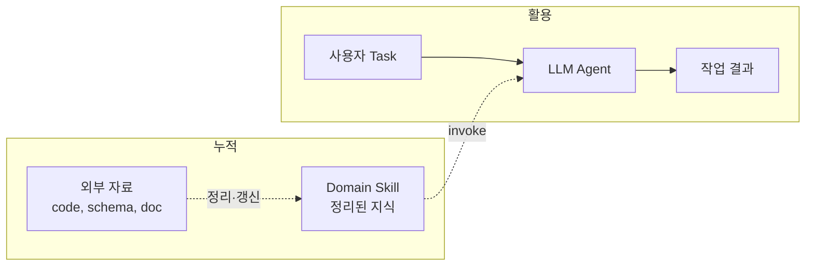
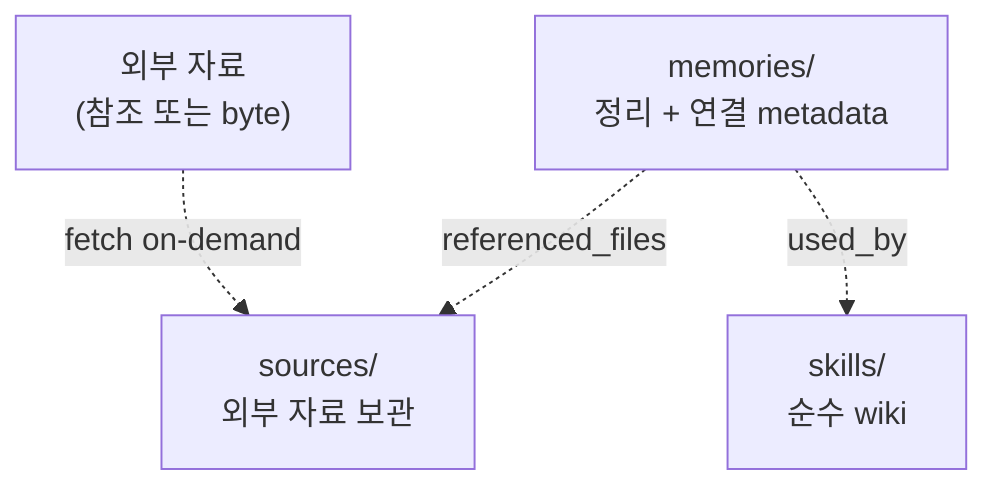

## Agent가 Domain을 다룬다는 것

- agent가 domain 작업을 반복 수행하려면 domain 지식이 **누적**되고, 그 지식을 호출 시점에 **활용** 가능해야 합니다.
    - 누적과 활용이 한 곳에서 일어나도록 domain 지식을 LLM Wiki 형태로 정리하고, domain skill 단위로 packaging합니다.
    - skill로 packaging하면 agent가 작업 시점에 `SKILL.md` 진입점을 통해 필요한 지식을 스스로 찾아 호출합니다.


```mermaid
graph LR
    subgraph accumulate["누적"]
        external[외부 자료<br>code, schema, doc]
        skill[Domain Skill<br>정리된 지식]
        external -.정리·갱신.-> skill
    end

    subgraph use["활용"]
        user[사용자 Task]
        agent[LLM Agent]
        output[작업 결과]
        user --> agent
        agent --> output
    end

    skill -.invoke.-> agent
```


### Domain 지식이 필요한 이유

- agent가 domain 작업을 수행하려면 일반 지식 외에 **그 domain의 정책과 system 구조**를 알아야 합니다.
    - 예를 들어, 일반적인 LLM은 결제 정책의 idempotency 규칙, 자사 service의 endpoint 구조, DB의 table 관계를 알지 못합니다.
        - idempotency는 같은 요청을 여러 번 보내도 한 번 처리한 것과 동일한 결과를 보장하는 성질입니다.
    - 이런 지식 없이 agent에게 "결제 환불 처리 추가" 같은 작업을 시키면 잘못된 가정으로 code를 작성하거나 system과 충돌하는 결과를 만듭니다.

- 한 번의 작업마다 인간이 필요한 맥락을 prompt로 주입하는 방식은 **반복 작업이 누적될수록 비효율적**입니다.
    - 인간이 매번 같은 정책을 설명하고 같은 file 위치를 알려주면 agent가 스스로 작업한다고 부를 수 없습니다.
    - **누적된 지식 저장소**가 있어야 agent가 호출 시점에 자기 task와 관련된 지식을 **스스로** 가져옵니다.


### Domain 지식의 누적

- LLM Domain Skill은 domain 정책, source code 구조, API contract, DB schema를 wiki 형태로 **영구적으로 누적**하여 agent가 매번 작업할 때 참조합니다.
    - RAG처럼 query마다 chunk를 재조합하지 않고, **미리 정리되고 cross-reference된 skill**을 통째로 활용합니다.
    - 같은 domain에서 여러 task를 반복 수행하는 agent에게는 RAG보다 skill 형태가 자연스러운데, **지식이 누적되고 일관성이 유지**되기 때문입니다.

- **유지 비용이 작다는 점**이 skill 형태의 강점이며, 이 비용 구조가 자주 변경되는 외부 자료를 유연하게 다룰 수 있게 만듭니다.
    - source code와 DB schema처럼 자주 변하는 자료는 수동 유지로는 며칠 만에 stale해지지만, **LLM이 sync, lint, cross-reference 갱신을 전담**하면 이 부담이 사라집니다.
    - **memories layer가 외부 자료와 wiki 사이의 연결 metadata를 단방향으로 추적**하므로, Human은 sync 명령만 주면 됩니다.

- 자동화 구조가 없다면, skill은 변경되는 외부 자료를 다루는 유지 비용을 감당하지 못해 금방 stale(낡은) 상태가 되며, **누적된 지식이라는 가치가 사라지게** 됩니다.


### Skill 형태로의 활용

- skill로 packaging한다는 것은 누적된 지식 묶음에 **이름표(`SKILL.md`)와 진입점**을 붙여 agent가 호출 시점에 쉽게 찾아 활용하도록 만드는 것입니다.
    - `SKILL.md` frontmatter의 name과 description이 agent에게 이 skill이 무엇이고 언제 호출해야 하는지를 알립니다.
    - 진입점이 있어야 agent가 작업 시작 시점에 자기 task와 관련된 skill을 식별하여 활용 가능합니다.
    - skill 형태는 **framework 중립적**이므로 Claude Code, OpenCode, Codex, 직접 만든 LLM application 모두에서 동일하게 사용됩니다.

- 한 domain skill의 범위는 단일 domain의 지식, API spec, DB schema, source code repository 등 한 작업 영역에 묶이는 자료 전체입니다.
    - business domain(결제, 주문, 환불), 외부 service와의 통합 contract, 자사 service의 code 구조가 한 skill에 함께 들어갈 수 있습니다.
    - 작업 영역이 **너무 넓으면** description이 모호해져 호출 정확도가 떨어지고, **너무 좁으면** cross-reference의 가치가 사라집니다.


---


## 기존 LLM Wiki와의 차이

- 활용 목적이 다르며, 기존 LLM Wiki는 **Human의 학습과 탐색**을 위해 만들어진 반면 LLM Domain Skill은 **LLM agent의 자율 작업 reference**로 만들어집니다.
    - 활용 목적이 다르면 어떤 자료를 source로 넣을지, page를 어떻게 구조화할지가 달라집니다.
    - Human용 wiki는 **paper와 article 중심**이지만, agent용 skill은 **system을 구성하는 모든 자료(code, schema, contract)**를 포함해야 자율 작업이 가능합니다.

- 외부 자료의 성격도 달라지며, 기존 LLM Wiki는 article이나 paper처럼 **한 번 수집하면 변하지 않는 자료**를 가정합니다.
    - agent용 skill에서는 GitHub repository, Confluence page, DB schema처럼 **외부에서 계속 변하는 자료**가 주가 되므로 **변경 추적**이 필수입니다.
    - 변경 추적은 source 종류별로 다르며(commit hash, page version, content hash 등), 각 종류 folder의 `AGENTS.md`에 절차를 정의합니다.

| 구분 | 기존 LLM Wiki | LLM Domain Skill |
| --- | --- | --- |
| **활용 목적** | Human의 학습·탐색 | LLM agent의 자율 작업 reference |
| **소비자** | Human (직접 읽기) | LLM agent (작업 중 invoke) |
| **진입점** | `index.md` | `SKILL.md` (frontmatter 포함) |
| **source 종류** | article, paper, transcript | github, confluence, markdown, pdf, image 등 |
| **source 변경** | 거의 없음 | 자주 발생, 종류별 추적 mechanism |
| **수집 방식** | Human이 markdown 변환 후 저장 | 외부 reference + on-demand fetch |
| **변경 대응** | 새 source 추가 (ingest) | 기존 source 변경 (sync) |
| **page 분류** | sources, concepts, entities, comparisons | domain, api, database (skill 단위) |

- 분류 축도 다르며, 단일 domain을 다루는 skill에서는 추상과 구체의 구분(concept vs entity)이나 종합 비교(comparisons)의 의미가 약해집니다.
    - domain 한정 skill은 그 domain의 정책, workflow, 외부 contract만 다루면 충분하며, 추상 개념을 별도 page로 두는 빈도가 낮습니다.
    - comparisons는 여러 domain을 가로지르는 분석에 적합한 분류이므로, 단일 skill 안에서는 자연스럽지 않습니다.


### 가장 좋은 Domain 자료 : Source Code와 DB Schema

- article과 paper는 domain을 **외부에서 설명**하지만, source code와 DB schema는 **domain 그 자체**를 드러냅니다.
    - source code는 logic의 실제 동작을, DB schema와 API spec은 system의 contract를 담습니다.
    - agent가 자율 작업을 하려면 그 작업을 수행할 system 자체를 알아야 하므로, 이 두 자료가 article·paper에 더해 source 종류로 추가됩니다.

- 매 작업마다 codebase를 탐색하면 비효율적이고 일관성도 흔들리므로, skill에 한 번 정리하여 후속 작업이 동일한 mental model을 공유하게 합니다.

- 외부 자료는 대부분 계속 변하므로, **변경 추적**이 sources layer 설계의 핵심 제약이며 sync operation의 출발점입니다.
    - source code는 commit, DB schema는 migration, Confluence page는 정책 갱신으로 변합니다.


---


## Layer 구조

- LLM Domain Skill은 **sources, memories, skills 세 layer**로 나뉘며, 각 layer는 단일 책임을 갖습니다.
    - `sources/`는 외부 자료 자체를 보관합니다.
        - byte로 보관하거나 외부 reference만 보관합니다.
    - `memories/`는 외부 자료의 정리(memory)와 wiki와의 연결 metadata를 책임집니다.
        - 영향 분석은 이 layer에서 시작합니다.
    - `skills/`는 순수 wiki입니다.
        - business 관점 page만 두며, 자료 연결 정보는 frontmatter에 두지 않습니다.

- raw 외부 자료가 memory로 정제되고, 그 memory를 토대로 skills의 wiki가 쌓이는 가공 흐름입니다.


```mermaid
graph TB
    external["외부 자료<br>(참조 또는 byte)"]
    sources["sources/<br>외부 자료 보관"]
    memories["memories/<br>정리 + 연결 metadata"]
    skills["skills/<br>순수 wiki"]

    external -.fetch on-demand.-> sources
    memories -.referenced_files.-> sources
    memories -.used_by.-> skills
```

| layer | 위치 | 책임 | 비고 |
| --- | --- | --- | --- |
| `AGENTS.md` | skill repo root | 전체 flow의 진입점 | ingest/sync 명령 정의와 layer 사이 작업 흐름 |
| `sources/<type>/` | skill repo 안 | 외부 자료 보관 | byte 저장 종류는 원본 file, 참조 종류는 URL과 변경 식별자만 |
| `memories/<type>/` | skill repo 안 | 외부 자료의 memory + wiki와의 연결 metadata | 영향 분석의 출발점 |
| `memories/<type>/AGENTS.md` | source 종류 folder 안 | 해당 source 종류의 고유 절차 | fetch, 변경분 추출, frontmatter format |
| `skills/know-<domain>/` | skill repo 안 | 순수 wiki | 자료 연결 정보 frontmatter에 두지 않음 |
| `skills/know-<domain>/SKILL.md` | skill folder 안 | 진입점 | skill manifest와 page catalog |


### 외부 자료의 종류와 저장 방식

- 외부 자료는 종류에 따라 **byte 저장**과 **참조만 보관**으로 나뉩니다.
    - link rot 위험과 repo 용량 부담의 trade-off를 종류별로 다르게 풉니다.

| 종류 | 저장 방식 | 위치 | 변경 식별자 |
| --- | --- | --- | --- |
| **github** | 참조만 | URL + last_commit | commit hash |
| **confluence** | 참조만 | URL + page version | page version |
| **markdown** | byte 저장 | `sources/markdown/` | content hash |
| **pdf** | byte 저장 | `sources/pdf/` | content hash |
| **image** | byte 저장 | `sources/image/` | content hash |

- byte 저장 종류는 **link rot 위험이 크거나 LLM이 직접 파싱·해석해야** 합니다.
    - image는 vision 재해석에 byte가 필수이고, pdf는 외부에서 사라지면 복구 불가능합니다.

- 참조만 보관하는 종류는 **외부 system이 안정적이고 fetch 비용이 낮아** 항상 최신을 가져올 수 있습니다.
    - github은 git remote, confluence는 API export로 fetch on-demand 합니다.

- 종류와 무관하게 변경 식별자는 `memories/<type>/<group>/index.md` 에 보관하며, sync는 식별자 비교로 변경 영역을 추출합니다.


### Sources Layer

- sources는 외부 자료 자체를 종류별 folder로 분리해서 보관합니다.
    - byte 저장 종류는 원본 file이 그대로 들어갑니다.
    - 참조 종류는 URL과 변경 식별자만 보관하며, 실제 byte는 fetch 시점에만 temp folder에 가져옵니다.

- sources layer의 핵심 의도는 **외부 자료를 안정적인 위치에 두는 것**이며, 그 자료의 정제·연결은 memories layer가 책임집니다.


### Memories Layer

- memories는 외부 자료의 정리(memory)와 wiki와의 연결 metadata를 모두 책임집니다.
    - 종류별 folder로 분리되며, 각 folder가 자기만의 ingest·sync 절차를 갖습니다.
    - 묶음 단위와 memory 단위가 source 종류에 따라 다른데, 자세한 내용은 다음 section에서 다룹니다.

- memory frontmatter의 두 field가 **양쪽 layer를 잇는 매개점**입니다.
    - `referenced_files` 가 sources 방향으로 외부 자료 식별자를 기록합니다.
    - `used_by` 가 skills 방향으로 이 memory를 활용하는 skill page를 기록합니다.

- 두 link 모두 **단방향**입니다.
    - 외부 자료는 frontmatter를 가질 수 없으므로 역방향 link를 둘 수 없습니다.
        - sync 시 식별자 비교로 보강합니다.
    - skill page도 자료 연결 정보를 frontmatter에 두지 않습니다.
        - 본문에서는 가독성용 link로 자유롭게 인용 가능합니다.

- 영향 분석 chain은 한 방향으로 완결됩니다.
    - 외부 자료 변경 감지 -> 식별자 비교로 영향받는 memory 식별 -> memory의 `used_by`로 영향받는 skill page 식별 -> skill page 갱신.


### Skills Layer

- skills는 순수 wiki layer입니다.
    - business 관점의 정책·workflow·schema를 정리한 page만 들어가고, **자료 연결 정보는 frontmatter에 두지 않습니다**.
    - skill page에서 외부 자료를 인용할 때는 본문에서 file:line 형태로 자유롭게 link합니다.
    - 영향 분석은 memories layer가 단방향으로 책임지므로 skill page는 자기 출처를 frontmatter에 명시할 필요가 없습니다.

- `skills/`는 한 개 이상의 domain skill folder를 담는 container이며, 같은 repo 안의 skill들은 sources와 memories를 공유합니다.
    - skill page 사이의 기계적 추적용 cross-reference는 frontmatter `related_pages`에 둡니다.

- domain skill 이름은 **`know-<domain>` 형태**로 그 skill이 어떤 domain을 아는가를 명시합니다.
    - `skills/` folder 안에 write skill이나 scrape skill 같은 행위 skill이 함께 있어도 명명만으로 구분됩니다.


---


## Memory의 구조

- 한 source 묶음은 **묶음 단위 `index.md` + 그 아래 topic 단위 memory**로 표현합니다.
    - `index.md` 는 묶음 meta(url, 변경 추적 식별자, topic 목록)를 담아 묶음 단위의 진입점이 됩니다.
    - 각 topic memory는 한 주제와 관련된 file:line 또는 section 단위 참조를 모아 정리합니다.

- topic memory의 frontmatter에는 두 종류의 link가 들어갑니다.
    - `referenced_files` 에는 외부 자료의 path와 symbol을 기록합니다.
        - 이 정보가 sync 시 영향 분석의 핵심 자료가 됩니다.
    - `used_by` 에는 이 memory를 활용하는 skill page 목록을 기록합니다.


### Source 종류별 차이

- 묶음 단위, memory 단위, sub-file 추적 정밀도가 source 종류에 따라 다릅니다.

| 종류 | 묶음 단위 | memory 단위 | sub-file 추적 |
| --- | --- | --- | --- |
| **github** | repo | topic (file 묶음) | file:line + symbol |
| **confluence** | space 또는 page tree | page | page 단위 |
| **markdown** | 문서 collection | 한 문서 | file 단위 |
| **pdf** | document | section | file 단위 (section 식별자 부재) |
| **image** | image collection | 한 image와 설명 | file 단위 (sub-image 식별자 부재) |

- pdf와 image는 **sub-file 식별자가 없어 변경 영역 추출 시 LLM이 재해석해야** 합니다.
    - file 변경은 감지되지만, file 안의 어디가 바뀌었는지는 LLM이 vision이나 재파싱으로 알아냅니다.

- 각 source 종류 folder의 `AGENTS.md`가 그 종류 고유의 ingest 절차, sync 절차, frontmatter format을 정의합니다.
    - 여러 skill이 같은 source 종류를 공유할 때 `AGENTS.md`를 재사용하므로 절차가 한 곳에 모입니다.


---


## Source to Skill - Ingest와 Sync

- 외부 자료를 skill에 반영하는 작업은 **ingest**와 **sync** 두 operation으로 나뉘며, 묶음 단위가 둘을 가르는 기준입니다.
    - **ingest** 는 묶음을 skill에 처음 등록하는 작업입니다.
        - `index.md` 를 신규 생성하고 묶음 안의 자료를 memory로 분리합니다.
    - **sync** 는 등록된 묶음의 외부 변경을 skill에 전파하는 작업입니다.
        - 기존 memory를 갱신하고 필요하면 새 memory를 만듭니다.
    - 한 묶음의 lifecycle은 **ingest 한 번 + sync N번** 구조입니다.

- 두 operation 모두 묶음 path를 인자로 받으며, path의 첫 segment(`github`, `confluence`, `pdf` 등)로 source 종류를 자동 식별합니다.
    - 종류별 절차의 차이는 `memories/<type>/AGENTS.md`에 캡슐화되어 operation 본체는 동일하게 유지됩니다.

| 구분 | Ingest | Sync |
| --- | --- | --- |
| **trigger 시점** | 묶음을 처음 등록할 때 | 등록된 묶음의 외부 자료가 변경되었을 때 |
| **명령 형태** | `ingest <묶음 path>` | `sync <묶음 path>` |
| **수행 빈도** | 묶음당 1회 | 묶음당 N회 |
| **`index.md` 처리** | 신규 생성 | meta 식별자 갱신 |
| **memory 처리** | 의미 단위로 분리하여 신규 생성 | 영향받는 memory 갱신, 필요 시 신규 생성 |

- LLM이 따르는 instruction은 두 위치로 나뉩니다.
    - **root `AGENTS.md`** 가 전체 flow의 진입점이며, ingest/sync 명령 정의와 layer 사이 작업 흐름을 담습니다.
    - **`memories/<type>/AGENTS.md`** 가 종류별 구체 절차(fetch 도구, 변경 식별자, 변경분 추출 방식)를 담습니다.
    - LLM은 명령을 받으면 root AGENTS.md를 읽어 흐름을 파악한 뒤, path의 첫 segment로 해당 종류의 AGENTS.md를 찾아 구체 절차를 수행합니다.

- skill folder는 instruction을 두지 않습니다.
    - 순수한 wiki 저장소로서 agent가 답변 생성 시 read-only로 참조합니다.


---


## Example - Payment Domain Skill

- `know-payment` skill이 `payment-service` github repo를 source로 묶어 결제 domain을 정리하는 예제입니다.
    - 한 source 종류만 등장시켜 system을 구성하는 file들이 어떤 형태로 들어가는지 보여줍니다.


### Directory 구조

```plaintext
llm-skill/
├── AGENTS.md                     # 전체 flow 진입점
├── sources/
│   └── (github은 참조만 하므로 file 없음)
├── memories/
│   └── github/
│       ├── AGENTS.md             # github 고유 절차
│       └── payment-service/
│           ├── index.md          # group meta + topic 목록
│           └── payment-flow.md   # topic memory
└── skills/
    └── know-payment/
        ├── SKILL.md              # skill 진입점
        ├── domain/
        │   └── payment.md        # business 정책 wiki
        ├── api/
        │   └── payment-endpoints.md   # API contract wiki
        └── database/
            └── transaction.md    # DB schema wiki
```


### root `AGENTS.md`

- LLM이 가장 먼저 읽는 진입점입니다.
    - 명령을 받아 어느 layer로 가야 하는지 안내합니다.

```markdown
# LLM Domain Skill Operations

## Flow

- 외부 자료 -> sources -> memories -> skills 가공 흐름.
- ingest는 묶음을 처음 등록, sync는 변경을 전파.

## Commands

- `ingest <묶음 path>` - path 첫 segment로 source 종류 식별 후 `memories/<type>/AGENTS.md`의 ingest 절차 수행.
- `sync <묶음 path>` - 동일하게 `memories/<type>/AGENTS.md`의 sync 절차 수행.
- `lint` - memory와 skill page 사이 reference 일치 점검.
```


### `memories/github/AGENTS.md`

- github source 종류의 ingest, sync, fetch 절차를 정의합니다.

```markdown
# GitHub Source Operations

## Identifier

- 묶음 단위: repo
- 변경 식별자: commit hash
- memory 단위: topic (한 주제와 관련된 file 묶음)

## Fetch

- temp folder에 `git clone`, 이미 있으면 `git fetch && git pull`.

## Ingest

1. repo fetch.
2. 의미 있는 주제(controller, service, ...)별로 topic memory 생성.
3. `referenced_files`에 path와 symbol 기록.
4. `index.md`에 url, last_commit, topic 목록 기록.

## Sync

1. fetch 후 `git diff <last_commit>..HEAD --name-only`.
2. 변경 file path를 모든 topic memory의 `referenced_files`와 비교 -> 영향 memory 식별.
3. memory 갱신 + `used_by`로 skill page 식별 -> skill page 갱신.
4. `index.md`의 last_commit 갱신.
```


### `memories/github/payment-service/index.md`

- 묶음 meta와 topic 목록을 담는 group 진입점입니다.

```markdown
---
url: https://github.com/company/payment-service
last_commit: abc123def
topics:
  - path: payment-flow.md
    description: 결제 승인 흐름
  - ...
---

## Repository

- ...
```


### `memories/github/payment-service/payment-flow.md`

- 한 주제의 file:line 단위 참조와 wiki와의 연결을 담는 topic memory입니다.

```markdown
---
referenced_files:
  - path: src/main/java/com/payment/service/PaymentService.java
    symbols: [PaymentService.process, PaymentService.checkIdempotency]
  - ...
used_by:
  - skills/know-payment/domain/payment.md
---

## 진입점

- `PaymentController.java:42`의 `createPayment()`에서 처리.

## Idempotency 처리

- `PaymentService.java:99`에서 Redis key 검사.
- ...
```


### `skills/know-payment/SKILL.md`

- skill의 진입점 + page catalog입니다.
    - agent가 자동 invoke 판단에 frontmatter description을 사용합니다.

```markdown
---
name: know-payment
description: Payment domain의 결제·환불·idempotency 정책과 payment-service repo의 code 구조를 다룹니다. 결제 흐름·webhook 검증·환불 정책 관련 작업에 호출합니다.
---

# Know Payment

## Pages

- `domain/payment.md` - 결제 승인 흐름과 idempotency 정책
- `api/payment-endpoints.md` - 결제 관련 endpoint contract
- `database/transaction.md` - 거래 table schema
```


### `skills/know-payment/domain/payment.md`

- business 관점의 정책과 흐름을 서술하는 domain wiki page입니다.

```markdown
---
title: Payment Domain
related_pages:
  - domain/refund.md
---

## 정책

- 모든 결제는 idempotency를 보장하며, 동일 key로 들어온 중복 요청은 기존 결과를 반환합니다.
- ...

## Workflow

- 사용자 결제 요청 -> idempotency 검사 -> 외부 PG 호출 -> 결과 저장.
```


### `skills/know-payment/api/payment-endpoints.md`

- 외부에 노출하는 endpoint의 contract를 정리하는 api wiki page입니다.

```markdown
---
title: Payment Endpoints
---

## Endpoints

- `POST /api/payments` - 결제 요청 생성.
- `POST /api/payments/{id}/refund` - 환불 요청.

## Request

- `Idempotency-Key` header 필수.
- ...

## Response

- 200: `{ paymentId, status }`
- 4xx: error code 표는 ...
```


### `skills/know-payment/database/transaction.md`

- table 한 개의 schema, 관계, 제약을 정리하는 database wiki page입니다.

```markdown
---
title: Transaction Table
---

## 개요

- 결제 거래 한 건이 한 row.
- lifecycle: PENDING -> APPROVED -> (REFUNDED).

## Schema

| column | type | 의미 |
| --- | --- | --- |
| id | bigint | PK |
| status | varchar(32) | 거래 상태 |
| ... | ... | ... |

## 제약

- `idempotency_key` UNIQUE.
- ...
```


---


## Reference

- <https://gist.github.com/karpathy/442a6bf555914893e9891c11519de94f>
- <https://docs.claude.com/en/docs/claude-code/skills>

