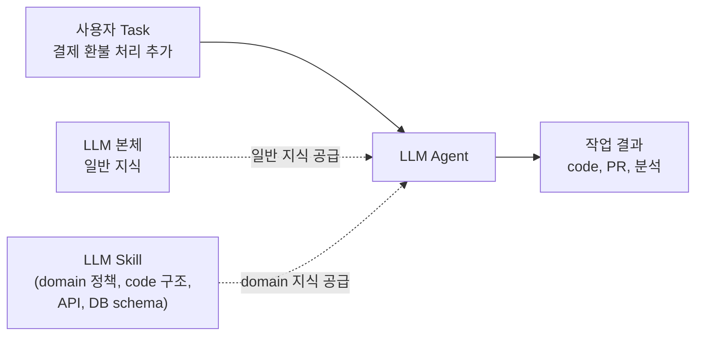
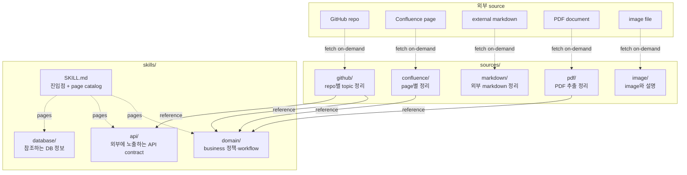
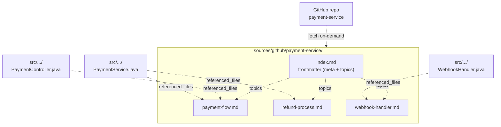
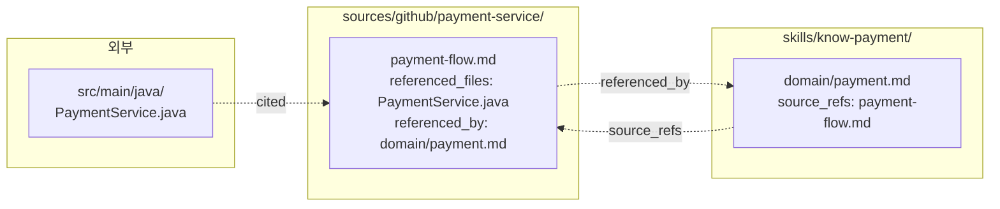

## Agent가 Domain을 다룬다는 것

- agent가 domain 작업을 반복 수행하려면 domain 지식이 **누적**되고, 그 지식을 호출 시점에 **활용** 가능해야 합니다.
    - 누적과 활용이 한 곳에서 일어나도록 domain 지식을 LLM Wiki 형태로 정리하고, skill 단위로 packaging합니다.
    - skill로 packaging하면 agent가 작업 시점에 `SKILL.md` 진입점을 통해 필요한 지식을 스스로 찾아 호출합니다.


### Domain 지식이 필요한 이유

- agent가 domain 작업을 수행하려면 일반 지식 외에 **그 domain의 정책과 system 구조**를 알아야 합니다.
    - 예를 들어, 일반적인 LLM은 결제 정책의 idempotency 규칙, 자사 service의 endpoint 구조, DB의 table 관계를 알지 못합니다.
        - idempotency는 같은 요청을 여러 번 보내도 한 번 처리한 것과 동일한 결과를 보장하는 성질입니다.
    - 이런 지식 없이 agent에게 "결제 환불 처리 추가" 같은 작업을 시키면 잘못된 가정으로 code를 작성하거나 system과 충돌하는 결과를 만듭니다.

- 한 번의 작업마다 인간이 필요한 맥락을 prompt로 주입하는 방식은 **반복 작업이 누적될수록 비효율적**입니다.
    - 인간이 매번 같은 정책을 설명하고 같은 file 위치를 알려주면 agent가 스스로 작업한다고 부를 수 없습니다.
    - **누적된 지식 저장소**가 있어야 agent가 호출 시점에 자기 task와 관련된 지식을 **스스로** 가져옵니다.


### Domain 지식의 누적

- LLM Skill은 domain 정책, source code 구조, API contract, DB schema를 wiki 형태로 **영구적으로 누적**하여 agent가 매번 작업할 때 참조합니다.
    - RAG처럼 query마다 chunk를 재조합하지 않고, **미리 정리되고 cross-reference된 skill**을 통째로 활용합니다.
    - 같은 domain에서 여러 task를 반복 수행하는 agent에게는 RAG보다 skill 형태가 자연스러운데, **지식이 누적되고 일관성이 유지**되기 때문입니다.


```mermaid
graph LR
    user[사용자 Task<br>결제 환불 처리 추가]
    agent[LLM Agent]
    llm[LLM 본체<br>일반 지식]
    skill["LLM Skill<br>(domain 정책, code 구조,<br>API, DB schema)"]
    output[작업 결과<br>code, PR, 분석]

    user --> agent
    llm -.일반 지식 공급.-> agent
    skill -.domain 지식 공급.-> agent
    agent --> output
```

- **유지 비용이 작다는 점**이 skill 형태의 강점이며, 이 비용 구조가 자주 변경되는 source를 유연하게 다룰 수 있게 만듭니다.
    - source code와 DB schema처럼 자주 변하는 자료는 수동 유지로는 며칠 만에 stale해지지만, **LLM이 sync, lint, cross-reference 갱신을 전담**하면 이 부담이 사라집니다.
    - **양방향 reference**(referenced_by, source_refs)가 자동으로 영향 범위를 추적하므로, Human은 sync 명령만 주면 됩니다.

- 자동화 구조가 없다면, skill은 변경되는 source를 다루는 유지 비용을 감당하지 못해 금방 stale(낡은) 상태가 되며, **누적된 지식이라는 가치가 사라지게** 됩니다.


### Skill 형태로의 활용

- skill로 packaging한다는 것은 누적된 지식 묶음에 **이름표(`SKILL.md`)와 진입점**을 붙여 agent가 호출 시점에 쉽게 찾아 활용하도록 만드는 것입니다.
    - `SKILL.md` frontmatter의 name과 description이 agent에게 이 skill이 무엇이고 언제 호출해야 하는지를 알립니다.
    - 진입점이 있어야 agent가 작업 시작 시점에 자기 task와 관련된 skill을 식별하여 활용 가능합니다.
    - skill 형태는 **framework 중립적**이므로 Claude Code, OpenCode, Codex, 직접 만든 LLM application 모두에서 동일하게 사용됩니다.

- 한 skill의 범위는 단일 domain의 지식, API spec, DB schema, source code repository 등 한 작업 영역에 묶이는 자료 전체입니다.
    - business domain(결제, 주문, 환불), 외부 service와의 통합 contract, 자사 service의 code 구조가 한 skill에 함께 들어갈 수 있습니다.
    - 작업 영역이 **너무 넓으면** description이 모호해져 호출 정확도가 떨어지고, **너무 좁으면** cross-reference의 가치가 사라집니다.


---


## 기존 LLM Wiki와의 차이

- 활용 목적이 다르며, 기존 LLM Wiki는 **Human의 학습과 탐색**을 위해 만들어진 반면 LLM Skill은 **LLM agent의 자율 작업 reference**로 만들어집니다.
    - 활용 목적이 다르면 어떤 자료를 source로 넣을지, page를 어떻게 구조화할지가 달라집니다.
    - Human용 wiki는 **paper와 article 중심**이지만, agent용 skill은 **system을 구성하는 모든 자료(code, schema, contract)**를 포함해야 자율 작업이 가능합니다.

- 외부 source의 성격도 달라지며, 기존 LLM Wiki는 article이나 paper처럼 **한 번 수집하면 변하지 않는 자료**를 가정합니다.
    - agent용 skill에서는 GitHub repository, Confluence page, DB schema처럼 **외부에서 계속 변하는 자료**가 주가 되므로 **변경 추적**이 필수입니다.
    - 변경 추적은 source 종류별로 다르며(commit hash, page version, content hash 등), 각 종류 folder의 `AGENTS.md`에 절차를 정의합니다.

| 구분 | 기존 LLM Wiki | LLM Skill |
| --- | --- | --- |
| **활용 목적** | Human의 학습·탐색 | LLM agent의 자율 작업 reference |
| **소비자** | Human (직접 읽기) | LLM agent (작업 중 invoke) |
| **진입점** | `index.md` | `SKILL.md` (frontmatter 포함) |
| **source 종류** | article, paper, transcript | github, confluence, markdown, pdf, image 등 |
| **source 변경** | 거의 없음 | 자주 발생, 종류별 추적 mechanism |
| **수집 방식** | Human이 markdown 변환 후 저장 | 외부 reference + on-demand fetch |
| **변경 대응** | 새 source 추가 (ingest) | 기존 source 변경 (sync) |
| **page 분류** | sources, concepts, entities, comparisons | domain, api, database (skill 단위) |

- 분류 축도 다르며, 단일 domain을 다루는 skill에서는 추상과 구체의 구분(concept vs entity)이나 종합 비교(comparisons)의 의미가 약해집니다.
    - domain 한정 skill은 그 domain의 정책, workflow, 외부 contract만 다루면 충분하며, 추상 개념을 별도 page로 두는 빈도가 낮습니다.
    - comparisons는 여러 domain을 가로지르는 분석에 적합한 분류이므로, 단일 skill 안에서는 자연스럽지 않습니다.


### 가장 좋은 Domain 자료 : Source Code와 DB Schema

- article과 paper는 domain을 **외부에서 설명**하지만, source code와 DB schema는 **domain 그 자체**를 드러냅니다.
    - source code는 logic의 실제 동작을, DB schema와 API spec은 system의 contract를 담습니다.
    - agent가 자율 작업을 하려면 그 작업을 수행할 system 자체를 알아야 하므로, 이 두 자료가 article·paper에 더해 source 종류로 추가됩니다.

- 매 작업마다 codebase를 탐색하면 비효율적이고 일관성도 흔들리므로, skill에 한 번 정리하여 후속 작업이 동일한 mental model을 공유하게 합니다.

- 외부 source는 대부분 계속 변하는 자료이므로, **변경 추적**이 sources layer 설계의 핵심 제약이며 sync operation의 출발점입니다.
    - source code는 commit, DB schema는 migration, Confluence page는 정책 갱신으로 변합니다.


---


## Layer 구조

- LLM Skill은 외부 source, sources layer, skills layer 세 영역으로 나뉘며, 각 영역은 위치와 책임이 다릅니다.
    - 외부 source는 skill repo 밖에 있고, sources는 그 외부 자료의 정리본이며, skills는 agent가 invoke하는 단위입니다.
    - sources는 source 종류별 folder로 분리되어 종류별 ingest와 sync 절차를 `AGENTS.md`에 따로 정의합니다.


```mermaid
graph TB
    subgraph external["외부 source"]
        ext_repo[GitHub repo]
        ext_conf[Confluence page]
        ext_md[external markdown]
        ext_pdf[PDF document]
        ext_img[image file]
    end

    subgraph sources_layer["sources/"]
        src_github["github/<br>repo별 topic 정리"]
        src_conf["confluence/<br>page별 정리"]
        src_md["markdown/<br>외부 markdown 정리"]
        src_pdf["pdf/<br>PDF 추출 정리"]
        src_img["image/<br>image와 설명"]
    end

    subgraph skills_layer["skills/"]
        skill_md["SKILL.md<br>진입점 + page catalog"]
        skill_domain["domain/<br>business 정책·workflow"]
        skill_api["api/<br>외부에 노출하는 API contract"]
        skill_db["database/<br>참조하는 DB 정보"]
    end

    ext_repo -.fetch on-demand.-> src_github
    ext_conf -.fetch on-demand.-> src_conf
    ext_md -.fetch on-demand.-> src_md
    ext_pdf -.fetch on-demand.-> src_pdf
    ext_img -.fetch on-demand.-> src_img

    src_github -->|reference| skill_domain
    src_conf -->|reference| skill_domain
    src_github -->|reference| skill_api
    src_pdf -->|reference| skill_domain

    skill_md -.pages.-> skill_domain
    skill_md -.pages.-> skill_api
    skill_md -.pages.-> skill_db
```

| layer | 위치 | 책임 |
| --- | --- | --- |
| **외부 source** | skill repo 밖 | 진짜 source (GitHub repo, Confluence page, PDF 등) |
| `sources/<type>/` | skill repo 안 | 종류별 외부 source의 file:line 또는 section:line 단위 참조 정리 |
| `sources/<type>/AGENTS.md` | source 종류 folder 안 | 해당 source 종류의 fetch, 변경분 추출, frontmatter format 등 종류 고유 절차 |
| `skills/know-<domain>/` | skill repo 안 | skill 단위 business 관점 page (sources는 frontmatter `source_refs`로 참조) |
| `skills/know-<domain>/SKILL.md` | skill folder 안 | 진입점 - skill manifest와 page catalog |
| `skills/know-<domain>/AGENTS.md` | skill folder 안 | 이 skill의 ingest, sync, query, lint operation 절차 |


### 외부 Source

- 외부 source는 skill repo에 byte 단위로 들어오지 않으며, 필요할 때만 temp folder에 clone하거나 fetch하여 LLM이 읽습니다.
    - source 전체를 skill에 두면 git history가 비대해지고, 외부 변경마다 skill repo도 같이 dirty해지는 문제가 발생합니다.
    - reference만 두는 전략으로 skill repo를 가볍게 유지하고, sync는 source 종류별 식별자 비교로 처리합니다.

- 변경 추적 식별자는 source 종류에 따라 다릅니다.
    - github은 commit hash, confluence는 page version, markdown과 pdf와 image는 content hash로 비교합니다.
    - 각 식별자 비교 절차는 source 종류 folder의 `AGENTS.md`에 정의됩니다.


### Sources Layer

- sources는 source 종류별 folder로 분리되며, 각 folder가 자기만의 ingest와 sync 절차를 갖습니다.
    - github은 `sources/github/<repo>/index.md` + `<topic>.md` 구조로 repo 단위로 묶고 그 안에서 topic 단위로 정리합니다.
    - confluence와 pdf와 markdown도 동일한 pattern을 따르되, 묶음 단위(page, document)와 식별자(version, hash)가 다릅니다.

- topic 또는 정리 단위의 분리가 **변경 동기화의 단위**가 되며, file이 바뀌면 그 file을 참조하는 정리본만 영향받습니다.
    - 한 source 변경 -> 영향받는 정리본 식별 -> 정리본의 referenced_by를 따라 skill page 갱신의 흐름이 일관되게 동작합니다.


### Skills Layer

- skills는 한 개 이상의 skill folder를 담는 container이며, 같은 repo 안의 skill들은 sources를 공유합니다.
    - `skills/know-payment/`, `skills/know-order/` 처럼 domain별 skill을 같은 repo 아래에 두면 외부 source 참조가 자연스럽게 재사용됩니다.
    - skill 사이의 기계적 추적용 cross-reference는 frontmatter `related_pages`에 두며, 본문 link는 가독성·흐름 안내용으로 자유롭게 사용해도 영향 분석에는 무관합니다.

- skill 이름은 **`know-<domain>` 형태**로 그 skill이 어떤 domain을 아는가를 명시합니다.
    - `know-payment`는 payment domain을 아는 skill, `know-order`는 order domain을 아는 skill처럼 의도가 이름에 드러납니다.
    - skills/ folder 안에 write skill이나 scrape skill 같은 행위 skill이 함께 있어도 명명만으로 구분됩니다.


---


## Source 정리본의 구조

- sources layer의 각 source 종류는 외부 source를 skill repo에 그대로 가져오지 않고, 참조 meta 정보 + 묶음 단위 정리본으로 표현합니다.
    - meta 정보에는 url과 변경 추적용 식별자(commit, version, content hash 등)가 포함되어 변경 감지의 기준점이 됩니다.
    - 정리본에는 source 종류에 맞는 단위(file:line, section, page)의 촘촘한 참조가 들어가며, 이 정보를 기반으로 LLM이 변경분의 영향 범위를 분석합니다.


```mermaid
graph TB
    repo[GitHub repo<br>payment-service]

    subgraph src_dir["sources/github/payment-service/"]
        index["index.md<br>frontmatter (meta + topics)"]
        topic_flow[payment-flow.md]
        topic_refund[refund-process.md]
        topic_webhook[webhook-handler.md]
    end

    file_ctrl["src/.../<br>PaymentController.java"]
    file_svc["src/.../<br>PaymentService.java"]
    file_wh["src/.../<br>WebhookHandler.java"]

    repo -.fetch on-demand.-> src_dir
    index -.topics.-> topic_flow
    index -.topics.-> topic_refund
    index -.topics.-> topic_webhook

    file_ctrl -.referenced_files.-> topic_flow
    file_svc -.referenced_files.-> topic_flow
    file_svc -.referenced_files.-> topic_refund
    file_wh -.referenced_files.-> topic_webhook
```


### 묶음 단위 Index Page

- 각 source 묶음(repo, page, document)마다 `index.md`를 두어 meta 정보와 정리본 목록을 담습니다.
    - frontmatter에 url, 변경 추적용 식별자(last_commit 등), topic 목록을 명시합니다.
    - 영향 분석은 정리본의 `referenced_by`만으로 충분하므로 group `index.md`에는 `referenced_by`를 두지 않습니다. 본문은 source 개요와 가독성용 link로 자유롭게 씁니다.


### 정리본 Page에서의 촘촘한 참조

- 정리본 page는 한 묶음 안에서 한 주제와 관련된 file:line 또는 section 단위 참조를 모아 정리합니다.
    - frontmatter의 `referenced_files`에 path와 symbols(class/method/function 이름)를 기록하며, 이 정보가 sync 시 영향 분석의 핵심 자료가 됩니다.
    - 본문 인용은 `File.java:42` 형태로 두되, line 번호는 무관한 commit에도 shift되므로 frontmatter에는 두지 않고 sync 시점에 grep으로 다시 확인합니다.
    - `referenced_by`에는 이 정리본을 참조하는 skill page 목록을 기록하여 skill page와의 양방향 연결을 만듭니다.


### Source 종류별 차이

- 묶음 단위와 변경 추적 식별자가 source 종류에 따라 달라집니다.
    - github은 repo 단위로 묶고 commit hash로 변경 추적, 정리본은 topic 단위입니다.
    - confluence는 space나 page tree 단위로 묶고 page version으로 변경 추적, 정리본은 page 단위입니다.
    - markdown은 관련 문서 collection 단위로 묶고 file별 content hash로 변경 추적, 정리본은 한 문서 단위입니다.
    - pdf는 한 document 단위로 묶고 content hash로 변경 추적, 정리본은 section 단위입니다.
    - image는 관련 image collection 단위로 묶고 file별 content hash로 변경 추적, 정리본은 한 image와 그 설명입니다.

- 각 source 종류 folder의 `AGENTS.md`에 그 종류 고유의 ingest 절차, sync 절차, frontmatter format을 정의합니다.
    - 여러 skill이 같은 source 종류를 공유할 때 `AGENTS.md`를 재사용하므로 절차가 한 곳에 모입니다.
    - 새로운 source 종류(notion, slack, jira 등)를 추가할 때도 새 folder와 `AGENTS.md`를 두면 끝입니다.


---


## 양방향 연결

- source 정리본과 skill page는 frontmatter의 referenced_by와 source_refs로 **양방향 연결**됩니다.
    - 양방향 연결은 변경 감지 시 **영향 분석을 가능하게 하는 핵심 mechanism**이며, 한 방향만 있으면 영향 범위 추적이 불가능합니다.
    - LLM은 한 file 변경을 감지하면 정리본의 referenced_files로 영향받는 정리본을 찾고, 그 정리본의 referenced_by로 영향받는 skill page를 찾습니다.


### 연결 Mechanism

- 외부 file, source 정리본, skill page 세 layer가 frontmatter field로 서로를 가리키며 추적 chain을 이룹니다.


```mermaid
graph LR
    subgraph external["외부"]
        ext_file["src/main/java/<br>PaymentService.java"]
    end

    subgraph src["sources/github/payment-service/"]
        topic_flow["payment-flow.md<br>referenced_files: PaymentService.java<br>referenced_by: domain/payment.md"]
    end

    subgraph skill["skills/know-payment/"]
        page_payment["domain/payment.md<br>source_refs: payment-flow.md"]
    end

    ext_file -.cited.-> topic_flow
    topic_flow -.referenced_by.-> page_payment
    page_payment -.source_refs.-> topic_flow
```


### Skill Page의 참조 규칙

- skill page에서 **기계적 영향 분석에 쓰이는 reference**는 frontmatter에 둡니다.
    - source 정리본 참조는 `source_refs`, 다른 skill page 참조는 `related_pages`에 둡니다.
    - sync 시 영향받는 skill page를 식별하려면 frontmatter scan 한 번으로 끝나야 하므로, **양방향 추적이 필요한 link는 frontmatter에 모입니다**.

- 본문 link는 **가독성과 흐름 안내용**이며 자유롭게 사용합니다.
    - 본문의 file:line 참조나 정리본 link는 독자가 자연스럽게 따라갈 수 있도록 돕는 보조 장치이며, 영향 분석에는 관여하지 않습니다.
    - 본문 link가 stale해져도 frontmatter reference가 정확하면 영향 분석은 정상 동작합니다.

```yaml
---
title: Payment Domain
source_refs:
  - sources/github/payment-service/payment-flow.md
  - sources/github/payment-service/refund-process.md
  - sources/confluence/payment-policy/refund-rules.md
---
```


---


## Source 소비 - Ingest와 Sync

- 외부 source를 skill에 반영하는 작업은 **ingest**와 **sync** 두 operation으로 나뉘며, 묶음 단위(repo, page tree, document, 단일 file)가 둘을 가르는 기준입니다.
    - 묶음이 skill에 처음 등록되는 경우가 **ingest**이며, `sources/<type>/<group>/index.md`를 신규 생성합니다.
    - 묶음 안에 변경(file 추가, 수정, 삭제, page revision 등)이 일어나는 경우가 **sync**이며, 기존 정리본을 갱신하고 필요하면 새 정리본을 생성합니다.

- 기준이 묶음 단위이므로 "이미 ingest된 repo에 새 file이 추가됨" 같은 case는 sync에 흡수됩니다.
    - sync 절차에는 변경 file이 어떤 정리본의 referenced_files에도 없을 때 적합한 기존 정리본에 흡수하거나 새 정리본을 생성하는 단계가 포함됩니다.
    - 결과적으로 한 묶음의 lifecycle은 **ingest 한 번 + sync N번** 구조가 됩니다.

- 두 operation 모두 묶음 path를 인자로 받으며, source 종류는 path의 첫 segment로 자동 식별합니다.
    - LLM은 path의 첫 segment(`github`, `confluence`, `pdf` 등)를 보고 해당 종류 folder의 `AGENTS.md`를 따라 절차를 수행합니다.
    - 종류별 절차의 차이(fetch 도구, 변경 식별자, 정리본 단위)는 **`AGENTS.md`에 캡슐화**되어 operation 본체는 동일하게 유지됩니다.

| 구분 | Ingest | Sync |
| --- | --- | --- |
| **trigger 시점** | 묶음을 처음 등록할 때 | 등록된 묶음의 외부 source가 변경되었을 때 |
| **명령 형태** | `ingest <묶음 path>` | `sync <묶음 path>` |
| **수행 빈도** | 묶음당 1회 | 묶음당 N회 |
| **`index.md` 처리** | 신규 생성 | meta 식별자 갱신 |
| **정리본 처리** | 의미 단위로 분리하여 신규 생성 | 영향받는 정리본 갱신, 필요 시 신규 생성 |
| **양방향 reference** | 신규 연결 생성 | 기존 연결 점검과 갱신 |


### Ingest Operation

- **ingest operation**은 새 source 묶음을 처음 skill에 등록하는 책임을 갖습니다.
    - 묶음 path가 가리키는 외부 source를 가져와 의미 있는 단위로 분리하고, 묶음 `index.md`를 신규 생성합니다.
    - skill page와의 양방향 reference(referenced_by, source_refs)도 이 시점에 처음 만들어집니다.

1. **trigger** : Human이 `ingest sources/github/payment-service`처럼 묶음 path를 인자로 주어 ingest를 명령합니다.

2. **type 식별과 fetch** : LLM이 path의 첫 segment로 source 종류를 식별하고, 그 종류 folder의 `AGENTS.md`의 fetch 절차에 따라 temp folder에 외부 source를 가져옵니다.

3. **정리본 분리와 index 생성** : `AGENTS.md`의 ingest 절차에 따라 묶음을 의미 있는 단위로 분리하여 정리본을 만들고, `index.md`에 meta 식별자(commit hash, version, content hash)와 정리본 목록을 기록합니다.
    - github은 controller, service, integration 같은 주제를 식별해 topic 단위로, confluence는 page 단위, markdown과 pdf는 section 단위로 분리합니다.
    - 각 정리본의 frontmatter `referenced_files`에 path, symbols, last_seen 식별자를 기록합니다.

4. **skill page 연결과 commit** : 정리본을 참조할 skill page를 식별해 `source_refs`에 새 정리본 path를 추가하고, 정리본의 `referenced_by`와 일치시킵니다. `SKILL.md` 본문 `## Pages`에 새 skill page entry를 추가합니다. 한 ingest 단위로 `ingest(github:payment-service): payment-flow.md, refund-process.md` 형태의 commit message로 git commit합니다.


### Sync Operation

- **sync operation**은 이미 ingest된 source의 변경을 skill에 전파하는 책임을 갖습니다.
    - 자동화는 본 문서 범위 밖이며, 현재는 Human이 명시적으로 sync를 trigger합니다.
    - 묶음 `index.md`의 meta 식별자가 이전 sync 시점의 snapshot 역할을 하며, 그 식별자와 현재 외부 source를 비교하여 변경 영역을 추출합니다.

1. **trigger** : Human이 `sync sources/github/payment-service`와 같이 묶음 path를 인자로 주어 sync를 명령합니다.

2. **type 식별과 meta 확인** : LLM이 path의 첫 segment로 source 종류를 식별하고, 그 종류 folder의 `AGENTS.md`를 읽어 절차를 파악하며, 묶음 `index.md`의 meta 식별자(commit hash, version, content hash)를 비교 기준으로 잡습니다.

3. **fetch** : `AGENTS.md`의 fetch 절차에 따라 temp folder에 외부 source를 가져옵니다.
    - github은 git fetch, confluence는 API export 등을 사용합니다.

4. **변경분 추출** : meta 식별자를 기준으로 변경 영역을 추출합니다.
    - github은 git diff, confluence는 page revision diff, markdown과 pdf는 content 비교를 사용합니다.

5. **영향 정리본 식별과 신규 file 분배** : 변경된 file path 또는 section을 모든 정리본의 referenced_files와 비교하여 영향받는 정리본을 찾고, 어떤 정리본에도 등록되지 않은 신규 file은 적합한 기존 정리본에 흡수하거나 새 정리본을 생성합니다.
    - 새 정리본을 만들 때는 그 정리본을 참조할 skill page도 함께 식별해 정리본의 `referenced_by`와 skill page의 `source_refs`를 동시에 설정합니다.

6. **영향 skill page 식별** : 영향받는 정리본의 referenced_by를 따라가 갱신이 필요한 skill page를 식별합니다.

7. **갱신과 commit** : LLM이 변경 내용을 읽고 정리본과 skill page를 갱신합니다. `index.md`의 `last_commit`을 갱신합니다. 한 sync 단위로 `sync(github:payment-service): abc123→def456 - payment-flow.md, domain/payment.md` 형태의 commit message로 git commit합니다.


---


## Directory 구조

- 한 skill repo는 sources와 skills 두 top-level folder로 구성됩니다.
    - sources에는 source 종류별 folder가 들어가고, 각 folder는 `AGENTS.md`와 묶음 단위 정리본을 갖습니다.
    - skills에는 know-<domain> 형태의 skill folder들이 들어갑니다.


### 전체 Tree

```plaintext
llm-skill/
├── sources/
│   ├── github/
│   │   ├── AGENTS.md
│   │   └── payment-service/
│   │       ├── index.md
│   │       ├── payment-flow.md
│   │       ├── refund-process.md
│   │       └── webhook-handler.md
│   ├── confluence/
│   │   ├── AGENTS.md
│   │   └── payment-policy/
│   │       ├── index.md
│   │       └── refund-rules.md
│   ├── markdown/
│   │   ├── AGENTS.md
│   │   └── design-decisions/
│   │       ├── index.md
│   │       └── payment-architecture.md
│   ├── pdf/
│   │   ├── AGENTS.md
│   │   └── payment-spec/
│   │       ├── index.md
│   │       └── card-flow.md
│   └── image/
│       ├── AGENTS.md
│       └── payment-diagrams/
│           ├── index.md
│           └── flow-chart.md
└── skills/
    ├── know-payment/
    │   ├── SKILL.md
    │   ├── AGENTS.md
    │   ├── domain/
    │   │   ├── payment.md
    │   │   └── refund.md
    │   ├── api/
    │   │   └── payment-endpoints.md
    │   └── database/
    │       └── transaction.md
    └── know-order/
        ├── SKILL.md
        ├── AGENTS.md
        ├── domain/
        ├── api/
        └── database/
```

- 한 skill repo 안에 여러 skill folder를 둘 수 있으며, 각 skill은 자기 `SKILL.md`를 진입점으로 갖습니다.
    - `skills/know-payment/`, `skills/know-order/` 처럼 domain별로 skill folder를 분리하면 각 skill이 독립적으로 invoke됩니다.
    - 여러 skill이 같은 source 정리본을 참조해도 무방하며, sources는 skill folder 사이에서 공유됩니다.

- skill folder 안의 page 분류는 단수형으로 작성합니다.
    - `domain/`, `api/`, `database/` 처럼 단수형은 이 skill의 domain 정리, api 정리, database 정리라는 의미를 단순하게 전달합니다.


### 초기 Setup

- directory 생성과 git init만으로 skill repo 운영을 시작할 수 있습니다.

```bash
mkdir -p llm-skill/sources/{github,confluence,markdown,pdf,image}
mkdir -p llm-skill/skills/know-payment/{domain,api,database}
touch llm-skill/sources/github/AGENTS.md
touch llm-skill/sources/confluence/AGENTS.md
touch llm-skill/sources/markdown/AGENTS.md
touch llm-skill/sources/pdf/AGENTS.md
touch llm-skill/sources/image/AGENTS.md
touch llm-skill/skills/know-payment/SKILL.md
touch llm-skill/skills/know-payment/AGENTS.md
cd llm-skill && git init
```


---


## SKILL.md와 AGENTS.md 작성

- 한 skill repo에는 세 종류의 agent instruction 문서가 있으며, 역할이 다릅니다.
    - `SKILL.md`는 skill 단위의 진입점이며 manifest와 page catalog만 담습니다.
    - skill 단위 `AGENTS.md`는 그 skill의 ingest, sync, query, lint operation 절차를 담습니다.
    - source 종류 단위 `AGENTS.md`는 그 종류의 fetch, 변경분 추출, frontmatter format 같은 종류 고유 절차를 담습니다.

- `SKILL.md`와 skill 단위 `AGENTS.md`를 분리하는 이유는 **진입점과 운영 절차의 변경 빈도가 다르기 때문**입니다.
    - manifest와 page catalog는 page가 추가·삭제될 때마다 갱신되며, agent가 매 invoke마다 읽습니다.
    - operation 절차는 한 번 정의하면 거의 바뀌지 않으며, agent가 해당 operation을 수행할 때만 읽습니다.


### SKILL.md Template

- `SKILL.md`는 하위 모든 page들을 위한 **index** 역할만 합니다.
    - frontmatter는 `name`과 `description`만 둡니다. description은 LLM agent가 자동으로 invoke할지 판단하는 기준이므로, 이 skill이 다루는 domain과 활용 시점을 명확히 적습니다.
    - 본문은 `## Pages` section으로 page catalog를 분류별로 담습니다. 이 외 다른 내용은 두지 않습니다.
    - skill 운영 규칙과 operation 절차는 같은 folder의 `AGENTS.md`에 둡니다.

````markdown
---
name: know-payment
description: Payment domain의 결제, 환불, 정산 정책과 payment-service repo의 code 구조, payment-api endpoint, payment-db schema를 다루며, 결제 흐름, idempotency 처리, webhook 검증, 환불 정책 관련 작업에 호출합니다.
---

# Know Payment

## Pages

### domain
- `domain/payment.md` - 결제 승인 흐름과 idempotency 정책
- `domain/refund.md` - 환불 정책과 정산 영향

### api
- `api/payment-endpoints.md` - 결제 관련 endpoint contract

### database
- `database/transaction.md` - 거래 table과 관련 schema
````


### Skill 단위 AGENTS.md Template

- skill 단위 `AGENTS.md`는 한 skill의 운영 규칙과 ingest, sync, query, lint operation 절차를 정의합니다.
    - `skills/know-<domain>/AGENTS.md` 위치에 두어 그 skill folder를 다루는 agent가 자연스럽게 참조하게 합니다.
    - source 종류 고유 절차(fetch, 변경분 추출 등)는 source 종류 단위 `AGENTS.md`에 위임합니다.

````markdown
# Know Payment Operations

## Conventions

- 기계적 영향 분석에 쓰이는 reference는 frontmatter에만 둡니다. source 정리본 참조는 `source_refs`, 다른 skill page 참조는 `related_pages`에 둡니다.
- 본문 link는 가독성·흐름 안내용으로 자유롭게 사용합니다. 영향 분석은 frontmatter만 신뢰합니다.
- 모든 page는 frontmatter에 `title`과 `source_refs`를 명시하고, 다른 skill page를 참조하면 `related_pages`도 추가합니다.

## Ingest (on "ingest <path>")

1. <path>의 외부 source를 식별하고 해당 source 종류 folder의 AGENTS.md ingest 절차를 따릅니다.
2. sources/<type>/<group>/ 아래에 index.md와 정리본을 생성하고 referenced_files를 기록합니다.
3. 영향받는 skill page를 갱신하고 양방향 reference(referenced_by, source_refs)를 일치시킵니다.
4. SKILL.md 본문 `## Pages`에 entry를 추가하고 한 ingest 단위로 git commit합니다.

## Sync (on "sync <path>")

1. <path>의 첫 segment로 source 종류를 식별합니다.
2. sources/<type>/AGENTS.md의 sync 절차를 수행합니다.
    - fetch, 변경분 추출, 정리본 갱신, meta 식별자 갱신 단계를 포함합니다.
3. 영향받는 정리본의 referenced_by를 따라 skill page를 갱신하고, 한 sync 단위로 git commit합니다.

## Query (on a question)

1. SKILL.md 본문 `## Pages`를 먼저 읽어 관련 page를 찾습니다.
2. 관련 skill page와 그 page가 참조하는 source 정리본을 읽습니다.
3. 답변을 생성하며, 필요 시 정리본의 file:line이나 section 정보를 인용합니다.

## Lint (on "lint")

1. 정리본의 referenced_by와 skill page의 source_refs가 일치하는지 점검합니다.
2. index.md frontmatter `topics`와 실제 정리본 file 목록이 일치하는지 점검합니다.
3. SKILL.md 본문 `## Pages`와 실제 skill page file 목록이 일치하는지 점검하고, skill page 사이의 `related_pages`가 양방향으로 맞물려 있는지 확인합니다.
4. orphan 정리본(어떤 skill page에서도 참조하지 않는)과 dangling reference(없는 정리본을 가리키는 skill page)를 찾습니다.
5. sync에서 새로 생성된 topic 정리본의 분류 경계가 기존 topic과 자연스럽게 맞물리는지 점검하고, 어색하면 재배치를 제안합니다.
````


### Source 종류 단위 AGENTS.md Template

- source 종류 단위 `AGENTS.md`는 한 source 종류의 fetch, 변경분 추출, frontmatter format을 정의합니다.
    - source 종류마다 fetch 도구, 변경 식별자, 정리본 단위가 다르므로 각 종류 folder에 따로 둡니다.
    - 여러 skill이 같은 source 종류를 공유할 때 이 `AGENTS.md`를 재사용합니다.

````markdown
# GitHub Source Schema

## Source Identifier

- 묶음 단위 : repo
- 변경 식별자 : commit hash
- 정리본 단위 : topic (한 주제와 관련된 file 묶음)

## Index Page Frontmatter

```yaml
---
url: https://github.com/<owner>/<repo>
default_branch: main
last_commit: <hash>
topics:
  - path: <topic file>
    description: <한 줄 설명>
---
```

## Topic Page Frontmatter

```yaml
---
referenced_files:
  - path: <relative path>
    symbols: [<class.method or function names>]
referenced_by:
  - <skill page path>
---
```

## Fetch 절차

1. temp folder가 비어있으면 `git clone <url> <temp>`, 있으면 `cd <temp> && git fetch`.
2. `git checkout <default_branch> && git pull`로 최신 상태로 갱신.

## 변경분 추출

- `git diff <last_commit>..HEAD --name-only`로 변경 file 목록을 가져옵니다.
- 추가 정밀도가 필요하면 `git diff <last>..HEAD -- <file>`로 변경 내용을 봅니다.

## Ingest 절차

1. repo를 fetch.
2. 의미 있는 주제(controller, service, integration 등)를 식별.
3. 각 주제별로 topic page를 만들고 관련 file과 symbol을 referenced_files에 기록.
4. index.md frontmatter의 `topics`에 각 topic의 path와 description을 entry로 기록.
5. 각 topic을 참조할 skill page를 식별해 topic page의 `referenced_by`를 채우고, 같은 skill page의 `source_refs`에도 topic path를 추가합니다.

## Sync 절차

1. Fetch 절차로 repo를 최신 상태로 가져옵니다.
2. 변경분 추출 절차로 변경 file 목록을 얻습니다.
3. 변경 file path를 모든 topic page의 referenced_files와 비교하여 영향받는 topic을 식별합니다.
4. 변경 file이 어떤 topic에도 등록되어 있지 않으면, 적합한 기존 topic에 흡수하거나 새 topic page를 생성합니다.
5. LLM이 변경분을 읽고 topic page의 referenced_files(symbols)를 갱신합니다.
6. step 4에서 새 topic page를 만들었다면, 그 topic을 참조할 skill page를 식별해 topic page의 `referenced_by`와 skill page의 `source_refs`를 함께 설정하고, index.md frontmatter `topics`에도 entry를 추가합니다.
7. index.md의 last_commit을 갱신합니다.
````

- 다른 source 종류의 `AGENTS.md`도 같은 구조를 따르되 식별자와 절차가 달라집니다.
    - confluence는 page version과 REST API export, markdown과 pdf는 content hash와 file 비교, image는 file hash와 description 작성 절차를 정의합니다.


---


## Skill Page 분류별 Template

- `domain/`, `api/`, `database/` 각 분류는 다루는 정보의 성격이 달라 본문 section도 달라집니다.
    - template은 권장 골격이며, domain에 따라 section을 추가하거나 생략해도 무방합니다.
    - frontmatter는 분류 무관하게 `title`과 `source_refs`를 공통으로 갖고, 다른 skill page를 참조할 때는 `related_pages`를 추가합니다.


### Domain Page

- business 정책, workflow, 의사 결정 규칙처럼 system 동작의 이유를 설명하는 page입니다.

````markdown
---
title: <Domain Name>
source_refs:
  - sources/.../<source-summary>.md
related_pages:
  - <skill page path>
---

## 개요
- 이 domain이 담당하는 책임과 경계.

## 정책
- domain 규칙, 제약, 예외 조건.

## Workflow
- 주요 흐름의 단계별 정리. code 수준 흐름이 정리된 source 정리본은 frontmatter `source_refs`에 등록하여 양방향 추적을 보장합니다.
````


### API Page

- 외부에 노출하는 endpoint의 contract를 정리하며, 실제 구현 위치는 frontmatter `source_refs`에 등록합니다.

````markdown
---
title: <Endpoint Group>
source_refs:
  - sources/github/.../<controller-summary>.md
related_pages:
  - <skill page path>
---

## Endpoints
- `METHOD /path` - 한 줄 설명

## Request
- path parameter, query parameter, header, body schema, 예시 payload.

## Response
- status code별 schema, 예시 payload, error case.

## 권한·정책
- 인증·인가, idempotency key, rate limit, 멱등성 보장 범위.
````


### Database Page

- 한 table의 schema, column 의미, 관계, 제약, 어떤 domain data를 담는지를 정리합니다.

````markdown
---
title: <Table Name>
source_refs:
  - sources/.../<schema-summary>.md
related_pages:
  - <skill page path>
---

## 개요
- 이 table이 담는 domain data의 의미와 lifecycle.

## Schema

| column | type | nullable | 의미 | 예시 값 |
| --- | --- | --- | --- | --- |
| id | bigint | NO | PK | 1001 |
| status | varchar(32) | NO | 거래 상태 (PENDING, APPROVED, REFUNDED) | APPROVED |

## 관계
- foreign key와 연관 table.

## 제약
- unique, check, index, partition.

## 운영 메모
- 자주 쓰이는 query pattern, 대용량 처리 시 주의점.
````


---


## Example - Payment Domain Skill

- know-payment skill은 payment-service repo와 결제 정책 Confluence page를 source로 묶고, 결제·환불·idempotency를 domain page로 정리합니다.


### Source Group Index - payment-service

- `sources/github/payment-service/index.md`는 repo 단위 source group의 진입점이며, frontmatter에 group meta(url, last_commit)와 topic 목록이 모입니다.

```markdown
---
url: https://github.com/company/payment-service
default_branch: main
last_commit: abc123def
topics:
  - path: payment-flow.md
    description: 결제 승인 흐름 (controller -> service -> 외부 PG)
  - path: refund-process.md
    description: 환불 처리 절차 (정책 검증 -> 부분 환불 -> 정산 갱신)
  - path: webhook-handler.md
    description: 외부 PG webhook 수신과 idempotency 처리
---

## Repository

- Payment service backend
- Spring Boot, Java 21
- 결제 승인, 환불, webhook 처리 담당
```


### Source 정리본 - 결제 흐름

- `sources/github/payment-service/payment-flow.md`는 symbol 단위의 code 흐름을 정리하며, 변경 감지의 단위가 됩니다.

```markdown
---
referenced_files:
  - path: src/main/java/com/payment/api/PaymentController.java
    symbols: [PaymentController.createPayment, PaymentController.refund]
  - path: src/main/java/com/payment/service/PaymentService.java
    symbols: [PaymentService.process, PaymentService.checkIdempotency, PaymentService.persist]
referenced_by:
  - skills/know-payment/domain/payment.md
  - skills/know-payment/api/payment-endpoints.md
---

## 진입점

- `POST /api/payments`는 `PaymentController.java:42`의 `PaymentController.createPayment()`에서 처리합니다.

## 비즈니스 흐름

- `PaymentService.java:15`의 `PaymentService.process()`에서 idempotency 검사 -> 외부 PG 호출 -> 결과 저장 순서로 진행합니다.

## Idempotency 처리

- `PaymentService.java:99`에서 Redis idempotency key를 검사합니다.
- 중복 요청은 기존 결과를 반환하고, 신규 요청만 `ExternalPgClient.charge()`로 위임합니다.
```


### Skill Page - 결제 Domain

- `skills/know-payment/domain/payment.md`는 business 관점의 정책과 흐름을 본문에 서술하고, 기계적 영향 분석용 reference로 source 정리본은 frontmatter `source_refs`에, 다른 skill page는 `related_pages`에 둡니다.

```markdown
---
title: Payment Domain
source_refs:
  - sources/github/payment-service/payment-flow.md
  - sources/confluence/payment-policy/refund-rules.md
related_pages:
  - skills/know-payment/domain/refund.md
---

## Domain 개요

- Payment domain은 결제 승인, 환불, 정산을 담당합니다.

## 정책

- 모든 결제는 idempotency를 보장하며, 동일 idempotency key로 들어온 중복 요청은 기존 결과를 반환합니다.

- 환불은 원 거래의 정산 상태에 따라 즉시 환불과 지연 환불로 분기합니다.
    - 정산이 끝난 거래는 다음 정산 cycle에서 차감되고, 정산 전 거래는 즉시 취소됩니다.

## Workflow

- 사용자 결제 요청 -> idempotency 검사 -> 외부 PG 호출 -> 결과 저장 -> webhook 대기 순서로 진행합니다.
```


### Sync 시 동작 예시

- `PaymentService.java`의 99번 line 근처에 idempotency 검사 logic 변경이 일어났다고 가정합니다.

```bash
# 1. sync 명령
$ sync sources/github/payment-service

# 2. AGENTS.md를 따라 last commit 확인
$ cat sources/github/payment-service/index.md | grep last_commit
last_commit: abc123def

# 3. fetch 후 diff
$ cd /tmp/payment-service && git fetch && git diff abc123def..HEAD --name-only
src/main/java/com/payment/service/PaymentService.java
```

- 변경 file path가 `payment-flow.md`의 referenced_files에 등록되어 있으므로, 해당 정리본이 영향 대상으로 식별됩니다.
    - 정리본의 referenced_by에 등록된 `skills/know-payment/domain/payment.md`와 `skills/know-payment/api/payment-endpoints.md`가 다음 갱신 대상이 됩니다.
    - LLM이 diff를 읽어 idempotency 검사 logic 변경 내용을 정리본에 반영하고, 정책 변경이 있으면 skill page도 갱신합니다.


---


## Reference

- <https://gist.github.com/karpathy/442a6bf555914893e9891c11519de94f>
- <https://docs.claude.com/en/docs/claude-code/skills>

