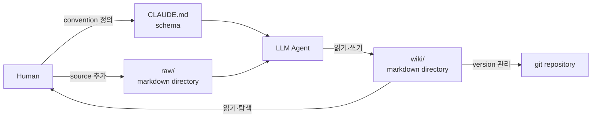
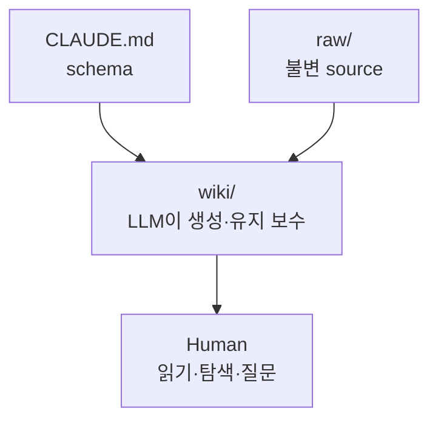
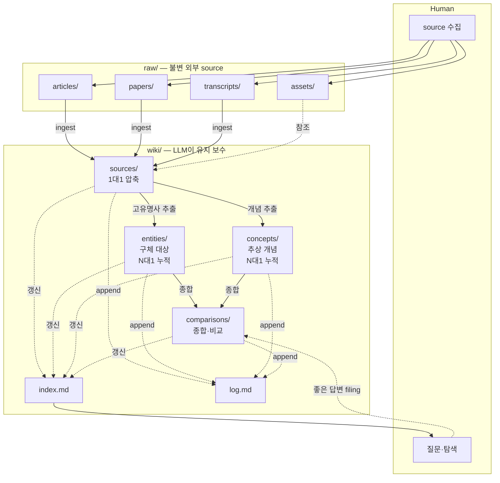
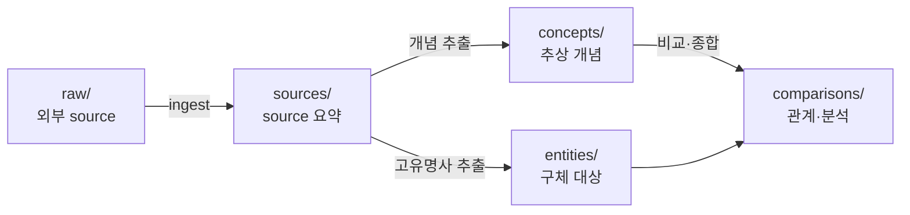
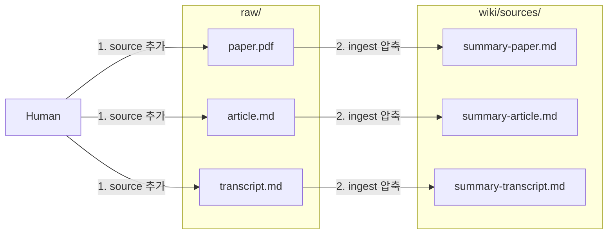
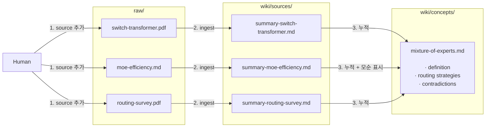
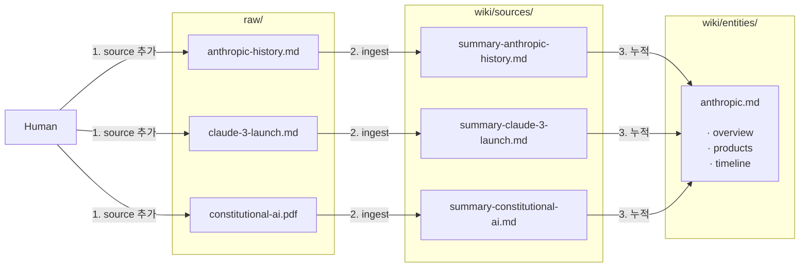
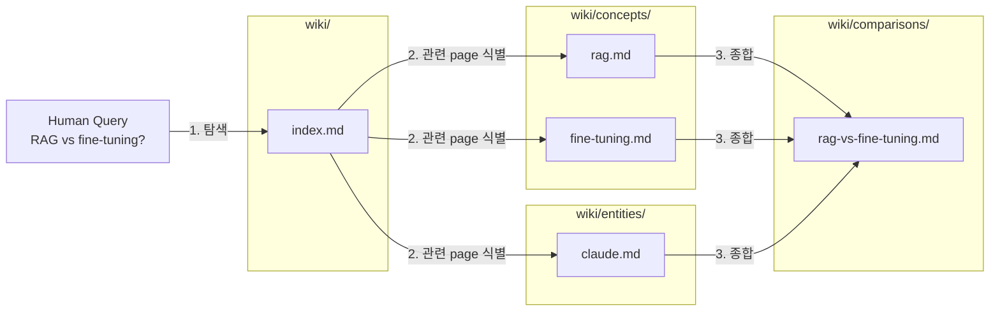

## Plain Markdown만으로 충분한 이유

- LLM Wiki pattern의 본질은 directory와 markdown file, schema 문서 세 가지로 환원됩니다.
    - Karpathy 원문에서도 "wiki는 markdown file로 이루어진 git repo일 뿐"이라고 명시합니다.
    - Obsidian, Logseq, Foam 같은 도구는 graph view나 hotkey 등 운영 편의를 더하는 IDE 역할이며, pattern 자체에는 필요하지 않습니다.

- LLM agent에게 필요한 것은 file을 읽고 쓸 수 있는 환경과 일관된 convention뿐입니다.
    - Claude Code, Codex, OpenCode, Gemini CLI 모두 local file system에 직접 접근하므로 별도 plugin이나 server가 필요 없습니다.
    - convention은 schema 문서(`CLAUDE.md` 또는 `AGENTS.md`)에 적어 두면 매 session마다 동일한 방식으로 wiki가 유지됩니다.




---


## 최소 Directory 구조

- 최소 구성은 raw source layer와 wiki layer, schema 문서 하나로 끝납니다.
    - raw source는 인간이 수집한 불변 자료이며, wiki는 LLM이 생성하고 유지 보수하는 markdown file directory입니다.
    - schema 문서는 LLM에게 wiki 운영 방식을 지시하는 instruction file입니다.



```text
my-wiki/
├── raw/
│   ├── articles/
│   ├── papers/
│   └── assets/
├── wiki/
│   ├── index.md
│   ├── log.md
│   ├── sources/
│   ├── concepts/
│   ├── entities/
│   └── comparisons/
└── CLAUDE.md
```

- `raw/`는 LLM이 읽기만 하고 절대 수정하지 않는 single source of truth입니다.
    - article, paper, transcript, image 등을 그대로 보관합니다.
    - 수집 형식은 markdown으로 통일하면 LLM이 가장 효율적으로 처리합니다.

- `wiki/`는 LLM이 생성하고 전적으로 관리하는 directory이며, page를 type별 sub-directory로 분류합니다.

- `index.md`와 `log.md`는 wiki 전체를 탐색하기 위한 별도 file입니다.
    - `index.md`는 page catalog로, LLM이 query에 답할 때 가장 먼저 읽습니다.
    - `log.md`는 ingest와 query, lint 활동의 시간순 기록입니다.

- raw source가 ingest를 거쳐 wiki layer로 분해되고 human은 수집과 질문 양 끝에서만 개입하는 흐름입니다.
    - LLM이 raw source를 wiki page로 압축하는 과정에서 key takeaway, 관련 concept, source 출처가 명확히 드러납니다.
    - human은 wiki를 탐색하며 질문을 던지고, LLM이 답변을 생성하여 wiki에 filing하는 선순환이 반복됩니다.



- 초기 setup은 mkdir과 git init 한 번이면 충분합니다.

```bash
mkdir -p my-wiki/raw/{articles,papers,assets}
mkdir -p my-wiki/wiki/{sources,concepts,entities,comparisons}
touch my-wiki/wiki/index.md my-wiki/wiki/log.md
touch my-wiki/CLAUDE.md
cd my-wiki && git init
```

- `sources`, `concepts`, `entities`, `comparisons`는 LLM Wiki 구현체 대부분이 공유하는 default 분류 축이며, knowledge의 네 가지 형태를 반영합니다.
    - input(외부에서 들어온 raw 지식)을 `sources`에, abstract(추상 개념)를 `concepts`에, concrete(고유 대상)를 `entities`에, synthesis(지식 간의 관계)를 `comparisons`에 배치합니다.
    - 어떤 domain에든 적용 가능한 일반 골격이지만, 독서 wiki는 `characters/`, `themes/`, `chapters/`를, business wiki는 `customers/`, `meetings/`, `decisions/`를 두는 등 domain에 맞게 변형이 가능합니다.



- LLM이 새 page를 만들 때 어디에 둘지 즉시 결정할 수 있도록 분류 축을 schema에 정의해 두는 것이 핵심입니다.
    - directory를 나누지 않고 wiki 한 곳에 모두 넣어도 동작은 하지만, page 수가 늘어나면 LLM이 매번 전체를 훑어야 해서 비효율적입니다.
    - 4개 type은 default일 뿐, domain에 따라 type을 추가하거나 줄이거나 이름을 바꿔도 무방합니다.


### sources : Source 요약 Page

- 한 raw source당 하나의 summary page를 갖는 1대1 대응 directory입니다.
    - `raw/papers/attention-is-all-you-need.pdf`를 ingest하면 `wiki/sources/summary-attention-is-all-you-need.md`가 생성됩니다.
    - source 추가 history와 file 목록이 거의 일치하므로, "지금까지 어떤 source를 읽었는가"의 기록 역할도 합니다.

- page 본문은 key takeaway, methodology, 발견한 모순, 관련 concept page link로 구성됩니다.
    - 원본 file 경로를 frontmatter에 명시하여 출처를 항상 검증 가능하게 유지합니다.




### concepts : 추상 개념 Page

- idea, theory, pattern, algorithm 같은 추상적 개념 단위로 작성하는 directory입니다.
    - `attention-mechanism.md`, `mixture-of-experts.md`, `scaling-laws.md` 같은 page가 들어갑니다.
    - 여러 source가 같은 개념을 다루면 하나의 page에 누적되며, 새 source가 추가될 때마다 갱신됩니다.

- N개의 source가 1개의 concept page에 수렴하는 N대1 누적 구조입니다.
    - source가 늘어날수록 concept page가 풍부해지고, 모순되는 주장이 발견되면 같은 page 안에 표시됩니다.




### entities : 고유 대상 Page

- person, company, tool, library, product 같은 named entity 단위로 작성하는 directory입니다.
    - `anthropic.md`, `karpathy.md`, `claude-code.md`, `pytorch.md` 같은 page가 들어갑니다.
    - concept과 동일하게 N개의 source에서 정보가 누적됩니다.

- concept과 entity의 차이는 추상과 구체의 차이입니다.
    - "attention mechanism"은 concept, "Anthropic"은 entity처럼 구분합니다.
    - 분류가 모호하면 schema에 판단 기준을 명시하여 LLM이 일관되게 결정하도록 유도합니다.




### comparisons : 종합·비교 Page

- 두 개 이상 개념의 비교나 query 결과를 page로 정착시킨 결과물을 모으는 directory입니다.
    - `moe-routing-strategies.md`, `rag-vs-fine-tuning.md`, `claude-vs-gpt-vs-gemini.md` 같은 page가 들어갑니다.
    - 원래는 chat history에 묻혀 사라질 분석을 wiki에 보존하는 자리입니다.

- "좋은 query 결과를 다시 wiki에 filing하라"는 LLM Wiki pattern의 핵심 실천이 일어나는 위치입니다.
    - 한 번 생성된 comparison page는 이후 새 source가 ingest될 때마다 영향 여부를 점검하여 갱신합니다.
    - synthesis, syntheses 같은 이름으로 부르는 구현체도 있으나 역할은 동일합니다.




---


## Schema 문서 작성

- schema 문서는 LLM을 generic chatbot이 아닌 wiki maintainer로 동작시키는 핵심 설정 file입니다.
    - Claude Code는 `CLAUDE.md`, Codex는 `AGENTS.md`, Gemini CLI는 `GEMINI.md`를 자동으로 읽습니다.
    - 동일한 내용을 여러 file로 복사해 두면 어떤 agent로 열어도 같은 convention이 적용됩니다.

- schema에 반드시 포함해야 할 항목은 directory 역할, page convention, ingest와 query, lint 절차입니다.
    - directory 역할은 `raw/`와 `wiki/`, `index.md`, `log.md` 각각의 소유권과 수정 가능 여부를 명시합니다.
    - page convention은 file naming, frontmatter 형식, cross-reference 방식을 정의합니다.
    - ingest와 query, lint 절차는 각 명령을 받았을 때 LLM이 수행할 step을 순서대로 나열합니다.


### 최소 CLAUDE.md 예시

- 최소 운영에 필요한 항목만 담은 starting point schema이며, domain에 맞게 수정해 가며 발전시킵니다.

````markdown
# LLM Wiki Schema

## Directory Layout
- `raw/` is immutable. Never modify files here.
- `wiki/` is yours. You own and maintain everything inside.
- `wiki/index.md` is the catalog of all pages. Update it after every ingest.
- `wiki/log.md` is an append-only activity record. Only add entries at the end.

## Page Conventions
- Use kebab-case for filenames (e.g. `attention-mechanism.md`).
- Every page must start with YAML frontmatter.
```yaml
---
title: Page Title
type: concept | entity | source-summary | comparison
sources:
  - raw/papers/source-file.md
related:
  - wiki/concepts/related-page.md
created: YYYY-MM-DD
updated: YYYY-MM-DD
confidence: high | medium | low
---
```
- Use standard markdown links `[text](relative/path.md)` to reference other pages.
- Every claim must cite its source path under `raw/`.

## Ingest (on "ingest <path>")
1. Read the source at `raw/<path>`.
2. Discuss the key takeaways with the user.
3. Create a summary page under `wiki/sources/`.
4. Create or update related concept and entity pages.
5. Add the new page to `wiki/index.md`.
6. Append an entry to `wiki/log.md`.

## Query (on a question)
1. Read `wiki/index.md` first to find relevant pages.
2. Read those pages and answer with citations.
3. If the answer is worth keeping, offer to save it as a new page under `comparisons/`.

## Lint (on "lint")
1. Contradictions between pages.
2. Orphan pages with no inbound links.
3. Concepts mentioned without a dedicated page.
4. Claims invalidated by newer sources.
5. Open questions worth investigating next.
````


---


## Page Type별 Template

- 각 page type은 frontmatter 구조와 본문 section이 일정해야 LLM이 일관되게 작성하고 인간이 빠르게 훑을 수 있습니다.
    - frontmatter는 기계가 다루기 위한 metadata이고, 본문은 인간이 읽는 영역입니다.
    - template을 schema에 박아 두면 매 session마다 동일한 형식이 재현됩니다.


### Source Summary Page

- 한 raw source당 하나씩 생성되며, source의 핵심을 요약하고 wiki 내 관련 page와 연결합니다.

```markdown
---
title: "MoE Efficiency 2026"
type: source-summary
sources:
  - raw/articles/2026-04-moe-efficiency.md
related:
  - wiki/concepts/mixture-of-experts.md
  - wiki/concepts/scaling-laws.md
created: 2026-04-04
updated: 2026-04-04
confidence: high
---

## Key Takeaways
- Dense models outperform sparse MoE below 10B parameters.
- Routing overhead grows sublinearly with the number of experts.

## Methodology
- Compares six routing variants against a Switch Transformer baseline.

## Implications
- Contradicts existing claims in [mixture-of-experts](../concepts/mixture-of-experts.md); flag a contradiction note on that page.
```


### Concept Page

- 개념 단위로 작성되며, 여러 source가 같은 개념을 다룰 때마다 갱신됩니다.

```markdown
---
title: Mixture of Experts
type: concept
sources:
  - raw/papers/switch-transformer.pdf
  - raw/articles/2026-04-moe-efficiency.md
related:
  - wiki/concepts/scaling-laws.md
  - wiki/concepts/attention-mechanism.md
created: 2026-03-10
updated: 2026-04-04
confidence: high
---

## Definition
- A sparse architecture that activates only a subset of experts per input token.

## Routing Strategies
- Top-k routing, hash-based routing, and expert choice routing are the dominant approaches.

## Contradictions
- [summary-moe-efficiency-2026](../sources/summary-moe-efficiency-2026.md) argues dense models outperform sparse MoE below 10B parameters.
```


### Entity Page

- 사람, 조직, 도구 같은 named entity를 한곳에 모읍니다.

```markdown
---
title: Anthropic
type: entity
sources:
  - raw/articles/anthropic-history.md
related:
  - wiki/entities/claude-series.md
  - wiki/concepts/constitutional-ai.md
created: 2026-02-01
updated: 2026-04-03
confidence: high
---

## Overview
- An AI company focused on safety research.

## Key Products
- Released the Claude series and the Constitutional AI methodology.

## Timeline
- 2021 : Founded.
- 2023 : Claude 1 release.
```


---


## Index와 Log Format

- `index.md`와 `log.md`는 LLM이 wiki를 탐색하고 history를 추적하는 출입구이므로 format을 단순하게 유지합니다.
    - format이 일관되면 grep, awk, ripgrep 같은 unix tool로도 parsing이 가능합니다.
    - LLM이 새 session을 시작할 때 `index.md`와 `log.md`만 읽어도 wiki의 현재 상태와 최근 변화를 빠르게 파악합니다.


### index.md 예시

```markdown
# Wiki Index

## Concepts
- [mixture-of-experts](concepts/mixture-of-experts.md) - sparse expert routing architecture
- [attention-mechanism](concepts/attention-mechanism.md) - self-attention and its variants
- [scaling-laws](concepts/scaling-laws.md) - compute-optimal training laws

## Entities
- [anthropic](entities/anthropic.md) - Claude series, Constitutional AI
- [openai](entities/openai.md) - GPT series

## Sources
- [summary-moe-efficiency-2026](sources/summary-moe-efficiency-2026.md) - 2026-04-04
- [summary-attention-revisited](sources/summary-attention-revisited.md) - 2026-03-15

## Comparisons
- [moe-routing-strategies](comparisons/moe-routing-strategies.md) - filed from query 2026-04-04
```


### log.md 예시

- 각 entry는 일정한 prefix 형식을 갖추어야 unix tool로 마지막 N개 entry를 추출할 수 있습니다.

```markdown
# Activity Log

## [2026-04-04] ingest | MoE Efficiency Article
- source : raw/articles/2026-04-moe-efficiency.md
- created : sources/summary-moe-efficiency-2026.md
- updated : concepts/mixture-of-experts.md, concepts/scaling-laws.md
- note : Contradicts existing dense vs sparse claim below 10B; flagged in concepts/mixture-of-experts.md.

## [2026-04-04] query | MoE Routing Comparison
- read : concepts/mixture-of-experts.md, sources/summary-moe-efficiency-2026.md
- output : comparisons/moe-routing-strategies.md

## [2026-04-04] lint | Weekly Health Check
- contradictions : 2
- orphan pages : 3
- missing concepts : 4
```

- prefix를 `## [YYYY-MM-DD] <op> | <title>` 형식으로 통일하면 `grep "^## \[" log.md | tail -5`로 최근 entry를 즉시 확인할 수 있습니다.


---


## 운영 단계 확장

- 최소 setup으로 시작한 뒤, 규모와 필요에 따라 점진적으로 layer를 추가합니다.
    - 100개 source, 수백 개 page 규모까지는 `index.md` 기반 탐색만으로 충분합니다.
    - 그 이상으로 커지면 search engine이나 graph 시각화 같은 보조 도구를 도입합니다.

| 단계 | source 규모 | 권장 도구 |
| --- | --- | --- |
| 시작 | 0 ~ 10 | plain markdown, `index.md` |
| 운영 | 10 ~ 100 | + frontmatter 표준, `log.md` 활용 |
| 확장 | 100 ~ 500 | + 외부 search (qmd 같은 BM25/vector hybrid) |
| 협업 | 다수 인원 | + branch별 ingest, review loop |

- 외부 search engine은 wiki page를 색인하는 별도 layer이며, 도입 후에도 markdown file 자체는 변경되지 않습니다.
    - qmd는 markdown 전용 hybrid search로, MCP server를 노출하므로 LLM이 native tool처럼 사용합니다.
    - search 결과는 여전히 markdown file 경로를 반환하므로 wiki layer의 단순성은 유지됩니다.

- editor는 취향껏 선택하되, file system을 직접 탐색할 수 있는 도구라면 어떤 것이라도 동작합니다.
    - VS Code는 markdown preview, 검색, git 통합이 기본 제공되어 추가 setup 없이 사용합니다.
    - Obsidian은 graph view와 backlink panel이 강력하지만, vault 설정과 plugin 관리 부담이 따릅니다.
    - terminal과 markdown previewer 조합도 유효한 선택지입니다.


### 도입 점검 항목

1. raw와 wiki, schema 세 layer가 directory와 file로 분리되어 있는가.
2. schema 문서에 directory 역할, page convention, ingest와 query, lint 절차가 모두 정의되어 있는가.
3. 모든 wiki page가 frontmatter를 갖추고 source 출처를 명시하는가.
4. `index.md`가 모든 page의 link와 한 줄 요약을 담고 있는가.
5. `log.md`가 ingest, query, lint operation을 시간순으로 append-only로 기록하는가.
6. git으로 version 관리되며 `raw/`는 절대 수정되지 않는가.


---


## Reference

- <https://gist.github.com/karpathy/442a6bf555914893e9891c11519de94f>
- <https://github.com/SamurAIGPT/llm-wiki-agent>
- <https://github.com/Pratiyush/llm-wiki>
- <https://github.com/kenhuangus/llm-wiki>
- <https://blog.starmorph.com/blog/karpathy-llm-wiki-knowledge-base-guide>
- <https://antigravity.codes/blog/karpathy-llm-wiki-idea-file>

