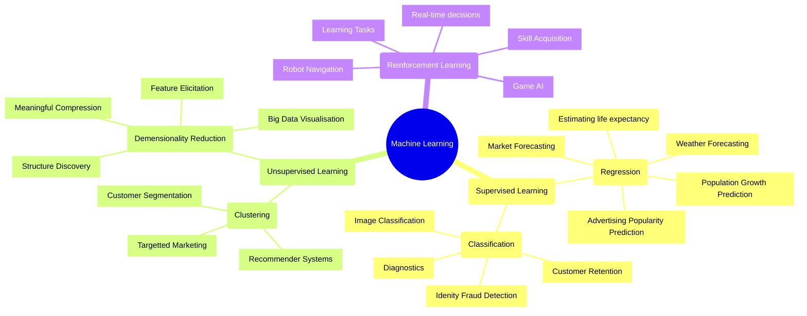
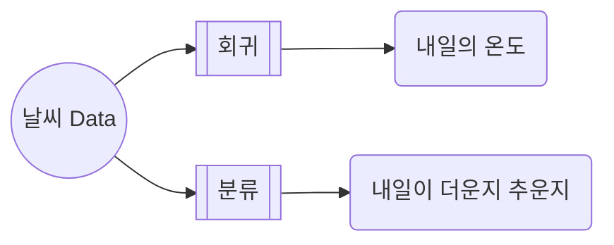

## Machine Learning : Data로부터 학습하는 Algorithm

- machine learning(기계 학습)은 computer가 data를 통해 스스로 학습하여 문제를 해결하는 algorithm을 연구하는 분야입니다.
    - data를 통해 model을 학습(train)시키고, 그 model로 새로운 data에 대한 결과를 예측(test)합니다.
    - 학습 data는 입력 data와 그에 대한 정답인 label로 구성됩니다.

- machine learning은 big data 처리, 복잡한 문제 해결, 예측 model 구축 등 다양한 분야에서 활용됩니다.
    - 의료 : 환자의 건강 상태 예측, 질병 진단
    - 금융 : 주가 예측, 사기 탐지
    - 자동화 : 자율 주행, 음성 인식, 얼굴 인식

---

## Machine Learning의 종류

- machine learning은 학습 방식에 따라 **supervised learning**, **unsupervised learning**, **reinforcement learning**으로 분류됩니다.

### Supervised Learning

- supervised learning(지도 학습)은 **label이 있는 학습 data**를 사용하는 학습 방법입니다.
    - 입력 data와 정답(label)이 함께 주어지며, 이를 통해 model을 학습시킵니다.
    - 학습된 model은 새로운 입력 data에 대한 예측을 수행합니다.

- **regression**(회귀)은 연속적인 값을 예측합니다.
    - 물건의 가격, 학생의 성적, 기온 등 숫자 값을 예측합니다.

- **classification**(분류)은 data를 category로 나눕니다.
    - 결과가 두 가지인 경우를 binary classification(이진 분류)이라 합니다.
    - 결과가 세 가지 이상인 경우를 multiclass classification(다중 분류)이라 합니다.

### Unsupervised Learning

- unsupervised learning(비지도 학습)은 **label이 없는 학습 data**를 사용하는 학습 방법입니다.
    - 입력 data만 주어지며, data의 pattern이나 구조를 찾아내는 것이 목표입니다.
    - 찾아낸 pattern이나 구조를 통해 새로운 입력 data를 해석합니다.

- **clustering**(군집화)은 data에서 특징을 찾아 여러 group으로 묶습니다.
    - 고객 segmentation, 추천 system 등에 활용됩니다.

- **dimension reduction**(차원 축소)은 data의 특징 수를 줄입니다.
    - data를 가장 잘 표현하는 핵심 특징들만 추출합니다.

### Reinforcement Learning

- reinforcement learning(강화 학습)은 **고정된 data 없이 기계의 경험을 통해 학습**합니다.
    - 기계가 특정 상태(state)에서 행동(action)을 취하면 환경으로부터 보상(reward)을 받습니다.
    - 상태, 행동, 보상으로 구성된 dataset을 직접 생성하며 학습합니다.

- 보상 설계와 환경 탐험 방식에 따라 학습 결과가 크게 달라집니다.
    - 보상 설계가 적절하면 방대한 data 없이도 기계 스스로 학습이 가능합니다.
    - 신뢰 할당 문제(credit assignment problem), 탐색-이용 딜레마(exploration-exploitation dilemma) 등 설계가 어렵습니다.

---

## Reference

- <https://www.ascentkorea.com/%EB%A8%B8%EC%8B%A0-%EB%9F%AC%EB%8B%9Dmachine-learning%EC%9D%B4%EB%9E%80-%EB%AC%B4%EC%97%87%EC%9D%B8%EA%B0%80/>
- <https://towardsdatascience.com/introduction-to-machine-learning-for-beginners-eed6024fdb08>
- <https://namu.wiki/w/%EA%B0%95%ED%99%94%ED%95%99%EC%8A%B5>

