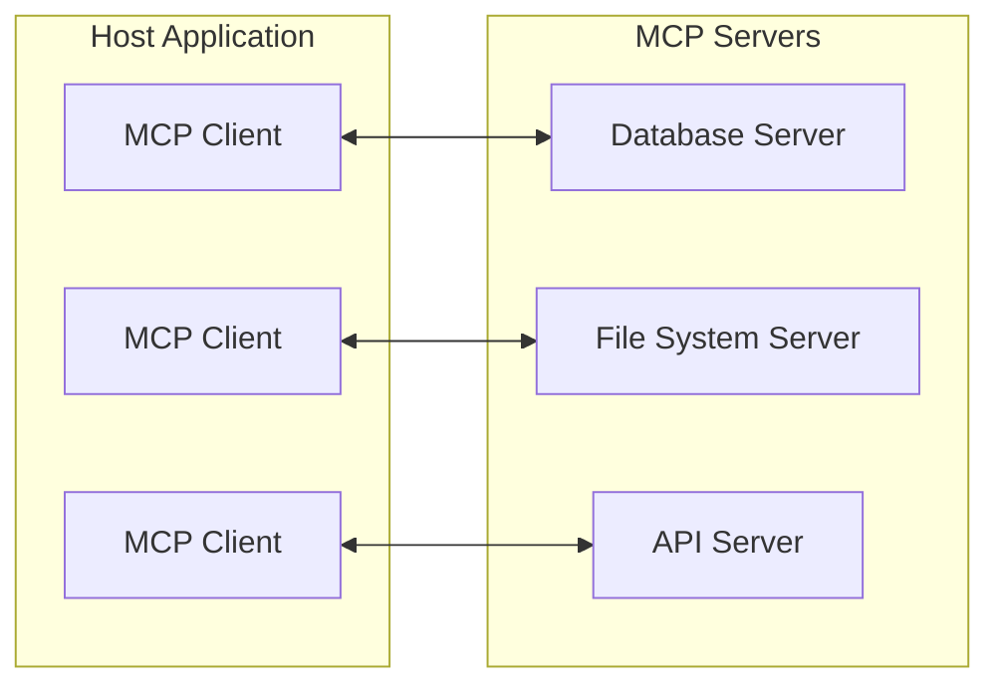
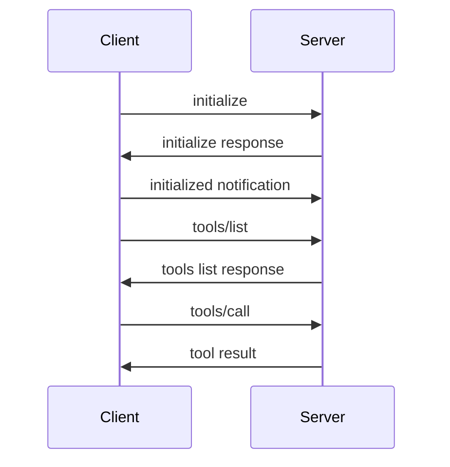

## MCP : AI Model과 외부 세계를 연결하는 Protocol

- MCP(Model Context Protocol)는 **AI model이 외부 data source, tool, service에 접근할 수 있게 하는 표준화된 protocol**입니다.
    - Anthropic이 개발하고 open source로 공개했습니다.
    - AI application과 외부 system 간의 통합을 단순화합니다.

- MCP는 AI model의 context를 확장하여 더 풍부한 응답을 생성할 수 있게 합니다.
    - 실시간 data 조회, 외부 API 호출, file system 접근 등이 가능합니다.
    - 각 data source마다 개별 연동 code를 작성할 필요 없이 표준화된 방식으로 연결합니다.


---


## MCP의 Architecture

- MCP는 **client-server architecture**를 따릅니다.
    - host application이 여러 MCP server에 연결하여 기능을 확장합니다.




### Host

- host는 MCP client를 포함하는 application입니다.
    - Claude Desktop, IDE plugin, AI chatbot 등이 host가 될 수 있습니다.
    - 하나의 host가 여러 MCP server에 동시에 연결할 수 있습니다.


### MCP Client

- MCP client는 host 내부에서 MCP server와 1:1 연결을 유지합니다.
    - server와의 통신을 담당하고 protocol 규격을 준수합니다.


### MCP Server

- MCP server는 특정 기능을 제공하는 경량 program입니다.
    - database 조회, file 읽기/쓰기, 외부 API 호출 등의 기능을 노출합니다.
    - 표준화된 MCP protocol을 통해 client와 통신합니다.


---


## MCP의 핵심 기능

- MCP는 **resources**, **tools**, **prompts** 세 가지 핵심 기능을 제공합니다.
    - 이 구조는 MCP specification이 정의한 것으로, 모든 AI tool integration이 동일한 구조를 따르지는 않습니다.
    - 예를 들어, OpenAI function calling은 tools 개념만 제공하고, resources나 prompts 개념이 없습니다.


### Resources

- resources는 server가 client에게 노출하는 **data**입니다.
    - file 내용, database record, API response 등이 resource가 될 수 있습니다.
    - client는 resource를 읽어 AI model의 context로 사용합니다.

```plaintext
file://project/src/main.py
database://users/schema
api://weather/current
```


### Tools

- tools는 server가 제공하는 **실행 가능한 함수**입니다.
    - AI model이 tool을 호출하여 작업을 수행할 수 있습니다.
    - database query 실행, file 생성, email 전송 등의 action을 수행합니다.

```json
{
  "name": "query_database",
  "description": "Execute SQL query",
  "inputSchema": {
    "type": "object",
    "properties": {
      "query": { "type": "string" }
    }
  }
}
```


### Prompts

- prompts는 server가 제공하는 **재사용 가능한 prompt template**입니다.
    - 자주 사용하는 prompt를 template으로 정의하여 일관성을 유지합니다.
    - parameter를 받아 동적으로 prompt를 생성할 수 있습니다.


---


## MCP의 통신 방식

- MCP는 **JSON-RPC 2.0** 기반으로 통신합니다.
    - request-response 방식과 notification 방식을 모두 지원합니다.


### Transport Layer

- MCP는 다양한 transport layer를 지원합니다.
    - **stdio** : 표준 입출력을 통한 local 통신.
    - **HTTP with SSE** : Server-Sent Events를 활용한 원격 통신.


### Message 흐름




---


## MCP Server 구현 예시

- MCP server는 Python, TypeScript 등 다양한 언어로 구현할 수 있습니다.

```python
from mcp.server import Server
from mcp.types import Tool, TextContent

server = Server("example-server")

@server.list_tools()
async def list_tools():
    return [
        Tool(
            name="get_weather",
            description="Get current weather",
            inputSchema={
                "type": "object",
                "properties": {
                    "city": {"type": "string"}
                }
            }
        )
    ]

@server.call_tool()
async def call_tool(name: str, arguments: dict):
    if name == "get_weather":
        city = arguments.get("city")
        # 날씨 API 호출 logic (여기서는 예시로 고정된 응답 사용)
        return [TextContent(type="text", text=f"{city}의 날씨: 맑음")]
```


---


## Reference

- <https://modelcontextprotocol.io>
- <https://github.com/modelcontextprotocol>

