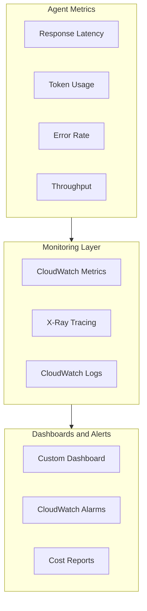

## Amazon Bedrock Agent Best Practices

- Bedrock Agent를 운영할 때 **성능**, **비용**, **보안** 측면에서 고려할 사항입니다.
- single agent든 multi-agent든 공통으로 적용됩니다.

---

## Performance 최적화 전략

- **model 선택**과 **caching**으로 latency와 cost를 줄입니다.

### Model Selection 최적화

- agent마다 **적합한 model**을 선택합니다.
    - 복잡한 reasoning이 필요한 agent에는 **Claude 4.5 Opus**를 씁니다.
    - 간단한 분류 작업에는 **Claude 4.5 Haiku**를 써서 비용을 줄입니다.
    - 빠른 응답이 필요한 agent에는 **low-latency model**을 배치합니다.

- **temperature**, **max token** 같은 parameter도 agent별로 다르게 설정합니다.

### Caching과 Result Reuse

- **자주 조회하는 정보는 cache**합니다.
    - knowledge base 검색 결과를 cache해서 같은 질문에 빠르게 응답합니다.
    - agent 응답도 일정 시간 동안 재사용합니다.

- **agent 간 data 전달**을 최적화합니다.
    - 큰 data는 S3에 저장하고 URL만 전달합니다.

---

## Monitoring과 Observability

- agent가 여러 개면 **어디서 문제가 생겼는지** 파악하기 어렵습니다.
- **CloudWatch**로 metric을 수집하고, **X-Ray**로 request 흐름을 추적합니다.

### Agent Level Monitoring

- **개별 agent**의 성능을 측정합니다.
    - **response time**, **error rate**, **throughput**을 확인합니다.
    - **token 사용량**을 tracking해서 비용을 관리합니다.
    - knowledge base **hit rate**를 분석해서 검색 효율을 평가합니다.

- **conversation log**를 분석해서 어떤 질문에서 실패하는지 파악합니다.

### System Level Observability

- **전체 request 흐름**을 추적합니다.
    - **X-Ray**로 agent → tool 호출 순서를 시각화합니다.
    - 어느 단계에서 병목이 생기는지 파악합니다.

- **CloudWatch Alarm**으로 이상 상황을 감지합니다.
    - error rate가 급증하거나 latency가 높아지면 alert를 보냅니다.

---

## Security와 Governance

- agent마다 **접근 권한**을 다르게 설정하고, 모든 활동을 **logging**합니다.

### Access Control 구현

- **IAM role**로 agent별 권한을 관리합니다.
    - order agent는 주문 DB만, product agent는 제품 catalog만 접근하게 합니다.
    - **least privilege** : 필요한 최소 권한만 부여합니다.

- **data encryption**으로 정보를 보호합니다.
    - 전송 중 data는 **TLS**로 암호화합니다.
    - 저장된 data는 **KMS**로 암호화합니다.

### Audit과 Compliance

- **CloudTrail**로 모든 API 호출을 기록합니다.
    - 누가, 언제, 어떤 agent를 호출했는지 추적합니다.
    - conversation history도 저장해서 문제 발생 시 원인을 분석합니다.

- **PII data** 처리 정책을 각 agent에 적용합니다.
    - 개인 정보는 masking하거나 별도 storage에 저장합니다.

---

## 비용 최적화 방안

- 비용은 **model 호출**, **token 사용량**, **infrastructure**로 나뉩니다.

### Model Usage 최적화

- **agent별로 적합한 model**을 선택합니다.
    - 호출이 적은 agent는 **on-demand**로, 호출이 많은 agent는 **provisioned throughput**으로 설정합니다.
    - batch 처리가 가능한 작업은 off-peak 시간에 돌립니다.

- **prompt를 간결하게** 작성해서 token 사용량을 줄입니다.
    - 불필요한 context를 제거합니다.
    - 응답 길이를 제한합니다.

### Infrastructure Cost Management

- **serverless architecture**를 활용합니다.
    - Lambda memory와 timeout을 최적화합니다.
    - S3 storage class를 data 접근 빈도에 맞게 선택합니다.

- **resource tagging**으로 비용을 추적합니다.
    - agent별, team별로 비용을 분리해서 확인합니다.
    - **budget alert**를 설정해서 예상치 못한 비용 증가를 방지합니다.

---

## Agent Design Principles

- **하나의 agent는 하나의 역할**만 담당합니다.
    - order agent가 제품 추천까지 하면 안 됩니다.
        - 제품 추천은 product agent가 담당합니다.
    - 기능이 늘어나면 새로운 agent를 추가합니다.

- **agent 간 의존성을 최소화**합니다.
    - order agent를 수정해도 product agent에 영향이 없어야 합니다.
    - 독립적으로 개발하고 배포합니다.

---

## Testing과 Validation

- **unit test**, **integration test**, **end-to-end test** 3단계로 testing을 수행합니다.
    - **unit test** : 각 agent가 단독으로 잘 동작하는지 확인합니다.
    - **integration test** : agent가 tool을 잘 호출하는지 확인합니다.
    - **end-to-end test** : 사용자 요청부터 최종 응답까지 전체 흐름을 검증합니다.

- **load testing**으로 동시 처리 능력을 측정합니다.
    - 동시에 100명이 질문하면 어떻게 되는지 확인합니다.

---

## Reference

- <https://aws.amazon.com/bedrock/agents/>
- <https://docs.aws.amazon.com/bedrock/latest/userguide/agents.html>
- <https://docs.aws.amazon.com/bedrock/latest/userguide/agents-monitor.html>

