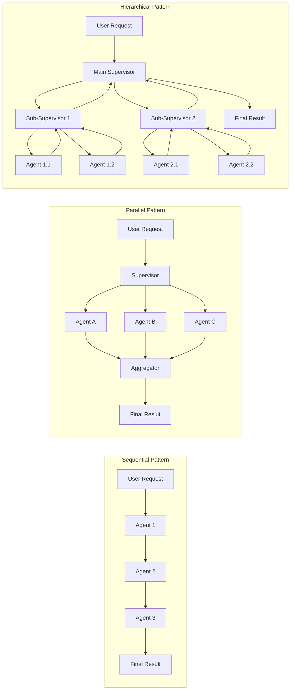
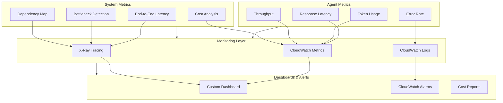

## AWS Bedrock Agent의 Multi-Agent 기능

- AWS Bedrock Agent의 multi-agent 기능은 여러 AI agent가 협력하여 복잡한 작업을 수행할 수 있도록 지원하는 orchestration 기능입니다.
- 각 agent는 특정 domain이나 기능에 특화되어 있으며, supervisor agent가 전체 workflow를 조정합니다.
- 2024년 re:Invent에서 발표된 기능으로, 복잡한 enterprise 시나리오에서 AI agent의 활용도를 크게 향상시킵니다.

---

## Multi-Agent System Architecture

- multi-agent system은 계층적 구조로 설계되어 supervisor agent가 sub-agent들을 orchestration합니다.
- 사용자 요청은 supervisor agent를 통해 적절한 sub-agent로 routing되며, 결과는 다시 supervisor agent가 종합하여 전달합니다.

```mermaid
graph TB
    %% Component declarations
    user[User]
    supervisor[Supervisor Agent]
    
    sub_agent1[Sub-Agent 1<br/>Customer Service]
    sub_agent2[Sub-Agent 2<br/>Order Processing]
    sub_agent3[Sub-Agent 3<br/>Product Expert]
    sub_agent4[Sub-Agent 4<br/>Analytics]
    
    kb1[Knowledge Base 1<br/>Customer Data]
    kb2[Knowledge Base 2<br/>Order History]
    kb3[Knowledge Base 3<br/>Product Catalog]
    kb4[Knowledge Base 4<br/>Business Metrics]
    
    tool1[Tools/APIs<br/>CRM System]
    tool2[Tools/APIs<br/>ERP System]
    tool3[Tools/APIs<br/>Inventory System]
    tool4[Tools/APIs<br/>BI Platform]
    
    fm1[Foundation Model<br/>Claude 3 Opus]
    fm2[Foundation Model<br/>Claude 3 Sonnet]
    fm3[Foundation Model<br/>Claude 3 Haiku]
    
    %% Connections
    user -->|Request| supervisor
    supervisor -->|Response| user
    
    supervisor -->|Route Task| sub_agent1
    supervisor -->|Route Task| sub_agent2
    supervisor -->|Route Task| sub_agent3
    supervisor -->|Route Task| sub_agent4
    
    sub_agent1 -->|Result| supervisor
    sub_agent2 -->|Result| supervisor
    sub_agent3 -->|Result| supervisor
    sub_agent4 -->|Result| supervisor
    
    sub_agent1 --> kb1
    sub_agent2 --> kb2
    sub_agent3 --> kb3
    sub_agent4 --> kb4
    
    sub_agent1 --> tool1
    sub_agent2 --> tool2
    sub_agent3 --> tool3
    sub_agent4 --> tool4
    
    sub_agent1 --> fm1
    sub_agent2 --> fm2
    sub_agent3 --> fm3
    sub_agent4 --> fm2
    
    %% Styling
    classDef agentStyle fill:#e1f5fe,stroke:#01579b,stroke-width:2px
    classDef kbStyle fill:#f3e5f5,stroke:#4a148c,stroke-width:2px
    classDef toolStyle fill:#e8f5e9,stroke:#1b5e20,stroke-width:2px
    classDef fmStyle fill:#fff3e0,stroke:#e65100,stroke-width:2px
    classDef userStyle fill:#fce4ec,stroke:#880e4f,stroke-width:2px
    
    class supervisor,sub_agent1,sub_agent2,sub_agent3,sub_agent4 agentStyle
    class kb1,kb2,kb3,kb4 kbStyle
    class tool1,tool2,tool3,tool4 toolStyle
    class fm1,fm2,fm3 fmStyle
    class user userStyle
```

---

## Multi-Agent Architecture 구성 요소

- multi-agent system은 supervisor agent와 sub-agent들로 구성된 계층적 구조를 가집니다.
- supervisor agent는 사용자 요청을 분석하고 적절한 sub-agent에게 작업을 위임하는 orchestrator 역할을 수행합니다.
- 각 sub-agent는 독립적인 knowledge base, tool, prompt configuration을 가질 수 있습니다.

### Supervisor Agent 역할

- supervisor agent는 사용자의 요청을 받아 전체 작업을 계획하고 조정합니다.
    - 사용자 요청의 의도를 파악하여 필요한 sub-agent를 선택합니다.
    - 여러 sub-agent의 작업 결과를 종합하여 최종 응답을 생성합니다.
    - sub-agent 간의 dependency를 관리하고 실행 순서를 결정합니다.

- routing logic을 통해 요청을 적절한 sub-agent에게 전달합니다.
    - natural language understanding을 통한 자동 routing이 가능합니다.
    - 사전 정의된 rule 기반 routing도 설정할 수 있습니다.

### Sub-Agent 특성

- 각 sub-agent는 특정 domain에 특화된 전문 agent로 동작합니다.
    - 독립적인 foundation model을 사용할 수 있어 task에 최적화된 model 선택이 가능합니다.
    - 전용 knowledge base를 통해 domain specific한 정보를 활용합니다.
    - 특화된 tool과 API를 통해 외부 system과 integration합니다.

- sub-agent는 다른 sub-agent와 독립적으로 개발되고 배포될 수 있습니다.
    - version 관리가 개별적으로 이루어져 유연한 update가 가능합니다.
    - 각 agent의 성능과 비용을 독립적으로 monitoring하고 최적화할 수 있습니다.

---

## Multi-Agent Collaboration Pattern

- multi-agent system은 다양한 collaboration pattern을 지원하여 복잡한 workflow를 구현합니다.
- sequential, parallel, hierarchical pattern을 조합하여 최적의 작업 흐름을 설계할 수 있습니다.

### Sequential Collaboration

- 작업이 순차적으로 진행되며 이전 agent의 output이 다음 agent의 input이 됩니다.
    - data processing pipeline에서 각 단계를 다른 agent가 처리합니다.
    - 문서 분석 후 요약, 번역 순서로 진행되는 workflow를 구현합니다.
    - error handling과 retry logic을 각 단계에서 독립적으로 관리합니다.

### Parallel Collaboration

- 여러 agent가 동시에 작업을 수행하여 처리 시간을 단축합니다.
    - 독립적인 정보 수집 작업을 병렬로 처리합니다.
    - 다양한 data source에서 동시에 정보를 조회하고 통합합니다.
    - resource 사용을 최적화하여 전체 latency를 감소시킵니다.

### Hierarchical Collaboration

- 복잡한 작업을 sub-task로 분해하여 계층적으로 처리합니다.
    - supervisor agent가 high-level planning을 수행합니다.
    - 중간 level agent가 specific domain의 coordination을 담당합니다.
    - leaf level agent가 실제 작업을 실행합니다.

---

## Knowledge Base와 Tool Integration

- multi-agent system에서 각 agent는 고유한 knowledge base와 tool을 활용합니다.
- 중앙 집중식 knowledge 관리와 분산식 knowledge 관리를 혼합하여 사용할 수 있습니다.

### Knowledge Base 관리 전략

- 각 agent별로 specialized knowledge base를 구성하여 domain expertise를 구현합니다.
    - vector database를 통한 semantic search 기능을 활용합니다.
    - RAG (Retrieval Augmented Generation) pattern으로 정확도를 향상시킵니다.
    - knowledge base의 access control을 통해 data governance를 구현합니다.

- shared knowledge base를 통해 공통 정보를 효율적으로 관리합니다.
    - 중복 data 저장을 방지하여 storage cost를 절감합니다.
    - 일관된 정보 제공으로 agent 간 응답의 일관성을 보장합니다.

### Tool과 Action Group 활용

- 각 agent는 specific tool과 action을 실행할 수 있는 capability를 가집니다.
    - Lambda function을 통해 custom business logic을 실행합니다.
    - external API를 호출하여 third-party service와 integration합니다.
    - database query, file processing 등의 작업을 수행합니다.

- action group을 통해 관련된 기능들을 논리적으로 grouping합니다.
    - CRUD operation을 하나의 action group으로 관리합니다.
    - authentication과 authorization을 centralized하게 처리합니다.

---

## 실제 구현 시나리오

- multi-agent system은 복잡한 enterprise 요구사항을 효과적으로 해결합니다.
- 금융, 의료, e-commerce 등 다양한 industry에서 활용 가능한 pattern을 제공합니다.

### Customer Service Automation

- customer service를 위한 multi-agent system 구성 예시입니다.
    - inquiry classification agent가 고객 문의를 분류합니다.
    - product specialist agent가 제품 관련 질문에 답변합니다.
    - order processing agent가 주문 처리와 tracking을 담당합니다.
    - escalation agent가 복잡한 문제를 human agent에게 전달합니다.

- 각 agent는 specific knowledge와 capability를 가지고 협력합니다.
    - product catalog, order history, customer profile 등의 data를 활용합니다.
    - CRM system, inventory management system과 실시간으로 연동됩니다.

### Financial Analysis Workflow

- 금융 분석을 위한 specialized agent들의 협업 구조입니다.
    - market data agent가 실시간 시장 정보를 수집합니다.
    - risk assessment agent가 portfolio risk를 분석합니다.
    - compliance agent가 규제 준수 여부를 검토합니다.
    - reporting agent가 종합 보고서를 생성합니다.

- 복잡한 금융 의사결정을 체계적으로 지원합니다.
    - 실시간 data와 historical data를 종합적으로 분석합니다.
    - regulatory requirement를 자동으로 check하여 compliance risk를 감소시킵니다.

---

## Performance 최적화 전략

- multi-agent system의 성능을 최적화하기 위한 다양한 전략을 적용할 수 있습니다.
- latency, cost, accuracy 간의 trade-off를 고려하여 최적의 configuration을 선택합니다.

### Model Selection 최적화

- 각 agent에 적합한 foundation model을 선택하여 성능과 비용을 최적화합니다.
    - 복잡한 reasoning이 필요한 agent에는 Claude 3 Opus를 사용합니다.
    - 간단한 classification task에는 Claude 3 Haiku를 사용하여 cost를 절감합니다.
    - response time이 critical한 agent에는 low-latency model을 배치합니다.

- model parameter tuning을 통해 각 agent의 behavior를 최적화합니다.
    - temperature, top-p, max token 등의 parameter를 task에 맞게 조정합니다.
    - prompt engineering을 통해 model의 output quality를 향상시킵니다.

### Caching과 Result Reuse

- 반복적인 요청에 대한 caching strategy를 구현합니다.
    - frequently accessed knowledge base query 결과를 cache합니다.
    - agent response를 일정 시간 동안 재사용하여 latency를 감소시킵니다.
    - cache invalidation policy를 정의하여 data freshness를 보장합니다.

- intermediate result를 효율적으로 관리합니다.
    - agent 간 data passing을 최적화하여 network overhead를 감소시킵니다.
    - large payload는 S3를 통해 전달하고 reference만 passing합니다.

---

## Monitoring과 Observability

- multi-agent system의 복잡성으로 인해 comprehensive monitoring이 필수적입니다.
- 각 agent의 performance metric과 system 전체의 health를 실시간으로 tracking합니다.

### Agent Level Monitoring

- 개별 agent의 performance를 상세하게 monitoring합니다.
    - response time, error rate, throughput을 측정합니다.
    - token usage와 API call 횟수를 tracking하여 cost를 관리합니다.
    - knowledge base hit rate를 분석하여 retrieval 효율성을 평가합니다.

- agent behavior를 분석하여 개선점을 도출합니다.
    - conversation log를 분석하여 failure pattern을 식별합니다.
    - user feedback을 수집하여 agent response quality를 평가합니다.

### System Level Observability

- 전체 multi-agent system의 동작을 종합적으로 관찰합니다.
    - distributed tracing을 통해 request flow를 추적합니다.
    - agent 간 dependency와 bottleneck을 시각화합니다.
    - end-to-end latency를 측정하여 user experience를 평가합니다.

- CloudWatch와 X-Ray를 활용한 monitoring infrastructure를 구축합니다.
    - custom metric과 dashboard를 생성하여 실시간 monitoring을 수행합니다.
    - alarm을 설정하여 이상 상황을 즉시 감지하고 대응합니다.

---

## Security와 Governance

- multi-agent system에서 data security와 access control은 매우 중요합니다.
- 각 agent의 권한을 세밀하게 관리하여 보안 위험을 최소화합니다.

### Access Control 구현

- IAM role과 policy를 통해 agent별 권한을 관리합니다.
    - least privilege principle을 적용하여 필요한 최소 권한만 부여합니다.
    - resource-based policy로 specific resource에 대한 access를 제어합니다.
    - cross-account access를 통해 multi-tenant 환경을 지원합니다.

- data encryption을 통해 sensitive information을 보호합니다.
    - transit 중인 data는 TLS를 통해 암호화합니다.
    - rest 상태의 data는 KMS를 사용하여 암호화합니다.
    - agent 간 communication에 mutual TLS를 적용합니다.

### Audit과 Compliance

- 모든 agent activity를 logging하여 audit trail을 유지합니다.
    - CloudTrail을 통해 API call을 기록합니다.
    - conversation history를 안전하게 저장하고 관리합니다.
    - data retention policy를 정의하여 compliance requirement를 충족합니다.

- regulatory compliance를 위한 control을 구현합니다.
    - PII data handling policy를 각 agent에 적용합니다.
    - data residency requirement를 region 설정으로 충족합니다.
    - regular security assessment를 수행하여 vulnerability를 관리합니다.

---

## 비용 최적화 방안

- multi-agent system의 운영 비용을 효과적으로 관리하기 위한 전략이 필요합니다.
- 각 component의 비용 구조를 이해하고 최적화 기회를 식별합니다.

### Model Usage 최적화

- agent별 model 사용량을 분석하여 비용을 최적화합니다.
    - 사용 빈도가 낮은 agent는 on-demand pricing을 활용합니다.
    - high-volume agent는 provisioned throughput을 고려합니다.
    - batch processing이 가능한 작업은 off-peak 시간에 처리합니다.

- prompt optimization을 통해 token 사용량을 감소시킵니다.
    - concise하고 effective한 prompt를 설계합니다.
    - unnecessary context를 제거하여 input token을 절감합니다.
    - response length를 제한하여 output token을 관리합니다.

### Infrastructure Cost Management

- serverless architecture를 활용하여 infrastructure 비용을 절감합니다.
    - Lambda function의 memory와 timeout을 최적화합니다.
    - S3 storage class를 data access pattern에 맞게 선택합니다.
    - DynamoDB의 capacity mode를 workload pattern에 따라 조정합니다.

- resource tagging을 통해 비용을 상세하게 추적합니다.
    - agent별, team별, project별로 비용을 할당합니다.
    - Cost Explorer를 활용하여 비용 trend를 분석합니다.
    - budget alert를 설정하여 예상치 못한 비용 증가를 방지합니다.

---

## Implementation Best Practices

- multi-agent system을 성공적으로 구현하기 위한 best practice를 정리합니다.
- 실제 production 환경에서 검증된 pattern과 전략을 활용합니다.

### Agent Design Principles

- single responsibility principle을 적용하여 각 agent의 역할을 명확히 정의합니다.
    - 하나의 agent가 너무 많은 기능을 담당하지 않도록 설계합니다.
    - agent 간의 책임 경계를 명확히 구분합니다.
    - 기능 확장 시 새로운 agent를 추가하는 방식을 고려합니다.

- loose coupling과 high cohesion을 유지합니다.
    - agent 간 dependency를 최소화하여 독립적인 개발과 배포를 가능하게 합니다.
    - 관련 기능들은 하나의 agent 내에서 cohesive하게 구성합니다.

### Testing과 Validation

- comprehensive testing strategy를 수립합니다.
    - unit test로 각 agent의 기능을 독립적으로 검증합니다.
    - integration test로 agent 간 interaction을 확인합니다.
    - end-to-end test로 전체 system의 동작을 검증합니다.

- performance testing을 통해 system capacity를 파악합니다.
    - load testing으로 동시 처리 능력을 측정합니다.
    - stress testing으로 system의 한계점을 식별합니다.
    - chaos engineering으로 failure scenario에 대한 resilience를 검증합니다.

---

## Reference

- <https://aws.amazon.com/bedrock/agents/>
- <https://docs.aws.amazon.com/bedrock/latest/userguide/agents-multi-agent.html>
- <https://aws.amazon.com/blogs/machine-learning/build-multi-agent-workflows-with-amazon-bedrock/>
- <https://github.com/aws-samples/amazon-bedrock-multi-agent-orchestration>
- <https://docs.aws.amazon.com/bedrock/latest/userguide/agents-create-multi-agent.html>

