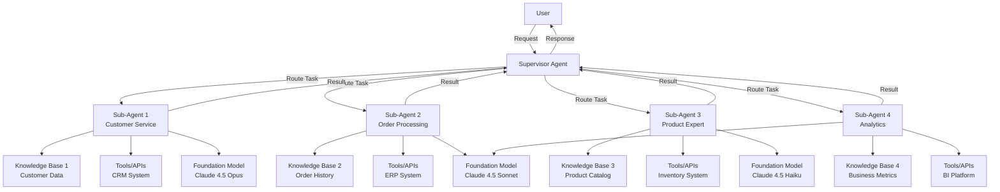
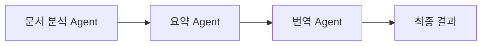
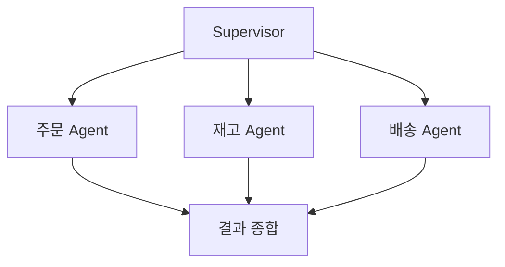
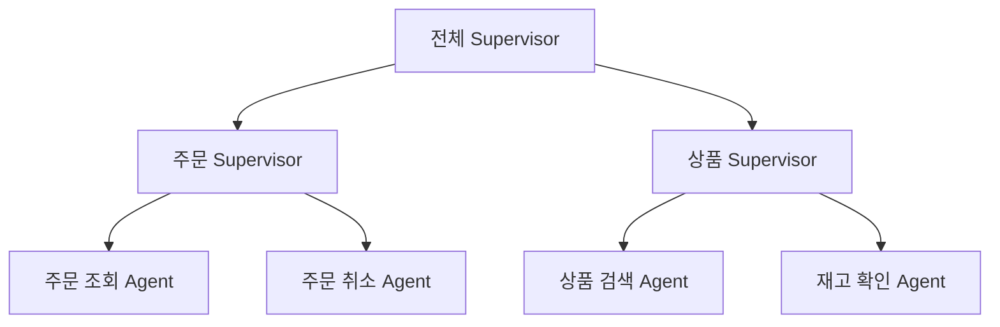

## AWS Bedrock Agent의 Multi-Agent 기능

- **multi-agent**는 여러 AI agent가 협력하여 복잡한 작업을 수행하는 기능입니다.
- 예를 들어 고객 문의가 들어오면 **supervisor agent**가 "이건 주문 관련이니까 order agent한테 맡기자"라고 판단하고, 해당 agent가 처리한 결과를 다시 supervisor가 종합해서 답변합니다.
- 2024년 re:Invent에서 발표되었으며, 복잡한 enterprise scenario에서 유용합니다.


### Multi-Agent System Architecture

- **supervisor agent**가 중앙에서 sub-agent들을 조율합니다.
- 사용자 요청이 들어오면 supervisor가 적절한 sub-agent에게 작업을 위임하고, 결과를 종합하여 최종 응답을 생성합니다.


```mermaid
graph TB
    %% Component declarations
    user[User]
    supervisor[Supervisor Agent]
    
    sub_agent1[Sub-Agent 1<br/>Customer Service]
    sub_agent2[Sub-Agent 2<br/>Order Processing]
    sub_agent3[Sub-Agent 3<br/>Product Expert]
    sub_agent4[Sub-Agent 4<br/>Analytics]
    
    kb1[Knowledge Base 1<br/>Customer Data]
    kb2[Knowledge Base 2<br/>Order History]
    kb3[Knowledge Base 3<br/>Product Catalog]
    kb4[Knowledge Base 4<br/>Business Metrics]
    
    tool1[Tools/APIs<br/>CRM System]
    tool2[Tools/APIs<br/>ERP System]
    tool3[Tools/APIs<br/>Inventory System]
    tool4[Tools/APIs<br/>BI Platform]
    
    fm1[Foundation Model<br/>Claude 4.5 Opus]
    fm2[Foundation Model<br/>Claude 4.5 Sonnet]
    fm3[Foundation Model<br/>Claude 4.5 Haiku]
    
    %% Connections
    user -->|Request| supervisor
    supervisor -->|Response| user
    
    supervisor -->|Route Task| sub_agent1
    supervisor -->|Route Task| sub_agent2
    supervisor -->|Route Task| sub_agent3
    supervisor -->|Route Task| sub_agent4
    
    sub_agent1 -->|Result| supervisor
    sub_agent2 -->|Result| supervisor
    sub_agent3 -->|Result| supervisor
    sub_agent4 -->|Result| supervisor
    
    sub_agent1 --> kb1
    sub_agent2 --> kb2
    sub_agent3 --> kb3
    sub_agent4 --> kb4
    
    sub_agent1 --> tool1
    sub_agent2 --> tool2
    sub_agent3 --> tool3
    sub_agent4 --> tool4
    
    sub_agent1 --> fm1
    sub_agent2 --> fm2
    sub_agent3 --> fm3
    sub_agent4 --> fm2
```


---


## Multi-Agent Architecture 구성 요소

- multi-agent system은 **supervisor agent + 여러 sub-agent**로 구성됩니다.
- supervisor가 "총괄 manager" 역할을 하고, 각 sub-agent는 "담당자" 역할을 합니다.


### Supervisor Agent 역할

- **supervisor agent**는 사용자 요청을 받아 "누구한테 맡길지" 결정하는 역할입니다.
    - 요청 의도를 파악해서 적절한 sub-agent를 선택합니다.
    - 여러 sub-agent의 결과를 종합해서 최종 응답을 만듭니다.
    - "주문 확인 → 재고 확인 → 배송 조회" 같은 **실행 순서**도 관리합니다.

- routing 방식은 **automatic routing**과 **rule-based routing** 두 가지입니다.
    - **automatic routing** : supervisor가 요청을 이해하고 알아서 적절한 agent에게 전달합니다.
    - **rule-based routing** : "주문" keyword가 있으면 order agent에게 전달하는 식으로 미리 정의합니다.


### Sub-Agent 특성

- 각 **sub-agent**는 특정 영역의 전문가입니다.
    - agent마다 **다른 model**을 사용할 수 있습니다.
        - 복잡한 작업에는 Opus, 간단한 작업에는 Haiku를 씁니다.
    - agent마다 **전용 knowledge base**를 연결해서 필요한 정보만 참조합니다.
    - agent마다 **전용 tool**을 연결해서 외부 API를 호출합니다.

- sub-agent는 **독립적으로 개발하고 배포**합니다.
    - order agent만 수정해도 다른 agent에 영향이 없습니다.
    - agent별로 성능과 비용을 따로 monitoring합니다.


---


## Multi-Agent Collaboration Pattern

- agent들이 협력하는 방식은 크게 **sequential**, **parallel**, **hierarchical** 세 가지입니다.
- 상황에 따라 조합해서 사용합니다.


### Sequential Collaboration

- **이전 agent의 결과를 다음 agent가 받아서 처리**하는 방식입니다.
    - 각 단계에서 error가 나면 해당 agent가 retry합니다.


```mermaid
graph LR
    doc_analysis[문서 분석 Agent] --> summary[요약 Agent]
    summary --> translation[번역 Agent]
    translation --> result[최종 결과]
```


### Parallel Collaboration

- **여러 agent가 동시에 작업**해서 처리 시간을 줄입니다.
    - 결과를 supervisor가 모아서 하나의 응답으로 만듭니다.


```mermaid
graph TB
    supervisor[Supervisor] --> order_agent[주문 Agent]
    supervisor --> stock_agent[재고 Agent]
    supervisor --> delivery_agent[배송 Agent]
    order_agent --> aggregator[결과 종합]
    stock_agent --> aggregator
    delivery_agent --> aggregator
```


### Hierarchical Collaboration

- **supervisor 아래에 sub-supervisor**를 두는 방식입니다.
    - 대규모 system에서 영역별로 중간 관리자를 둡니다.


```mermaid
graph TB
    main_supervisor[전체 Supervisor] --> order_supervisor[주문 Supervisor]
    main_supervisor --> product_supervisor[상품 Supervisor]
    order_supervisor --> order_query[주문 조회 Agent]
    order_supervisor --> order_cancel[주문 취소 Agent]
    product_supervisor --> product_search[상품 검색 Agent]
    product_supervisor --> stock_check[재고 확인 Agent]
```


---


## Knowledge Base와 Tool Integration

- 각 agent는 **자신만의 knowledge base**와 **tool**을 가집니다.
- 공통으로 쓰는 정보는 **shared knowledge base**로 분리합니다.


### Knowledge Base 관리 전략

- agent별로 **전용 knowledge base**를 구성합니다.
    - order agent는 주문/배송 관련 문서만, product agent는 제품 catalog만 참조합니다.
    - **RAG** pattern으로 정확한 정보를 검색해서 응답에 활용합니다.

- **shared knowledge base**는 회사 정책, FAQ 같은 공통 정보를 담습니다.
    - 중복 저장을 방지하고, 모든 agent가 일관된 정보를 제공합니다.


### Tool과 Action Group 활용

- agent는 **Lambda function**이나 **외부 API**를 호출해서 실제 작업을 수행합니다.
    - order agent가 주문 취소 API를 호출하거나, DB에서 주문 상태를 조회합니다.

- **action group**은 관련 기능을 묶어서 관리합니다.
    - 주문 action group에는 주문 조회, 주문 취소, 주문 수정이 포함됩니다.


---


## 실제 구현 Scenario

- multi-agent는 **customer service**, **금융 분석** 같은 복잡한 요구 사항에 적합합니다.


### Customer Service Automation

- customer service에서는 **문의 분류 → 제품 안내 → 주문 처리 → escalation**을 각각 다른 agent가 담당합니다.
    - **inquiry agent** : 고객 문의가 제품 문의인지, 주문 문의인지, 불만인지 분류합니다.
    - **product agent** : 제품 spec, 가격, 재고 관련 질문에 답변합니다.
    - **order agent** : 주문 조회, 배송 추적, 취소/환불을 처리합니다.
    - **escalation agent** : 복잡한 문제는 상담원에게 전달합니다.


### Financial Analysis Workflow

- 금융 분석에서는 **data 수집 → risk 분석 → compliance 검토 → 보고서 생성**을 병렬로 처리합니다.
    - **market agent** : 실시간 시장 정보를 수집합니다.
    - **risk agent** : portfolio risk를 분석합니다.
    - **compliance agent** : 규제 준수 여부를 검토합니다.
    - **reporting agent** : 위 결과를 종합해서 보고서를 생성합니다.


### AWS SDK를 이용한 Multi-Agent 생성

- **@aws-sdk/client-bedrock-agent**를 사용하여 supervisor와 sub-agent를 생성합니다.

```typescript
import {
  BedrockAgentClient,
  CreateAgentCommand,
} from '@aws-sdk/client-bedrock-agent';

const client = new BedrockAgentClient({ region: 'us-east-1' });

// Sub-Agent 생성
const subAgentResponse = await client.send(
  new CreateAgentCommand({
    agentName: 'order-processing-agent',
    agentResourceRoleArn: 'arn:aws:iam::123456789012:role/BedrockAgentRole',
    foundationModel: 'anthropic.claude-sonnet-4-20250514-v1:0',
    instruction: `
      주문 처리 전문 agent입니다.
      - 주문 조회, 주문 상태 확인, 배송 추적을 담당합니다.
      - 주문 취소 및 환불 요청을 처리합니다.
    `,
    idleSessionTTLInSeconds: 600,
  })
);

const subAgentId = subAgentResponse.agent?.agentId;

// Supervisor Agent 생성
const supervisorResponse = await client.send(
  new CreateAgentCommand({
    agentName: 'customer-service-supervisor',
    agentResourceRoleArn: 'arn:aws:iam::123456789012:role/BedrockAgentRole',
    foundationModel: 'anthropic.claude-opus-4-20250514-v1:0',
    instruction: `
      customer service supervisor agent입니다.
      - 고객 문의를 분석하여 적절한 sub-agent에게 routing합니다.
      - 여러 sub-agent의 응답을 종합하여 최종 답변을 생성합니다.
    `,
    idleSessionTTLInSeconds: 600,
  })
);

const supervisorId = supervisorResponse.agent?.agentId;
```


### Sub-Agent 연결

- supervisor에 sub-agent를 연결하면 **협력 관계**가 설정됩니다.

```typescript
import {
  AssociateAgentCollaboratorCommand,
  PrepareAgentCommand,
  CreateAgentAliasCommand,
} from '@aws-sdk/client-bedrock-agent';

// Supervisor에 Sub-Agent 연결
await client.send(
  new AssociateAgentCollaboratorCommand({
    agentId: supervisorId,
    agentVersion: 'DRAFT',
    agentDescriptor: {
      aliasArn: `arn:aws:bedrock:us-east-1:123456789012:agent-alias/${subAgentId}/TSTALIASID`,
    },
    collaboratorName: 'order-processor',
    collaborationInstruction: `
      주문 관련 문의가 들어오면 이 agent에게 위임합니다.
      - 주문 번호 조회
      - 배송 상태 확인
      - 주문 취소 요청
    `,
    relayConversationHistory: 'TO_COLLABORATOR',
  })
);

// Agent 준비 및 배포
await client.send(new PrepareAgentCommand({ agentId: supervisorId }));

await client.send(
  new CreateAgentAliasCommand({
    agentId: supervisorId,
    agentAliasName: 'production',
  })
);
```


### Multi-Agent 호출

- supervisor를 호출하면 **자동으로 적절한 sub-agent에게 작업이 위임**됩니다.

```typescript
import {
  BedrockAgentRuntimeClient,
  InvokeAgentCommand,
} from '@aws-sdk/client-bedrock-agent-runtime';

const runtimeClient = new BedrockAgentRuntimeClient({ region: 'us-east-1' });

const response = await runtimeClient.send(
  new InvokeAgentCommand({
    agentId: supervisorId,
    agentAliasId: 'production-alias-id',
    sessionId: 'user-session-123',
    inputText: '주문번호 ORD-2024-001의 배송 상태를 알려주세요.',
  })
);

// streaming response 처리
if (response.completion) {
  for await (const event of response.completion) {
    if (event.chunk?.bytes) {
      const text = new TextDecoder().decode(event.chunk.bytes);
      process.stdout.write(text);
    }
  }
}
```


---


## Reference

- <https://aws.amazon.com/bedrock/agents/>
- <https://docs.aws.amazon.com/bedrock/latest/userguide/agents-multi-agent.html>
- <https://aws.amazon.com/blogs/machine-learning/build-multi-agent-workflows-with-amazon-bedrock/>
- <https://github.com/aws-samples/amazon-bedrock-multi-agent-orchestration>
- <https://docs.aws.amazon.com/bedrock/latest/userguide/agents-create-multi-agent.html>

