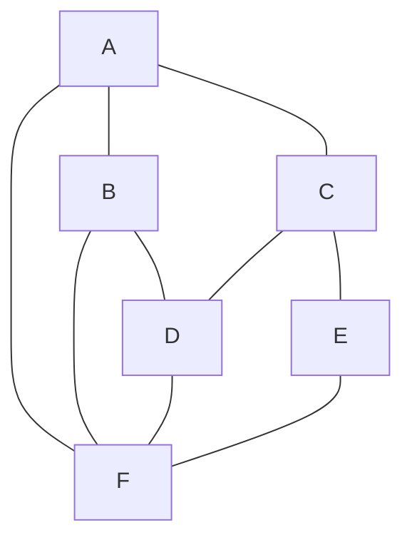

## Graph : Data를 비선형적으로 연결하여 저장하기

- Graph는 **여러 개의 정점(Vertex)**과 **그 점들을 잇는 간선(Edge)**으로 구성된 network 구조로, 다양한 관계를 modeling하는 데 사용됩니다.
    - social network, 지도 내 경로 찾기, web page 간의 link 구조 등의 많은 실생활 문제를 modeling할 수 있는 data 구조입니다.



- Graph는 두 node 사이에는 2개 이상의 **여러 개의 경로**가 존재할 수 있으며, 이는 node들 사이의 다양한 연결을 표현할 수 있게 합니다.
   - Graph는 node들 사이에 **무방향(양방향)** 또는 **방향(단방향)** 경로를 가질 수 있습니다.
   - **무방향 Graph**에서는 연결된 node들이 양방향으로 접근 가능하고, **방향 Graph**에서는 특정 방향으로만 접근 가능합니다.

- Graph는 자기 자신으로 연결되는 **self-loop**뿐만 아니라, 시작점과 끝점이 동일한 경로인 **circuit(회로)**도 가능합니다.

- Graph에는 Tree와 달리 **root node나 부모-자식 관계의 개념이 없습니다.**
    - 모든 node는 평등한 위치에 있으며, 연결 구조에 따라 다양한 관계를 형성할 수 있습니다.

- Graph를 순회하는 방법으로는 **깊이 우선 탐색(DFS)**과 **너비 우선 탐색(BFS)**가 있으며, 이는 Graph 내의 모든 node를 방문하는 방법입니다.

- Graph는 여러 기준에 의해 분류될 수 있습니다.
    - Graph는 **순환(Cyclic) Graph**와 **비순환(Acyclic) Graph**로 나눌 수 있습니다.
        - **순환 Graph**는 한 node에서 시작하여 다시 그 node로 돌아오는 경로가 존재하고, **비순환 Graph**는 그러한 경로가 없습니다.
    - Graph는 **방향 Graph(Directed Graph)**와 **무방향 Graph(Undirected Graph)**로도 나눌 수 있으며, 이는 간선의 방향 유무에 따라 구분됩니다.
    - Graph의 **간선은 선택 사항**으로, 어떤 Graph는 모든 가능한 node 쌍 사이에 간선을 가지고(완전 Graph), 어떤 Graph는 매우 적은 수의 간선만을 가질 수도(희소 Graph) 있습니다.


### Graph 용어

- **정점 (Vertex)** : 위치를 나타내는 개념으로, Node라고도 부릅니다.
    - 예를 들어, 도시를 나타내는 점들은 정점입니다.

- **간선 (Edge)** : 정점 간의 관계를 나타내는 선으로, node를 연결하는 선입니다.
    - Link 또는 Branch라고도 합니다.
    - 예를 들어, 도시 사이를 연결하는 도로들은 간선입니다.

- **인접 정점 (Adjacent vertex)** : 간선에 의해 직접 연결된 두 정점을 의미합니다.
    - 예를 들어, A와 B라는 두 도시가 도로로 연결되어 있으면 A와 B는 인접 정점입니다.

- **정점의 차수 (Degree)** : 무방향 Graph에서 하나의 정점에 인접한 정점의 수를 나타냅니다.
    - 예를 들어, 어떤 도시가 3개의 다른 도시에 연결되어 있다면 그 도시의 차수는 3입니다.
    - **무방향 Graph에서의 특성** : 모든 정점의 차수 합은 Graph의 간선 수의 2배입니다.

- **진입 차수 (In-degree)** : 방향 Graph에서 외부에서 해당 정점으로 들어오는 간선의 수를 의미하며, 내차수라고도 부릅니다.
    - 예를 들어, 어떤 web page로 들어오는 link의 수.

- **진출 차수 (Out-degree)** : 방향 Graph에서 해당 정점에서 외부로 나가는 간선의 수를 의미하며, 외차수라고도 부릅니다.
    - 예를 들어, 어떤 web page에서 나가는 link의 수.
    - **방향 Graph에서의 특성** : 모든 정점의 진입 차수와 진출 차수의 합은 Graph의 총 간선 수와 같습니다.

- **경로 길이 (Path length)** : 경로를 구성하는 데 사용된 간선의 수를 나타냅니다.
    - 예를 들어, A에서 C까지 가는 경로가 A-B-C라면 경로 길이는 2입니다.

- **단순 경로 (Simple path)** : 경로 중에서 반복되는 정점이 없는 경우를 말합니다.
    - 예를 들어, A-B-C가 단순 경로입니다.

- **Cycle** : 단순 경로의 시작 정점과 종료 정점이 동일한 경우를 말합니다.
    - 예를 들어, A-B-C-A가 cycle입니다.


---


## Graph의 종류

| 분류 기준 | Graph 종류 | 특징 |
| --- | --- | --- |
| 방향성 | **무방향 Graph** | 간선을 통해 양방향 이동 가능 |
|  | **방향 Graph** | 간선에 방향성이 존재 |
| 가중치 | **가중치 Graph** | 간선에 비용이나 가중치가 할당 |
| 연결성 | **연결 Graph** | 모든 정점 쌍에 경로 존재 |
|  | **비연결 Graph** | 특정 정점 쌍 사이에 경로 없음 |
| Cycle 유무 | **순환 Graph** | 단순 경로의 시작과 종료 정점 동일 |
|  | **비순환 Graph** | cycle 없음 |
| 연결 정도 | **완전 Graph** | 모든 정점이 서로 연결 |


### 무방향 Graph & 방향 Graph

| 무방향 Graph (Undirected Graph) | 방향 Graph (Directed Graph) |
| --- | --- |
| 간선을 통해 양방향으로 이동 가능.<br>정점 A와 정점 B를 연결하는 간선은 `(A, B)`와 같이 정점의 쌍으로 표현되며 `(A, B)`와 `(B, A)`는 동일함. | 간선에 방향성이 존재하는 Graph.<br>`A`에서 `B`로만 갈 수 있는 간선은 `<A, B>`로 표시하며 `<A, B>`와 `<B, A>`는 다름. |
| 양방향 통행 도로. | 일방 통행. |


### 가중치 Graph

- **가중치 Graph(Weighted Graph)**는 간선에 비용이나 가중치가 할당된 Graph입니다.
    - Network라고도 합니다.

- 예시 : 도시-도시의 연결, 도로의 길이, 회로 소자의 용량, 통신망의 사용료 등.


### 연결 Graph & 비연결 Graph

| 연결 Graph (Connected Graph) | 비연결 Graph (Disconnected Graph) |
| --- | --- |
| 무방향 Graph에서 모든 정점 쌍에 대해 항상 경로가 존재하는 경우. | 무방향 Graph에서 특정 정점 쌍 사이에 경로가 존재하지 않는 경우. |
| cycle이 없는 연결 Graph. Tree. | 정점들이 여러 개의 고립된 부분 Graph로 나누어진 경우. |


### 순환 Graph & 비순환 Graph

| 순환 Graph (Cycle Graph) | 비순환 Graph (Acyclic Graph) |
| --- | --- |
| 단순 경로의 시작 정점과 종료 정점이 동일한 경우. | cycle이 없는 Graph. |
| 경로 중에서 반복되는 정점이 없는 경우. 단순 경로(Simple Path). | Tree. |


### 완전 Graph

- **완전 Graph(Complete Graph)**는 Graph에 속한 모든 정점이 서로 연결되어 있는 Graph입니다.
    - 특히, **무방향 완전 Graph**에서 정점 수가 `n`이면 간선의 수는 `n * (n-1) / 2`입니다.


---


## Graph 구현하기

- Graph를 컴퓨터에서 표현하는 방법에는 **인접 행렬**, **인접 List** 방법이 있습니다.

- **인접 행렬(Adjacency Matrix)**은 간선이 많이 존재하는 **밀집 Graph(Dense Graph)**에서 사용하기 적합한 data 구조입니다.
    - **장점**
        - 두 정점을 연결하는 간선의 존재 여부(`M[i][j]`)를 `O(1)`로 즉시 알 수 있습니다.
        - 정점의 차수를 `O(N)`(`N`은 정점의 수) 안에 알 수 있습니다.
            - 인접 행렬의 i번째 행 또는 열을 모두 더함으로써 가능합니다.
    - **단점**
        - 어떤 node에 인접한 node들을 찾기 위해서는 모든 node를 전부 순회해야 합니다.
        - Graph에 존재하는 모든 간선의 수를 `O(N²)`(`N`은 정점의 수) 안에 알 수 있습니다.
            - 인접 행렬 전체를 조사함으로써 가능합니다.

- **인접 List(Adjacency List)**는 간선의 수가 적은 **희소 Graph(Sparse Graph)**에서 사용하기 적합한 data 구조입니다.
    - **장점**
        - 어떤 node에 인접한 node들을 쉽게 찾을 수 있습니다.
        - Graph에 존재하는 모든 간선의 수를 `O(N+E)`(`N`은 정점의 수, `E`는 간선의 수) 안에 알 수 있습니다.
            - 인접 List 전체를 조사함으로써 가능합니다.
    - **단점**
        - 간선의 존재 여부를 확인하거나 정점의 차수를 구하는 데 시간이 많이 걸립니다.
            - 정점 i의 list에 있는 node의 수, 즉 정점 차수만큼의 시간이 필요합니다.


### 인접 행렬을 사용하여 구현하기

- 인접 행렬(Adjacency Matrix)은 **Graph를 2차원 배열로 표현**하는 방법입니다.
    - 만약 Graph에 N개의 정점이 있다면, N x N 크기의 2차원 배열을 만들어 사용합니다.
- 배열의 요소 `matrix[i][j]`는 정점 `i`에서 정점 `j`로의 간선이 존재하면 1(또는 가중치 값)을, 그렇지 않으면 0을 가집니다.

```c
#include <stdio.h>
#include <stdlib.h>

#define MAX_VERTICES 100

typedef struct {
    int matrix[MAX_VERTICES][MAX_VERTICES];
    int numVertices;
} Graph;

void initializeGraph(Graph* g, int vertices) {
    g->numVertices = vertices;
    for (int i = 0; i < vertices; i++) {
        for (int j = 0; j < vertices; j++) {
            g->matrix[i][j] = 0;
        }
    }
}

void addEdge(Graph* g, int src, int dest) {
    g->matrix[src][dest] = 1;
    g->matrix[dest][src] = 1;    // 무방향 Graph의 경우
}

void printGraph(Graph* g) {
    for (int i = 0; i < g->numVertices; i++) {
        for (int j = 0; j < g->numVertices; j++) {
            printf("%d ", g->matrix[i][j]);
        }
        printf("\n");
    }
}

int main() {
    Graph g;
    initializeGraph(&g, 5);
    addEdge(&g, 0, 1);
    addEdge(&g, 0, 4);
    addEdge(&g, 1, 2);
    addEdge(&g, 1, 3);
    addEdge(&g, 1, 4);
    addEdge(&g, 2, 3);
    addEdge(&g, 3, 4);

    printGraph(&g);
    return 0;
}
```


### 인접 List를 사용하여 구현하기

- 인접 List(Adjacency List)는 **각 정점에 대한 연결된 정점들의 list를 배열로 표현**하는 방법입니다.
- 각 정점마다 list를 만들어 해당 정점과 연결된 모든 정점들을 list에 저장합니다.

```c
#include <stdio.h>
#include <stdlib.h>

typedef struct Node {
    int vertex;
    struct Node* next;
} Node;

typedef struct {
    Node** adjLists;
    int numVertices;
} Graph;

Node* createNode(int v) {
    Node* newNode = malloc(sizeof(Node));
    newNode->vertex = v;
    newNode->next = NULL;
    return newNode;
}

Graph* createGraph(int vertices) {
    Graph* graph = malloc(sizeof(Graph));
    graph->numVertices = vertices;

    graph->adjLists = malloc(vertices * sizeof(Node*));
    for (int i = 0; i < vertices; i++) {
        graph->adjLists[i] = NULL;
    }

    return graph;
}

void addEdge(Graph* graph, int src, int dest) {
    Node* newNode = createNode(dest);
    newNode->next = graph->adjLists[src];
    graph->adjLists[src] = newNode;

    // 무방향 Graph의 경우
    newNode = createNode(src);
    newNode->next = graph->adjLists[dest];
    graph->adjLists[dest] = newNode;
}

void printGraph(Graph* graph) {
    for (int v = 0; v < graph->numVertices; v++) {
        Node* temp = graph->adjLists[v];
        printf("Vertex %d: ", v);
        while (temp) {
            printf("%d -> ", temp->vertex);
            temp = temp->next;
        }
        printf("NULL\n");
    }
}

int main() {
    Graph* graph = createGraph(5);
    addEdge(graph, 0, 1);
    addEdge(graph, 0, 4);
    addEdge(graph, 1, 2);
    addEdge(graph, 1, 3);
    addEdge(graph, 1, 4);
    addEdge(graph, 2, 3);
    addEdge(graph, 3, 4);

    printGraph(graph);
    return 0;
}
```


---


## Reference

- <https://gmlwjd9405.github.io/2018/08/13/data-structure-graph.html>
